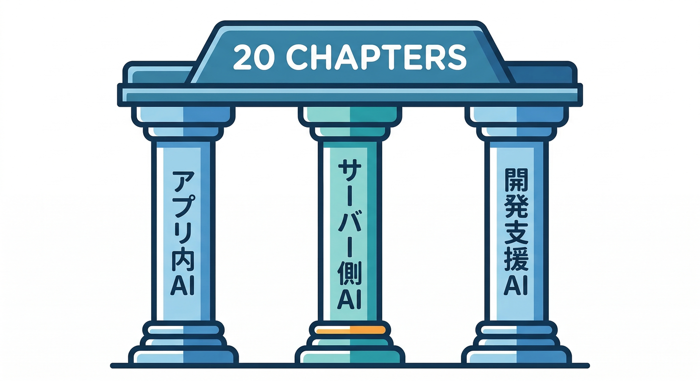
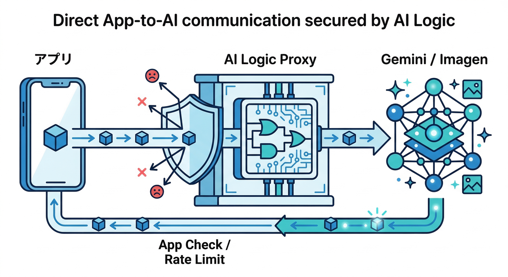
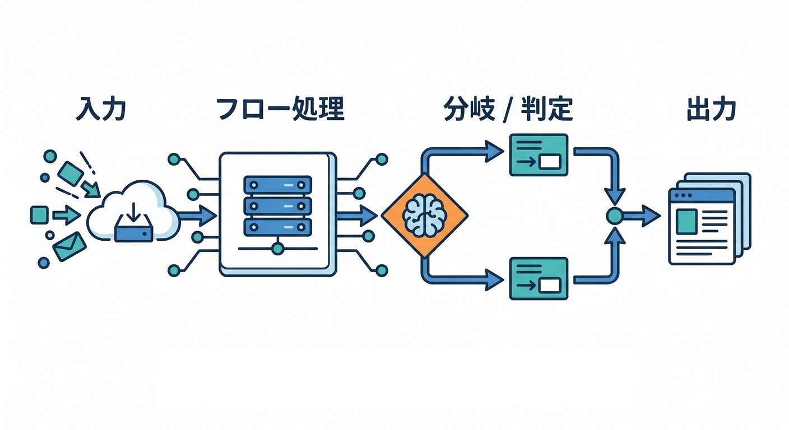
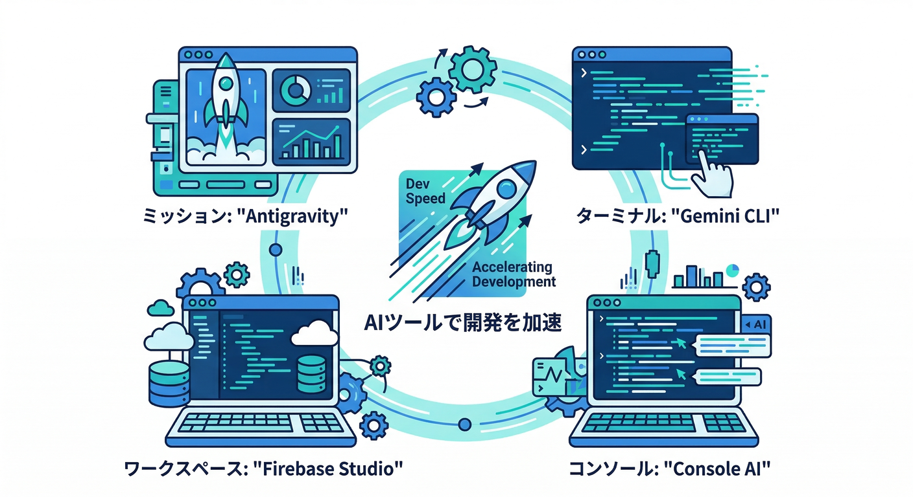
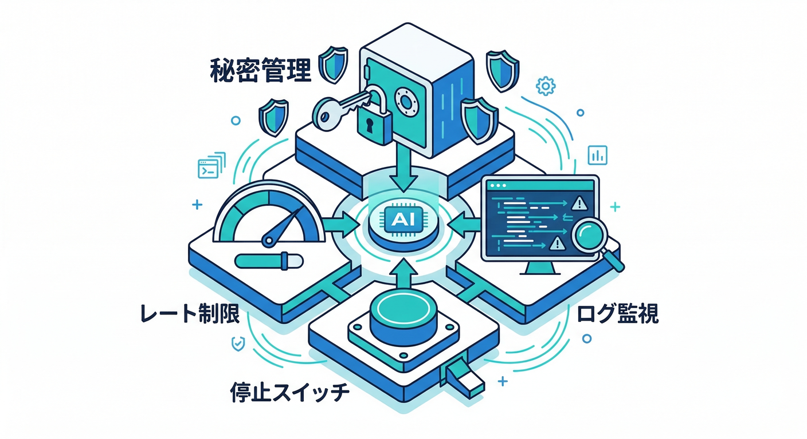

# AIカテゴリ（AI Logic × Genkit × 開発AI）20章アウトライン🤖🔥

このカテゴリは、**「アプリにAIを入れる」**（クライアント直呼び）と、**「サーバー側でAIワークフローを組む」**（フロー/分岐/再試行/評価）と、**「開発そのものをAIで速くする」**（Antigravity / Gemini CLI / Firebase Studio / Console AI）を、20章でスッと繋げる構成です😆✨

---

## まず、このカテゴリで作る“1つの題材”📌

題材はこれでいきます（全部RAGなしで成立）🧩

* **日報を整えるボタン**（要約/整形/言い換え/チェック）📝✨
* **投稿のNG表現チェック**（NGなら差し戻し、OKなら公開）🛡️✅
* **使いすぎ防止**（App Check + レート制御 + Remote Configの段階解放）🎛️🧿
  Firebase AI Logicは、アプリからGemini/Imagenを呼ぶためのSDK＋プロキシを提供し、**App Check統合**や**ユーザー単位のレート制限**、**Remote Config連携**などが軸になります。([Firebase][1])

---

## 20章アウトライン（各章＝読む→手を動かす→ミニ課題→チェック）📚✨

## 第1章：全体像「AIを“どこに置くか”」を先に決める🗺️🤖

* 読む：クライアント直呼び（AI Logic）とサーバー側（Genkit）で“責任範囲”が違う話🙂
* 手を動かす：日報整形（クライアント）／NGチェック（サーバー）に役割分担を書き出す📝
* ミニ課題：どっちに置くか“判断理由”を1行で説明できるようにする✍️
* チェック：「秘密（APIキー）」「乱用」「ログ」「再現性」の観点で説明できる？✅

---

## A. アプリ内AI（Firebase AI Logic）💬⚡（第2章〜第8章）

## 第2章：AI Logicの“安全に呼べる仕組み”を理解する🔐🧠

* 読む：AI LogicはSDK＋プロキシで、アプリ直呼びでも守れる設計（App Checkなど）🧿
* 手を動かす：Gemini Developer API と Vertex AI Gemini API の違いをざっくり比較🧾
* ミニ課題：自分の用途はどっちが向くか、理由を2つ書く✍️
* チェック：「無料枠で試す→スケールで切替」が説明できる？([Firebase][1])

## 第3章：最初の“テキスト生成”を最短で通す🚀📝

* 読む：AI Logic SDK（Web）で「テキスト→テキスト生成」の基本導線🙂
* 手を動かす：Reactに「整形ボタン」を置く（UIだけでOK）🔘
* ミニ課題：入力→生成結果→画面表示の流れを作る✨
* チェック：エラー時の表示（やさしい文言）を用意した？✅

## 第4章：要約・整形・言い換えの“型”を作る🧩📝

* 読む：プロンプトを「目的→条件→出力形式」に分けるコツ📌
* 手を動かす：日報整形のテンプレ（箇条書き・敬体・長さ制限）を作る✍️
* ミニ課題：同じ入力で“安定した出力”に寄せる工夫を入れる🛠️
* チェック：ユーザーがそのまま貼れる文章になってる？✅

## 第5章：JSONで返してもらう（構造化の入口）🧾🔎

* 読む：分類/抽出は“JSON返却”が超便利（後処理が楽）😆
* 手を動かす：日報から「カテゴリ」「重要度」「ToDo」を抽出する設計🧠
* ミニ課題：UIに“抽出結果カード”を表示する📇
* チェック：JSONが壊れた時のリカバリ案がある？✅

## 第6章：画像生成（Imagen）を“アプリ体験”に混ぜる🖼️✨

* 読む：AI LogicはImagenも扱える（テキスト→画像）🖌️
* 手を動かす：日報のサムネ案を1枚生成する導線を設計🙂
* ミニ課題：生成画像を保存する場所（Storage）を考える📦
* チェック：生成に失敗した時の代替（デフォ画像等）は？✅
  （AI LogicがGemini/Imagen両方を扱えること）([Firebase][1])

## 第7章：App Checkで“正規アプリ以外を弾く”🧿🛡️

* 読む：AIモデルAPIは乱用されやすい→App Checkで守る理由🙂
* 手を動かす：AI Logic側のApp Check導入手順を“チェックリスト化”📝
* ミニ課題：開発段階から有効化する運用を決める（例：段階的に強化）🎛️
* チェック：App Check未通過時に「どう表示するか」決めた？✅
  （AI LogicのApp Check統合＆推奨）([Firebase][2])

## 第8章：使いすぎ防止（レート制限＋段階解放）🎛️🚦

* 読む：AI Logicは**ユーザー単位のレート制限がデフォ＆設定可能**🧯
* 手を動かす：無料ユーザー/有料ユーザーで“回数差”を決める🧠
* ミニ課題：Remote Configで「AI機能ON/OFF」「回数」を切替できる設計にする🔁
* チェック：障害時の“AI停止スイッチ”ある？✅
  （ユーザー単位レート制限・Remote Config連携）([Firebase][1])

---

## B. サーバー側AI（Genkit）🧰🔥（第9章〜第15章）

## 第9章：Genkitの基本「Flow＝一連の処理の台本」🎬🧠

* 読む：サーバー側は「分岐」「再試行」「ツール呼び出し」が得意🙂
* 手を動かす：NGチェックFlowの処理手順を“日本語の擬似コード”で書く📝
* ミニ課題：NGだったら理由＋修正文案を返す設計にする✍️
* チェック：人間が最終確認すべきポイントを明示した？✅

## 第10章：Developer UIで“実行→追跡→評価”する👀🧪

* 読む：Genkitはローカルで**Run/Inspect/Evaluate**できる開発UIがある😆
* 手を動かす：Flowを叩いて、トレースを眺める（どこで迷ったか見る）🔎
* ミニ課題：プロンプトを1回改善→結果がどう変わったかメモ📝
* チェック：改善前後の差を説明できる？✅
  ([GitHub][3])

## 第11章：“AIにやらせる/人がやる”の境界線🛡️🙂

* 読む：危ない領域（誤判定・誤情報・倫理）がある→人間レビューに回す設計🧠
* 手を動かす：NG判定を「確信度」や「根拠」で返す案を作る🧾
* ミニ課題：「要レビュー」状態のUI（差し戻し）を用意する🚧
* チェック：誤判定時の“救済ルート”ある？✅

## 第12章：デプロイ先の選択（Functions/Cloud Run）とランタイム🎯⚙️

* 読む：2nd gen（Cloud Run functions）中心の世界観とメリデメ🙂 ([Google Cloud Documentation][4])
* 手を動かす：AI用は **Node.js（TypeScript）** を主軸にする理由を書く📝
* ミニ課題：クラウド側言語の“版”をメモ：

  * Node.js **20 / 22**（Firebase Functionsでサポート）([Firebase][5])
  * Python **3.13**（Cloud Run functionsでGA）([Google Cloud Documentation][4])
  * .NET **8**（Cloud Run functionsでGA）([Google Cloud Documentation][4])
* チェック：用途別に「どの言語/どこへ置く」を言える？✅

## 第13章：アプリからFlowを呼ぶ（onCallGenkit）📣🔗

* 読む：Genkit FlowをCallable Functionとして呼べる `onCallGenkit` の考え方🙂
* 手を動かす：アプリ側から「NGチェック」を呼ぶ導線を設計（認証込み）🔐
* ミニ課題：結果を3パターン（OK/NG/要レビュー）でUI分岐する🧩
* チェック：ログインしてない時に呼べない設計になってる？✅
  ([Firebase][6])

## 第14章：ログ・トレースの“残し方”を決める🧯🧾

* 読む：AIは「後から説明できる」ことが大事（何が起きたか追える）🙂
* 手を動かす：保存すべき情報（入力/出力/モデル/エラー/所要時間）を整理📝
* ミニ課題：個人情報や秘匿情報をログに残さないルールを作る🚫
* チェック：問い合わせが来たとき“再現に必要な情報”は揃う？✅

## 第15章：評価（Evaluate）で“品質を数字で上げる”📊🔥

* 読む：Genkitは評価結果とトレースを結び付けて見られる🧪
* 手を動かす：NGチェックのテストケース（10件）を作る🗂️
* ミニ課題：「誤NG」「見逃し」の基準を決める⚖️
* チェック：改善が“気分”じゃなく“数字”で語れる？✅
  ([GitHub][3])

---

## C. 開発をAIで速くする（Antigravity / Gemini CLI / Firebase Studio / Console）🚀（第16章〜第20章）

## 第16章：Antigravityで“調査→実装→テスト”をミッション化する🛸🧠

* 読む：Antigravityはエージェントを管理する“Mission Control”型の開発体験🙂
* 手を動かす：「NGチェックの仕様整理」「テスト追加」などをミッションに分ける🧩
* ミニ課題：1ミッション＝30分で終わる粒度に切る✂️
* チェック：やることが“TODO地獄”じゃなく“ミッション列”になってる？✅
  ([Google Codelabs][7])

## 第17章：Gemini CLIで“リサーチと修正”をターミナルから回す💻✨

* 読む：Gemini CLIはターミナルで調査・修正・テスト作成まで支援する😆
* 手を動かす：エラー文を投げて「原因候補→修正案→確認手順」を出させる🧯
* ミニ課題：テスト雛形を作らせて、人間がレビューして取り込む🤝
* チェック：AIの提案を“そのまま採用しない”レビュー手順ある？✅
  （Cloud Shellで追加セットアップなし等）([Google Cloud Documentation][8])

## 第18章：Firebase Studioで“環境を再現可能”にする🧰🧊

* 読む：Firebase Studioはワークスペースをクラウドで共有でき、`dev.nix`で環境を定義できる🙂
* 手を動かす：Nodeや必要ツールを `dev.nix` に列挙する設計にする📦
* ミニ課題：チーム用に「このリポジトリを開けば同じ環境」状態を作る👥
* チェック：新メンバーが“1時間で同じ状態”になれる？✅
  ([Firebase][9])

## 第19章：Gemini in Firebaseで“コンソール運用”を助けてもらう🧯🔧

* 読む：Firebaseコンソール上のGeminiで、設定やトラブルシュートを支援できる🙂
* 手を動かす：AI Logic / Functions / App Check まわりの「詰まりポイント」を質問してみる🧩
* ミニ課題：回答を“運用メモ”に1段落で要約して残す📝
* チェック：誰が見ても再現できる手順書になってる？✅
  ([Firebase][10])

## 第20章：運用の仕上げ「鍵・設定・コスト・停止スイッチ」💸🧯🔒

* 読む：AIは運用で事故りやすい（鍵漏れ/使いすぎ/暴走/障害時の対応）😇
* 手を動かす：

  * **鍵・秘密情報**：Secret Managerや安全な設定方法へ寄せる🗝️([Firebase][11])
  * **古いfunctions.config系**は移行対象として把握しておく🧨([GitHub][12])
  * **App Check**は早期に本番同等へ🧿([Firebase][2])
  * **Remote Config停止スイッチ**で即OFFできるように🎛️([Firebase][1])
* ミニ課題：「障害が起きたらこれ」チェックリストを10行で作る📋
* チェック：最悪の日でも“被害を小さく”できる設計になってる？✅

---

## 補足：このカテゴリで“自然に身につく”超重要ポイント🌟

* クライアント直AIでも、**App Check＋プロキシ**で守れる（AI Logicの強み）🧿([Firebase][1])
* サーバー側は、**Flow＋トレース＋評価**で品質を上げられる（Genkitの強み）🧪([GitHub][3])
* 開発AIは、**ミッション分割（Antigravity）＋ターミナルAI（Gemini CLI）＋再現可能環境（Firebase Studio）＋コンソールAI（Gemini in Firebase）**で“速度と安全”を両立できる🚀([Google Codelabs][7])

---

[1]: https://firebase.google.com/docs/ai-logic "Gemini API using Firebase AI Logic  |  Firebase AI Logic"
[2]: https://firebase.google.com/docs/ai-logic/app-check "Implement Firebase App Check to protect APIs from unauthorized clients  |  Firebase AI Logic"
[3]: https://github.com/firebase/genkit "GitHub - firebase/genkit: Open-source framework for building AI-powered apps in JavaScript, Go, and Python, built and used in production by Google"
[4]: https://docs.cloud.google.com/functions/docs/release-notes?utm_source=chatgpt.com "Cloud Run functions (formerly known as Cloud Functions ..."
[5]: https://firebase.google.com/docs/functions/get-started?utm_source=chatgpt.com "Get started: write, test, and deploy your first functions - Firebase"
[6]: https://firebase.google.com/docs/functions/oncallgenkit "Invoke Genkit flows from your App  |  Cloud Functions for Firebase"
[7]: https://codelabs.developers.google.com/getting-started-google-antigravity?utm_source=chatgpt.com "Getting Started with Google Antigravity"
[8]: https://docs.cloud.google.com/gemini/docs/codeassist/gemini-cli?utm_source=chatgpt.com "Gemini CLI | Gemini for Google Cloud"
[9]: https://firebase.google.com/docs/studio/get-started-workspace "About Firebase Studio workspaces"
[10]: https://firebase.google.com/docs/ai-assistance/gemini-in-firebase?utm_source=chatgpt.com "Gemini in Firebase - Google"
[11]: https://firebase.google.com/docs/functions/config-env?utm_source=chatgpt.com "Configure your environment | Cloud Functions for Firebase"
[12]: https://github.com/firebase/firebase-tools/issues/8925?utm_source=chatgpt.com "Functions config deprecation warning even though I'm not ..."
