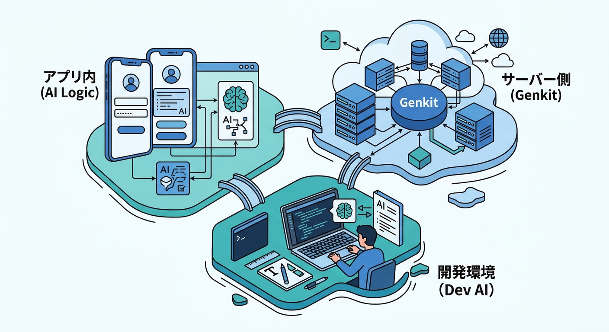
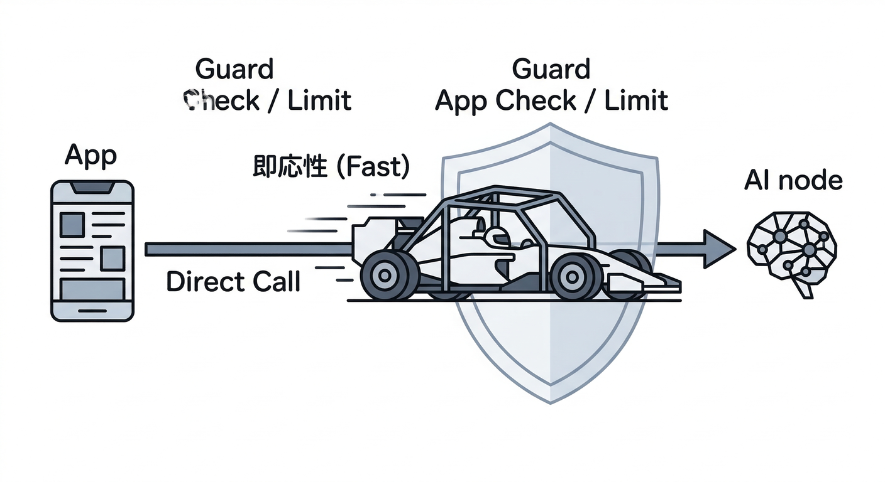
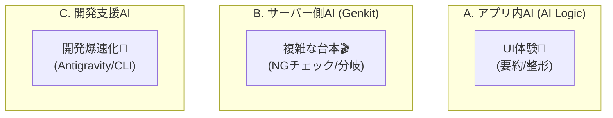
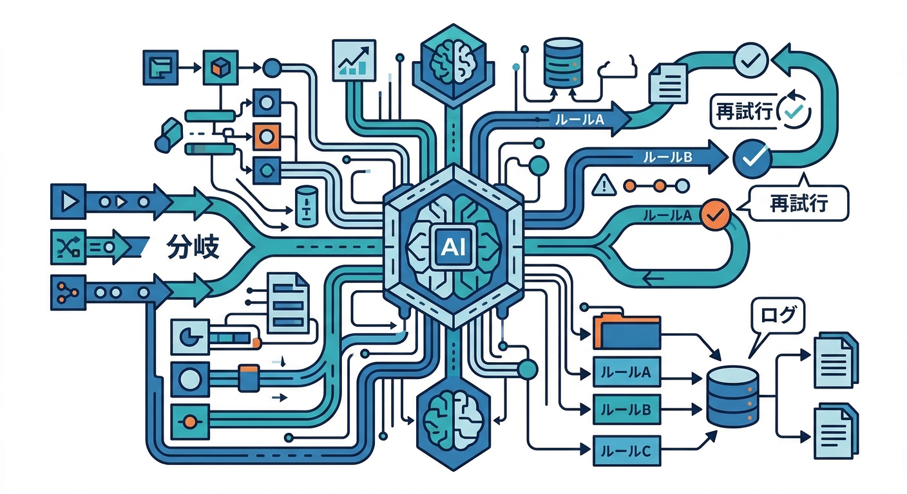
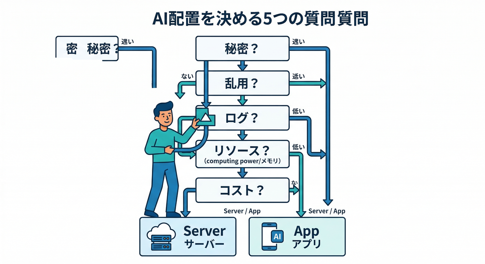
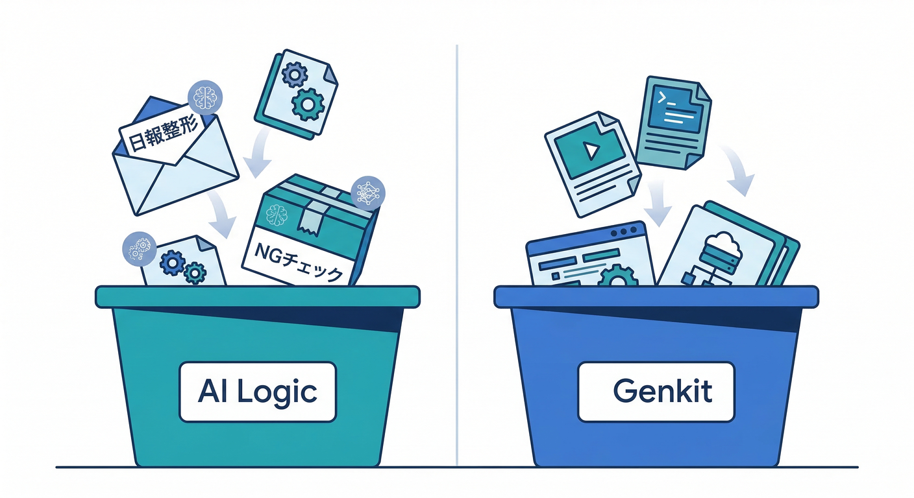

# 第01章：全体像「AIを“どこに置くか”」を先に決める🗺️🤖

この章は、いきなり実装に突っ込む前に **「AIをどこで動かすのが安全でラクか」** を決める回です😊
ここがフワッとしてると、あとで「鍵どうする？😱」「乱用された😇」「ログ足りない…」みたいな事故が起きやすいんですよね。

---



## 1) まずは“置き場所”を3つに分けよう🧩

AIの置き場所は、だいたいこの3パターンに整理できます👇





## A. アプリ内AI（クライアント直呼び）📱💬

代表：**Firebase AI Logic**

* アプリ（Web/モバイル）から **Gemini / Imagen を直接呼ぶ**ためのクライアントSDKが用意されてます。([Firebase][1])
* でも「直呼び＝危険」にならないように、**不正クライアント対策（App Check 連携できるプロキシ）**が仕込まれてるのがポイント🛡️([Firebase][2])
* さらに **ユーザー単位のレート制限**がデフォで入っていて（例：既定は *100 RPM / user*）、調整もできます🚦([Firebase][3])

👉 得意：UIの「ボタン押したら即結果✨」みたいな体験（例：日報整形）
👉 注意：乱用・ログ・再現性の設計をサボると痛い（後半でやるよ）😇

---



## B. サーバー側AI（ワークフロー/分岐/再試行/評価）🖥️🧰

代表：**Genkit + Cloud Functions**

* Genkitは **フルスタックAIアプリを作るためのオープンソース枠組み**で、（少なくとも公式ドキュメント上は）“Firebase Genkit → Genkit” に名称整理された流れがあります。([Firebase][4])
* そしてFirebase側には、GenkitのFlow（処理の台本）を **Callable Functionとして包む `onCallGenkit`** が用意されています📣([Firebase][5])

👉 得意：

* 「NGなら差し戻し、OKなら公開」みたいな **分岐**
* 失敗したら **再試行**
* 品質をテストケースで **評価**
* ログ/監査/再現性を **しっかり残す**

---

## C. 開発をAIで速くする（開発AI）🚀🤝

代表：Antigravity / Gemini CLI / Firebase Studio / コンソールAI

* **Google Antigravity** は “エージェントを複数動かしてタスクを回す Mission Control 的な開発体験” を前面に出してます🛸([Google Codelabs][6])
* **Gemini CLI** は “ターミナルにいるAIエージェント” で、公式ドキュメントやOSSリポジトリでもその立ち位置が明記されています💻([GitHub][7])
* **Firebase Studio** は Nix（`dev.nix`）で環境を宣言して **再現性のあるワークスペース**を作れるのが売りです🧊([Firebase][8])
* **Gemini in Firebase** は、Firebaseコンソール内での支援（例：Crashlyticsの原因推定や修正提案）を提供します🧯([Firebase][9])

👉 得意：設計・調査・修正・テスト追加を爆速にする（ただし最終判断は人間🧠）

---



## 2) 迷ったらコレ：AI配置を決める「5つの質問」🧠❓

次の質問に **YESが多いほどサーバー側（Genkit）寄り**、NOが多いほど **アプリ内（AI Logic）寄り**です👇

1. **秘密（鍵/機密データ）**を扱う？🔑
2. **乱用されると困る**（コスト/規約/スパム）？💸🧨
3. **ログを残して説明責任**が必要？🧾
4. **分岐・再試行・評価**みたいな“台本”が必要？🎬
5. **UIの体験として即応性**が最優先？⚡

ここで超大事なのが👇

* AI Logic側は **App Check と組み合わせて生成AIモデルAPIを守れる**設計が用意されてます🧿([Firebase][2])
* さらに運用では **Remote ConfigでAIパラメータ（モデル名など）をアプリ更新なしで切替**できる、というのが公式チェックリストでも強調ポイントです🎛️([Firebase][10])

---



## 3) 今回の題材に当てはめてみよう🧩✨

あなたの題材（RAGなし）だと、こんな切り分けが自然です👇

## ✅ 日報を整えるボタン（要約/整形/言い換え）📝✨

* 体験：ユーザーが押したらすぐ整うと嬉しい
* 分岐：少なめ（基本は1発生成）
* なので **アプリ内（AI Logic）**が気持ちいい😆([Firebase][1])

## ✅ 投稿のNG表現チェック（OK/NG/要レビュー）🛡️✅

* 体験：結果は速いほどいいけど、**判定の根拠**や**運用の安全**が大事
* 分岐：OK/NG/要レビュー、必要なら差し戻し理由生成…など増えがち
* なので **サーバー側（Genkit Flow + onCallGenkit）**が管理しやすい🎬([Firebase][5])

---

## 4) 手を動かす：役割分担メモを“3分”で作る📝⏱️

ここからが実技パートです😊
下の表をそのままコピって、埋めてください✍️（紙でもOK）

| 機能     | 入力        | 出力               | 失敗したら困る度😱 | 乱用リスク🧨 | ログ必要度🧾 | おすすめ配置   |
| ------ | --------- | ---------------- | ---------: | ------: | ------: | -------- |
| 日報整形   | 自分の日報テキスト | 整形済み文章           |          中 |       中 |     低〜中 | AI Logic |
| NGチェック | 投稿本文      | OK/NG/要レビュー + 理由 |          高 |       高 |       高 | Genkit   |

ポイントは「度合い」を数値じゃなくてもいいので、**強弱**が見えるようにすること👀✨

---

## 5) ミニ課題：「判断理由」を1行で言えるようにする✍️✅

“それっぽい言葉”じゃなく、事故りやすい観点で言えると強いです🔥
テンプレ置いときます👇

```text
この機能を（AI Logic / Genkit）に置く。理由は、①（秘密/乱用/ログ/再現性/分岐）の観点で（こうなる）から。
```

例（短くてOK）👇

* 日報整形：**UI即応性が最優先**で、分岐や監査要件が薄いからAI Logic寄り📱✨
* NGチェック：**判定根拠とログが必要**で、分岐（要レビュー）があるからGenkit寄り🧾🎬

---

## 6) チェック：「秘密・乱用・ログ・再現性」4点セット✅🧿🧾🔁

最後に自己採点タイムです😆（ここ通ると次章がラク！）

* ✅ **秘密**：クライアントに置いちゃダメな情報は何？（例：管理者だけが見れる判定ルール）🔑
* ✅ **乱用**：ユーザー単位の回数制御どうする？（AI Logicにはユーザー単位レート制限の考え方がある）🚦([Firebase][3])
* ✅ **ログ**：問い合わせが来たとき「何が起きたか」説明できる？🧾
* ✅ **再現性**：同じ入力で結果がブレたらどう扱う？（モデル/プロンプト/設定を追える？）🔁
* ✅ **停止スイッチ**：ヤバい時に止められる？（Remote Configで切替、が公式でも重要扱い）🎛️([Firebase][10])
* ✅ **守り**：アプリ内AIはApp Checkで守る設計を最初から意識できた？🧿([Firebase][2])

---

## 次章につながる“伏線”📌✨

第2章からは、アプリ内（AI Logic）側の「安全に呼べる仕組み」へ進みます🔐
この章で決めた“置き場所”が、**App Check / レート制御 / Remote Config / Flow設計**に全部つながっていきます😄🔥

[1]: https://firebase.google.com/docs/ai-logic?utm_source=chatgpt.com "Gemini API using Firebase AI Logic - Google"
[2]: https://firebase.google.com/docs/ai-logic/app-check?utm_source=chatgpt.com "Implement Firebase App Check to protect APIs from ... - Google"
[3]: https://firebase.google.com/docs/ai-logic/quotas?utm_source=chatgpt.com "Rate limits and quotas | Firebase AI Logic - Google"
[4]: https://firebase.google.com/docs/genkit/overview?authuser=0&hl=ja&utm_source=chatgpt.com "Genkit | Firebase - Google"
[5]: https://firebase.google.com/docs/functions/oncallgenkit?utm_source=chatgpt.com "Invoke Genkit flows from your App | Cloud Functions for Firebase"
[6]: https://codelabs.developers.google.com/getting-started-google-antigravity?utm_source=chatgpt.com "Getting Started with Google Antigravity"
[7]: https://github.com/google-gemini/gemini-cli?utm_source=chatgpt.com "google-gemini/gemini-cli: An open-source AI agent that ..."
[8]: https://firebase.google.com/docs/studio/get-started-workspace?utm_source=chatgpt.com "About Firebase Studio workspaces - Google"
[9]: https://firebase.google.com/docs/ai-assistance/gemini-in-firebase?utm_source=chatgpt.com "Gemini in Firebase - Google"
[10]: https://firebase.google.com/docs/ai-logic/production-checklist?utm_source=chatgpt.com "Production checklist for using Firebase AI Logic - Google"
