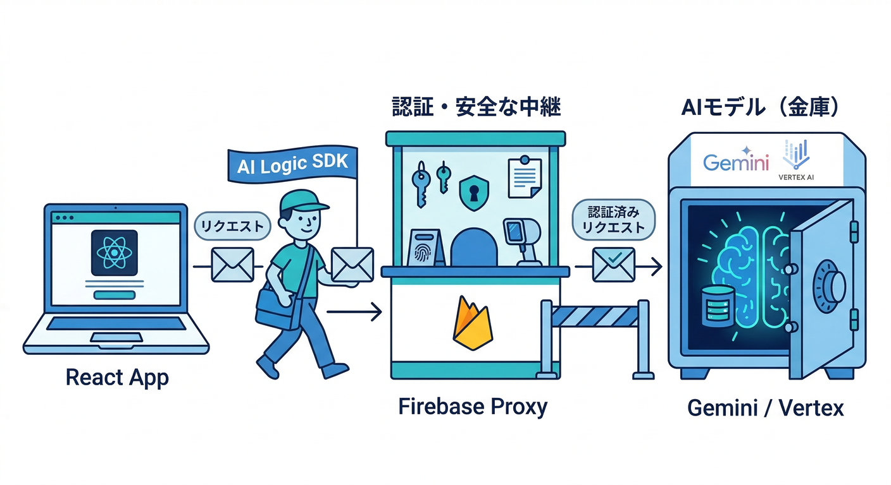
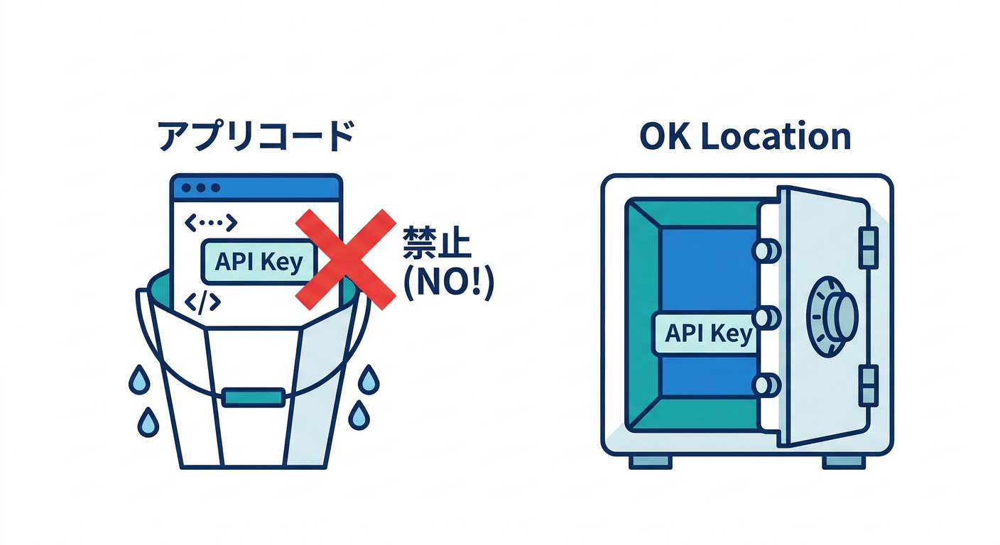
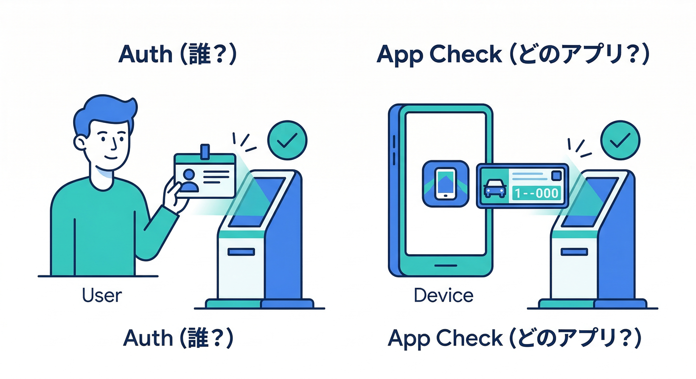
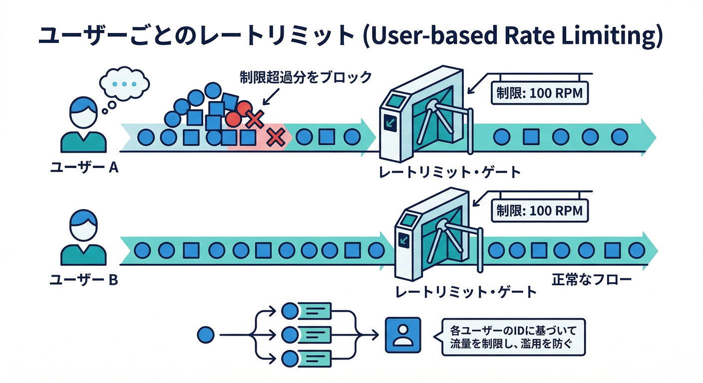
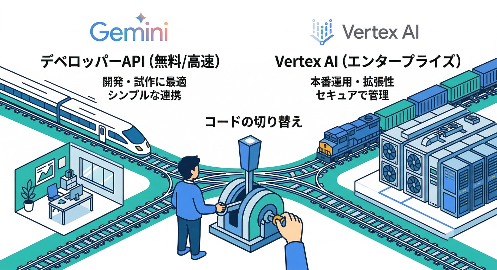

# 第02章：AI Logicの“安全に呼べる仕組み”を理解する🔐🧠

この章のゴールはこれ👇

* 「なんで *アプリから直接* Gemini を叩かないの？」に答えられる🤔
* AI Logic が **SDK＋プロキシ**で“守り”を作ってる理由がわかる🛡️
* **App Check** と **ユーザー単位のレート制限**が、どこで効いてるかイメージできる🧿🚦
* Gemini Developer API と Vertex AI Gemini API の“ざっくり使い分け”ができる⚖️

---



## 読む：AI Logic の中身は「アプリの代理人」🕴️📨

AI Logic は、アプリに入れる **クライアントSDK**と、裏側の **Firebase AI Logic API（プロキシ）** がセットです。
アプリはモデルに直行せず、いったん“受付”に渡すイメージ🌟（この受付が安全装置つき）

**イメージ図**🗺️

* React アプリ
  → AI Logic SDK（`firebase/ai`）
  → Firebase 側のプロキシ（Firebase AI Logic API）
  → どっちかの Gemini API（後述）
  → 返答

AI Logic は「**App Check を統合できる**」「**APIキーをアプリに埋めない設計にできる**」みたいな“事故りやすい部分”を、最初からガードしやすい形にしてます。([Firebase][1])

---



## 読む：いちばん大事な注意「APIキーをアプリに入れない」🚫🔑

Firebase コンソール側で Gemini API キーが作られる流れがありますが、公式に **「そのキーをアプリのコードに入れないでね」** と明言されています。
ここ、超重要ポイントです⚠️（入れると漏れやすい＆悪用されやすい）

([Firebase][1])

---



## 読む：App Check は「本物のアプリから来た？」を確かめる🧿

**Firebase Authentication**が「誰が使ってる？」なら、
**App Check**は「そのリクエスト、あなたの“正規アプリ”から来た？」を確かめる係です👮‍♀️

Web の場合は **reCAPTCHA Enterprise** などのプロバイダを使って守れます。([The Firebase Blog][2])

ただし注意👇

* App Check は **万能の防御壁ではない**（“正規アプリ”経由の乱用まで全部は止められない）
* だから **レート制限・停止スイッチ・ログ** と組み合わせるのが現実的🧯

この「万能じゃないから設計で守る」って発想が、AI機能では特に大切です🙂([The Firebase Blog][2])

---



## 読む：ユーザー単位のレート制限が最初からある🚦

AI Logic は **ユーザー単位のレート制限（デフォルト 100 リクエスト/分/ユーザー）** が設定されています。
しかも **Cloud Console の Quotas で調整**できます🔧([Firebase][3])

ここで押さえるコツ👇

* これは「Aさんは50、Bさんは200」みたいな個別設定ではなく、基本は“全体の上限”を決めるタイプ（＝事故の上限を決める）🧱
* 実務だとさらに

  * UI側の連打防止（ボタン連打を止める）🖱️
  * Remote Config で段階解放や停止🎛️（第8章でやるやつ）
    を重ねていくと堅いです👍([Firebase][3])

---



## 読む：Gemini Developer API と Vertex AI Gemini API の違いざっくり⚖️

AI Logic は **2つの“行き先”** を選べます🚪

* **Gemini Developer API**：最速で始めやすい🏃‍♂️💨（無料枠も使いやすい方向）
* **Vertex AI Gemini API**：本番・企業向けの管理やガバナンスを重視しやすい🏢🧾（課金が前提になりやすい）

Firebase公式は「まずは Gemini Developer API で始めるのがおすすめ。必要なら後から Vertex に切り替えOK」と案内しています。([Firebase][1])

---

## 読む：切り替えはコード上だと “backend を変えるだけ”🧩

Web（TypeScript）だと、`getAI()` の初期化で backend を指定します👇

```ts
import { initializeApp } from "firebase/app";
import { getAI, GoogleAIBackend, VertexAIBackend } from "firebase/ai";

const app = initializeApp({ /* your firebaseConfig */ });

// Gemini Developer API を使う
const ai1 = getAI(app, { backend: new GoogleAIBackend() });

// Vertex AI Gemini API を使う（リージョン指定もできる）
const ai2 = getAI(app, { backend: new VertexAIBackend("us-central1") });
```

（`VertexAIBackend` はリージョン指定できて、デフォルトは `us-central1` です）([Firebase][4])

---

## 手を動かす：この章は「設定を触る」より“設計メモを作る”📝✨

ここでは、実装より先に **事故りやすい所を先に言語化**します（未来の自分を救うやつ）🦸‍♂️

## 1) リポジトリに `ai/safety-notes.md` を作る📄

中身はこの4つだけでOK👇

* ① AI Logic を使う理由（APIキーを埋めない、App Check統合、レート制限）
* ② App Check をいつ有効化するか（最初から？段階的？）
* ③ レート制限で“最悪の被害”をどこまでにするか
* ④ Gemini Developer API か Vertex AI か、最初の選択と理由

参考になる根拠はここにまとまってます。([Firebase][1])

## 2) Gemini CLI で「比較メモ」を作らせる💻🤖

Gemini CLI はターミナルで“調査→整理”が速いので、こういう文章作りに強いです✍️([Google Cloud Documentation][5])

例：こんなお願いを投げるイメージ👇

* 「Gemini Developer API と Vertex AI Gemini API を“個人開発→小規模本番→企業本番”の3段階で比較して」
* 「AI Logic の安全面の要点を、初心者向けに箇条書きで」

## 3) Antigravity で“ミッション化”して残す🛸📌

Antigravity は「やることをミッション化して進める」流れに向いてるので、
この章の成果物（`ai/safety-notes.md`）を **“AI導入の土台ミッション”**として固定すると気持ちいいです😆([Google Codelabs][6])

---

## ミニ課題：あなたのアプリの結論を2行で言う✍️✨

次の2行を `ai/safety-notes.md` の先頭に書けたら勝ち🏆

* 「最初は **（Gemini Developer API / Vertex AI）** で始める。理由は **A** と **B**。」
* 「守りは **App Check** と **レート制限** を軸にして、事故ったら **停止スイッチ**で止める。」

（停止スイッチは第8章で Remote Config と一緒にやると強いです🎛️）

---

## チェック：理解できたかテスト✅🧠

次がスッと言えたらOKです👇

* 「AI Logic は SDK＋プロキシで、アプリ直呼びでも“守り”を組み込みやすい」([Firebase][1])
* 「Gemini API キーをアプリに入れない（入れると漏れやすい）」([Firebase][1])
* 「App Check は“正規アプリからの呼び出し”を証明する。Authとは役割が違う」([The Firebase Blog][2])
* 「デフォのレート制限は 100/分/ユーザー。Quotas で調整できる」([Firebase][3])
* 「Developer と Vertex は、始めやすさ vs 本番運用（ガバナンス寄り）で選べる」([The Firebase Blog][2])

---

## おまけ：安全面で“知っておくと得”な最新トピック🎁🧯

* Firebase AI Logic は **AI monitoring**（リクエスト数・レイテンシ・エラー・トークン使用量など）で観測しやすくなっています📈👀([The Firebase Blog][7])
* App Check も **limited-use tokens** みたいな強化方向が進んでいて、今のうちから対応しておくと後が楽になりやすいです🧿🧱([The Firebase Blog][7])
* それと地味に重要：モデルには **廃止予定**が入ることがあるので（例：2026-03-31 退役予定の記載など）、運用では“モデル更新”も作業に入れましょう🔁🗓️([Firebase][3])

---

次の第3章は、ここで理解した土台の上で「最初のテキスト生成」を最短で通して、UIに出すところまで一気にやると気持ちいいです🚀📝

[1]: https://firebase.google.com/docs/ai-logic/get-started "Get started with the Gemini API using the Firebase AI Logic SDKs  |  Firebase AI Logic"
[2]: https://firebase.blog/posts/2025/05/building-ai-apps/ "Building AI-powered apps with Firebase AI Logic"
[3]: https://firebase.google.com/docs/ai-logic/quotas "Rate limits and quotas  |  Firebase AI Logic"
[4]: https://firebase.google.com/docs/reference/js/vertexai "vertexai package  |  Firebase JavaScript API reference"
[5]: https://docs.cloud.google.com/gemini/docs/codeassist/gemini-cli?utm_source=chatgpt.com "Gemini CLI | Gemini for Google Cloud"
[6]: https://codelabs.developers.google.com/getting-started-google-antigravity?utm_source=chatgpt.com "Getting Started with Google Antigravity"
[7]: https://firebase.blog/posts/2025/09/firebase-ai-logic-updates/ "New Firebase AI Logic features to explore - September 2025 updates"
