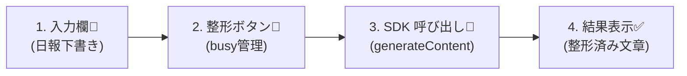
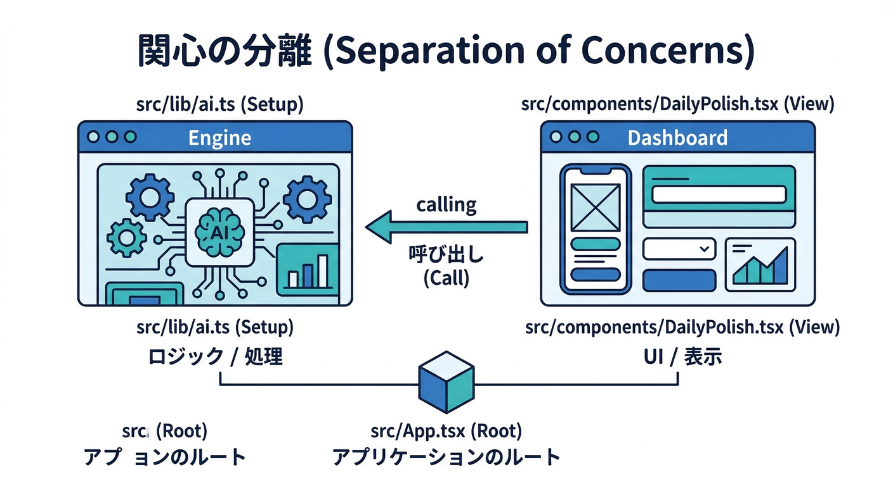
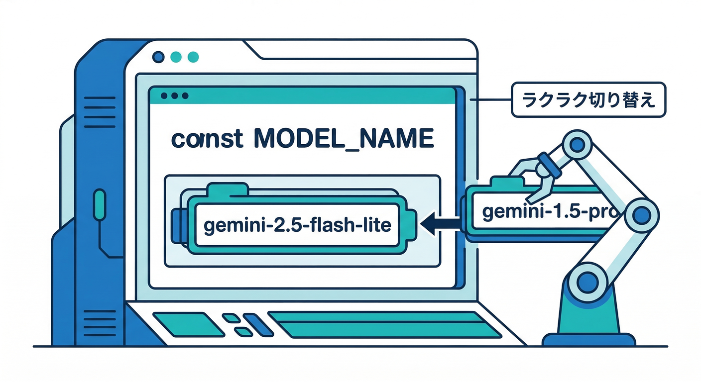
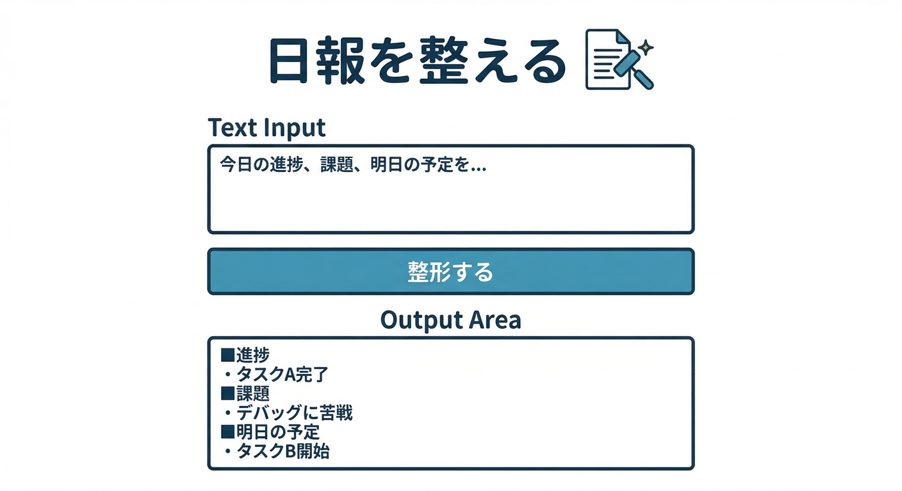
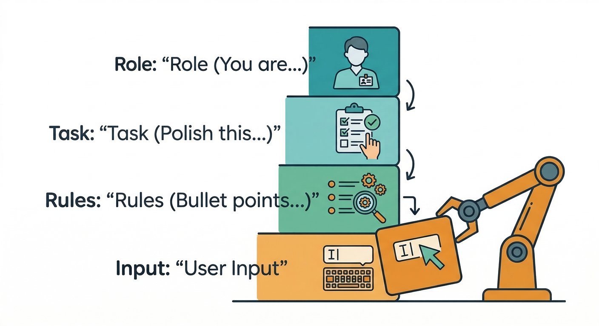

# 第03章：最初の“テキスト生成”を最短で通す🚀📝

この章は「とにかく1回、AIが文章を返してくる体験」を**最短距離**で作ります😆✨
Reactの画面に👇を置いて、**入力 → 生成 → 表示**まで一気に通します💨

* 🧾 テキスト入力（例：日報の下書き）
* 🔘 「整形する」ボタン
* 🤖 生成結果を画面に表示

Firebase AI LogicのWeb SDKは、Firebase JS SDKの一部として使えます（`npm install firebase`）📦✨ ([Firebase][1])
生成（`generateContent()`）のWebサンプルも公式に載っています。([Firebase][2])

---




## この章のゴール🎯

* ✅ ボタンを押すと、Geminiが文章を生成して返す
* ✅ 画面に結果（or エラー）をやさしく表示できる
* ✅ あとで拡張しやすい“置き場所”にコードを分けられる（重要🧠）

---



## 1) まずは“最短で動く形”の設計にする🧩

Reactのコンポーネントに全部書くと、あとで地獄になりがちです😇
なので、最初からこの2分割でいきます👇

* `src/lib/ai.ts`：Firebase初期化 + AIモデル取得（裏方）🧰
* `src/components/DailyPolish.tsx`：UI（入力・ボタン・結果表示）🖥️

---



## 2) モデル名は“あとで差し替えやすく”しておく🎛️

2026年はモデルの世代交代が速いです⚡
Firebase AI Logicのドキュメントでも、**特定モデルの退役日**が明記されています（例：2026-03-31退役）。([Firebase][3])

なのでこの章では、モデル名を**定数にして1か所**に置きます🧷
（将来はRemote Configで差し替え可能にするのが王道ですが、それは後の章でOK👌）
Remote Configでモデル名・バージョンをリモート変更する考え方も公式で推奨されています。([Firebase][3])

---

## 3) 実装：`src/lib/ai.ts` を作る🧰✨

ポイントはここ👇

* `getAI()` でAI Logicを初期化
* `getGenerativeModel()` でモデルを作る
* Reactの再レンダリングでも二重初期化しにくいように `getApps()` を使う（地味に効く🧠）

公式のWeb例は `getAI(..., { backend: new GoogleAIBackend() })` → `getGenerativeModel(...)` の流れです。([Firebase][1])

```ts
// src/lib/ai.ts
import { initializeApp, getApps } from "firebase/app";
import { getAI, getGenerativeModel, GoogleAIBackend } from "firebase/ai";

// 🔽 FirebaseコンソールのWebアプリ設定から持ってくるやつ
const firebaseConfig = {
  // apiKey: "...",
  // authDomain: "...",
  // projectId: "...",
  // appId: "...",
};

const app = getApps().length ? getApps()[0] : initializeApp(firebaseConfig);

// ✅ Gemini Developer API 側のバックエンド（まずはこれでOK）
export const ai = getAI(app, { backend: new GoogleAIBackend() });

// ⚠️ 退役情報に注意しつつ、将来差し替えやすいように定数へ
export const MODEL_NAME = "gemini-2.5-flash-lite";

export const model = getGenerativeModel(ai, { model: MODEL_NAME });
```

---



## 4) 実装：UIコンポーネントを作る🖥️🔘

ここでやることはシンプル👇

* 入力欄（textarea）
* ボタン（押したら `model.generateContent()`）
* 結果表示（成功/失敗/実行中）

`generateContent()` の呼び方（`result.response.text()`）は公式サンプル通りです。([Firebase][2])

```tsx
// src/components/DailyPolish.tsx
import { useState } from "react";
import { model } from "../lib/ai";

export function DailyPolish() {
  const [input, setInput] = useState("");
  const [output, setOutput] = useState("");
  const [busy, setBusy] = useState(false);
  const [error, setError] = useState<string | null>(null);

  async function onPolish() {
    setBusy(true);
    setError(null);
    setOutput("");

    try {
      // 🧠 “日報を整える”用の最小プロンプト
      const prompt = [
        "あなたは文章編集のアシスタントです。",
        "次の文章を、読みやすい日報として整形してください。",
        "条件：",
        "- 丁寧語（です・ます）",
        "- 箇条書き中心",
        "- 重要ポイントを先に",
        "",
        "本文：",
        input,
      ].join("\n");

      const result = await model.generateContent(prompt);
      const text = result.response.text();

      if (!text) {
        setError("返答テキストが空でした🙏 もう一度試してみてね。");
        return;
      }

      setOutput(text);
    } catch (e: any) {
      // ✅ 初心者向け：エラーを“人間が読める”形に
      setError("AIの呼び出しで失敗しました🙏 しばらくして再挑戦してね。");
      console.error(e);
    } finally {
      setBusy(false);
    }
  }

  const canRun = input.trim().length > 0 && !busy;

  return (
    <div style={{ maxWidth: 720, margin: "24px auto", padding: 16 }}>
      <h2>日報を整える📝✨</h2>

      <textarea
        value={input}
        onChange={(e) => setInput(e.target.value)}
        placeholder="日報の下書きを貼ってね…"
        rows={10}
        style={{ width: "100%", padding: 12, marginTop: 12 }}
      />

      <div style={{ marginTop: 12, display: "flex", gap: 12 }}>
        <button onClick={onPolish} disabled={!canRun} style={{ padding: "10px 14px" }}>
          {busy ? "整形中…🤖💭" : "整形する🔘✨"}
        </button>

        <button
          onClick={() => {
            setInput("");
            setOutput("");
            setError(null);
          }}
          disabled={busy}
          style={{ padding: "10px 14px" }}
        >
          クリア🧹
        </button>
      </div>

      {error && (
        <div style={{ marginTop: 16, padding: 12, background: "#fff3f3" }}>
          <b>エラー⚠️</b>
          <div>{error}</div>
        </div>
      )}

      {output && (
        <div style={{ marginTop: 16, padding: 12, background: "#f3fff3", whiteSpace: "pre-wrap" }}>
          <b>整形結果✅</b>
          <div style={{ marginTop: 8 }}>{output}</div>
        </div>
      )}
    </div>
  );
}
```

---

## 5) `App.tsx` で表示する📌

```tsx
// src/App.tsx
import { DailyPolish } from "./components/DailyPolish";

export default function App() {
  return <DailyPolish />;
}
```

---

## 6) 動作チェック✅（ここだけ見ればOK）

1. 画面を開く🖥️
2. 日報っぽい文章を貼る📝
3. 「整形する🔘✨」を押す
4. 緑のエリアに結果が出たら成功🎉

---

## 7) よくある“つまづき”と直し方🧯

## A) 返答が空っぽになる（`text` が空）

* まずは入力が短すぎないかチェック🧐
* 文章量を増やす or プロンプトを少し具体化すると改善しやすいです🧩

## B) “モデル名”で失敗する

* モデルは世代交代があり、退役もあります⚡
* 退役情報（例：2026-03-31）を踏まえて新しめに寄せるのが安全です。([Firebase][3])

## C) 連打でエラーが出る

Firebase AI Logicには「ユーザー単位のRPM（requests per minute）上限」の考え方があり、デフォルトは高め（例：100 RPM）です。([Firebase][4])
この章ではUI側で `busy` を使って連打を抑えるだけでもかなり安定します👍

---



## 8) “プロンプトを育てる”最短ルート🧪✨

プロンプトは、いきなりコードに埋め込んで苦しむより、**先に試して固める**のがラクです😆
公式でも、プロンプトのテスト・反復には Google AI Studio の利用が推奨されています。([Firebase][2])

コツはこれ👇

* 「目的」：何をしてほしい？🎯
* 「条件」：口調、長さ、形式、禁止事項🧷
* 「出力形式」：箇条書き、見出し、JSON…🧾（JSONは次の章以降で🔥）

---

## 9) 開発AIの使いどころ（Antigravity / Gemini CLI）🚀

この章は“薄い実装”なので、開発AIで時短がめちゃ効きます⚡

## Antigravityでやると速いこと🛸

Google Antigravity は、エージェントを束ねて計画→実装→検証まで進める「Mission Control」的な考え方です。さらにWebブラウズも含めて支援できる設計が説明されています。([Google Codelabs][5])
なので例えば👇

* 「日報整形UIを作って」
* 「エラー表示を初心者向けに直して」
* 「prompt を3案出して、どれが安定しそうか理由も」
  みたいな“短いミッション”に切るとスムーズです🧩✨

## Gemini CLIでやると速いこと💻

Gemini CLI はコードだけじゃなく、調査・文章生成・タスク管理にも使える、と公式に書かれています。さらに Cloud Shell なら追加セットアップなしで使える旨も明記されています。([Google Cloud Documentation][6])
この章だと👇が相性いいです😆

* エラー文を貼って「原因候補→直し方→確認手順」だけ出させる🧯
* プロンプトの改善案を複数出させる📝
* UI文言（やさしいエラー文）の案を作らせる💬

---

## ミニ課題🎒✨（10〜20分）

1. プロンプトを2種類に増やす🧩

* 「短く整形」版
* 「丁寧に詳しく」版

2. UIに切替トグルを付ける🎛️

* 選んだ方のプロンプトで生成する

---

## チェック✅（できたら勝ち🎉）

* [ ] 入力→生成→表示が1回でも通った🤖✨
* [ ] 実行中にボタンが連打できないようになってる🚦
* [ ] エラーが“人間が読める日本語”で出る🙏
* [ ] モデル名が1か所にまとまってる（後で差し替えがラク）🎛️

---

次の章（第4章）では、この“日報整形”を **安定して同じ形式で返す**ために、プロンプトを「目的→条件→出力形式」に分解して“型”を作っていきます🧩📝🔥

[1]: https://firebase.google.com/docs/ai-logic/get-started "Get started with the Gemini API using the Firebase AI Logic SDKs  |  Firebase AI Logic"
[2]: https://firebase.google.com/docs/ai-logic/generate-text "Generate text using the Gemini API  |  Firebase AI Logic"
[3]: https://firebase.google.com/docs/ai-logic/models "Learn about supported models  |  Firebase AI Logic"
[4]: https://firebase.google.com/docs/ai-logic/quotas "Rate limits and quotas  |  Firebase AI Logic"
[5]: https://codelabs.developers.google.com/getting-started-google-antigravity "Getting Started with Google Antigravity  |  Google Codelabs"
[6]: https://docs.cloud.google.com/gemini/docs/codeassist/gemini-cli "Gemini CLI  |  Gemini for Google Cloud  |  Google Cloud Documentation"
