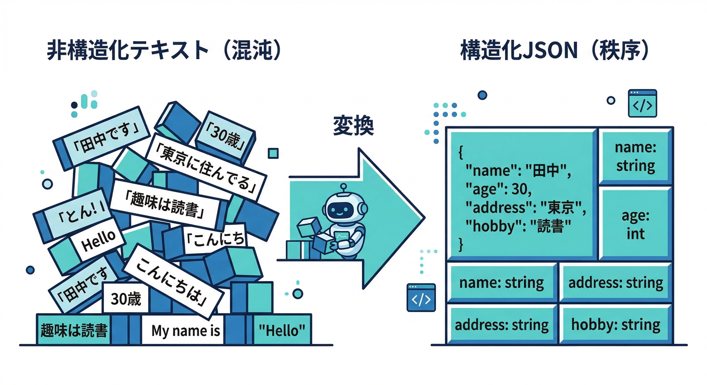
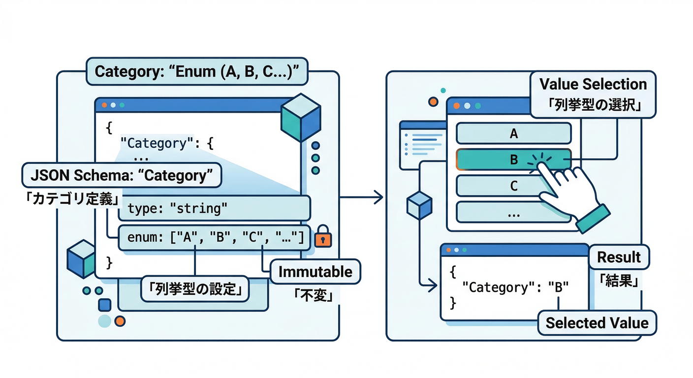
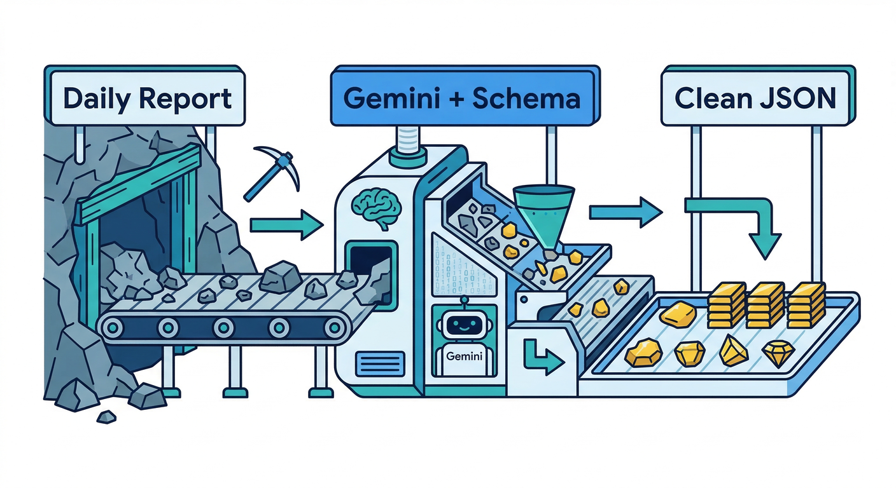
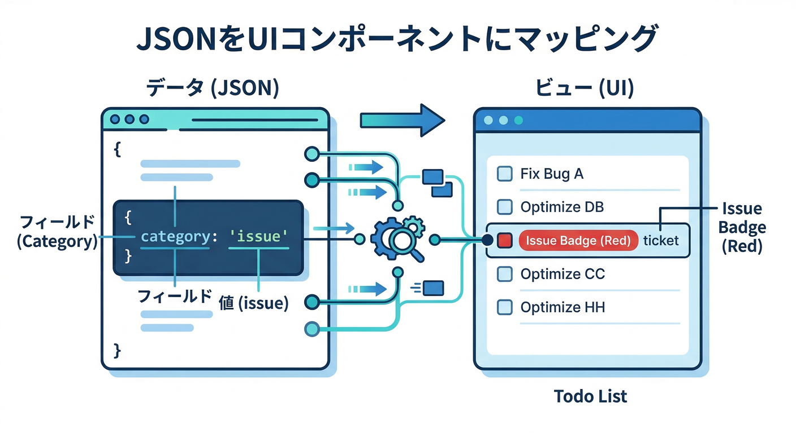

# 第05章：JSONで返してもらう（構造化の入口）🧾🔎

この章はひとことで言うと、**AIの返事を“文章”じゃなくて“データ”として受け取れるようにする**回です😆✨
（UIに出す・Firestoreに保存する・あとで集計する…が一気にラクになります！）

---

## この章でできるようになること 🎯

* 日報テキストから **「カテゴリ」「重要度」「ToDo配列」** を **JSONで** 抽出できる🧠
* **responseMimeType + responseSchema** で、返事の形をだいたい固定できる🔧 ([Firebase][1])
* JSONが壊れても **復旧できる3段構え** を用意できる🧯

---



## 読む 📚✨：なぜJSONが強いの？（“文章”→“構造”）🧠

AIの返事がふつうの文章だけだと、あとでこうなりがちです👇

* 「え、ToDoってどこからどこまで？」😵
* 「重要度って数字なの？言葉なの？」😵‍💫
* 「UIにカード表示したいのに、毎回パース地獄」🌀

そこで **“構造化出力（structured output）”** を使って、**最初からJSONで返してもらう**のが超便利！
Firebase AI Logicでも、JSONを含む構造化出力は `responseMimeType` と `responseSchema` でコントロールできます🧩 ([Firebase][2])

---

## 手を動かす 🧑‍💻✨：日報 → JSON抽出 → UI表示（React）

ここからは「日報を整えるボタン」の中の **“抽出パート”** を作ります🛠️

---



## ① まずJSONの形を決める🧩

今回はUIで扱いやすいように、こんな形にします👇

* `category`: `"progress" | "issue" | "plan"`
* `importance`: 数字（あとで1〜5に丸める）
* `todos`: `{ title, due? }` の配列（最大10件）

ポイントはこれ👇

* **キー名は英語**のほうが、TypeScriptの型やDB保存で事故りにくい👍
* **配列はmaxItemsで上限**をつける（暴走防止）🧯 ([Firebase][1])
* **厳密な「1〜5」みたいな制約はアプリ側で検証**（スキーマで表現できない/効かない場合がある）🧰 ([Firebase][1])

---



## ② `responseMimeType` と `responseSchema` をセットする🔧

WebのSDKは `firebase/ai` を使います（ドキュメントのサンプルもこの形です）🧩 ([Firebase][1])
`responseMimeType: "application/json"` を指定すると、**「JSONとして返してね」**が明確になります。([Firebase][1])

```ts
import { getAI, getGenerativeModel, GoogleAIBackend, Schema } from "firebase/ai";
import { initializeApp } from "firebase/app";

const firebaseApp = initializeApp({
  // ここは既に第2〜4章で用意済み想定（config）
});

const ai = getAI(firebaseApp, { backend: new GoogleAIBackend() });

/**
 * 日報から「カテゴリ・重要度・ToDo」を抽出するためのJSONスキーマ
 */
const dailyReportSchema = Schema.object({
  properties: {
    category: Schema.enumString({ enum: ["progress", "issue", "plan"] }),
    importance: Schema.number(),
    todos: Schema.array({
      maxItems: 10,
      items: Schema.object({
        properties: {
          title: Schema.string(),
          due: Schema.string(), // "2026-02-20" みたいに来たら嬉しい、くらいの気持ち
        },
        optionalProperties: ["due"],
      }),
    }),
  },
});

// 生成モデル（JSON固定）
export const dailyReportModel = getGenerativeModel(ai, {
  model: "GEMINI_MODEL_NAME",
  generationConfig: {
    responseMimeType: "application/json",
    responseSchema: dailyReportSchema,
  },
});
```

スキーマで使える項目が限られていたり、**基本は“全部必須扱い”になりやすい**ので、必要なら `optionalProperties` をちゃんと指定します🙂 ([Firebase][1])

---



## ③ React側：抽出してカード表示する📇✨

まずは「抽出→画面に見せる」まで最短でいきます🚀

```tsx
import React, { useMemo, useState } from "react";
import { z } from "zod";
import { dailyReportModel } from "./ai";

// ✅ 受け取ったJSONを“最後に守る”ためのZod（保険）
const DailyReportZ = z.object({
  category: z.enum(["progress", "issue", "plan"]),
  importance: z.number(),
  todos: z.array(
    z.object({
      title: z.string().min(1),
      due: z.string().optional(),
    })
  ),
});
type DailyReport = z.infer<typeof DailyReportZ>;

function clampImportance(n: number) {
  // 重要度が 1〜5 に入らなくても、ここで救う🙏
  if (!Number.isFinite(n)) return 3;
  return Math.min(5, Math.max(1, Math.round(n)));
}

export default function DailyReportExtractor() {
  const [input, setInput] = useState("");
  const [data, setData] = useState<DailyReport | null>(null);
  const [error, setError] = useState<string | null>(null);
  const [busy, setBusy] = useState(false);

  async function run() {
    setBusy(true);
    setError(null);
    setData(null);

    try {
      const prompt = `
次の日報テキストから、カテゴリ(category)、重要度(importance)、ToDo一覧(todos)を抽出してください。
- 出力はJSONのみ
- todosは最大10件
- dueは分かれば "YYYY-MM-DD" 形式、分からなければ省略

日報:
${input}
      `.trim();

      const result = await dailyReportModel.generateContent(prompt);
      const text = result.response.text(); // JSON文字列のはず
      const json = JSON.parse(text);

      const parsed = DailyReportZ.safeParse(json);
      if (!parsed.success) {
        throw new Error("JSONの形が想定と違いました（検証NG）");
      }

      // 仕上げ：importanceだけ丸める
      const fixed: DailyReport = {
        ...parsed.data,
        importance: clampImportance(parsed.data.importance),
        todos: parsed.data.todos.slice(0, 10),
      };

      setData(fixed);
    } catch (e: any) {
      setError(e?.message ?? "エラーが起きました");
    } finally {
      setBusy(false);
    }
  }

  return (
    <div style={{ display: "grid", gap: 12, maxWidth: 720 }}>
      <h2>日報 → JSON抽出 🧾✨</h2>

      <textarea
        rows={8}
        value={input}
        onChange={(e) => setInput(e.target.value)}
        placeholder="今日やったこと、困ってること、明日やること…をラフに書く✍️"
      />

      <button onClick={run} disabled={busy || input.trim().length === 0}>
        {busy ? "抽出中…🤖" : "抽出する🧠"}
      </button>

      {error && <div style={{ color: "crimson" }}>⚠️ {error}</div>}

      {data && (
        <div style={{ border: "1px solid #ddd", padding: 12, borderRadius: 12 }}>
          <div>📌 category: <b>{data.category}</b></div>
          <div>🔥 importance: <b>{data.importance}</b></div>
          <div style={{ marginTop: 8 }}>✅ todos:</div>
          <ul>
            {data.todos.map((t, i) => (
              <li key={i}>
                {t.title} {t.due ? <span>（🗓️ {t.due}）</span> : null}
              </li>
            ))}
          </ul>
        </div>
      )}
    </div>
  );
}
```

「スキーマで縛ってるのに、さらにZodで検証するの？」って思うけど、ここは**アプリ側の安全ベルト**です🧷
スキーマは強いけど、現実の運用では“想定外”がゼロにならないので、最後はコードで守るのが安心です🙂 ([Google AI for Developers][3])

---


## ④ JSONが壊れた時のリカバリ案（3段構え）🧯🧯🧯

## レベル1：よくある“余計な文字”を削って再パース🧼

* 先頭/末尾の空白
* たまに混ざる説明文
* ```json みたいなフェンス（もし混ざったら）  
  ```

```ts
export function tryParseLooseJson(text: string) {
  // まずは素直に
  try { return { ok: true as const, value: JSON.parse(text) }; } catch {}

  // 次に「最初の{」〜「最後の}」だけ抜く（雑だけど効くことある）
  const start = text.indexOf("{");
  const end = text.lastIndexOf("}");
  if (start >= 0 && end > start) {
    const sliced = text.slice(start, end + 1);
    try { return { ok: true as const, value: JSON.parse(sliced) }; } catch {}
  }
  return { ok: false as const };
}
```

## レベル2：“修復専用AI”に直させる🔧🤖

ここが便利ポイント！
Firebase AI Logicは**systemInstruction**も設定できるので、「壊れたJSONを直して、JSONだけ返せ」を強制しやすいです🙂 ([Firebase][4])

```ts
import { getGenerativeModel } from "firebase/ai";
import { ai, dailyReportSchema } from "./aiBase"; // aiはgetAI済みのもの

const repairModel = getGenerativeModel(ai, {
  model: "GEMINI_MODEL_NAME",
  systemInstruction:
    "You are a JSON repair tool. Output ONLY valid JSON that matches the given schema. No prose.",
  generationConfig: {
    responseMimeType: "application/json",
    responseSchema: dailyReportSchema,
  },
});

export async function repairJson(broken: string) {
  const prompt = `
Broken output:
${broken}

Fix it and return only JSON that matches the schema.
`.trim();

  const result = await repairModel.generateContent(prompt);
  return JSON.parse(result.response.text());
}
```

## レベル3：UXで救う（再試行・手入力・プレーン表示）🧑‍🤝‍🧑

* 「もう一回やる🔁」ボタンを出す
* JSON抽出がダメなら、**プレーン文章で表示して人が直せる**ルートを用意する
* 失敗ログは“個人情報を入れずに”残す🧯

---

## ⑤ ちょい運用メモ（地味に超重要）📦🧠

* **スキーマは小さく**：スキーマ自体も入力トークンに影響します（大きすぎると失敗しやすい）📉 ([Firebase][1])
* **enumは強い**：分類は `enumString` がとても安定します🎯 ([Firebase][1])
* **モデルは入れ替わる**：最近のドキュメントでもモデルの提供/引退が明記されてます。モデル名はRemote Configで差し替えられる設計にしておくと安全です🧯 ([Firebase][2])

---

## ミニ課題 🧪✨

1. `todos` に `confidence`（0〜1の自信度）を追加してみる💡（制約はZodでチェック）
2. `category` を `"progress" | "issue" | "plan" | "other"` に増やして、**otherの時だけ** `note` を入れてもらう（`optionalProperties` を使う）🧩 ([Firebase][1])
3. 抽出結果を「カード → 編集 → 保存」できるUIにして、次章以降（サーバー側/評価）へ繋げる🚀

---

## チェック ✅✅✅

* JSONのキーが毎回ブレない（UIが壊れない）？🧱
* `optionalProperties` を使って「無理に埋めさせない設計」になってる？🙂 ([Firebase][1])
* 壊れた時に「ユーザーが詰まない」逃げ道がある？🧯
* 重要度や配列上限など、**アプリ側で最終ガード**できてる？🛡️

---

次の章に進むなら、ここで作ったJSONをそのまま使って「画像生成のメタ情報」や「NG表現チェック結果」みたいな“機械が扱うデータ”に広げると、気持ちよく繋がりますよ〜😆✨

[1]: https://firebase.google.com/docs/ai-logic/generate-structured-output "Generate structured output (like JSON and enums) using the Gemini API  |  Firebase AI Logic"
[2]: https://firebase.google.com/docs/ai-logic/model-parameters "Use model configuration to control responses  |  Firebase AI Logic"
[3]: https://ai.google.dev/gemini-api/docs/structured-output "Structured outputs  |  Gemini API  |  Google AI for Developers"
[4]: https://firebase.google.com/docs/ai-logic/system-instructions "Use system instructions to steer the behavior of a model  |  Firebase AI Logic"
