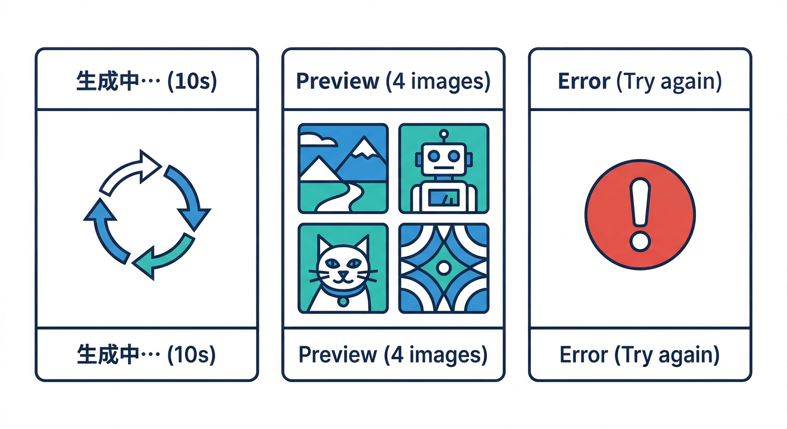
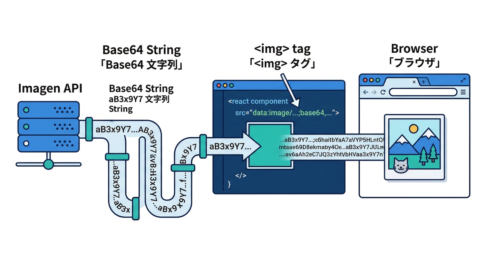
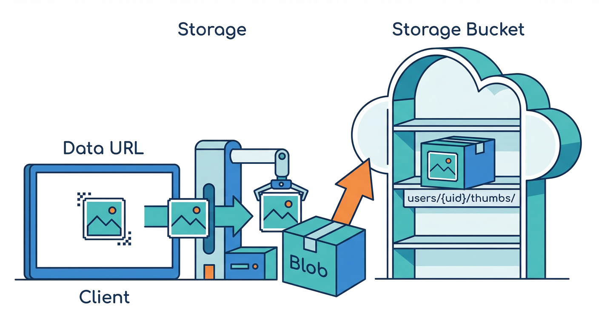
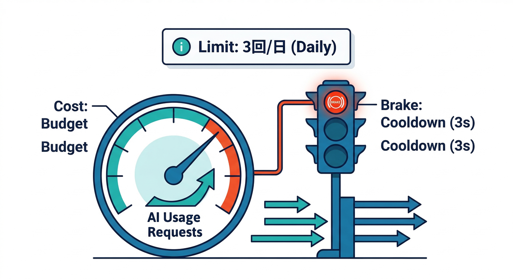
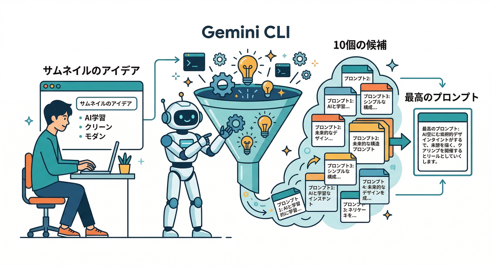
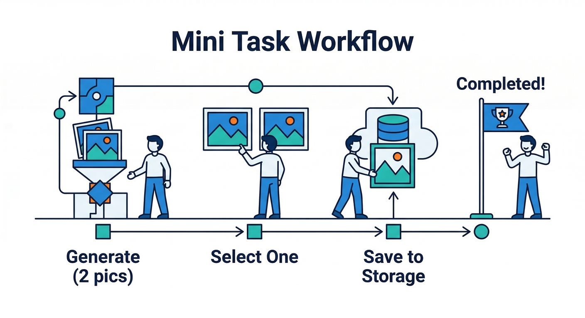

# 第06章：画像生成（Imagen）を“アプリ体験”に混ぜる🖼️✨

この章のゴールはこれです👇😆
**「日報のサムネをAIで作る」→「プレビューして選ぶ」→「保存して次回も表示」** を、気持ちよく一連の体験にすること🎯

Firebase AI Logic のクライアントSDKから **Imagenで画像生成**できます。([Firebase][1])

---

## 1) 画像生成UIは「失敗前提」で作るのが勝ち🏆🧯



テキスト生成より、画像生成は体感で「重い・待つ・弾かれる」が起こりやすいです🙂
だからUIは最初からこうしておくと、学習者が詰まりません👇

* ⏳ **生成中表示**：ボタンを無効化＋スピナー＋「10〜20秒かかることもあるよ」表示
* 🧪 **候補は最大4枚まで**：まずは1〜2枚でOK（コストもUXも安定）
* 🚧 **弾かれた時の分岐**：

  * プロンプト自体がブロック → 例外（エラー）で返ることがある
  * プロンプトはOKでも、生成画像がフィルタされて `images` が空になることがある（`filteredReason` が付く）([Firebase][2])
* 🖼️ **保存前にプレビュー**：ユーザーが「これ！」を選ぶ時間を作る
* 🧷 **“デフォ画像”の逃げ道**：生成失敗でも画面が成立する（超重要）✅

---

## 2) まずは生成してプレビューまで通す React 実装🧩⚡



Firebase AI Logic の `ImagenModel.generateImages()` は **base64文字列で画像を返す**設計です。([Firebase][2])
返ってくる各画像には `bytesBase64Encoded` と `mimeType` が入ります。([Firebase][3])

## コア：生成→data URLにして `` 表示🖼️

```ts
import { useState } from "react";

import { initializeApp } from "firebase/app";
import { getAI, GoogleAIBackend, getImagenModel } from "firebase/ai";

// すでに他章で作った firebaseConfig を使う想定
const app = initializeApp(firebaseConfig);

const ai = getAI(app, { backend: new GoogleAIBackend() });
// NOTE: モデル名は後述。まずは動く型を作るのが目的👍
const imagen = getImagenModel(ai, {
  model: "imagen-3.0-generate-002",
  generationConfig: {
    numberOfImages: 1,
    // 1:1 がサムネに使いやすい
    aspectRatio: "1:1",
    // PNGがデフォ（指定も可能）
  },
});

export function ThumbnailGenerator() {
  const [prompt, setPrompt] = useState("和風の落ち着いた日報サムネ。筆文字風のタイトル余白あり。");
  const [loading, setLoading] = useState(false);
  const [dataUrl, setDataUrl] = useState<string | null>(null);
  const [msg, setMsg] = useState<string | null>(null);

  const onGenerate = async () => {
    setLoading(true);
    setMsg(null);
    setDataUrl(null);

    try {
      const res = await imagen.generateImages(prompt);

      // 画像がフィルタで落ちると images が空になることがある
      if (!res.images || res.images.length === 0) {
        setMsg(res.filteredReason
          ? `今回は安全フィルタで画像が出せなかったみたい🥲（理由: ${res.filteredReason}）`
          : "画像が生成できなかったみたい🥲 もう一回だけ試してみよう！");
        return;
      }

      const img = res.images[0];
      const url = `data:${img.mimeType};base64,${img.bytesBase64Encoded}`;
      setDataUrl(url);
      setMsg("できた！✨ 気に入ったら保存しよう📦");
    } catch (e: any) {
      // プロンプトがブロックされると例外になることがある
      setMsg("その指示だと生成できなかったみたい🥲 言い方を変えて試してみてね。");
    } finally {
      setLoading(false);
    }
  };

  return (
    <div style={{ maxWidth: 560, display: "grid", gap: 12 }}>
      <h3>日報サムネメーカー🖼️✨</h3>

      <textarea
        value={prompt}
        onChange={(e) => setPrompt(e.target.value)}
        rows={4}
        placeholder="どんなサムネにしたい？（雰囲気・色・余白・文字なし等）"
      />

      <button onClick={onGenerate} disabled={loading}>
        {loading ? "生成中…⏳" : "サムネを作る🪄"}
      </button>

      {msg && <div>{msg}</div>}

      {dataUrl && (
        <div style={{ display: "grid", gap: 8 }}>
          
        </div>
      )}
    </div>
  );
}
```

## 生成設定で押さえるポイント🎛️

* `numberOfImages`：最大4くらいが現実的（まずは1でOK）([Firebase][4])
* `aspectRatio`：サムネなら `1:1` が無難😌([Firebase][4])
* `addWatermark`：**不可視のSynthID透かし**を埋められる（Gemini Developer API側ではONがデフォ＆OFF不可、と明記あり）([Firebase][4])
* `negativePrompt`：Gemini Developer API側だと、モデルによっては「使えない/制約あり」があるので、まずは **ポジティブに指示**が安定です🙂([Firebase][4])

---

## 3) 生成した画像を Cloud Storage に保存する📦🧷



ここからが「アプリ体験」になります😆
生成した画像を **Storageへアップロード**して、あとで同じサムネを表示できるようにします。

おすすめの保存ルール👇

* パス：`users/{uid}/thumbs/{yyyymmddHHMMss}.png` みたいに **ユーザー別＋衝突しない命名**🧠
* メタ：`contentType` を必ず付ける（Rulesでも使う）🔐
* Firestoreには「現在のサムネ」と「履歴」を持つ（次章以降の拡張に効く）📚

## data URL → Blob にして uploadBytes する🧰

```ts
import { getStorage, ref as sRef, uploadBytes, getDownloadURL } from "firebase/storage";
import { getAuth } from "firebase/auth";

const storage = getStorage(app);

function dataUrlToBlob(dataUrl: string): Blob {
  const [meta, base64] = dataUrl.split(",");
  const mime = meta.match(/data:(.*);base64/)?.[1] ?? "image/png";
  const bin = atob(base64);
  const u8 = new Uint8Array(bin.length);
  for (let i = 0; i < bin.length; i++) u8[i] = bin.charCodeAt(i);
  return new Blob([u8], { type: mime });
}

export async function saveThumbnail(dataUrl: string) {
  const auth = getAuth(app);
  const uid = auth.currentUser?.uid;
  if (!uid) throw new Error("not signed in");

  const blob = dataUrlToBlob(dataUrl);
  const ts = new Date().toISOString().replace(/[-:.TZ]/g, "");
  const path = `users/${uid}/thumbs/${ts}.png`;

  const r = sRef(storage, path);
  await uploadBytes(r, blob, { contentType: blob.type });

  const url = await getDownloadURL(r);
  return { path, url };
}
```

---

## 4) コストと上限 画像生成は先にブレーキを付ける🚦💸



画像生成は「楽しい」ので、放っておくと回数が増えがちです😂
Firebase AI Logic には **ユーザー単位のレート制限**など“乱用対策”の話が最初から出てきます。([Firebase][5])
また料金は、AI Logic自体だけでなく **使うモデル側（Gemini/Imagen/Vertex AI）や、他Firebaseサービス（Storage等）**の分も含めて考える必要があります。([Firebase][6])

この章で入れておく「初心者に優しい制限」おすすめ👇

* 🧮 1日あたり回数：まず **3回/日**
* 🖼️ `numberOfImages`：最初は **1枚**（気持ちよく学べる）
* 🧯 連打対策：生成中はボタン無効化＋クールダウン（3秒とか）
* 🧨 “停止スイッチ”の置き場所を決める（Remote Configは後の章で本格実装🎛️）

---

## 5) モデル名の選び方だけ注意⚠️🧠

ドキュメント側には `imagen-4.0-generate-001` など **Imagen 4系のモデル名**が載っている一方、JavaScript API reference の `ImagenModelParams.model` には **「Imagen 3（imagen-3.0-*）のみ」**と書かれている箇所もあります。([Firebase][1])

なので学習ではこうすると事故りにくいです👇🙂

* まず `imagen-3.0-generate-002` で **動く型を完成**
* もし新しいモデル名に変えてエラーが出たら、**公式のモデル一覧（ガイド側）に合わせて更新**
* 「モデル名が通らない」系のエラーは、だいたいここが原因です😂

---

## 6) Gemini CLI で「プロンプト作り」を秒速にする🧠⚡



画像プロンプトって、地味に悩みますよね🙂
ここは **Gemini CLI** に「候補を10個出して」→「良さそうなのを合体」→「短く整形」ってやると楽です💻✨（この流れ自体が“開発AI”の練習にもなる！）

プロンプトのコツ（初心者向け）👇🪄

* 先に「用途」：**日報サムネ**
* 次に「雰囲気」：落ち着き／明るい／信頼感
* 次に「構図」：中央に余白、文字は後で載せるので **文字なし**
* 最後に「禁止」：個人情報・顔写真っぽい指定は避ける（安全にも強い）🛡️

---

## ミニ課題 いい感じのサムネ体験を完成させる🎒✨



やることは3つだけ😆

1. `numberOfImages: 2` にして **2枚候補**を出す🖼️🖼️
2. どっちかを選んで **Storageに保存**📦
3. Firestoreに「今日の日報」ドキュメントを作って、そこに `thumbnailUrl` を入れる📝

---

## チェック ここまでできたら合格✅🎉

* ⏳ 生成中のUIがちゃんと出る（連打できない）
* 🧯 失敗しても画面が壊れない（メッセージ＋デフォ画像がある）
* 🖼️ `data:${mimeType};base64,...` でプレビューできる
* 📦 Storageに保存できて、リロード後も表示できる
* 🚦 回数が増えすぎない仕組み（最低限のブレーキ）が入ってる

---

次の第7章で、ここに **App Check** をかけて「正規アプリ以外からの乱用」をガードしていくと、一気に実務っぽくなります🧿🛡️

[1]: https://firebase.google.com/docs/ai-logic/generate-images-imagen?utm_source=chatgpt.com "Generate images using Imagen | Firebase AI Logic - Google"
[2]: https://firebase.google.com/docs/reference/js/ai.imagenmodel.md "ImagenModel class  |  Firebase JavaScript API reference"
[3]: https://firebase.google.com/docs/reference/js/ai.imageninlineimage.md "ImagenInlineImage interface  |  Firebase JavaScript API reference"
[4]: https://firebase.google.com/docs/reference/js/ai.imagengenerationconfig.md "ImagenGenerationConfig interface  |  Firebase JavaScript API reference"
[5]: https://firebase.google.com/docs/ai-logic/quotas?utm_source=chatgpt.com "Rate limits and quotas | Firebase AI Logic - Google"
[6]: https://firebase.google.com/docs/ai-logic/pricing?utm_source=chatgpt.com "Understand pricing | Firebase AI Logic - Google"
