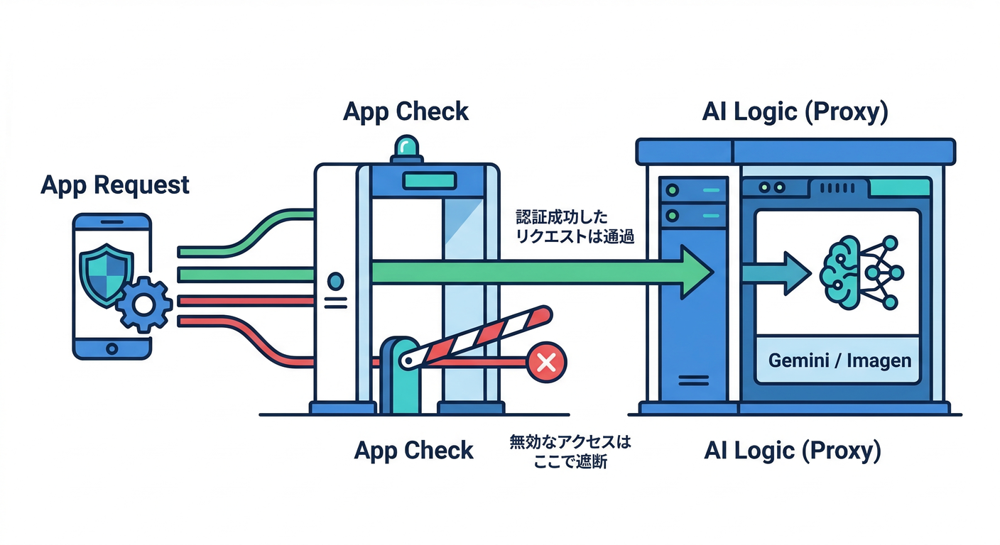
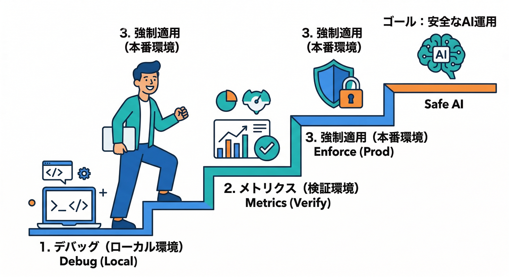
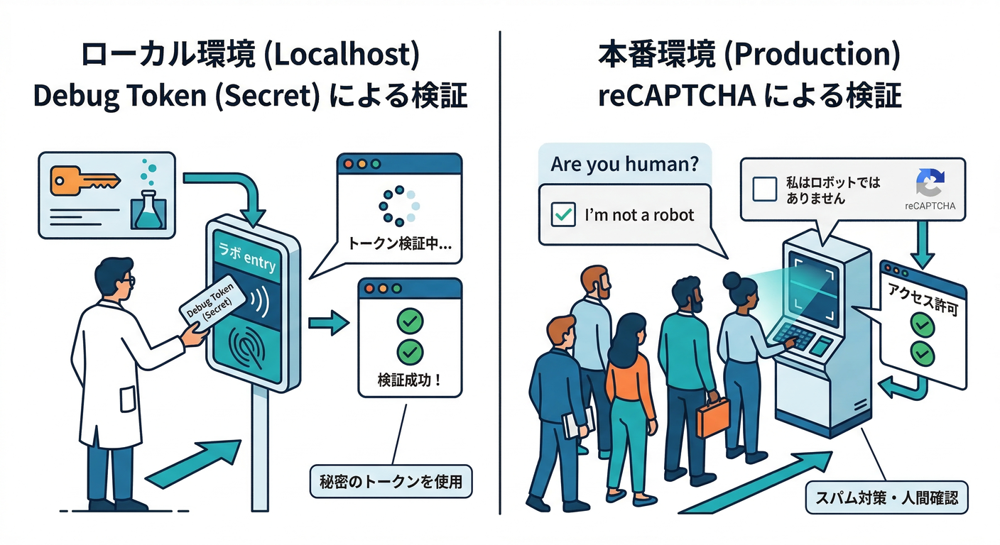
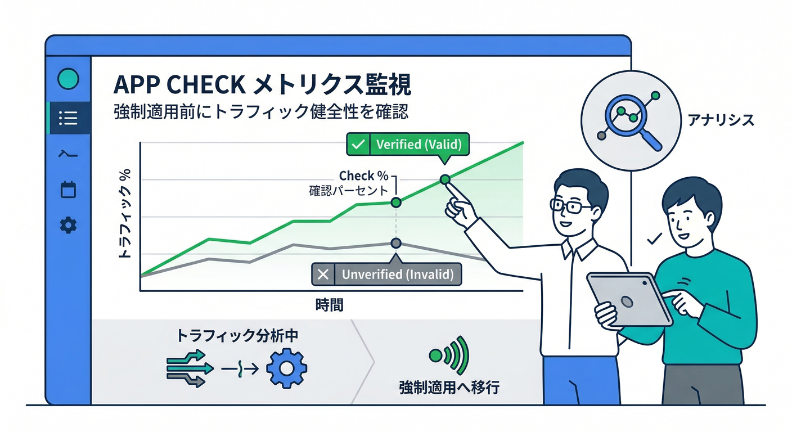
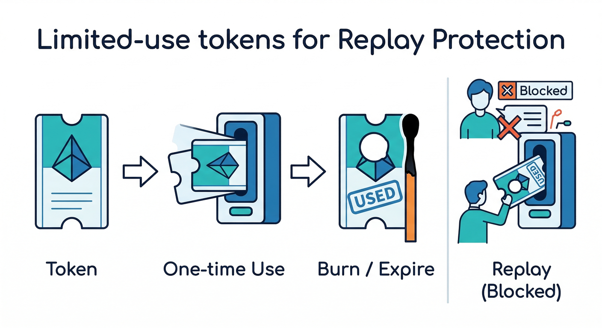
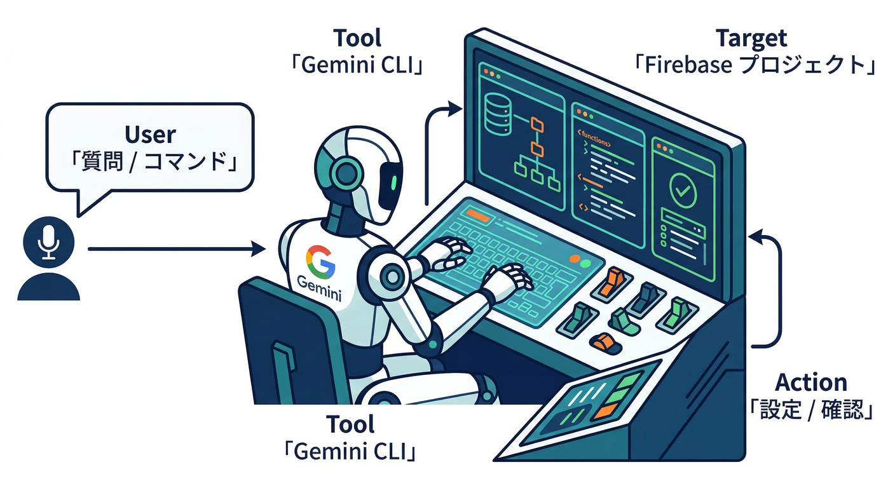
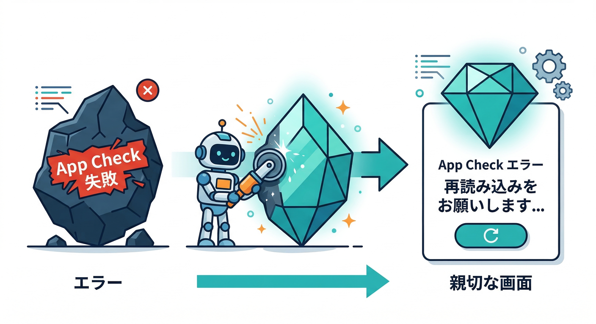

# 第07章：App Checkで“正規アプリ以外を弾く”🧿🛡️

この章はひと言でいうと、**AIボタン（整形/要約/NGチェック/画像生成）を「野良スクリプト」から守る回**です😇💸
AI系APIは狙われやすいので、ここを押さえると安心感が一気に上がります✨

---

## この章でできるようになること✅

* App Checkが**AI Logic（Gemini/Imagen呼び出し）を守る理由**がわかる🙂
* Web（React）で **App Checkを動かす（開発→本番）**ができる🚀
* **Firebase AI Logicに対してEnforcement（強制）をON**にできる🧱
* 将来の“強化（リプレイ対策）”に備えて **limited-use tokens** を理解できる🧯🕒 ([Firebase][1])

---

## 1) まず結論：AI Logic + App Check は相性が良い👍



Firebase AI Logic は、アプリからのリクエストを **Firebase側のサービスがプロキシ**して、そこから Gemini API/Imagen に投げてくれる作りです。なので、**その“入口”で App Check を検証してから通す**がやりやすいんですね🧠✨ ([Firebase][1])

そして重要ポイント👇

* **APIキーは「プロジェクトの識別」には使えるけど、「アクセス許可」そのものではない**（守りとしては弱い）
* だから **App Check を早めに入れるのが推奨**されます🧿 ([Firebase][1])

---

## 2) やる順番（事故らないルート）🧭



App Checkは、最初から強制すると自分で自分を詰ませがちです😂
なのでこの順番が鉄板です👇

1. **開発中**：debug provider（デバッグトークン）で通す🧪
2. **動作確認**：App Checkのメトリクスで「Verifiedが増えてる」ことを見る👀
3. **本番**：Firebase AI Logic の **EnforcementをON**（強制）🧱 ([Firebase][2])

---

## 3) 手を動かす：React( Web )で App Check を有効化する🛠️✨

## 3-1. 先に決める：WebのProviderはどれ？🤔

Web向けは主にこの2択です👇

* **reCAPTCHA Enterprise**（しっかり運用向け）🛡️
* **reCAPTCHA v3**（手軽寄り）🙂

Firebase公式のWeb向けApp Checkは、こうしたreCAPTCHA系プロバイダでの利用が基本です。 ([Firebase][3])

---

## 3-2. 開発（localhost）では debug provider を使う🧪（超重要！）



ここ、めちゃ大事です⚠️
**localhost を reCAPTCHA の許可ドメインに入れてデバッグしようとしない**でください。誰でもローカルで動かせちゃうので危険です😱 ([Firebase][4])

代わりに **debug provider** を使います👇 ([Firebase][4])

## ✅ 実装例（Vite + React想定）

```tsx
// src/lib/firebase.ts
import { initializeApp } from "firebase/app";

export const firebaseApp = initializeApp({
  apiKey: import.meta.env.VITE_FIREBASE_API_KEY,
  authDomain: import.meta.env.VITE_FIREBASE_AUTH_DOMAIN,
  projectId: import.meta.env.VITE_FIREBASE_PROJECT_ID,
  appId: import.meta.env.VITE_FIREBASE_APP_ID,
});
```

```ts
// src/lib/appCheck.ts
import { firebaseApp } from "./firebase";
import { initializeAppCheck, ReCaptchaEnterpriseProvider } from "firebase/app-check";

// ✅ 開発中は debug token を出す（まずは true でOK）
if (import.meta.env.DEV) {
  // 公式は self を例示。ブラウザなら globalThis でもOK
  (globalThis as any).FIREBASE_APPCHECK_DEBUG_TOKEN = true;
}

// 本番は reCAPTCHA Enterprise の site key を入れる想定
const siteKey = import.meta.env.VITE_RECAPTCHA_ENTERPRISE_SITE_KEY;

export const appCheck = initializeAppCheck(firebaseApp, {
  provider: new ReCaptchaEnterpriseProvider(siteKey),
  isTokenAutoRefreshEnabled: true, // トークン更新ON
});
```

## ✅ 動作確認（デバッグトークンの登録）

1. ローカルでアプリを開いて、ブラウザのDevToolsを見る👀
2. コンソールに **AppCheck debug token: "..."** が出ます
3. Firebase Console の App Check で **Manage debug tokens** から登録🧾
   これでバックエンドが「そのトークンを正規として扱う」状態になります。
   ※トークンは秘密扱いで！漏れたら即 revoke 🔥 ([Firebase][4])

---

## 4) AI Logic 側：Enforcement（強制）をONにする🧱✅

App Check をコードに入れたら、次は **Console側で“強制するか”**を切り替えます。

## 4-1. まずメトリクスを見る👀



App Check の画面で、対象サービス（ここでは **Firebase AI Logic**）のメトリクスを見て、
**Verified がちゃんと増えてる**ことを確認します。 ([Firebase][2])

## 4-2. Firebase AI Logic のEnforcementを有効化🧱

App Check の管理画面で **Firebase AI Logic** を選んで **EnforcementをEnable**。
有効化してから反映されるまで **最大15分くらい**かかることがあります⏳ ([Firebase][2])

---

## 5) “将来の強化”に備える：リプレイ対策（limited-use tokens）🧯🕒



今後の強化として **replay protection（リプレイ対策）** が案内されています。
ざっくり言うと「トークンを盗まれて使い回される」のを防ぐ方向です🛡️ ([Firebase][1])

その鍵になるのが **limited-use tokens**👇

* 通常の App Check トークン（セッショントークン）は有効期限が長め（30分〜最大7日）
* limited-use token は **1回使ったら終わり**＆短命（例：2分）で、リプレイに強い💪 ([Firebase][1])

## ✅ AI Logic（Web SDK）で limited-use tokens をONにする例

AI Logic 側の初期化で `useLimitedUseAppCheckTokens: true` を指定します。 ([Firebase][1])

```ts
// src/lib/ai.ts
import { getAI } from "firebase/ai";
import { firebaseApp } from "./firebase";

export const ai = getAI(firebaseApp, {
  useLimitedUseAppCheckTokens: true,
});
```

※この仕組みは「強くなる代わりに呼び出し回数/挙動が変わる」可能性があるので、**段階導入**が安全です🙂 ([Firebase][1])

---

## 6) よくある詰まりポイント集🧯（ここを見れば大体直る）

## 6-1. “Enforcement ONにしたら全部死んだ”😇

* だいたい **debug token を登録してない** or **本番のproviderが未設定**
* 対策：いったん enforcement を戻して、Verified が増える状態を作ってから再度ON 🧱 ([Firebase][2])

## 6-2. localhostをreCAPTCHA許可ドメインに入れたくなる🙃

* ダメです（誰でもローカルで実行できちゃう）
* 対策：debug provider が正解🧪 ([Firebase][4])

## 6-3. “APIキー隠したのに安心できない…”🤔

* APIキーは「ID札」みたいなもので、**それ自体が通行証ではない**です
* App Check（＋必要ならAuth）で守るのが基本🧿 ([Firebase][1])

---

## 7) 開発AIでスムーズにする小ワザ（Antigravity / Gemini CLI）🛸💻



Firebase公式で、**Antigravity** と **Gemini CLI** から Firebase を触るための **Firebase MCP server** が案内されています。
設定や調査を“会話で”進めやすくなるやつです🤖✨ ([Firebase][5])

例：Gemini CLI 側は公式の拡張を入れる流れが紹介されています👇 ([Firebase][5])

```bash
gemini extensions install https://github.com/gemini-cli-extensions/firebase/
```

**使いどころ（この章だと）**

* 「App Checkのどこを見ればVerified/Unverifiedが分かる？」
* 「EnforcementをONにする前にチェックすべき項目は？」
  みたいな“手順の確認”を、迷子にならずに進めるのに便利です🙂🧭 ([Firebase][5])

---

## 8) ミニ課題🎯：「App Check失敗時の表示」をやさしくする🙂✨



AIボタンを押したとき、App Checkが通らないと**ユーザー視点だと意味不明**になりがちです😂
なので、表示をこうします👇

* 例）「安全確認ができなかったのでAI機能は使えませんでした。ページ更新で直ることがあります🙂」

```ts
// ざっくり例：AI呼び出しで失敗したら“やさしい文言”にする
export function toFriendlyAiError(e: unknown): string {
  const msg = (e as any)?.message ?? "";
  if (msg.toLowerCase().includes("app check")) {
    return "安全確認ができなかったのでAI機能は使えませんでした。ページ更新で直ることがあります🙂";
  }
  return "AIの処理でエラーが起きました。少し待ってからもう一度試してね🙏";
}
```

---

## 9) チェックリスト✅（この章の合格ライン）

* [ ] debug token が Console に登録されている🧪 ([Firebase][4])
* [ ] App Check メトリクスで Verified が増えている👀 ([Firebase][2])
* [ ] Firebase AI Logic の Enforcement をONにできた🧱（反映に最大15分待つ）⏳ ([Firebase][2])
* [ ] limited-use tokens（リプレイ対策）の意味を説明できる🧯 ([Firebase][1])
* [ ] 失敗時に“やさしい表示”が出る🙂

---

次の第8章では、この守りを土台にして **「使いすぎ防止（レート制限＋段階解放＋停止スイッチ）」**へ進めます🎛️🚦
App Check が入ってると、レート制御の“効き”が一気に現実的になりますよ😆✨

[1]: https://firebase.google.com/docs/ai-logic/faq-and-troubleshooting "FAQ and troubleshooting  |  Firebase AI Logic"
[2]: https://firebase.google.com/docs/app-check/enable-enforcement "Enable App Check enforcement  |  Firebase App Check"
[3]: https://firebase.google.com/docs/app-check/web/recaptcha-provider "Get started using App Check with reCAPTCHA v3 in web apps  |  Firebase App Check"
[4]: https://firebase.google.com/docs/app-check/web/debug-provider "Use App Check with the debug provider in web apps  |  Firebase App Check"
[5]: https://firebase.google.com/docs/ai-assistance/mcp-server "Firebase MCP server  |  Develop with AI assistance"
