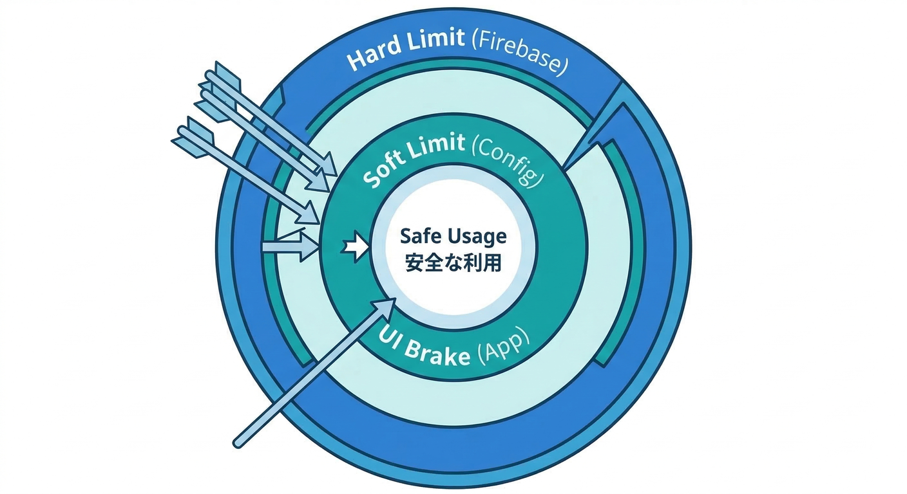
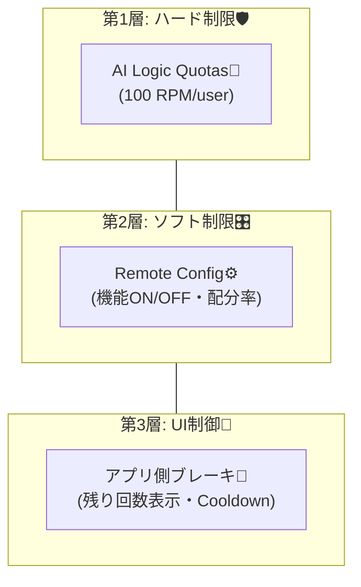
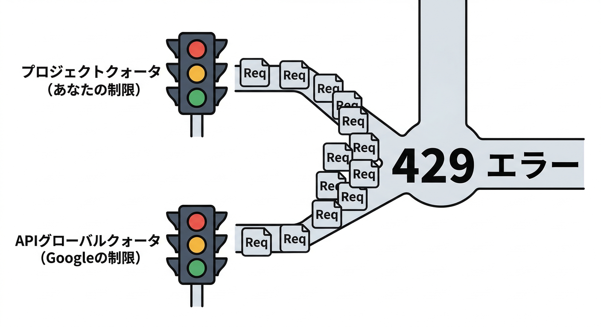
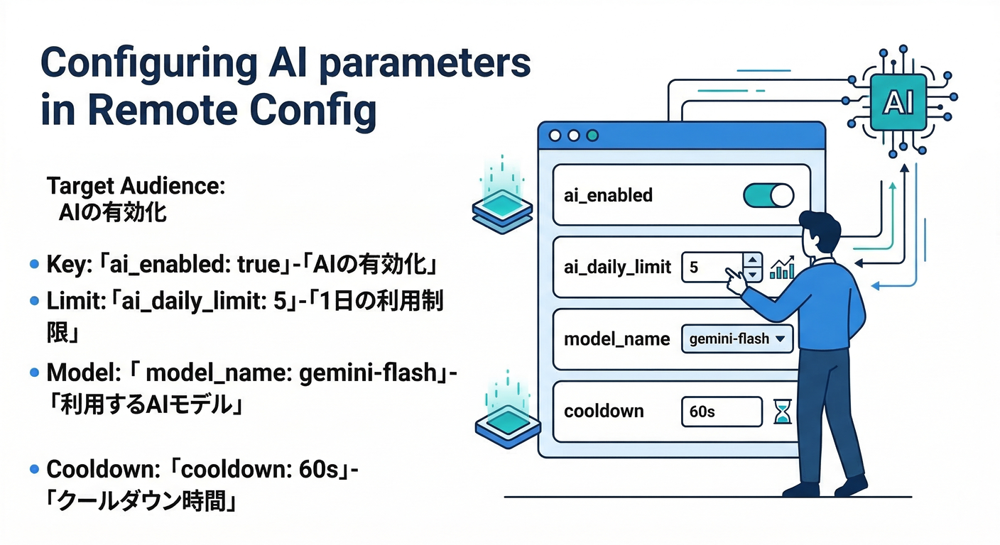
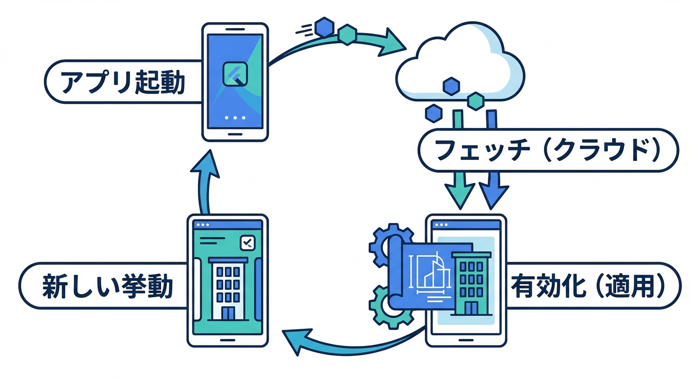
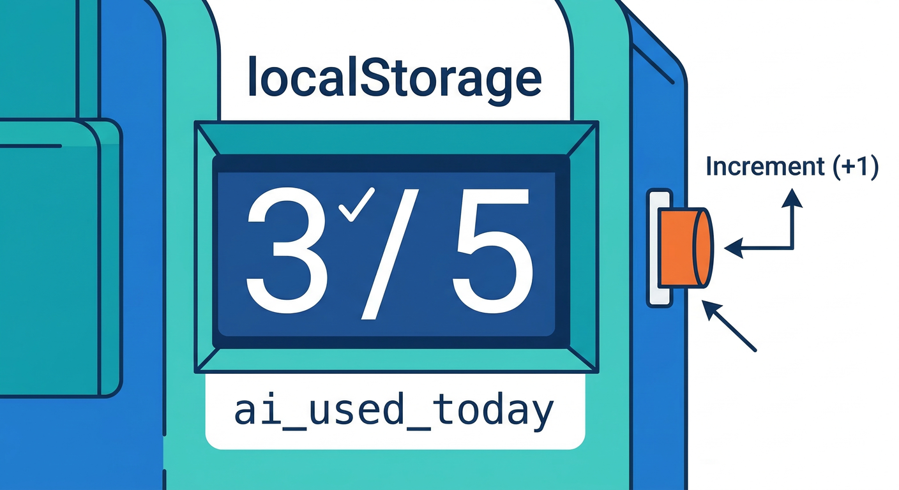
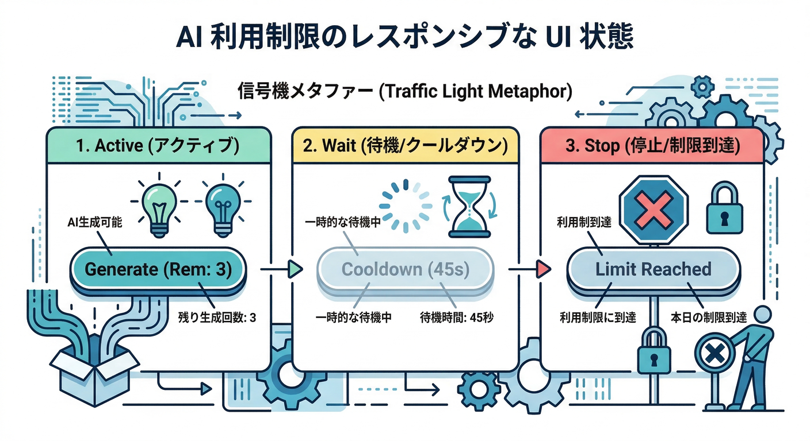
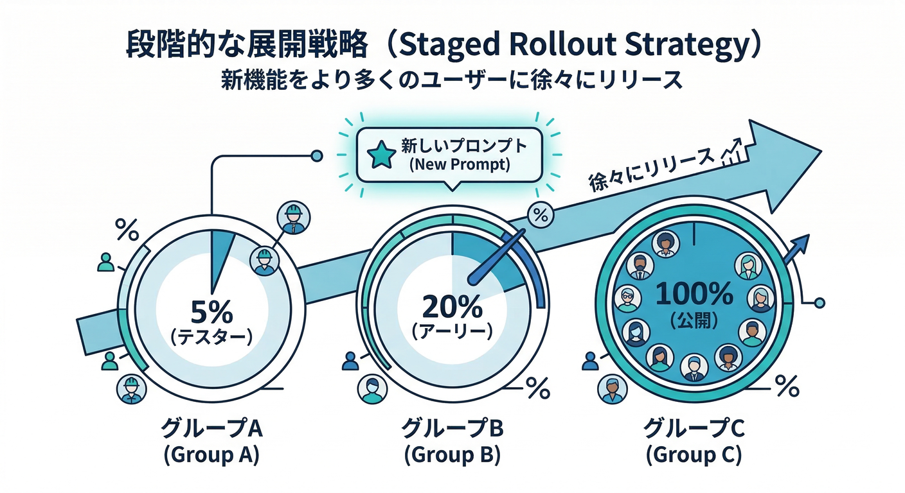

# 第08章：使いすぎ防止（レート制限＋段階解放）🎛️🚦

この章はひとことで言うと「**AI機能で、コスト事故💸と乱用🤖を起こさない仕組み**を作る回」です😊✨
“便利なボタン”ほど、放置すると秒で燃えます🔥（マジで…）

---

## この章のゴール 🎯✨

* **（強い守り）** AI呼び出しを「回数・速度」で自動ブレーキ🧯
* **（やさしい運用）** Remote Configで **段階解放**（ON/OFF・配布率・プラン別）🎛️
* **（事故対応）** 429（クォータ超過）でも、アプリが壊れずに“上手に止まる”🚧

> まず大事な前提：クォータ（レート制限）は **RPM/RPD/TPM/TPD** みたいな複数軸で判定され、超えると **429** が返ります📵 ([Firebase][1])
> さらに Gemini Developer API は **2025-12-07 にクォータ調整**があり、突然429が増えるケースも注意ポイントです⚠️ ([Firebase][2])

---

## まず“3段バリア”で考える 🧱🧱🧱





## ① ハード制限（最強）🛡️

* Firebase AI Logic は **「per user」レート制限**を設定できます（デフォルトは *1ユーザーあたり 100 RPM*）。ただし **ユーザー個別や特定グループだけ別設定**はできません。 ([Firebase][1])
* ここは「最終安全装置」なので、まず必ず入れます🧯

## ② ソフト制限（UX）🙂

* Remote Config で **AI機能のON/OFF**、**段階解放**、**プロンプト/モデル切替**をやります🎛️
* ただし Remote Config の値は **機密情報を置く場所じゃない**（アプリから見えます）🙅‍♂️ ([Firebase][3])

## ③ “アプリ内”ブレーキ（親切）🧁

* 「今日はあと◯回」みたいな表示＆停止で、無駄打ちを減らします💡
* 本気の課金プラン制御は、後半のサーバー側（Genkit/Functions）で強化が王道です🏗️

---

## 読むパート 📖🧠（ここだけ覚えればOK）

## ✅ 429が出る理由は2つ



1. **あなたのFirebaseプロジェクトのクォータ**超過（RPM/RPD/TPM/TPDのどれか）📉 ([Firebase][1])
2. Gemini Developer API側のクォータ事情（調整が入ることも）🔧 ([Firebase][2])

## ✅ Remote Configは「切替スイッチ」向き

Firebase AI Logic × Remote Config は公式に「モデル名・システム指示・プロンプト・Vertexのlocation」などを Remote Config から読ませる例が用意されています🧩 ([Firebase][4])
さらに generative AI みたいな用途は、**ロールアウトで少人数→徐々に増やす**のが超安全です🪜 ([Firebase][5])

---

## 手を動かすパート 🛠️💻（React + TypeScript）

ここでは「**Remote Configで段階解放**」＋「**429時の止め方**」までを一気に仕上げます✨

---

## 1) Remote Config に“AI用パラメータ”を作る 🎛️🧾



最低限これだけ作るのがオススメ👇

* `ai_enabled`（boolean）… AI機能のON/OFF（停止スイッチ🚨）
* `ai_daily_limit`（number）… 1日あたりの上限（UX用）
* `ai_cooldown_sec`（number）… 429後に待つ秒数（UX用）
* `model_name`（string）… モデル切替
* `system_instructions`（string）… システム指示
* `prompt`（string）… プロンプト雛形

※ Firebase AI Logic公式の Remote Config 例も、ほぼこの発想です🙂 ([Firebase][4])

---

## 2) Remote Config をアプリ起動時に読み込む 🚀



ポイント：

* 値に依存するコードは **fetch & activate の後**に動かす📌 ([Firebase][4])
* 取りすぎると **throttle（制限）**されるので、開発中だけ短くして、本番は控えめに🧊
* 本番の minimum fetch interval は **12時間が基本**（公式推奨の考え方） ([Firebase][3])

```tsx
// remoteConfigAi.ts
import { getRemoteConfig, fetchAndActivate, getValue } from "firebase/remote-config";
import type { FirebaseApp } from "firebase/app";

export type AiRc = {
  aiEnabled: boolean;
  aiDailyLimit: number;
  aiCooldownSec: number;
  modelName: string;
  systemInstructions: string;
  prompt: string;
};

export async function loadAiRemoteConfig(app: FirebaseApp): Promise<AiRc> {
  const rc = getRemoteConfig(app);

  // 本番は長めが基本。開発中だけ短くしてOK（例：60秒）
  rc.settings.minimumFetchIntervalMillis = 60_000;

  rc.defaultConfig = {
    ai_enabled: true,
    ai_daily_limit: 5,
    ai_cooldown_sec: 60,
    model_name: "gemini-2.5-flash",
    system_instructions: "あなたは丁寧な編集者です。",
    prompt: "次の文章を読みやすく整形して。出力は日本語、敬体、箇条書きを含めて。",
  };

  await fetchAndActivate(rc);

  return {
    aiEnabled: getValue(rc, "ai_enabled").asBoolean(),
    aiDailyLimit: getValue(rc, "ai_daily_limit").asNumber(),
    aiCooldownSec: getValue(rc, "ai_cooldown_sec").asNumber(),
    modelName: getValue(rc, "model_name").asString(),
    systemInstructions: getValue(rc, "system_instructions").asString(),
    prompt: getValue(rc, "prompt").asString(),
  };
}
```

---

## 3) “今日あと何回？”をローカルで数える 🧁📅



これは**UX用**（本気の不正対策ではない）けど、体験がめちゃ良くなります🙂✨

```ts
// aiUsageLocal.ts
const keyForToday = () => {
  const d = new Date();
  const yyyy = d.getFullYear();
  const mm = String(d.getMonth() + 1).padStart(2, "0");
  const dd = String(d.getDate()).padStart(2, "0");
  return `ai_used_${yyyy}-${mm}-${dd}`;
};

export function getUsedToday(): number {
  return Number(localStorage.getItem(keyForToday()) ?? "0");
}

export function incUsedToday(): void {
  const k = keyForToday();
  const next = getUsedToday() + 1;
  localStorage.setItem(k, String(next));
}

export function canUseToday(limit: number): { ok: boolean; remaining: number } {
  const used = getUsedToday();
  const remaining = Math.max(0, limit - used);
  return { ok: remaining > 0, remaining };
}
```

---

## 4) 429（クォータ超過）で“上手に止まる”🚧😇

* クォータ超過は **429** が典型です📵 ([Firebase][1])
* 429が出たら「少し待ってね」表示＋一定時間ボタン無効化が親切です🫶

```ts
// aiGuard.ts
export function isQuotaError(e: unknown): boolean {
  const anyE = e as any;
  const msg = String(anyE?.message ?? "");
  const status = anyE?.status ?? anyE?.code;

  // SDKや環境で形が違うので “ゆるく” 判定するのがコツ
  return status === 429 || msg.includes("429") || msg.toLowerCase().includes("quota");
}

const cooldownKey = "ai_cooldown_until_ms";

export function setCooldown(seconds: number) {
  const until = Date.now() + seconds * 1000;
  localStorage.setItem(cooldownKey, String(until));
}

export function getCooldownRemainingSec(): number {
  const until = Number(localStorage.getItem(cooldownKey) ?? "0");
  return Math.max(0, Math.ceil((until - Date.now()) / 1000));
}
```

---

## 5) React側で「ON/OFF」「残り回数」「クールダウン」を表示 🎛️📣



```tsx
// AiButton.tsx（例）
import { useEffect, useState } from "react";
import type { FirebaseApp } from "firebase/app";
import { loadAiRemoteConfig, type AiRc } from "./remoteConfigAi";
import { canUseToday, incUsedToday } from "./aiUsageLocal";
import { getCooldownRemainingSec, isQuotaError, setCooldown } from "./aiGuard";

export function AiButton({ app, runAi }: { app: FirebaseApp; runAi: (rc: AiRc) => Promise<void> }) {
  const [rc, setRc] = useState<AiRc | null>(null);
  const [busy, setBusy] = useState(false);
  const [msg, setMsg] = useState("");

  useEffect(() => {
    loadAiRemoteConfig(app).then(setRc).catch(() => setMsg("設定の読み込みに失敗したよ🥲"));
  }, [app]);

  if (!rc) return <button disabled>読み込み中…⏳</button>;

  const cooldown = getCooldownRemainingSec();
  const daily = canUseToday(rc.aiDailyLimit);

  const disabled =
    busy || !rc.aiEnabled || cooldown > 0 || !daily.ok;

  const label = !rc.aiEnabled
    ? "AIは停止中🚨"
    : cooldown > 0
      ? `少し待ってね…⏳（${cooldown}s）`
      : !daily.ok
        ? "本日の回数上限です🧯"
        : `AIで整形する✨（残り ${daily.remaining} 回）`;

  return (
    <div>
      <button
        disabled={disabled}
        onClick={async () => {
          setBusy(true);
          setMsg("");
          try {
            await runAi(rc);     // ← Chapter3/4/5で作ったAI呼び出しに接続する想定
            incUsedToday();
          } catch (e) {
            if (isQuotaError(e)) {
              setCooldown(rc.aiCooldownSec);
              setMsg("アクセスが集中したみたい💦 少し待ってからもう一度！🙂");
            } else {
              setMsg("うまくいかなかった🥲 入力を短くして再挑戦してみてね");
            }
          } finally {
            setBusy(false);
          }
        }}
      >
        {label}
      </button>

      {msg && <p style={{ marginTop: 8 }}>{msg}</p>}
    </div>
  );
}
```

---

## 段階解放（ロールアウト）🪜✨



Remote Config には **Rollouts** があり、少人数から安全に広げられます🙂
しかも generative AI の「プロンプトJSONを少数配布→様子見→拡大」みたいな例が、公式ページにドンピシャで書かれてます📌 ([Firebase][5])

注意点：A/BテストとRolloutは **合計で同時実行24件まで**です（上限共有）🧠 ([Firebase][5])

---

## 🔥超実務ポイント：モデル切替は“事故る前に”用意しよう

例えば、古いモデルが期限で使えなくなることがあります。
実際、`gemini-2.0-flash` / `gemini-2.0-flash-lite` は **2026-03-31 に退役予定**と案内されています📆 ([Firebase][1])

だから最初から `model_name` を Remote Config にしておくと、移行がめちゃ楽です🎛️✨ ([Firebase][4])

---

## ミニ課題 🧩📝

1. `ai_enabled=false` にして、ボタンが即「停止中🚨」になるのを確認
2. Rolloutで `prompt` を 5% → 20% → 100% と増やす計画を書く🪜
3. 429を想定して、**クールダウン表示**が出ることを確認（擬似的に `setCooldown(30)` でOK）⏳

---

## チェック ✅✅✅

* 429が来ても、画面が壊れずに“待ってね表示”になる？ ([Firebase][2])
* Remote Config の値を「機密」にしてない？（APIキー等は絶対NG） ([Firebase][3])
* 段階解放（Rollout）で安全に広げられる設計になってる？ ([Firebase][5])
* 「モデル切替」「プロンプト切替」がアプリ更新なしでできる？ ([Firebase][4])

---

## つまずきがちポイント集 🧠🧷

* **Remote Configがすぐ反映されない**：最低取得間隔がある（本番は長めが基本）([Firebase][3])
  → 緊急停止を本気でやるなら、Real-time updates（更新監視）も検討（minimum fetch intervalを回避できる挙動あり）📡 ([Firebase][6])
* **無料/有料で“厳密に回数差”を付けたい**：AI Logicの per-user 制限だけでは分けられない ([Firebase][1])
  → 次の「サーバー側（Genkit/Functions）」で、DBカウントや課金状態と組み合わせるのが王道🏗️

---

次の章（Genkit側）に行くと、ここで作った「停止スイッチ🎛️」「段階解放🪜」が、**サーバー処理にも同じノリで効かせられる**ようになって一気に“実務っぽく”なりますよ😆🔥

[1]: https://firebase.google.com/docs/ai-logic/quotas "Rate limits and quotas  |  Firebase AI Logic"
[2]: https://firebase.google.com/docs/ai-logic/faq-and-troubleshooting "FAQ and troubleshooting  |  Firebase AI Logic"
[3]: https://firebase.google.com/docs/remote-config/web/get-started "Get started with Remote Config on Web  |  Firebase Remote Config"
[4]: https://firebase.google.com/docs/ai-logic/solutions/remote-config "Dynamically update your Firebase AI Logic app with Firebase Remote Config  |  Firebase AI Logic"
[5]: https://firebase.google.com/docs/remote-config/rollouts "Remote Config rollouts  |  Firebase Remote Config"
[6]: https://firebase.google.com/docs/remote-config/loading "Firebase Remote Config loading strategies"
