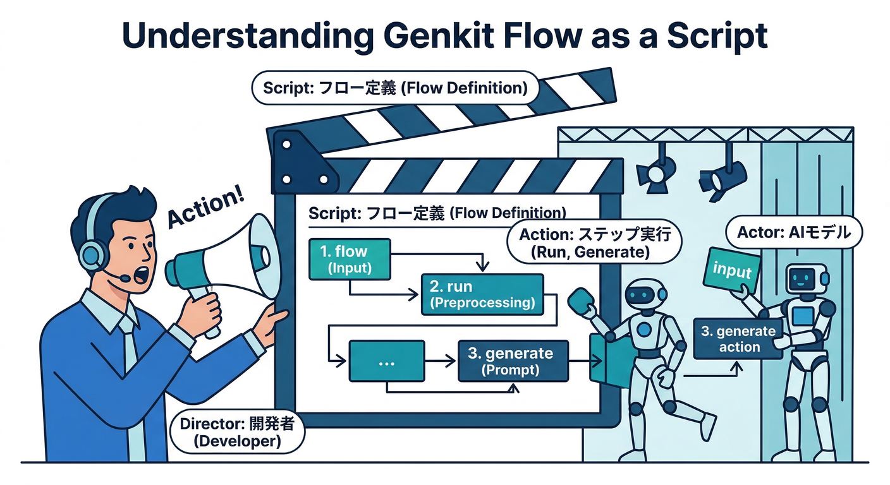
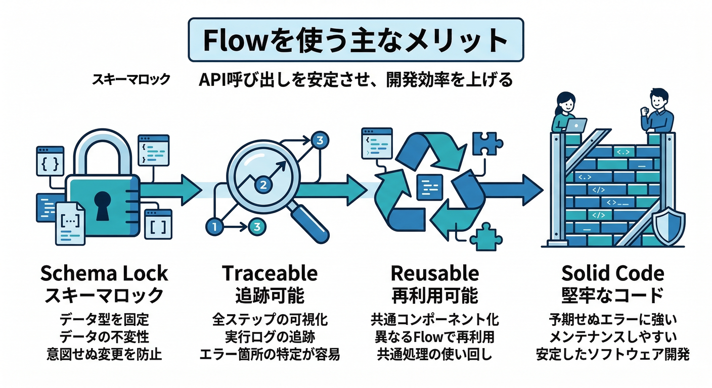
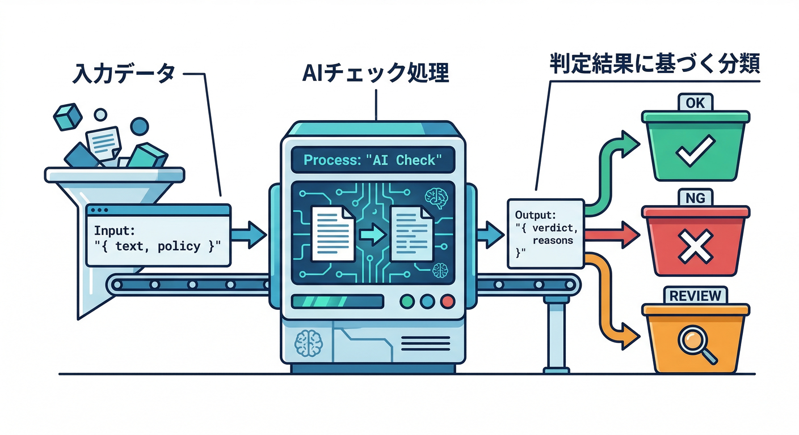
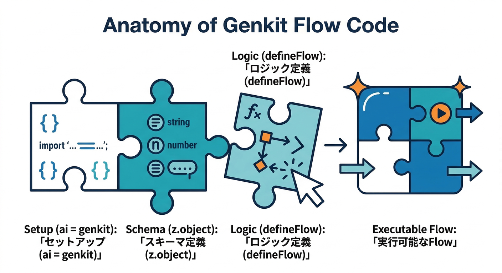
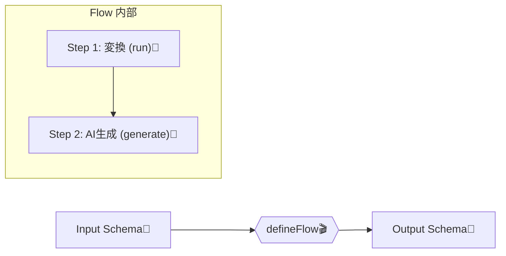
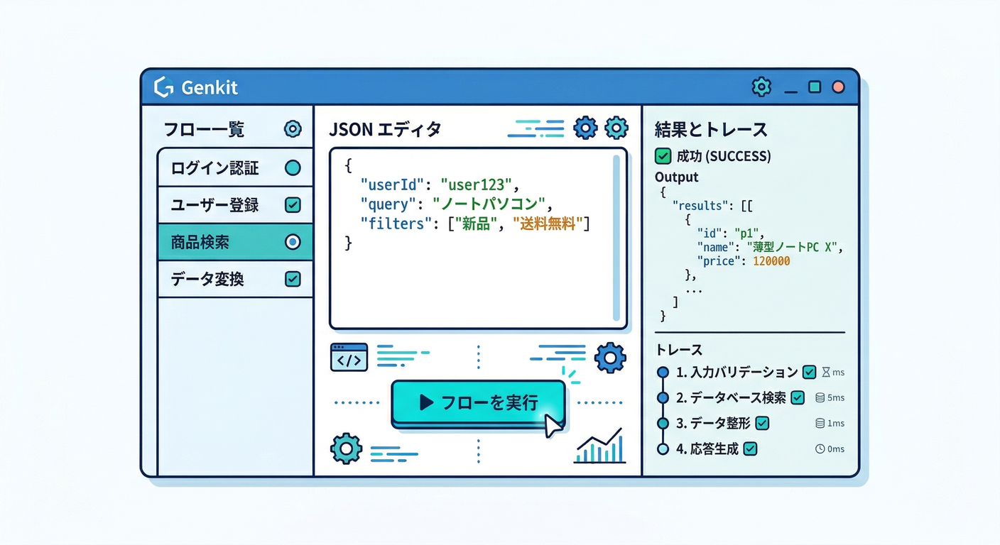
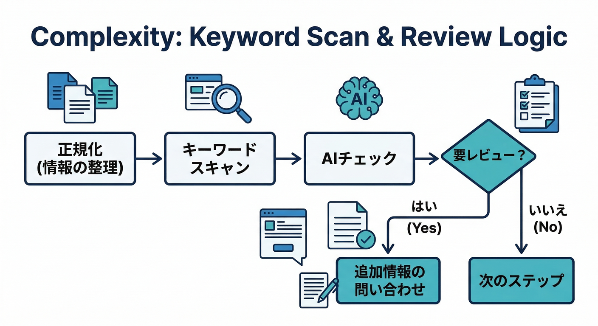
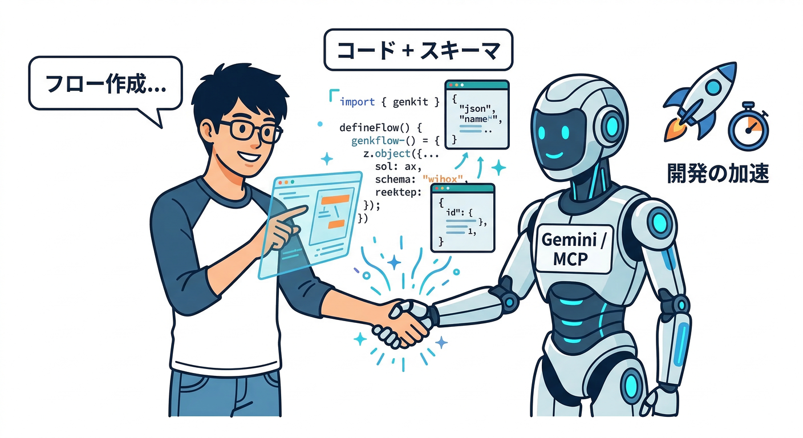

# 第09章：Genkitの基本「Flow＝一連の処理の台本」🎬🧠

## この章でできるようになること✅

* Flowが「ただの関数」じゃなくて、**追跡・再現・改善**しやすい“台本”になる理由がわかる🎞️
* **NGチェックFlow**（OK/NG/要レビュー＋理由＋修正文案）をTypeScriptで1本つくれる🧩
* 後の章（Developer UI / onCallGenkit / 評価）につながる“型”を手に入れる🔗

---

## 1) Flowってなに？ 台本ってどういう意味？📜✨



Flowはひとことで言うと、**「入力→処理→出力」を“名前つきで固定化”した実行ユニット**です🎬
しかも、Genkitが得意なこと（生成・チャット・埋め込みなど）は**勝手に“手順（ステップ）”として記録されて、後から追える**のが強いです👀🧪
そして「Genkitが知らない処理」も、`run()` で包めば“ステップ扱い”にできます🧷（＝台本の1コマになる）📌 ([Firebase][1])

---

## 2) なんでFlowにするの？（初心者ほど恩恵デカい）💡😆



**Flowにしておくと、あとがラク**です👇

* **入力と出力をスキーマで固定**できる（壊れたJSONで泣きにくい）🧾
* **実行が“追跡（トレース）”できる**（どこで迷ったか・遅いかが見える）🔎
* **生成・チャットなどが自動でステップ化**される（改善点が見つかる）🧪 ([Firebase][1])
* 将来、同じFlowを **Developer UIで回したり**、**アプリから呼んだり**しやすい🧰 ([Firebase][1])

---

## 3) 今日つくるFlow：投稿のNGチェック🛡️📝



## 入力（Input）

* `text`: 投稿本文
* `policy`: 判定の厳しさ（`normal` / `strict`）

## 出力（Output）

* `verdict`: `OK` / `NG` / `REVIEW`
* `reasons`: 理由（複数OK）
* `suggestedRewrite`: 修正文案（必要なら）
* `tags`: どの系統のNGか（例：暴言/個人情報/差別…）

> ポイント：**「要レビュー（REVIEW）」を用意**すると、AIの“自信ないのに断言”を減らせます🙂🧯

---

## 4) 手を動かす①：まず“日本語の擬似コード”を書く📝🧠

紙でもメモでもOK！まずはこれを書きます👇

* ① 入力 `text` を受け取る
* ② `policy` に応じて判定基準を切り替える（厳しめ/ふつう）🎛️
* ③ AIに「判定＋理由＋修正文案」を **決め打ちのJSON構造で返して**もらう🧾
* ④ 出力が空ならエラーにする（黙って成功しない）🚫
* ⑤ `OK/NG/REVIEW` のどれかを返す

ここまで書けたら、もう半分勝ちです😆✨

---

## 5) 手を動かす②：TypeScriptでFlowを実装する🧩💻

## 5-1) まず必要なものを入れる📦

Genkitの入門では、TypeScript用ツール（`typescript`, `tsx`）＋Genkit＋GoogleのGemini向けプラグインを入れる流れが公式ガイドにあります📚 ([Firebase][2])

例（流れだけ分かればOK）：

* `typescript`, `tsx` を開発依存で追加
* `genkit` と `@genkit-ai/google-genai` を追加 ([Firebase][2])

そしてGemini APIキーは環境変数で渡す形が紹介されています🔑 ([Firebase][2])
（このへんは第20章で「鍵・運用」にまとめて強化するので、今は“環境変数で渡す”だけ押さえればOKです🙂）

---

## 5-2) `src/index.ts` にFlowを書く✍️





```ts
import { genkit, z } from "genkit";
import { googleAI } from "@genkit-ai/google-genai";

// 1) Genkit本体（ai）を用意
const ai = genkit({
  plugins: [googleAI()],
  // 迷ったらまずは軽量モデルでOK（あとで差し替えやすい）
  model: googleAI.model("gemini-2.5-flash"),
});

// 2) 入出力スキーマ（= 台本のフォーマット）🧾
const NgCheckInputSchema = z.object({
  text: z.string().min(1).describe("ユーザー投稿の本文"),
  policy: z.enum(["normal", "strict"]).default("normal"),
});

const NgCheckOutputSchema = z.object({
  verdict: z.enum(["OK", "NG", "REVIEW"]),
  reasons: z.array(z.string()).default([]),
  suggestedRewrite: z.string().optional(),
  tags: z.array(z.string()).default([]),
});

// 3) Flow定義（= 台本）🎬
export const ngCheckFlow = ai.defineFlow(
  {
    name: "ngCheckFlow",
    inputSchema: NgCheckInputSchema,
    outputSchema: NgCheckOutputSchema,
  },
  async (input) => {
    // 4) Genkitが知らない処理も “ステップ化”したいなら run() で包む🧷
    const normalized = await ai.run("normalize-text", async () => {
      // 例：よけいな空白を整える（超ざっくり）
      return input.text.replace(/\s+/g, " ").trim();
    });

    const strictHint =
      input.policy === "strict"
        ? "判定は厳しめ。少しでも危ない表現はNGかREVIEWに寄せる。"
        : "判定はふつう。明確に危ないものだけNG。迷ったらREVIEW。";

    const prompt = `
あなたは投稿チェック担当です。
次の本文を、コミュニティ投稿としてOKか判定してください。

判定ルール:
- 出力は必ずスキーマ通り（verdict, reasons, suggestedRewrite?, tags）
- verdict は OK / NG / REVIEW のいずれか
- 断言できないときは REVIEW にする
- NG のときは suggestedRewrite をできるだけ出す
- 個人情報っぽいもの、攻撃的、差別、違法助長などは特に注意

ポリシー:
${strictHint}

本文:
${normalized}
`.trim();

    // 5) 生成（構造化出力）🧾✨
    const { output } = await ai.generate({
      prompt,
      output: { schema: NgCheckOutputSchema },
    });

    if (!output) {
      throw new Error("No output generated.");
    }
    return output;
  }
);
```

ここで大事なのは3つだけです👇

* `defineFlow({ name, inputSchema, outputSchema }, ...)` が**台本の宣言**🎬 ([Firebase][1])
* `output: { schema: ... }` で**JSONの形を固定**🧾 ([Firebase][1])
* `run()` で**AI以外の処理も“ステップ”にできる**🧷 ([Firebase][1])

---

## 5-3) 動かし方：Developer UIでFlowを実行する▶️👀



Developer UIは、Flowを**選んで入力して実行**できて、**トレースも見れる**のが強みです🔎
起動コマンド例（公式）：

* `genkit start -- tsx --watch src/your-code.ts` ([Firebase][1])

起動したら、Runタブで `ngCheckFlow` を選んで、入力はこんな感じ👇

```json
{
  "text": "お前マジで消えろよｗ",
  "policy": "normal"
}
```

---

## 6) ミニ課題：台本を“実務っぽく”する🧩🔥



## ミニ課題A：tagsをちゃんと使う🏷️

* `tags` に必ず「暴言」「個人情報」「差別」みたいなカテゴリを入れるルールにする
* UI側でタグ別に色を変えると“それっぽさ”が出ます😆✨

## ミニ課題B：REVIEWのときだけ追加質問する🤔

REVIEWのときだけ、もう一回AIに👇

* 「どこが曖昧？どんな追加情報が必要？」
  を聞いて、**人間レビューが楽**になる導線を作る🧠

## ミニ課題C：`run()` をもう1つ増やす🧷

例えば「禁止語リストチェック」を `ai.run("keyword-scan", ...)` にして、トレースで見えるようにする👀 ([Firebase][1])

---

## 7) チェック：できたら合格✅🎓

* [ ] 入力と出力のスキーマがある🧾
* [ ] 迷ったら `REVIEW` に逃がす設計になってる🙂
* [ ] `output` が空ならエラーにしてる🚫
* [ ] `run()` を1つ使って“台本っぽさ”が出てる🎬
* [ ] Developer UIで `ngCheckFlow` を実行できた▶️👀 ([Firebase][1])

---

## 8) 開発AIでこの章を“最短”にする🚀🤖



ここ、ちゃんと最新の公式ルートがあります✅
**Firebase MCP server** を使うと、AntigravityやGemini CLIなどの“エージェント系”からFirebase開発を手伝わせやすくなります🧰 ([Firebase][3])

## Gemini CLIなら：Firebase拡張でMCPを入れられる🧩

Firebase拡張を入れると、MCPサーバー設定やコンテキストがセットされる案内があります📌 ([Firebase][3])

## さらに：プロンプトカタログ（定型プロンプト集）📚✨

Firebase MCP serverには「Firebase開発向けに最適化されたプロンプト集」があり、Gemini CLI拡張を使うと `/firebase:init` みたいにスラッシュコマンドとして使える、と明記されています🪄 ([Firebase][2])
しかも注意点として「AIは間違えるので変更を確認してから」「こまめにコミット」とも書かれてます（超大事）🧯 ([Firebase][2])

> 使い方のコツ：
>
> * 「ngCheckFlowのスキーマを守るプロンプトに直して」
> * 「REVIEW時だけ追加質問する分岐を足して」
> * 「テスト用の入力JSONを10個作って」
>   みたいに、“やってほしい成果物”で頼むと強いです💪😆

---

## 9) 次章への伏線🔗✨

* 次はDeveloper UIで **Run/Inspect** を使って「どこで詰まったか」を見て改善します👀🧪 ([Firebase][1])
* さらに後で、このFlowをアプリから呼ぶ（`onCallGenkit`）ルートに繋げます📣（公式ドキュメントあり） ([Firebase][4])

---

* [theverge.com](https://www.theverge.com/news/822833/google-antigravity-ide-coding-agent-gemini-3-pro?utm_source=chatgpt.com)
* [techradar.com](https://www.techradar.com/pro/googles-ai-powered-antigravity-ide-already-has-some-worrying-security-issues?utm_source=chatgpt.com)

[1]: https://firebase.google.com/docs/genkit/flows "Defining AI workflows | Genkit"
[2]: https://firebase.google.com/docs/ai-assistance/prompt-catalog "AI prompt catalog for Firebase  |  Develop with AI assistance"
[3]: https://firebase.google.com/docs/ai-assistance/mcp-server "Firebase MCP server  |  Develop with AI assistance"
[4]: https://firebase.google.com/docs/ai-assistance/agent-skills?hl=ja "Firebase エージェントのスキル  |  Develop with AI assistance"
