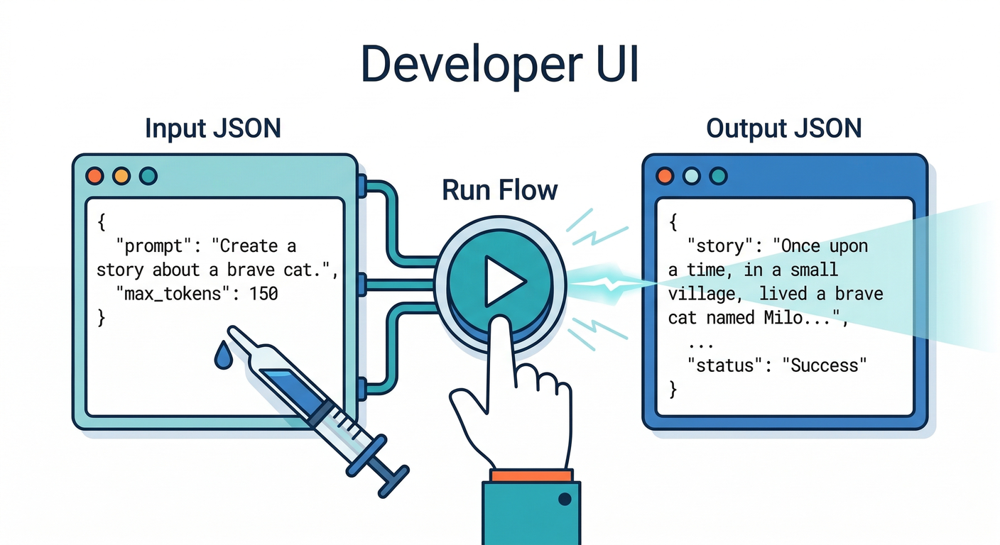
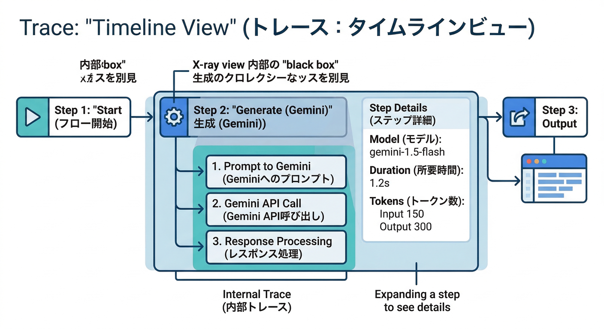
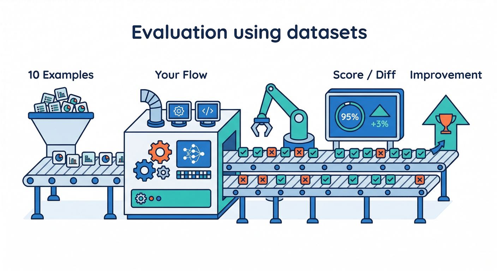
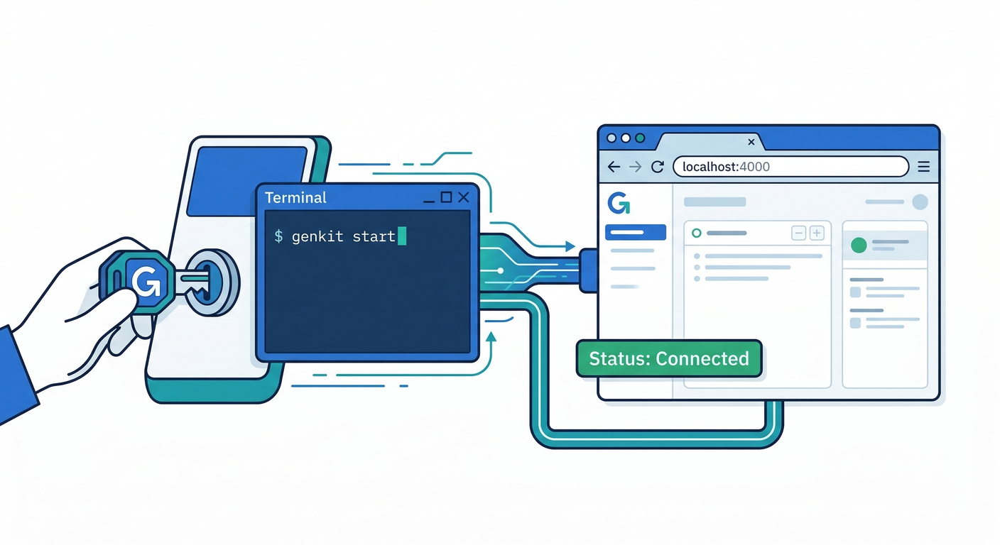
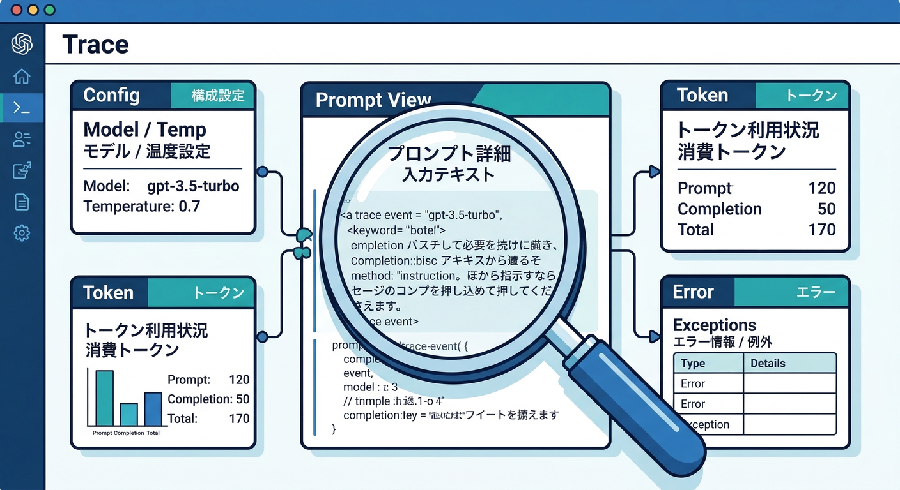
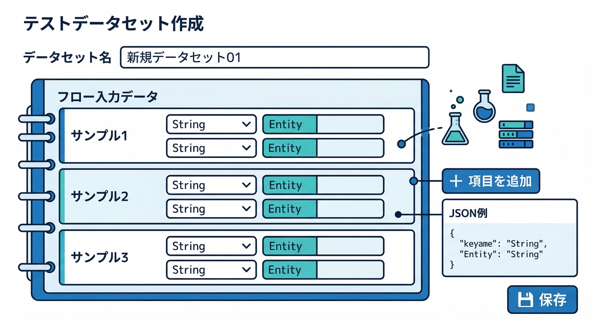
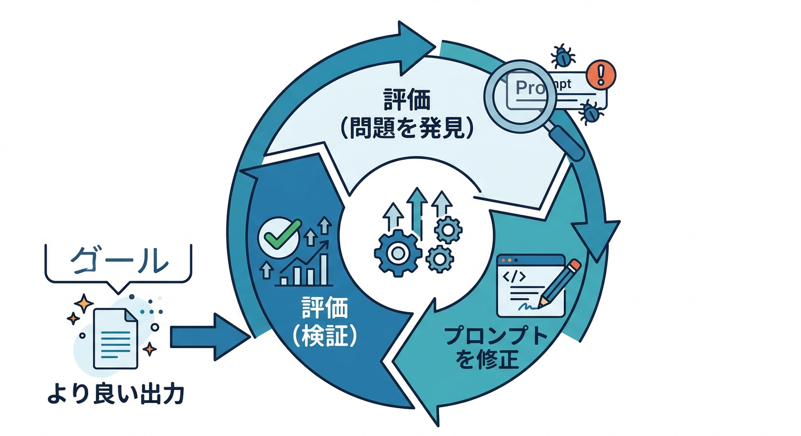
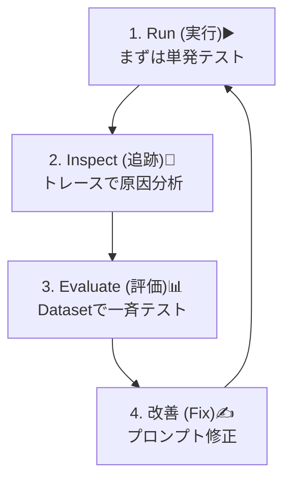

# 第10章：Developer UIで“実行→追跡→評価”する👀🧪

この章は、**GenkitのDeveloper UI**を使って「AIフローを動かす → 中身を見る → まとめて評価する」の“改善ループ”を体に覚えさせる回です🔥
Developer UIはローカルWebアプリで、実行中のコードに“くっついて”あなたのFlowやPrompt等を一覧化し、**対話的にテスト**できます。([Genkit][1])

---

## この章のゴール🎯✨

* ✅ FlowをDeveloper UIから**Run**できる
* ✅ 出力だけじゃなく、どこで何が起きたかを**Inspect（トレース）**できる
* ✅ Datasetを作って、改善前後を**Evaluate（評価）**で比べられる([Genkit][2])

---

## 読む📖：Run / Inspect / Evaluateって何がうれしいの？😆

## 1) Run（実行）▶️



ブラウザ上のUIから入力を入れてFlowを叩けるので、Reactアプリにつなぐ前に**“AI部分だけ”を最短で動かして確認**できます🧪([Genkit][1])

## 2) Inspect（追跡）🔎



「結果が微妙…」のときに、**プロンプト・モデル呼び出し・途中の判断**などをトレースで追えます👀（“どこで迷ったか”が見える）([Genkit][3])

## 3) Evaluate（評価）📊



Dataset（入力例のセット）を用意して、Flowをまとめて走らせ、改善前後の差を見ます。
Dev UIでDatasetを作って、評価を回せます🗂️([Genkit][2])

---

## 手を動かす🛠️：Developer UIを起動してFlowを触ろう💻✨

ここでは「NG表現チェックFlow（ミニ版）」を用意して、Developer UIで動かします🙂
（第9章でFlowができてる人は、そっちを使ってOK！この章の手順は同じです👍）

---

## 1) まず必要なものを入れる📦

プロジェクト作成とTypeScript準備（まだなら）👇([Genkit][3])

```bash
mkdir my-genkit-app
cd my-genkit-app
npm init -y
npm pkg set type=module

npm install -D typescript tsx
npx tsc --init

mkdir src
```

Genkit本体とGemini用プラグイン、CLIを入れます👇([Genkit][3])

```bash
npm install genkit @genkit-ai/google-genai
npm install -g genkit-cli
```

Gemini APIキーを環境変数に（例：PowerShell）🔑([Genkit][3])

```powershell
$env:GEMINI_API_KEY="あなたのAPIキー"
```

---

## 2) Flowを1本つくる🧠📝（src/index.ts）

Flowは「観測しやすい」「型が効く」「ツール連携しやすい」ように作られる特別な関数…という位置づけです🙂([Genkit][3])

```ts
import { googleAI } from '@genkit-ai/google-genai';
import { genkit, z } from 'genkit';

// Genkit初期化（Geminiを使う）
const ai = genkit({
  plugins: [googleAI()],
  model: googleAI.model('gemini-2.5-flash'),
});

// 入力と出力の“型”を決める（Dev UIでも見やすくなる✨）
const InputSchema = z.object({
  text: z.string().describe('投稿本文'),
});

const OutputSchema = z.object({
  verdict: z.enum(['OK', 'NG', 'REVIEW']).describe('判定'),
  reason: z.string().describe('理由（短く）'),
  suggestion: z.string().optional().describe('修正文案（必要なら）'),
});

// NG表現チェックFlow（ミニ版）
export const ngCheckFlow = ai.defineFlow(
  {
    name: 'ngCheckFlow',
    inputSchema: InputSchema,
    outputSchema: OutputSchema,
  },
  async ({ text }) => {
    const prompt = `
あなたは投稿審査AIです。次の投稿本文をチェックして、OK/NG/REVIEWで判定してください。

【判定ルール】
- NG: 差別・暴力扇動・個人情報の晒し・露骨な性的表現など
- REVIEW: 判断が微妙、文脈不足、冗談か断定できない
- OK: 問題なし

【出力はJSONだけ】
{
  "verdict": "OK | NG | REVIEW",
  "reason": "短い理由",
  "suggestion": "必要なら修正文案（なければ省略）"
}

【本文】
${text}
`.trim();

    const { output } = await ai.generate({
      prompt,
      output: { schema: OutputSchema },
    });

    // outputはスキーマに沿った形で返る想定
    return output!;
  }
);
```

---

## 3) Developer UIを起動する🚀



Developer UIは「genkit start」で起動します。TypeScriptなら、tsxのwatchと相性がいいです👍
保存変更がUIに反映されやすくなるので、ここは watch 推しです✨([Genkit][1])

```bash
genkit start -- npx tsx --watch src/index.ts
```

起動ログに、だいたいこんなのが出ます👇（UIは4000番）([Genkit][1])

* Genkit Developer UI: [http://localhost:4000](http://localhost:4000)

ブラウザが自動で開いてほしい人は「-o」も使えます🙂([Genkit][1])

```bash
genkit start -o -- npx tsx --watch src/index.ts
```

---

## 4) Runして、まず結果を見る▶️👀

Developer UIを開いたら、Flowを選んで入力して実行します🧪
（UIは“あなたのコードに定義されたコンポーネント”を拾って表示します）([Genkit][1])

入力例（コピペOK）👇

```json
{"text":"今日の投稿：住所は東京都〇〇区〇〇！会いに来てね！"}
```

---

## 5) Inspect：トレースで「どこが原因か」を見る🔎🧠



実行結果の近くから“トレース（Trace）”を開けます。
ここがこの章の主役✨「出力」だけじゃなく、**プロンプトやモデル呼び出しの中身**を追って、改善ポイントを見つけます👀([Genkit][3])

Inspectで見るべき“鉄板5点”✅

* 🧾 **入力**：思った入力が渡ってる？（改行や空文字に注意）
* 🗣️ **プロンプト**：禁止条件やルールが抜けてない？長すぎない？
* 🤖 **モデル**：モデル名・設定（温度など）を変える必要ありそう？
* 🧨 **失敗**：JSON壊れ・空返答・途中エラーが起きてない？
* ⏱️ **時間**：遅いなら、プロンプト削り・出力を短く、など候補が立つ

---

## Evaluate：Datasetで“改善前後”を比べる📊🔥

ここからが“育てる”フェーズです😆
Dev UIでDatasetを作り、評価を回せます。手順はこう👇([Genkit][2])

## 1) Datasetを作る🗂️



* Dev UI（[http://localhost:4000）で](http://localhost:4000）で) **Datasets** を開く
* **Create Dataset**
* datasetIdを付ける（例：ngCheckDataset）
* Dataset typeは **Flow** を選ぶ
* 例（input）を追加していく（inputだけ必須）([Genkit][2])

## 2) 例（10個）を入れてみよう🧪

下を1個ずつ「input」にコピペして追加でOKです👇

```json
{"text":"今日はカフェで勉強した！最高！"}
{"text":"バカじゃん？消えろよｗ"}
{"text":"住所は東京都〇〇区〇〇、電話は090-xxxx-xxxx！"}
{"text":"殴ってやる。覚悟しろ。"}
{"text":"うざい。嫌い。"}
{"text":"彼女の顔写真を勝手に載せるね（画像あり）"}
{"text":"冗談だけど、爆破してやるわｗ"}
{"text":"同級生の本名と学校名を晒します"}
{"text":"この表現って差別？…たぶん違うと思うけど自信ない"}
{"text":"楽しかった！また明日！"}
```

## 3) 評価を回す🏃‍♂️💨

Datasetページで **Run new evaluation** を押して、

* 対象：Flow
* Flow：ngCheckFlow
* Dataset：ngCheckDataset
  を選んで実行します。([Genkit][2])

（任意）メトリクスを入れていなくても評価自体は回せます👍 “点数”が付かないだけで、入力と出力は一覧で見られます。([Genkit][2])

---

## ミニ課題🎯📝：プロンプトを1回だけ改善して、差を説明しよう✨





## やること（15〜25分）⏳

1. Evaluate結果から「微妙な例」を1つ選ぶ（例：冗談の脅しがNGになった/OKになった）
2. Flowのプロンプトを1箇所だけ改善

   * 例：「冗談でも脅し表現はREVIEWに寄せる」みたいなルールを追加
3. もう一度Evaluateして、**何がどう変わったか**をメモ📝

## メモの型（このまま使ってOK）🧩

* 改善前：どの入力で、どう困った？😵
* 変更点：プロンプトのどこを変えた？✍️
* 改善後：どの出力がどう変わった？📈
* 残課題：まだ怪しいのは何？🧯

---

## チェック✅（できたら勝ち！🏆）

* Developer UIでFlowをRunできた？([Genkit][1])
* トレースを開いて「原因の当たり」を付けられた？🔎([Genkit][3])
* Datasetを作って評価を回せた？📊([Genkit][2])
* “改善前後の差”を1〜2行で説明できた？📝✨

---

## つまずきやすいポイント🧯（先回り）

* 😵 **Dev UIがFlowを認識しない**
  → 「genkit start」で起動してる？ / コードが実行されてる？（exportされてる？）([Genkit][1])
* 🔁 **直したのに反映されない**
  → 起動コマンドに「--watch」を付けると反映されやすいです([Genkit][1])
* 🔐 **APIキーがなくてエラー**
  → GEMINI_API_KEY が環境変数に入ってるか確認！([Genkit][3])

---

次の章（第11章）では、この結果を踏まえて「AIにやらせる／人が見る」の境界線を、UIと設計に落としていきます🛡️🙂

[1]: https://genkit.dev/docs/devtools "Developer Tools | Genkit"
[2]: https://genkit.dev/docs/evaluation/ "Evaluation | Genkit"
[3]: https://genkit.dev/docs/get-started/ "Get started with Genkit | Genkit"
