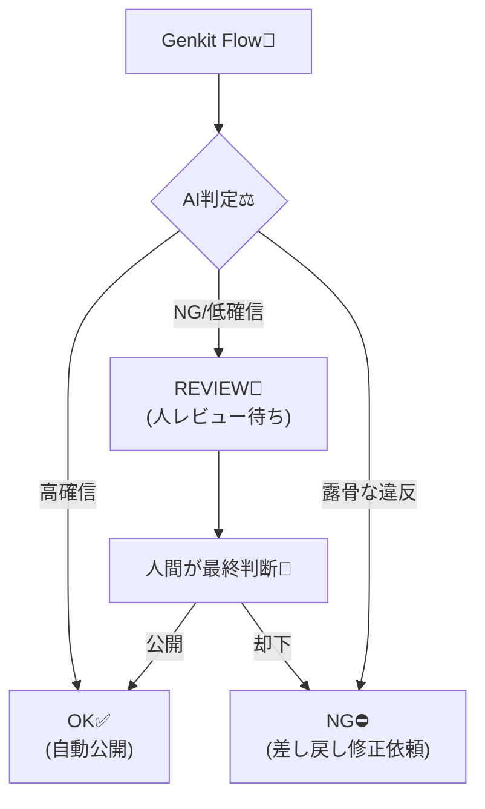
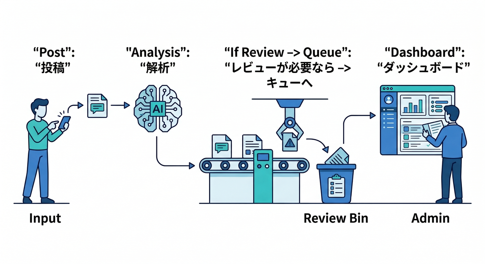
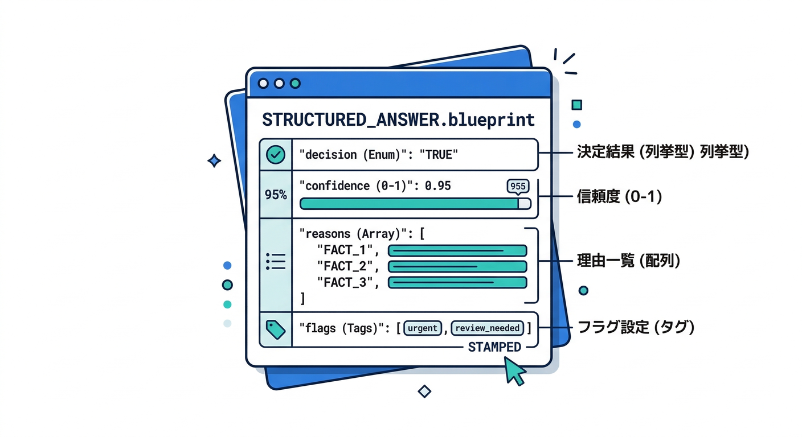
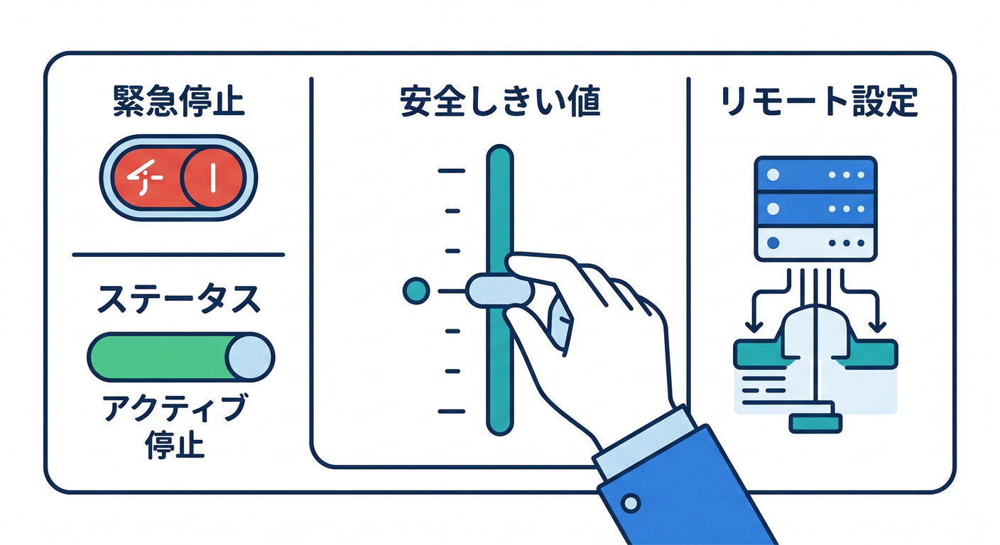

# 第11章：“AIにやらせる/人がやる”の境界線🛡️🙂

この章はひとことで言うと、**AIに「最終決定」をさせないための設計図**を作る回です🧭✨
「NG表現チェック」を例に、**自動OK / 自動NG / 要レビュー**の線引きを、UI・データ・Genkit Flowまで落とし込みます🔥

---

## この章でできるようになること✅

* 「AIの判定」を**そのまま採用しない**設計にできる🙂
* 結果を **OK / NG / REVIEW（要レビュー）** の3状態で扱える🧩
* “要レビュー”を **Firestoreのキュー** に積んで、人が最後に決める流れを作れる👀
* Genkit Flowの出力に **根拠（理由）・注意フラグ・修正文案** を含められる🧾
* ツール呼び出し（関数呼び出し）を混ぜても事故らない“境界線”が引ける🔒

---

## 1) まず結論：AIは「提案役」まで📝🙂


AIは賢いけど、**誤判定（特に“誤NG”）**は普通に起きます😇
なので、設計の基本はこれ👇

* AI：**判定候補（OK/NG/REVIEW）＋理由＋修正文案**を出す
* 人：**公開・差し戻し**などの最終決定をする
* システム：**証跡（ログ）**と**救済ルート**を用意する

Genkitは Flow を作って、クライアントからは `onCallGenkit` で安全に呼べます（認証情報も載せやすい）([Firebase][1])
さらに Developer UI で Run/Inspect/Evaluate ができるので、**「どこで誤判定したか」**を追いやすいのが強いです👀([GitHub][2])

---

## 2) 境界線を引く“5つの物差し”🧠🧭


迷ったら、次の5つで判定します（覚えやすい順に）👇

1. **取り返しがつく？**（公開しちゃったら戻せない？）
2. **影響が大きい？**（炎上・法務・信用に直撃？）
3. **プライバシー触る？**（個人情報・機密っぽい？）
4. **説明できる？**（なぜそう判定したか人間が説明できる？）
5. **悪用される？**（攻撃者が“抜け道”を探しやすい？）

このどれかに引っかかったら、**基本は REVIEW（要レビュー）**に倒すのが安全です🛡️

---

## 3) 3状態モデル（OK / NG / REVIEW）を固定する🧩




「AIの出力」を、アプリ側でこう扱うのがオススメです👇

| 状態        | 何をする？             | 例                 |
| --------- | ----------------- | ----------------- |
| OK ✅      | そのまま投稿（ただしログは残す）  | 軽い誤字や口調の調整        |
| NG ⛔      | **自動公開しない**（差し戻し） | 露骨な暴言、個人攻撃っぽい     |
| REVIEW 🚧 | **人の確認待ち**キューへ    | グレーゾーン、文脈依存、皮肉/冗談 |

ポイントは **「NGでも自動でBANとかしない」** こと🙂
まずは **差し戻し＋人レビュー**で“事故”を減らすのが入門として強いです✨

---

## 4) “確信度”の使い方（超重要）⚠️🎯

AIが返す「確信度（confidence）」は、**数字だから正しい…とは限りません**😇
だから運用はこうします👇

* 確信度は「目安」：**閾値で REVIEW を増やすため**に使う
* 危険カテゴリ（個人情報/差別/暴力など）が絡むなら：確信度が高くても **REVIEW** へ
* 迷ったら：**REVIEW**（これが最強）

安全設定（Safety settings）は、Gemini API 側でも調整でき、カテゴリ別にブロック強度を変えられます([Google AI for Developers][3])
AI Logic から呼ぶ場合も safety settings の考え方がまとまっています([Firebase][4])
（さらに Vertex AI 側は安全フィルタの説明が整理されてます）([Google Cloud Documentation][5])

---

## 5) Firestoreのデータ設計：レビューキューを作る📦👀



ここから “手を動かす” 方向です✋✨
最低限、次の3つがあると運用がラクになります。

* `posts/{postId}`：投稿本体（状態を持つ）
* `moderationRuns/{runId}`：AI判定の履歴（あとから検証用）
* `reviewQueue/{postId}`：レビュー待ち（一覧で拾いやすく）

例（雰囲気）👇

```json
// posts/{postId}
{
  "authorUid": "uid_abc",
  "text": "投稿本文…",
  "status": "REVIEW", 
  "createdAt": "2026-02-20T00:00:00Z",
  "lastModerationRunId": "run_001"
}
```

```json
// moderationRuns/{runId}
{
  "postId": "post_123",
  "model": "gemini-...",
  "decision": "REVIEW",
  "confidence": 0.62,
  "reasons": ["個人への攻撃に見える可能性", "文脈が不明"],
  "suggestedRewrite": "（やわらかい言い換え案）",
  "flags": ["POTENTIAL_HARASSMENT"],
  "createdAt": "2026-02-20T00:00:00Z"
}
```

```json
// reviewQueue/{postId}
{
  "postId": "post_123",
  "priority": "HIGH",
  "reason": "POTENTIAL_HARASSMENT",
  "createdAt": "2026-02-20T00:00:00Z",
  "assignedTo": null
}
```

---

## 6) Genkit Flow：出力は「構造化JSON」に固定🧾🔧



ここでコツは、**“文章で返させない”**ことです🙂
構造化（スキーマ）で返すと、アプリの分岐が激ラクになります。

Genkitはスキーマ駆動の出力（schema-driven output）を扱え、**スキーマに合わない出力を検証したり、リトライ/修復を試みる**考え方も説明されています([Firebase][6])

例：Flowの出力（型）イメージ👇

```ts
type ModerationDecision = "OK" | "NG" | "REVIEW";

type ModerationResult = {
  decision: ModerationDecision;
  confidence: number;        // 0〜1（目安）
  reasons: string[];         // 人が読める理由
  flags: string[];           // 機械的フラグ（後で集計しやすい）
  suggestedRewrite?: string; // NG/REVIEWのときに出す
};
```

Flowの中では、だいたいこういう流れにします👇

1. 入力（投稿本文）を受け取る
2. モデルへ「判定＋理由＋言い換え案」を**JSONで**要求
3. **危険フラグ or confidence低い** → `REVIEW` に寄せる
4. 結果を `moderationRuns` に保存
5. `decision === "REVIEW"` なら `reviewQueue` に積む

---

## 7) Safety settings と “停止スイッチ”🎛️🧯



安全系は「頑張りすぎる」とアプリ体験が死ぬので、**切り替え可能**にしておくのが現実的です🙂

* AI Logic の本番チェックリストでも、**App Check を有効化**して、**Remote Config でAIパラメータをオンデマンド変更**できるようにするのが重要って書かれています([Firebase][7])
* さらに AI Logic には **ユーザー単位のレート制限**があり、デフォルトは **100 RPM / user** です([Firebase][8])
  → 事故ったときの“燃え方”を小さくできます🔥🧯

「境界線」の文脈だと、Remote Config はこう使うと強いです👇

* `aiModerationEnabled`: true/false（緊急停止）
* `reviewThreshold`: 0.75（これ未満はREVIEW）
* `autoOkEnabled`: true/false（最初は false 推奨🙂）

---

## 8) ツール呼び出し（Function Calling）を混ぜるなら、境界線はもっと固く🔒😇


今後、Flowが「Firestoreから何か取る」「別API叩く」みたいな **ツール呼び出し**を始めると、危険度が一段上がります⚠️

Firebaseのブログでも、**ユーザーがプロンプトで“別ユーザーのデータを取れ”と誘導してくる**ような例が解説されています([The Firebase Blog][9])
なのでルールはこれ👇

* **モデルに userId を決めさせない**（サーバー側で固定して注入）
* ツール側で **認可チェックを必ず実施**（「本人のデータだけ」）
* 迷ったら、ツール実行前に **REVIEW（人承認）** を挟む

「AIにやらせる/人がやる」の境界線は、ツールが増えるほど“人側”に寄せるのが基本です🛡️

---

## 9) 手を動かす：レビュー導線を実装する✋🧩

やることは4つだけです🙂✨

1. 投稿に `status` を追加（最初は常に `REVIEW` でもOK）
2. Genkit Flow を `onCallGenkit` で呼べるようにする([Firebase][1])
3. Flow結果を `moderationRuns` に保存し、`REVIEW` なら `reviewQueue` に積む
4. 管理UI（超シンプルでOK）を作る

   * 左：原文
   * 右：AIの理由＋言い換え案
   * ボタン：✅承認 / ⛔差し戻し / ✏️編集して公開

---

## 10) ミニ課題🎒✨

次を満たすテスト文を **20個** 作って、AIの判定を眺めてください👀
（Gemini CLI に「グレーな例を20個作って」って頼むと一瞬で作れます💻）

* 冗談っぽい暴言（文脈次第）
* 皮肉・当てこすり
* 個人情報っぽい断片
* 引用（他人の言葉）
* 絵文字だけ・短文だけ
* “攻撃者の誘導プロンプト”っぽい文

「誤NG」が多いなら、**閾値を上げる**か、**REVIEWに倒す**方向が安全です🙂

---

## 11) チェック（できた？）✅🧾

* [ ] AIの結果で**自動公開しない**設計になってる？
* [ ] `OK/NG/REVIEW` の3状態が **UI/DBで一貫**してる？
* [ ] AIが出した「理由」を、人が読んで納得できる？
* [ ] REVIEWキューが詰まったときの運用（担当/優先度）がある？
* [ ] safety settings や停止スイッチ（Remote Config）で事故を止められる？([Google AI for Developers][3])
* [ ] ツール呼び出しが入るなら、認可がサーバー側で固定されてる？([The Firebase Blog][9])

---

次の第12章では、この Flow を「どこにデプロイするか（Functions/Cloud Run）」「ランタイムは何にするか」まで繋げて、実運用の置き場所を決めに行きます🎯⚙️

[1]: https://firebase.google.com/docs/functions/oncallgenkit?utm_source=chatgpt.com "Invoke Genkit flows from your App | Cloud Functions for Firebase"
[2]: https://github.com/firebase/genkit?utm_source=chatgpt.com "firebase/genkit: Open-source framework for building AI- ..."
[3]: https://ai.google.dev/gemini-api/docs/safety-settings?utm_source=chatgpt.com "Safety settings | Gemini API | Google AI for Developers"
[4]: https://firebase.google.com/docs/ai-logic/safety-settings?utm_source=chatgpt.com "Understand and use safety settings | Firebase AI Logic - Google"
[5]: https://docs.cloud.google.com/vertex-ai/generative-ai/docs/multimodal/configure-safety-filters?utm_source=chatgpt.com "Safety and content filters | Generative AI on Vertex AI"
[6]: https://firebase.google.com/codelabs/ai-genkit-rag?utm_source=chatgpt.com "Build gen AI features powered by your data with Genkit"
[7]: https://firebase.google.com/docs/ai-logic/production-checklist?utm_source=chatgpt.com "Production checklist for using Firebase AI Logic - Google"
[8]: https://firebase.google.com/docs/ai-logic/quotas?utm_source=chatgpt.com "Rate limits and quotas | Firebase AI Logic - Google"
[9]: https://firebase.blog/posts/2025/12/securing-ai-agents/?utm_source=chatgpt.com "Securing AI agents and tool calls"
