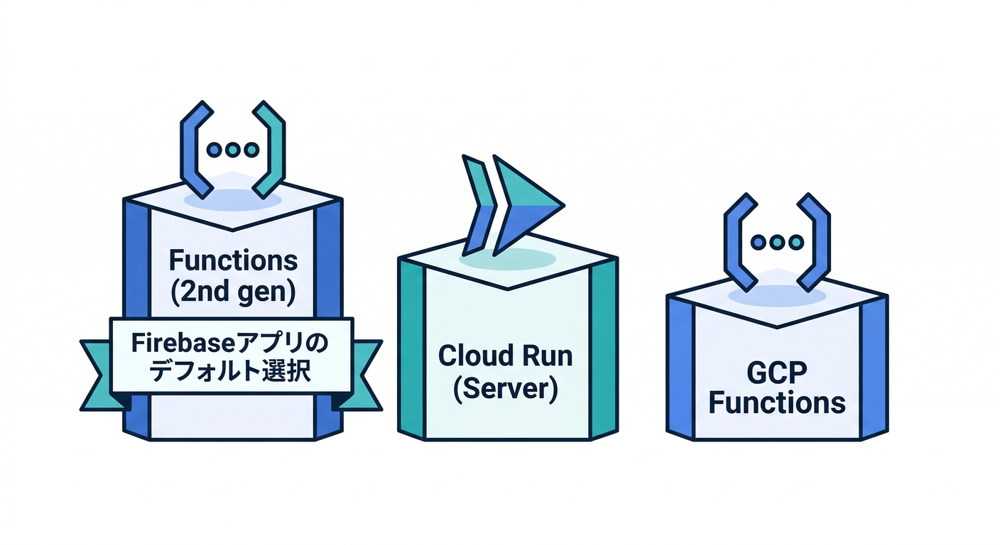
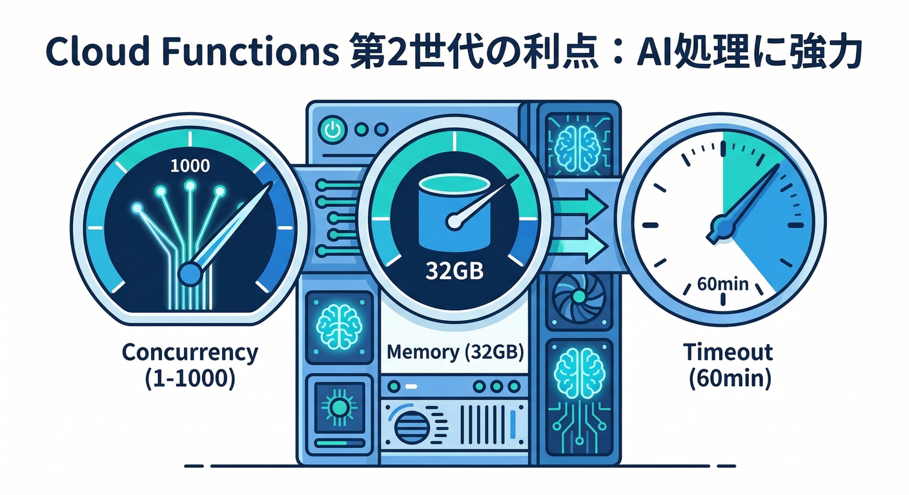
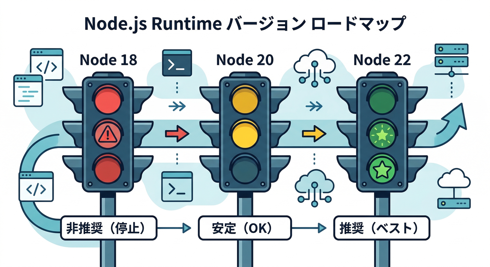
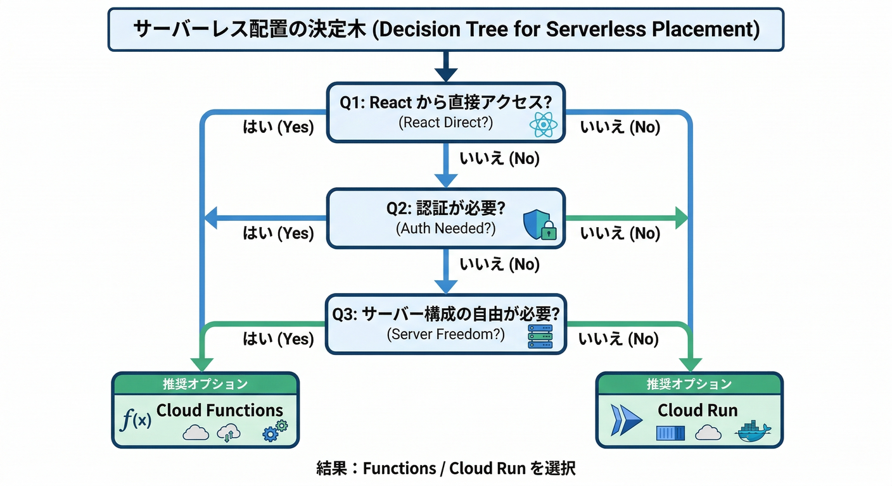
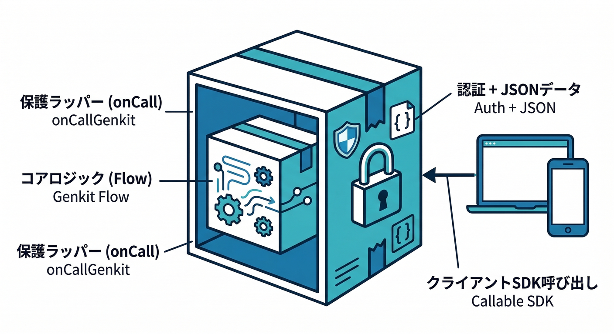
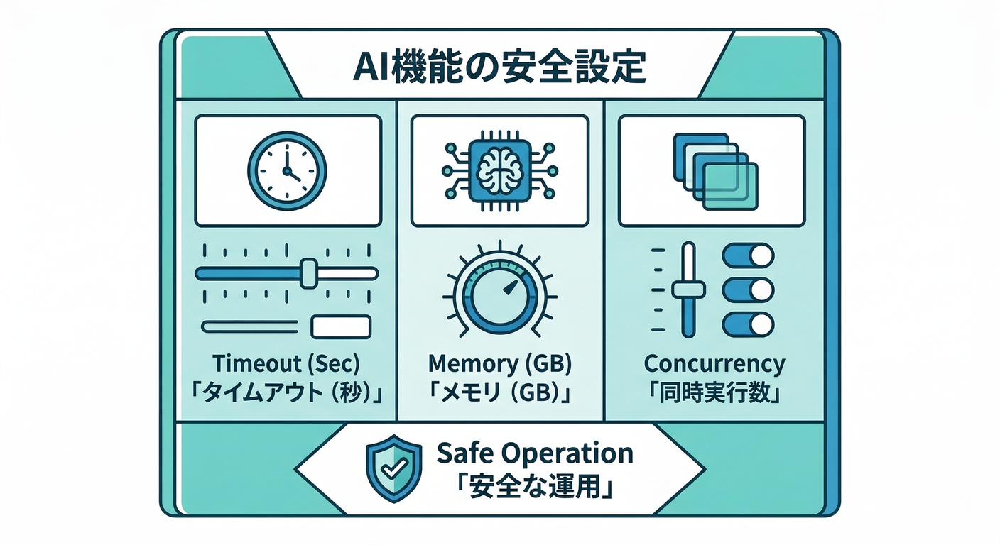

# 第12章：デプロイ先の選択（Functions/Cloud Run）とランタイム🎯⚙️

この章はひとことで言うと、**「GenkitのAI処理（Flow）を、どこで動かすのが気持ちいい？」**を決める回です😆
AIって便利だけど、**遅い/高い/乱用される**の3点セットが起きやすいので、置き場所の選択がめちゃ大事になります🧯💸🛡️

---

## 読む：まず結論（迷ったらこの3択）🧭✨



### ① いちばん迷わない：Cloud Functions for Firebase（2nd gen）＋ `onCallGenkit` 📣🤖

* **アプリ（React）→Flow呼び出し**が主役なら、これが最短です🏃‍♂️💨
* callable function なので、クライアントSDK側が**認証情報を自動で付けて呼べる**のが超ラクです🔐✨ ([Firebase][1])
* `onCallGenkit` は **Flowを包んで callable 化**できて、**ストリーミング/JSON応答**にも対応しやすい設計になってます🧠🌊 ([Firebase][1])

### ② 自由度MAX：Cloud Run（サービス）🛠️🚀

* **「HTTPサーバーとして動かしたい」**とか、**フレームワーク込みでガッツリ**やりたいとき向きです🧩
* Genkit自体も Cloud Run へのデプロイ導線が用意されてます📦✨ ([Firebase][2])

### ③ GCP寄りの関数：Cloud Run functions ⚡

* “関数っぽさ”は保ちつつ、GCP側の世界観で寄せたいときに便利です🙂
* ただしFirebase中心のアプリなら、まずは①でOKになりやすいです🙆‍♀️ ([Firebase][3])

> ざっくり指針：
> **Firebase中心（認証/SDK/トリガー）なら①**、**自由なWebサーバーなら②**、**GCP関数の作法で行くなら③** 🧭✨ ([Firebase][3])

---

## 読む：2nd genが「AI向き」な理由🔥（ここ超重要）



Cloud Functions for Firebase の **2nd gen** は、裏側が **Cloud Run（とEventarc）ベース**なので、スケールや並列処理の考え方が一気に現代寄りになります📈✨ ([Firebase][4])

特にAIだと効いてくるのがこれ👇

* **同時処理（concurrency）**を調整できる

  * 2nd genは `concurrency` を **1〜1000**で設定でき、デフォルトは **80**です🔁✨
  * しかも「Cloud Runの仕組みで動く」と明記されてます🧠 ([Firebase][5])
* **タイムアウト/メモリ**をちゃんと盛れる

  * 2nd genはメモリ上限が大きく、最大 **32GiB** まで選べます💪🧠 ([Firebase][6])
  * HTTP系の最大タイムアウトは **60分**までいけます⏳（AIの重い処理で助かるやつ） ([Firebase][6])

---

## 読む：ランタイム（言語とバージョン）最新メモ🧾✨



ここは「困ったらこの数字に寄せる」メモです🙂
（デプロイ時にハマる原因の上位が“ランタイムの指定ミス”です😇）

### ✅ Cloud Functions for Firebase（2nd gen）

* **Node.js：22 / 20（18はdeprecated）**

  * さらに **14/16は2025年初頭に廃止**で、デプロイ不可です⚠️ ([Firebase][5])
* **Python：3.10〜3.13（デフォルトは3.13）** 🐍✨ ([Firebase][7])
* Nodeのバージョン指定は、基本 **`functions/package.json` の `engines`** か **`firebase.json`** でOKです🧩 ([Firebase][5])

### ✅ Cloud Run（サービス）

* **Python：3.13（3.14はプレビュー）** 🐍 ([Google Cloud Documentation][8])
* **.NET：8.0** 🧱 ([Google Cloud Documentation][9])

> この教材だと、Genkitはまず **Node/TypeScript** を主軸にして、
> “別言語を使うならどこへ置く？”の判断材料として Python/.NET の版を持っておく感じが強いです🙂🧠

---

## 手を動かす：あなたのFlowの「置き場所」を決めて、最低限の形にする🛠️✨

ここでは **“NG表現チェックFlow”** を例にします（他のFlowでも同じ）🛡️✅

## Step 1：3問だけ答えて決める🧠📝



1. **Reactから直接呼びたい？**（YESなら①が濃厚）📣
2. **Firebase Authの情報を自然に載せたい？**（YESなら①がめちゃ強い）🔐
3. **“関数”じゃなく“サーバー”として色々やりたい？**（YESなら②）🛠️

---

## Step 2-A：①を選んだ人（Functions＋onCallGenkit）📣🤖

## (1) Node.jsランタイムを指定する（22推し）🧾

* `functions/package.json` に `engines` を書くのが王道です（例） ([Firebase][5])

```json
{
  "engines": { "node": "22" }
}
```

* 事情があって `firebase.json` で指定したい場合はこう👇（CLIはこっちを優先します） ([Firebase][5])

```json
{
  "functions": {
    "runtime": "nodejs22"
  }
}
```

## (2) Flowを `onCallGenkit` で包む🧩



`onCallGenkit` は callable function を作れるので、クライアントSDKが**認証情報を付けて呼べる**のがポイントです🔐✨ ([Firebase][1])

イメージ（超ざっくり）👇
※実コードはあなたのFlow名・secretsに合わせてOKです🙂

```js
// CommonJS例（ドキュメント例に合わせて雰囲気をつかむ用）
const { onCallGenkit } = require("firebase-functions/https");

// すでにある Genkit Flow（例：ngCheckFlow）を callable 化する
exports.ngCheck = onCallGenkit(
  {
    // 例：APIキーなどは secrets で束ねる（運用章で強化する）
    secrets: [/* apiKey */],
  },
  /* ngCheckFlow */
);
```

> `onCallGenkit` は callable の機能を引き継ぎつつ、**ストリーミング/JSON応答**も扱いやすいと説明されています🌊📦 ([Firebase][1])

---

## Step 2-B：②を選んだ人（Cloud Runへ）🚀🛠️

* 「サーバーとして公開して、HTTPで呼ぶ」形に寄せやすいです🌐
* Genkitは Cloud Run へのデプロイ導線が用意されているので、その手順に沿うのが安全です📚✨ ([Firebase][2])
* ここでの判断ポイントは👇

  * “関数の枠”より **Webサーバーの自由**が欲しいか？🧩
  * 将来、**他のHTTP APIも同居**させたいか？🧰

---

## AI向けの「事故らない設定」3点セット🧯💸🛡️



AI処理は **遅い＆重い**ことがあるので、最初から“上限”を持つのがコツです🙂✨

## 1) タイムアウトは「想定より長め」に⏳

* 2nd genなら HTTP で最大 **60分**までいけます ([Firebase][6])
* とはいえ、AIの1回呼び出しに60分は基本いらないので、まずは **1〜3分**くらいからが現実的です（教材的にも）🙂

## 2) メモリは「ケチりすぎない」🧠

* 2nd genは最大 **32GiB**まで選べます💪 ([Firebase][6])
* 画像/長文/重い変換をやるなら、最低でも **1GiB以上**を検討すると心が平和です🕊️

## 3) concurrency / maxInstances で「使いすぎ爆発」を防ぐ💥🚫

* 2nd genは `concurrency` を **1〜1000**で設定でき、デフォルトは **80**です🔁 ([Firebase][5])
* でもAIは外部APIを叩くので、最初は **concurrency低め**＋ **maxInstancesで上限** が安全です🧯

  * “人気が出た瞬間に課金が爆発”を防げます💸😇

---

## ミニ課題：あなたのアプリに最適な「置き場所メモ」を作る📝✨


次のテンプレを埋めてください（1〜2分でOK）🙂

* 私のFlow名：`__________`
* 選ぶ置き場所：① Functions＋onCallGenkit / ② Cloud Run / ③ Cloud Run functions
* 理由（3行まで）：

  1. ---
  2. ---
  3. ---
* 事故防止の上限：timeout = ___ 秒 / maxInstances = ___ / concurrency = ___

---

## チェック：ここまでで説明できたら勝ち✅🏆

* `onCallGenkit` が「Flowを callable として公開する」って説明できる？📣 ([Firebase][1])
* Node.js 22 / 20 がサポートされていて、18はdeprecatedって言える？🧾 ([Firebase][5])
* 2nd genで concurrency（1〜1000）を触れる理由が言える？🔁 ([Firebase][5])
* “タイムアウト/メモリ/上限”を最初から決める意味が言える？🧯💸 ([Firebase][6])

---

次の第13章では、ここで決めた「置き場所」に向けて、**アプリからFlowを呼ぶ導線（認証込み）**を具体化していきます📣🔐✨

[1]: https://firebase.google.com/docs/functions/oncallgenkit "Invoke Genkit flows from your App  |  Cloud Functions for Firebase"
[2]: https://firebase.google.com/docs/genkit/cloud-run "Deploy with Cloud Run | Genkit"
[3]: https://firebase.google.com/docs/functions/version-comparison "Cloud Functions version comparison  |  Cloud Functions for Firebase"
[4]: https://firebase.google.com/docs/functions/version-comparison?utm_source=chatgpt.com "Cloud Functions version comparison - Firebase - Google"
[5]: https://firebase.google.com/docs/functions/manage-functions "Manage functions  |  Cloud Functions for Firebase"
[6]: https://firebase.google.com/docs/functions/quotas "Quotas and limits  |  Cloud Functions for Firebase"
[7]: https://firebase.google.com/docs/functions/get-started "Get started: write, test, and deploy your first functions  |  Cloud Functions for Firebase"
[8]: https://docs.cloud.google.com/run/docs/runtimes/python?hl=ja "Python ランタイム  |  Cloud Run  |  Google Cloud Documentation"
[9]: https://docs.cloud.google.com/run/docs/runtimes/dotnet?hl=ja ".NET ランタイム  |  Cloud Run  |  Google Cloud Documentation"
