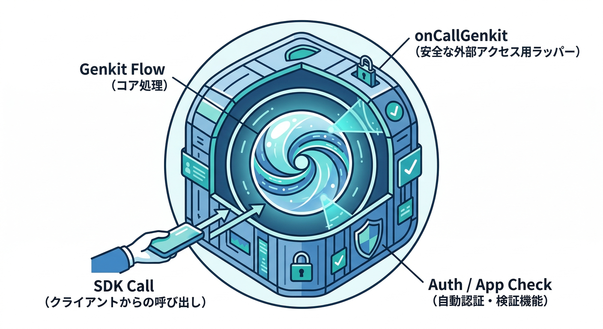
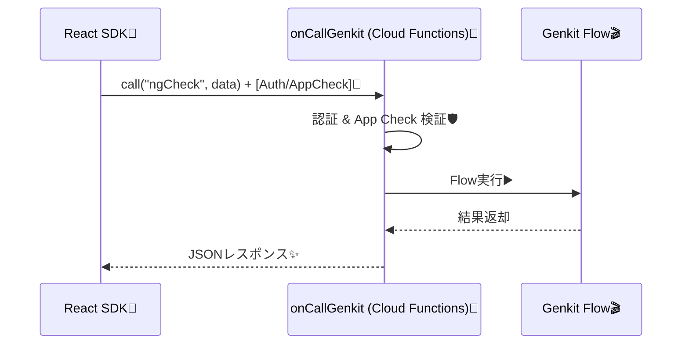
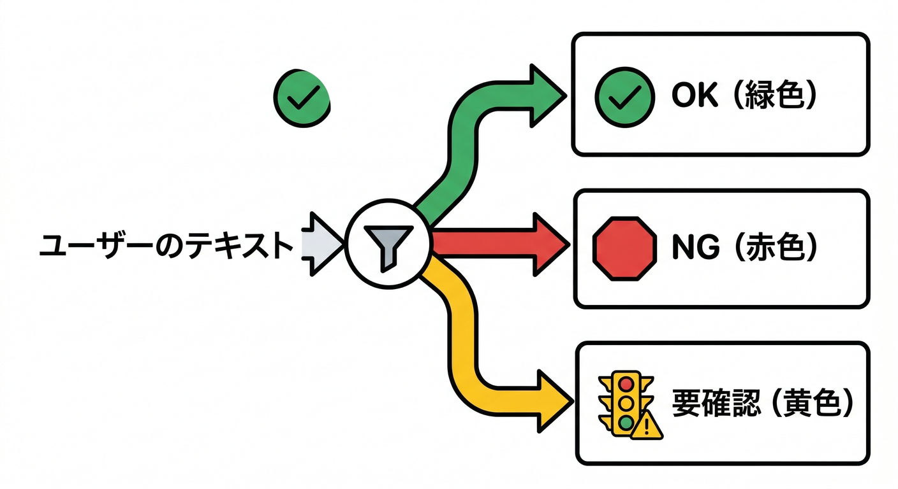
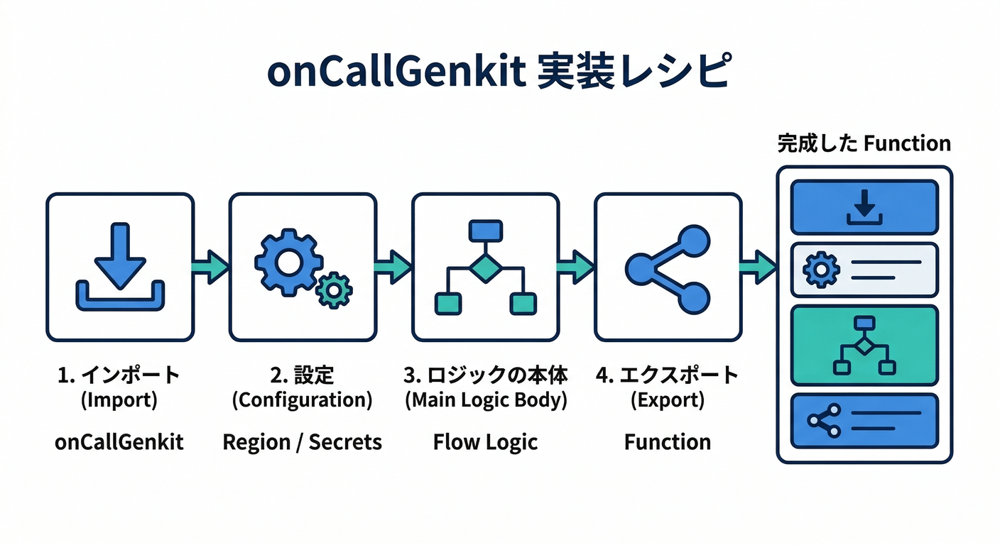
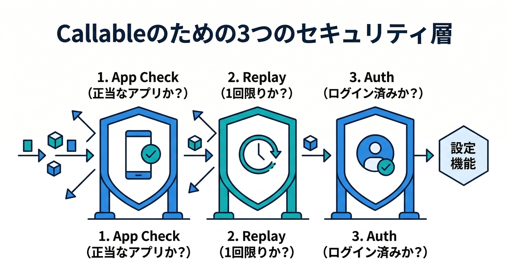
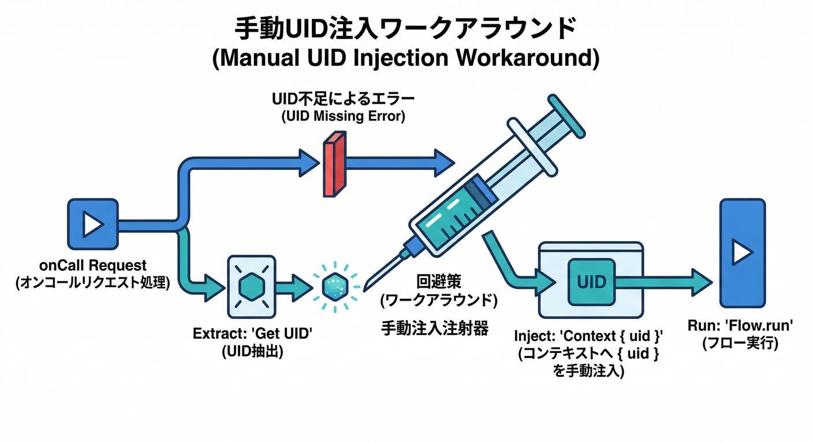
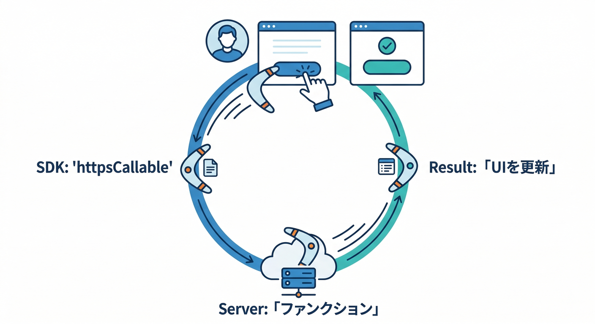
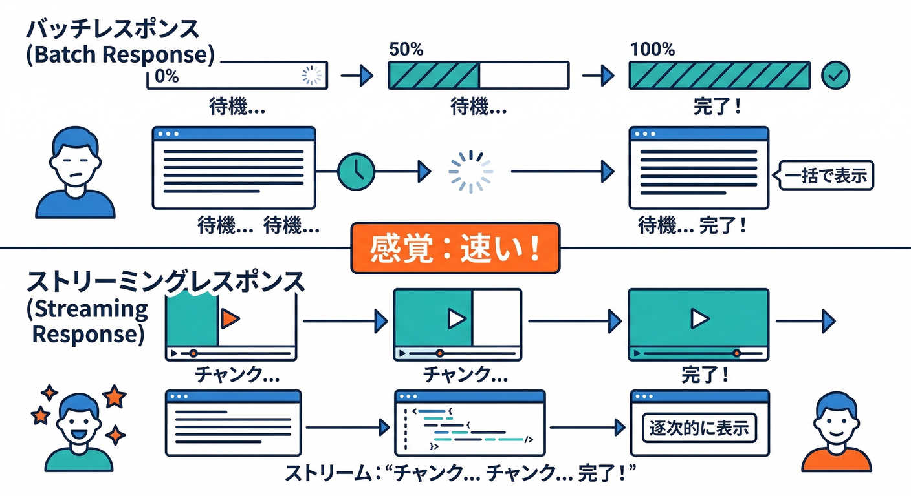

# 第13章：アプリからFlowを呼ぶ（onCallGenkit）📣🔗

## この章のゴール🎯

* Reactのボタンから「Genkit Flow」を安全に呼び出して、結果でUIを分岐できるようになる🧩✨
* 「未ログインなら呼べない」「App Checkで正規アプリ以外を弾く」「高コスト処理はリプレイ耐性も付ける」をセットで入れる🔐🧿💸
* エラー時にユーザーへ“やさしく”返す（＝壊れた体験にしない）🩹🙂

---

## 1) まず全体像：なぜ onCallGenkit なの？🤔





onCallGenkit は、Genkit の Flow を「呼び出し可能関数（Callable）」として公開する仕組みだよ〜という立ち位置です📌
呼び出し側は「genkit/beta/client」または Cloud Functions のクライアントSDKから呼べて、認証情報も自動で付いてきます✅([Firebase][1])

Callable なので、Authトークン・FCMトークン・App Checkトークン（使える場合）が自動でリクエストに含まれ、サーバー側での検証もよしなにやってくれます🙏✨([Firebase][2])

---

## 2) 今日作る呼び出し：NGチェック（OK/NG/要レビュー）🛡️✅



UIはこう分岐させます👇

* OK：そのまま公開OK🎉
* NG：理由＋修正文案を出して差し戻し🚫✍️
* 要レビュー：人間に見てね（保留）👀🕒

この「3値」を返すだけで、アプリが急に“実務っぽく”なります😆✨

---

## 3) サーバー側：Flow を onCallGenkit で包む🧰🔥

ここでは「第9章あたりで作った ngCheckFlow が既にある」想定で、呼び出し口だけ作ります（Flow本体の中身より、公開のしかたが主役！）🎬

## 3-1. いちばんシンプルな公開（まず動かす）🚀



ポイントは「onCallGenkit(オプション, Flow)」で包むだけ🙌([Firebase][1])

```ts
// functions/src/index.ts
import { onCallGenkit } from "firebase-functions/v2/https";
import { ngCheckFlow } from "./flows/ngCheckFlow";

export const ngCheck = onCallGenkit(
  {
    region: "asia-northeast1",
    // Webから呼ぶなら、CORSを明示しておくと安心（Callableは基本よしなにされるけど保険🙂）
    cors: true,

    // 例：モデルAPIキー等（Secret Manager連携）
    secrets: ["GOOGLE_GENAI_API_KEY"],
  },
  ngCheckFlow
);
```

* secrets を使って安全に秘密情報を渡せます🗝️（オプションで指定）([Firebase][1])
* CORS は callable として扱う場合は基本面倒を見てくれる設計だけど、Webで詰まると辛いので明示しておくのはアリ👌([Firebase][3])

---

## 3-2. セキュリティを“最初から”入れる（重要）🔐🧿



AIはコストも悪用リスクも高いので、ここからが本番🔥

✅ App Check を強制（正規アプリ以外を弾く）
✅ App Check トークンのリプレイ耐性（高コスト系なら特に）
✅ 未ログインをブロック（まずは「呼べない」状態に）

これらは CallableOptions の項目として用意されています。([Firebase][3])

```ts
// functions/src/index.ts
import { onCallGenkit, isSignedIn } from "firebase-functions/v2/https";
import { ngCheckFlow } from "./flows/ngCheckFlow";

export const ngCheck = onCallGenkit(
  {
    region: "asia-northeast1",
    cors: true,
    secrets: ["GOOGLE_GENAI_API_KEY"],

    // ✅ App Checkを強制：無効トークンは 401 で自動拒否
    enforceAppCheck: true,

    // ✅ 高コスト処理なら “トークン使い回し” も検知できる（リプレイ耐性）
    consumeAppCheckToken: true,

    // ✅ 未ログインをブロック（※authPolicy はDeprecated扱いの注意はあるけど、学習には超わかりやすい）
    authPolicy: isSignedIn(),
  },
  ngCheckFlow
);
```

* enforceAppCheck / consumeAppCheckToken / authPolicy（＋ isSignedIn / hasClaim）が CallableOptions として定義されています。([Firebase][3])
* Callable は「Auth/App Check があれば自動で同梱＆検証」という性質があるので、アプリ実装がめちゃ楽になります✨([Firebase][2])

---

## 3-3. 超重要な注意：Flowの中で UID が取れない場合がある⚠️



現時点の課題として「onCallGenkit だと Firebase Auth のコンテキスト（uid/claims 等）を Flow に渡せない」話が Issue として出ています。([GitHub][4])

なので設計としてはこう考えるのが安全🧠

* 「未ログインを弾く」だけなら → authPolicy で十分✅
* 「Flowの中で uid を使って権限制御したい」なら → **onCall を自前で書いて Flow.run に uid を渡す**（ワークアラウンド）🛠️([GitHub][4])

ワークアラウンドのイメージ👇（雰囲気でOK、後で必要になったら本気でやるやつ）

```ts
import { onCall, HttpsError } from "firebase-functions/v2/https";
import { ngCheckFlow } from "./flows/ngCheckFlow";

export const ngCheck = onCall({ region: "asia-northeast1" }, async (request) => {
  if (!request.auth) {
    throw new HttpsError("unauthenticated", "ログインが必要です");
  }

  const uid = request.auth.uid;

  const result = await ngCheckFlow.run(
    { text: request.data.text, uid },   // ← Flow入力に混ぜるのではなく…
    { context: { uid } }               // ← “信頼できるコンテキスト”として渡す発想
  );

  return result;
});
```

「uid をクライアント入力で送る」は改ざんできるので基本NG🙅‍♂️（サーバーで取れるものはサーバーで）

---

## 4) アプリ側（React）：Flowを呼ぶ📣✨



## 4-1. まずは1発呼び出し（httpsCallable）🔘

Callableの呼び出しは Cloud Functions のクライアントSDKでOKです。([Firebase][2])

```ts
// src/lib/ngCheck.ts
import { getFunctions, httpsCallable } from "firebase/functions";
import { app } from "./firebaseApp"; // いつもの初期化済みApp

type NgCheckInput = { text: string };
type NgCheckOutput = {
  verdict: "ok" | "ng" | "review";
  reason: string;
  suggested?: string;
};

const functions = getFunctions(app, "asia-northeast1");
const callNgCheck = httpsCallable<NgCheckInput, NgCheckOutput>(functions, "ngCheck");

export async function ngCheck(text: string): Promise<NgCheckOutput> {
  const res = await callNgCheck({ text });
  return res.data;
}
```

## 4-2. UI分岐（OK/NG/要レビュー）🧩

```tsx
// src/components/NgCheckButton.tsx
import { useState } from "react";
import { ngCheck } from "../lib/ngCheck";

export function NgCheckButton() {
  const [text, setText] = useState("");
  const [result, setResult] = useState<string>("");

  const onClick = async () => {
    setResult("チェック中…🤖");
    try {
      const out = await ngCheck(text);

      if (out.verdict === "ok") {
        setResult("OK！そのまま公開できそう🎉");
      } else if (out.verdict === "ng") {
        setResult(`NG😵 理由: ${out.reason}\n修正文案: ${out.suggested ?? "（なし）"}`);
      } else {
        setResult(`要レビュー👀 理由: ${out.reason}\n人間が最終確認してね`);
      }
    } catch (e: any) {
      // functions/* のエラーコードが来るので、それに応じて表示を変えると親切🙂
      const code = String(e?.code ?? "");
      if (code.includes("unauthenticated")) {
        setResult("ログインしてから使ってね🔐");
      } else if (code.includes("failed-precondition")) {
        setResult("App Checkが通ってないかも🧿（設定を確認してね）");
      } else {
        setResult("エラーが出たよ🩹 もう一度試してね");
      }
    }
  };

  return (
    <div style={{ display: "grid", gap: 8 }}>
      <textarea value={text} onChange={(e) => setText(e.target.value)} rows={6} />
      <button onClick={onClick}>NGチェックする🛡️</button>
      <pre style={{ whiteSpace: "pre-wrap" }}>{result}</pre>
    </div>
  );
}
```

Callable は「Auth/App Check があれば勝手に付けて送る」ので、クライアント側でヘッダいじりを基本しなくてOKです👍([Firebase][2])

---

## 5) ちょい上級：ストリーミングで“待ち時間を体験化”する⚡



AIの返答を「一気にドン」ではなく、「ちょっとずつ出す」やつです✨
onCallGenkit は Flow 側で sendChunk と streamSchema を使ってストリームを返せます。([Firebase][5])

## 5-1. Flow側（断片を送る）📤

```ts
// 例：Flow定義側（イメージ）
import { z } from "zod";

export const ngCheckFlow = ai.defineFlow(
  {
    name: "ngCheckFlow",
    inputSchema: z.object({ text: z.string() }),
    outputSchema: z.object({
      verdict: z.enum(["ok", "ng", "review"]),
      reason: z.string(),
      suggested: z.string().optional(),
    }),
    streamSchema: z.object({ token: z.string() }),
  },
  async (input, { sendChunk }) => {
    sendChunk({ token: "判定中…" });
    // …AI呼び出し・途中経過…
    sendChunk({ token: "もうすぐ！" });

    return { verdict: "ok", reason: "問題なし" };
  }
);
```

## 5-2. クライアント側（受け取り）📥

Callable には stream が用意され、AsyncIterable として扱える形が仕様に入っています。([Firebase][6])
また、Node.js callable から Web SDK へストリーミングする紹介も出ています。([The Firebase Blog][7])

※クライアント側APIはSDKバージョンで書き味が変わることがあるので、ここは「公式の最新版の書き方」に合わせてね（考え方が大事）🙂

---

## 6) よくある詰まりポイント集（ここだけ先に読むと強い）🧯

## 6-1. 関数名がズレてる😵

サーバー export 名（ngCheck）と、クライアント側の呼び出し名（"ngCheck"）が一致してる？🔍

## 6-2. リージョンが違う🌏

getFunctions(app, "asia-northeast1") と、関数側 region が一致してる？
ズレると「呼べるけど遅い」「404っぽい」「謎の失敗」になりやすいです🫠

## 6-3. App Check 強制で全部落ちる🧿

enforceAppCheck を true にしたら、クライアント側も App Check をちゃんと有効化しないと当然落ちます（でもそれが狙い！）([Firebase][3])

## 6-4. uid を Flow 内で使いたいのに取れない😭

前述のとおり、onCallGenkit だと Flow に Auth コンテキストが届かないケースが報告されています。([GitHub][4])
→ 必要なら onCall でラップして Flow.run に context を渡す作戦へ🛠️

---

## 7) ミニ課題🧩✨

## お題：NGチェックを「運用向け」に進化させる🛡️

1. 出力に traceId（文字列）を追加して、問い合わせ時に追えるようにする🔎
2. verdict が review のときだけ「人間レビュー待ち」状態として Firestore に保存（設計だけでもOK）🗃️
3. consumeAppCheckToken を true にしている理由を1行で説明できるようにする🧠([Firebase][3])

---

## 8) チェックリスト✅

* ボタン→Callable→Flow→UI分岐（OK/NG/レビュー）が通った？🎉
* 未ログインで呼べない？（authPolicy or 自前チェック）🔐([Firebase][3])
* App Check を強制した状態で “正規アプリだけ通る” を作れた？🧿([Firebase][3])
* エラー表示がユーザーに優しい？🩹🙂

---

次の章（第14章）では、ここで返した結果を「ログ・トレースとして残す設計」に落とし込んで、運用で強い形にします🧯🧾

[1]: https://firebase.google.com/docs/functions/oncallgenkit?hl=ja&utm_source=chatgpt.com "アプリから Genkit フローを呼び出す - Firebase - Google"
[2]: https://firebase.google.com/docs/functions/callable?utm_source=chatgpt.com "Call functions from your app | Cloud Functions for Firebase"
[3]: https://firebase.google.com/docs/reference/functions/2nd-gen/node/firebase-functions.https.callableoptions?utm_source=chatgpt.com "https.CallableOptions interface | Cloud Functions for Firebase"
[4]: https://github.com/firebase/genkit/issues/3795?utm_source=chatgpt.com "GenKit Auth Issue using onCallGenkit and firebase #3795"
[5]: https://firebase.google.com/docs/functions/oncallgenkit "Invoke Genkit flows from your App  |  Cloud Functions for Firebase"
[6]: https://firebase.google.com/docs/reference/functions/2nd-gen/node/firebase-functions.https.callablefunction "https.CallableFunction interface  |  Cloud Functions for Firebase"
[7]: https://firebase.blog/posts/2025/03/streaming-cloud-functions-genkit/?utm_source=chatgpt.com "Build Responsive, AI-powered Apps with Cloud Functions ..."
