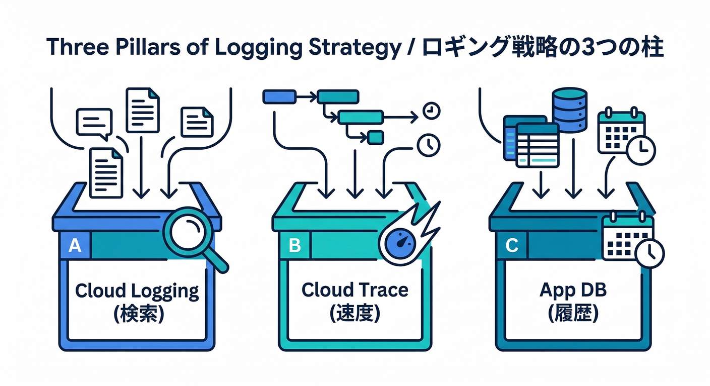
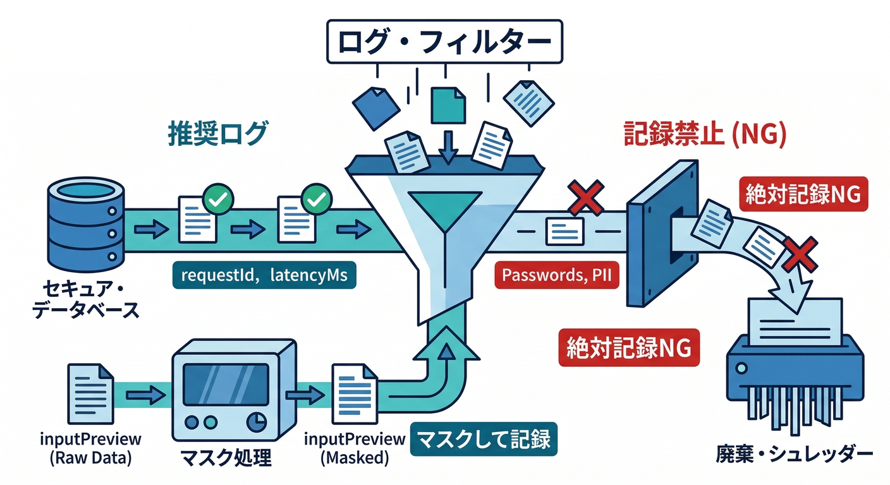
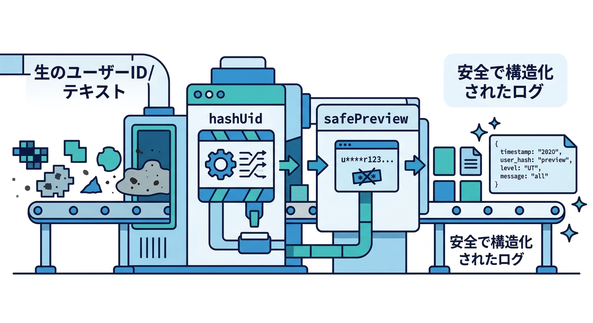
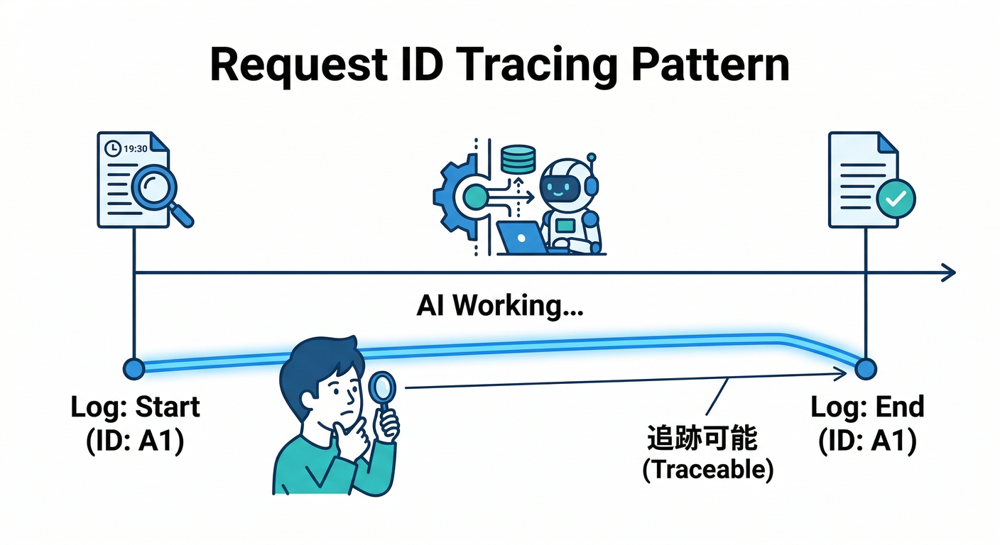
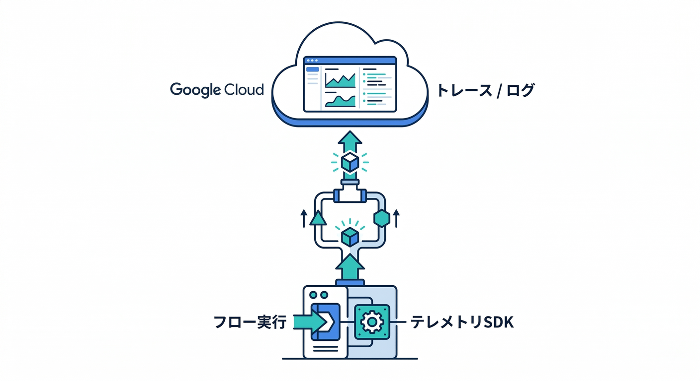
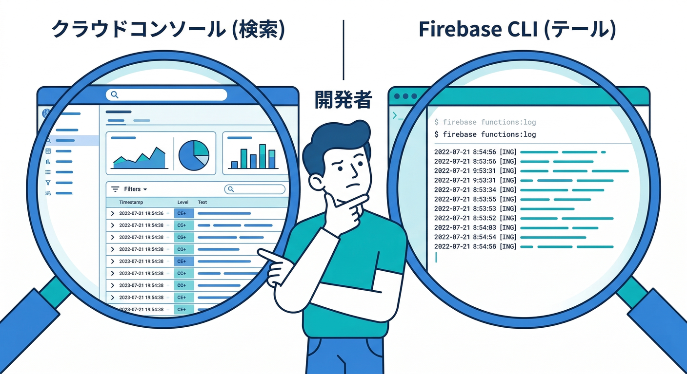
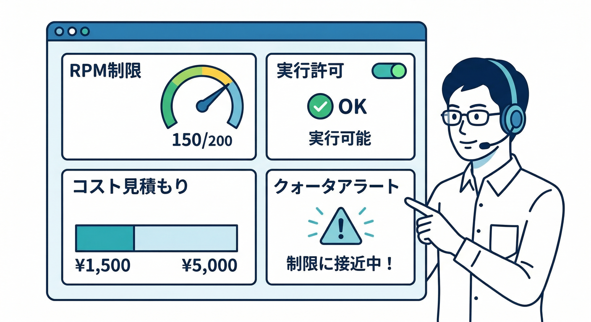

# 第14章：ログ・トレースの“残し方”を決める🧯🧾

この章はひとことで言うと、**「AIの挙動を“あとから説明できる”ようにする設計」**を固める回です🙂✨
AIは、同じ入力でも揺れたり、外部要因（モデル更新・混雑・タイムアウト）で結果が変わったりします。だからこそ **ログ（出来事の記録）＋トレース（処理の足跡）** が超大事です🧭

---

## 1) まず結論：ログ設計は「3つの箱」で考える📦📦📦



## ✅ 箱A：Cloud Logging（まずここが本丸）🪵

* **検索できる・集計できる・アラートにできる**
* Cloud Functions では **logger SDK** で「構造化ログ（JSON）」を出すのが基本です。([Firebase][1])

## ✅ 箱B：Cloud Trace（“流れ”を追う）🧵

* 1回のリクエストが、どの順で何msかかったか（スパン）を追える
* ログとトレースは **Trace ID / Span ID** で紐づけできます。([Google Cloud Documentation][2])

## ✅ 箱C：アプリ用の“履歴DB”（必要なら）🗂️

* ユーザーが「前の結果を見返す」用途
* ただし **個人情報が混ざりやすい**ので、ここは“最小限”が鉄則🚫🧠（Cloud Logging側とは役割が違う）

---

## 2) 「何を残す？」最小で強いログ項目セット💪🧾



AIワークフロー（Flow）で **最低限これだけ**残すと、だいたい復旧できます👇

## 🧩 共通（全ログに付けるタグ）

* `requestId`：1回の実行ID（自分でUUID発行でOK）
* `flowName`：どのFlowか
* `flowVersion`：プロンプトやロジックの版（例：`v3`）
* `actor`：呼び出し元（`uidHash` とか）
* `release`：デプロイ版（Gitの短いSHAでもOK）

## ⏱️ 観測（事故調査で強い）

* `latencyMs`：全体の処理時間
* `step`：どの段階か（`start` / `model_call` / `end` / `error`）
* `retryCount`：再試行回数
* `model`：モデル名（例：Gemini/Imagenのどれ）
  ※Firebase AI Logic は Gemini/Imagen を扱えます。([Firebase][3])

## 🚫 絶対にログに入れない（最重要）🔒

* 生の本文（ユーザーの入力原文）
* メール/電話/住所/氏名などのPII
* トークン、Cookie、Authorizationヘッダ、App Checkトークン
* “うっかりコピペした秘密情報”全般

**代わりに**👇

* `inputChars`（文字数）
* `inputHash`（ハッシュ）
* `inputPreview`（先頭20文字だけ、さらに伏せ字）
  みたいな“調査に必要な最低限”にします🙂

---

## 3) 手を動かす：Functions(TypeScript)で「構造化ログ」を標準化する🛠️✨

Cloud Functions の logger SDK は **構造化ログ（JSON）**を簡単に出せます。([Firebase][1])
ここでは「Flow開始→モデル呼び出し→終了」を **同じ形**で出すテンプレを作ります💡

## 3-1. ログ用ユーティリティ（コピペOK）📎



```ts
// functions/src/observability.ts
import * as logger from "firebase-functions/logger";
import { randomUUID, createHash } from "crypto";

export type LogCtx = {
  requestId: string;
  flowName: string;
  flowVersion: string;
  uidHash?: string;     // 生uidは避ける
  release?: string;     // 例: Git SHA
};

export function newRequestId() {
  return randomUUID();
}

export function hashUid(uid: string) {
  return createHash("sha256").update(uid).digest("hex").slice(0, 16);
}

// ざっくり伏せ字（PII完全検知は難しいので、まずは“入れない設計”が基本）
export function safePreview(text: string, max = 20) {
  const t = (text ?? "").replace(/\s+/g, " ").trim();
  const head = t.slice(0, max);
  // メールっぽいものは伏せる（簡易）
  return head.replace(/[A-Za-z0-9._%+-]+@[A-Za-z0-9.-]+\.[A-Za-z]{2,}/g, "***@***");
}

export function logInfo(event: string, ctx: LogCtx, fields: Record<string, unknown> = {}) {
  logger.info(event, { ...ctx, ...fields }); // ←構造化ログ（jsonPayload）
}

export function logWarn(event: string, ctx: LogCtx, fields: Record<string, unknown> = {}) {
  logger.warn(event, { ...ctx, ...fields });
}

export function logError(event: string, ctx: LogCtx, err: unknown, fields: Record<string, unknown> = {}) {
  const message = err instanceof Error ? err.message : String(err);
  logger.error(event, { ...ctx, errorMessage: message, ...fields });
}
```

## 3-2. Flow側で「start/end/error」を必ず出す📌



```ts
// functions/src/index.ts（例）
import { onCallGenkit } from "firebase-functions/v2/https";
import { newRequestId, hashUid, logInfo, logError, safePreview } from "./observability";

// 例：onCallGenkitで公開しているFlowを“呼ぶ側”のラッパとして考えてOK
export const ngCheck = onCallGenkit(
  { region: "asia-northeast1" },
  async (req) => {
    const requestId = newRequestId();
    const ctx = {
      requestId,
      flowName: "ngCheck",
      flowVersion: "v1",
      uidHash: req.auth?.uid ? hashUid(req.auth.uid) : undefined,
      release: process.env.GIT_SHA,
    };

    const t0 = Date.now();
    const input = String(req.data?.text ?? "");

    logInfo("flow_start", ctx, {
      inputChars: input.length,
      inputPreview: safePreview(input),
    });

    try {
      // ここで実際のAI処理（Genkit Flow内のLLM呼び出し等）
      // const result = await runNgCheckFlow(input);

      const result = { verdict: "OK", reason: "sample" };

      logInfo("flow_end", ctx, {
        latencyMs: Date.now() - t0,
        verdict: result.verdict,
      });

      return result;
    } catch (e) {
      logError("flow_error", ctx, e, { latencyMs: Date.now() - t0 });
      throw e;
    }
  }
);
```

ポイント👇

* **“成功ログ”と“失敗ログ”が同じrequestIdで追える**🧵
* 入力は「文字数＋プレビュー（伏せ）」まで
* これだけで問い合わせ対応がめちゃ楽になります🙂✨

---

## 4) トレースも欲しい：GenkitのテレメトリをGoogle Cloudへ🧭



Genkit には **テレメトリ（ログ/メトリクス/トレース）をGoogle Cloudへ出す仕組み**があります。([genkit.dev][4])
本番で「どのステップが遅い？」を詰めるなら、これが効きます🔥

最小イメージ（初期化時にON）👇

```ts
import { enableGoogleCloudTelemetry } from "@genkit-ai/google-cloud";

enableGoogleCloudTelemetry({
  // 必要なら projectId 等
});
```

そして Cloud Logging 側は、**トレースとログを紐づけ**できるので、ログからトレースへ飛べる導線を作れます。([Google Cloud Documentation][2])

---

## 5) “見る”のも大事：ログの確認ルートを2本にする👀🧪



## ルートA：Cloud Logging UI（検索・集計に強い）🔎

* 構造化ログだと `jsonPayload.flowName="ngCheck"` みたいに **フィールド検索**ができます。([Google Cloud Documentation][5])

## ルートB：CLIでサッと見る（作業中に強い）⚡

* `firebase functions:log` でログ表示できます。([Firebase][6])

例👇

```bash
firebase functions:log --only ngCheck
```

---

## 6) 事故らないための「ログ運用ルール」ミニテンプレ📋🧠

## 🔥 ルール1：ログレベルの基準

* `info`：開始/終了/分岐（OK/NG/要レビュー）
* `warn`：リトライ発生、外部APIが遅い、入力が怪しい
* `error`：例外、タイムアウト、プロバイダ障害

## 🔥 ルール2：保持期間（Retention）は“分ける”

Cloud Logging はログバケット等で保持期間を変えられます。([Google Cloud][7])

* ふだんのinfo：短め
* error/warn：長め
  みたいに分けるとコストも事故も減ります💸

## 🔥 ルール3：監査ログは別物（セキュリティの基礎）

管理操作・権限変更は **Cloud Audit Logs**（監査ログ）側で考えるのが基本です。([Google Cloud Documentation][8])

---

## 7) Firebase AI Logicも絡める：乱用・コスト監視のログ設計🎛️💸



AI Logic は **ユーザー単位のレート制限**（デフォルト 100 RPM/ユーザー）があり、プロダクションではクォータ確認や監視が重要です。([Firebase][9])
なのでログにも👇を入れると運用が楽です。

* `aiAllowed: true/false`（Remote Config等で止めたか）
* `rateLimited: true/false`
* `planTier: free/pro`（課金差があるなら）
* `estimatedCostBucket: low/med/high`（ざっくりでもOK）

さらに、コスト/使用量の監視ガイドもあります。([Firebase][10])

---

## 8) 開発AIで“ログ調査”を爆速にする🚀（Gemini CLI / Console）

## 💻 Gemini CLIで「ログクエリ作って」→そのまま貼る

Gemini CLI はターミナルで調査・デバッグを支援できます。([Google Cloud Documentation][11])
おすすめプロンプト例👇

* 「Cloud Loggingで `flowName=ngCheck` の `flow_error` だけ抜くクエリを書いて」
* 「`requestId` をキーに、開始→終了まで追えるクエリにして」
* 「jsonPayloadのフィールドを前提に、集計（エラー率/平均latency）案を出して」

## 🧩 Gemini in Firebaseで「このエラー何？」をコンソールで聞く

Firebase コンソール側の支援も使えます。([Firebase][12])
ただし、**AIにログ本文を丸投げしない**（PII混入の可能性）で、まずは `requestId` や `errorMessage` 程度に絞るのが安全です🙂🛡️

---

## ミニ課題🧩📝

次を満たす「ログ設計メモ」を作って、コードにも反映してみてください✨

1. `requestId / flowName / flowVersion / uidHash / latencyMs` を必ず出す
2. 入力本文は残さず、`inputChars / inputPreview(伏せ) / inputHash` にする
3. `flow_start / flow_end / flow_error` の3種類を必ず出す
4. Cloud Logging UI で `requestId` 検索して、1回の実行が追えるのを確認👀

---

## チェック✅

* 問い合わせが来たとき「いつ・誰が・どのFlowで・何秒かかって・どう失敗した」が **requestIdで1発**で追える？
* ログに“秘密”や“本文”が入らない設計になってる？🔒
* 成功時のログもある？（失敗だけだと原因の比較ができない）🙂

---

必要なら、次の第15章（Evaluate）に繋げやすいように、**「評価用データセットID」「期待ラベル（OK/NG）」「判定結果」**までログ項目に入れる版も作れます📊🔥

[1]: https://firebase.google.com/docs/functions/writing-and-viewing-logs?utm_source=chatgpt.com "Write and view logs | Cloud Functions for Firebase - Google"
[2]: https://docs.cloud.google.com/trace/docs/trace-log-integration?utm_source=chatgpt.com "Link log entries with traces"
[3]: https://firebase.google.com/docs/ai-logic?utm_source=chatgpt.com "Gemini API using Firebase AI Logic - Google"
[4]: https://genkit.dev/docs/integrations/google-cloud/?utm_source=chatgpt.com "Google Cloud Plugin"
[5]: https://docs.cloud.google.com/logging/docs/structured-logging?hl=ja&utm_source=chatgpt.com "構造化ロギング | Cloud Logging"
[6]: https://firebase.google.com/docs/functions/1st-gen/writing-and-viewing-logs-1st?hl=ja&utm_source=chatgpt.com "ログの書き込みと表示（第 1 世代） | Cloud Functions for ..."
[7]: https://cloud.google.com/logging?utm_source=chatgpt.com "Cloud Logging - Manage, Analyze, Monitor Log Data"
[8]: https://docs.cloud.google.com/logging/docs/audit/best-practices?utm_source=chatgpt.com "Best practices for Cloud Audit Logs"
[9]: https://firebase.google.com/docs/ai-logic/quotas?utm_source=chatgpt.com "Rate limits and quotas | Firebase AI Logic - Google"
[10]: https://firebase.google.com/docs/ai-logic/monitoring?utm_source=chatgpt.com "Monitor costs, usage, and other metrics | Firebase AI Logic"
[11]: https://docs.cloud.google.com/gemini/docs/codeassist/gemini-cli?utm_source=chatgpt.com "Gemini CLI | Gemini for Google Cloud"
[12]: https://firebase.google.com/docs/ai-assistance/gemini-in-firebase?utm_source=chatgpt.com "Gemini in Firebase - Google"
