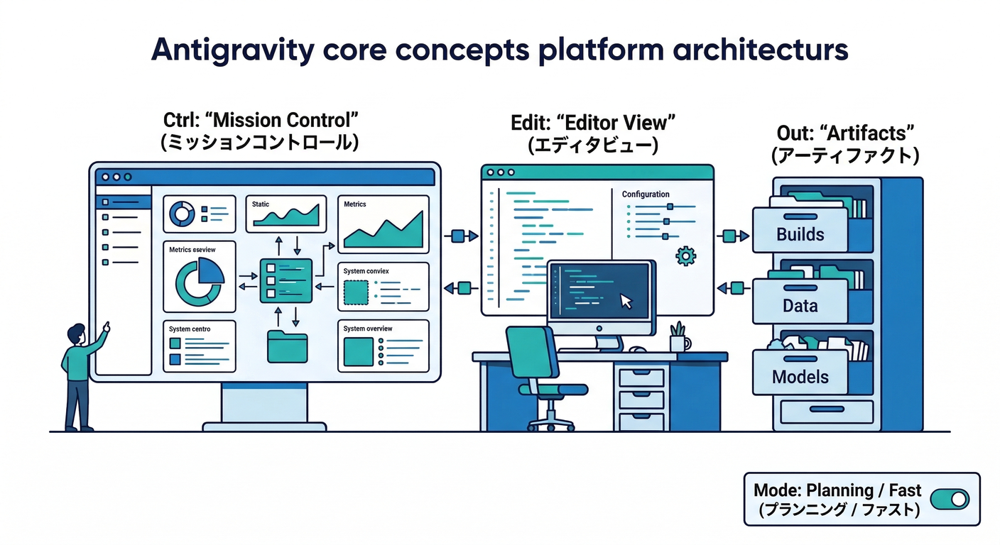
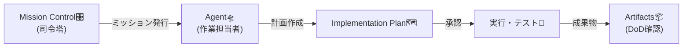
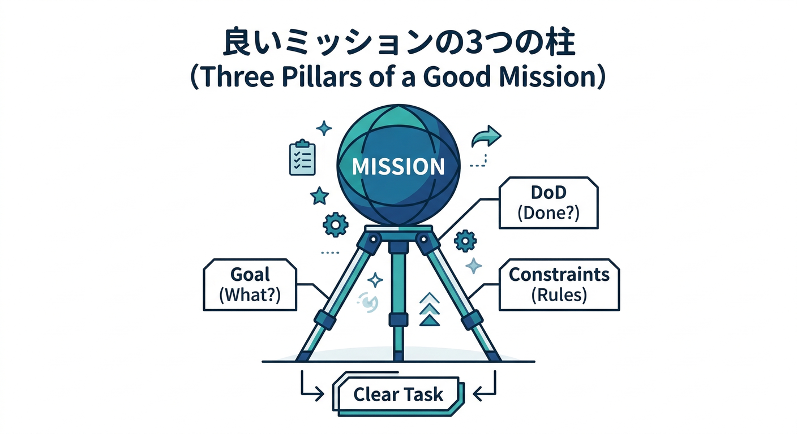
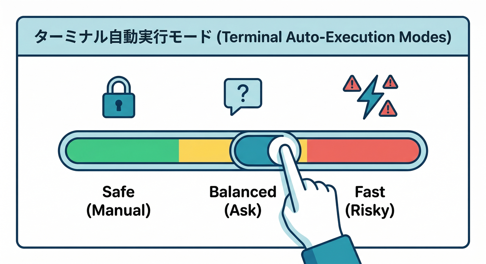
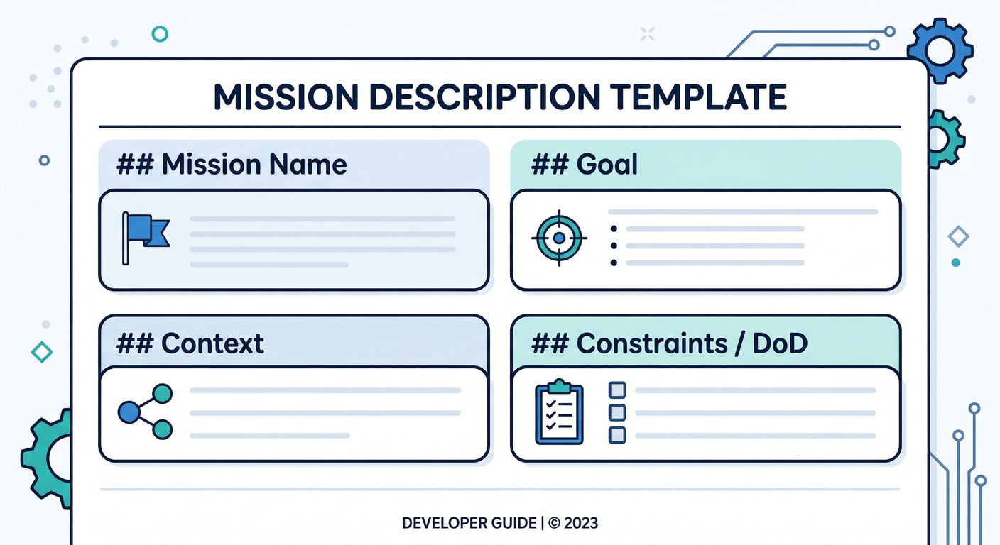
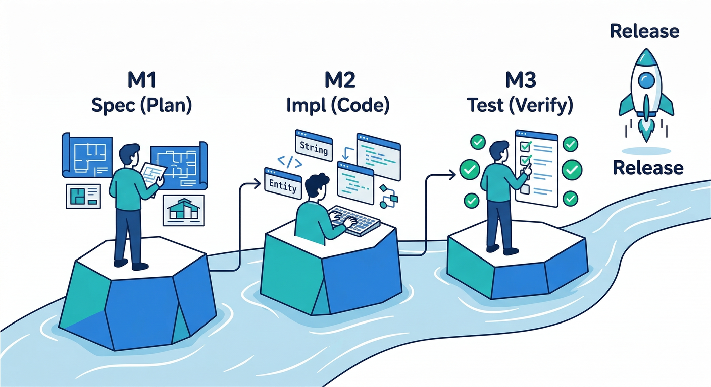
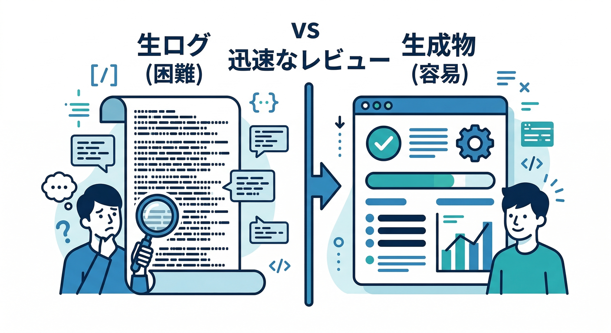
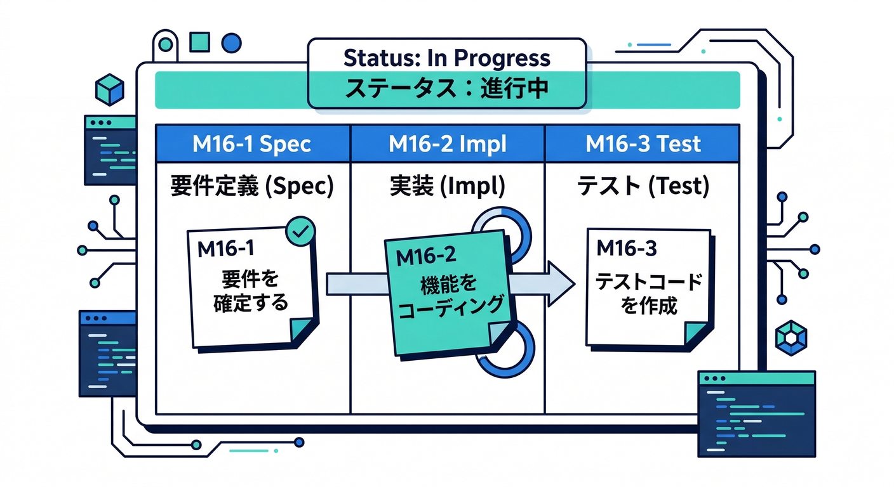

# 第16章：Antigravityで“調査→実装→テスト”をミッション化する🛸🧠

この章は、「やること多すぎて詰む😵‍💫」を防ぐための回です。
Antigravityの強みは **“作業をミッション（小さな任務）に分けて、複数エージェントで並行処理し、成果物（Artifacts）でレビューできる”** ところにあります。([Google Developers Blog][1])

---

## 読む📖：Antigravityの“ミッション開発”って何？🧩

## 1) まず覚える5語だけ🧠✨





* **Mission Control（エージェントマネージャー）**：ミッションを投げて、進捗を眺めて、レビューする司令塔🎛️
  （複数エージェントを生成・監視・操作できる）([Google Codelabs][2])
* **Editor View**：いつものIDEっぽく手で直す場所✍️
* **Artifacts**：計画書・タスクリスト・差分・スクショ・ウォークスルーなど「確認しやすい成果物」📦
  （ログ延々読むより、成果物で検証できるのがポイント）([Google Developers Blog][1])
* **Planning / Fast**：

  * Planning＝「先に計画→成果物→レビュー→実行」向き🗺️
  * Fast＝「小さな修正をサッと」向き⚡([Google Codelabs][2])
* **Review-driven（推奨）**：しょっちゅうレビューを求めてくれる安全寄り運用🛡️([Google Codelabs][2])

---

## 手を動かす🛠️：ミッションの切り方（ここが9割）✂️🔥

## “良いミッション”の条件✅（超重要）



ミッションは **30分前後で終わる粒度** が最高です✌️
次の3点セットが入ってると、エージェントも迷子になりにくいです🧭

1. **ゴール（1行）**：何ができたら勝ち？🏁
2. **Definition of Done（3〜6個）**：終わった判定ルール📏
3. **制約**：触っていい範囲・禁止事項・参照していい公式ドメインなど🚧

---

## 先に設定を“事故らない寄り”にする🧯（超大事）

初心者ほど、ここは慎重がラクです🙂

## A) モードは基本 Planning 🗺️

Planningは「実行前に計画を立てて、タスクを整理して、Artifactsを出しやすい」ので、仕様確認→実装の流れが安定します。([Google Codelabs][2])

## B) Terminalの自動実行は慎重に🖥️🛡️



Antigravityには **Terminal Command Auto Execution** があって、

* **Off**（許可リスト方式で最も安全）
* **Auto**（危険そうなら確認する…が、判断ミスの余地あり）
* **Turbo**（基本全部やる。速いけど危険）
  みたいな考え方です。([Google Codelabs][2])

初心者のおすすめはだいたい **Off＋Allowlist**（または Review-driven 開発）です🧷([Google Codelabs][2])

## C) ブラウザのURL許可リストは必須級🌐🧿

Web閲覧は強力だけど、**プロンプトインジェクション**の入口にもなります😇
なので **Browser URL Allowlist** を入れて、信頼ドメインだけに絞るのが安全です。([Google Codelabs][2])

（Allowlistファイルを開ける場所まで明記されています）([Google Codelabs][2])

---

## ミッション指示テンプレ（これをコピペして使う）🧾✨



```text
## Mission: （短いタイトル）

## Goal（ゴール）
- 何を作る/直す？（1行で）

## Context（文脈）
- 対象機能：例）「投稿のNGチェック（Genkit Flow）」など
- 関連ファイル（わかる範囲で）：例）functions/src/... / app/src/...

## Constraints（制約）
- 言語：TypeScript中心（React + Node）
- 依存追加：必要最小限（追加するなら理由も書く）
- 参照OKドメイン：firebase.google.com / cloud.google.com / github.com/firebase など
- 変更禁止：秘密情報をコードに直書きしない、など

## Definition of Done（終わった判定）
- [ ] 仕様メモ（1枚）をArtifactsで出す
- [ ] 実装差分が小さくまとまっている
- [ ] テスト（または確認手順）が用意されている
- [ ] 変更点のウォークスルーがArtifactsにある
```

---

## ハンズオン🧑‍💻：今回の題材を“3ミッション”にして回す🔁✨



ここでは例として、あなたの題材の **「投稿のNGチェック（OK/NG/要レビュー）」** を改善する流れでやります🛡️✅

---

## Mission 1（調査🔎）：仕様を1枚にする📝

**狙い**：実装前に迷いを消す（ここで勝負が決まる）🔥
**やること**：

* 「OK/NG/要レビュー」の判定ルールを文章化
* ユーザー表示文言（やさしい言葉）も決める
* “人間レビューへ回す条件” を明文化

**Antigravityに投げる指示（例）**

```text
Goal: NGチェック機能の仕様を1枚にまとめて。OK/NG/要レビューの判定ルールと返却JSON案がほしい。
Constraints: 公式ドキュメント中心で。参照URLは firebase.google.com / cloud.google.com のみ。
DoD: 仕様メモ（Artifacts）＋返却JSON例＋例外時の扱い（AI失敗時）を含むこと。
```

👉 Planningモードだと、先に計画を出してくれやすいのでレビューが楽です。([Google Codelabs][2])

---

## Mission 2（実装🛠️）：Flowと返却JSONを固める🧩



**狙い**：UIが分岐しやすい “形の良い出力” を作る🧾✨
**やること**：

* 返却JSONを安定させる（status / reason / suggestion など）
* “要レビュー”のときは根拠を薄くてもOK、みたいな逃げ道を用意🚧
* Artifactsで「変更点まとめ」を出させる

**ポイント**：
Antigravityは **Artifacts（計画書・タスク・ウォークスルー等）で検証しやすい** のが売りです。
「変更内容をArtifactsで説明して」って書くと、レビューが爆速になります🚀([Google Developers Blog][1])

---

## Mission 3（テスト🧪）：失敗しない“確認手順”を作る✅

**狙い**：AI機能は “なんとなくOK” が事故の元😇
**やること**：

* テスト入力10個（OK/NG/要レビューが混ざる）を用意
* 期待結果を表にする（手動でもOK）
* 可能なら自動テストの雛形も作る（無理なら確認手順だけでも勝ち）🏆

**ここでのコツ**：
「テストケース作って→結果をArtifactsでレポートして」までを1ミッションにすると、品質が一気に上がります📈([Google Developers Blog][1])

---

## ミニ課題🧩（30分×3で終わるやつ）⏱️✨



次の3ミッションを作って、Mission Controlに並べてください🎛️

1. **仕様ミッション**：NG判定の基準＋返却JSON
2. **実装ミッション**：サーバー側（Flow）を修正
3. **テストミッション**：10ケース＋期待結果＋確認手順

ミッション名を「M16-1」「M16-2」みたいに番号で揃えると、あとで見返すのが気持ちいいです😆📚

---

## チェック✅：この章の“できた判定”🎯

* [ ] TODOが“ミッション列”になっている（でかい塊が消えた）🧹
* [ ] 各ミッションに **DoD（終わった判定）** が書いてある📏
* [ ] Planningで計画→Artifacts→レビュー→実行の流れを回せた🗺️([Google Codelabs][2])
* [ ] Terminal/Browserの安全設定（Allowlist等）を触って、守りを固めた🛡️([Google Codelabs][2])

---

## 次章につながる一言🔜💻

次の第17章（Gemini CLI）は、この第16章で作った **「ミッションの型」** を、ターミナル中心にもっと高速回転させる感じです⚡
“司令塔＝Antigravity / 現場作業＝CLI” みたいに役割分担できると、開発が一段ラクになります😎✨

[1]: https://developers.googleblog.com/build-with-google-antigravity-our-new-agentic-development-platform/ "
            
            Build with Google Antigravity, our new agentic development platform
            
            
            \- Google Developers Blog
            
        "
[2]: https://codelabs.developers.google.com/getting-started-google-antigravity?hl=ja "Google Antigravity のスタートガイド  |  Google Codelabs"
