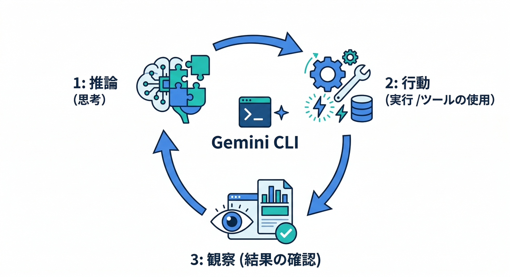
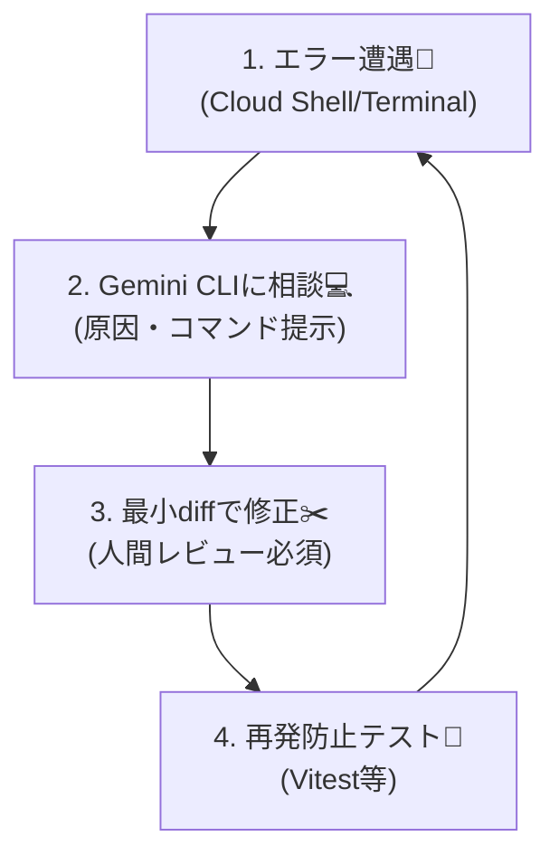
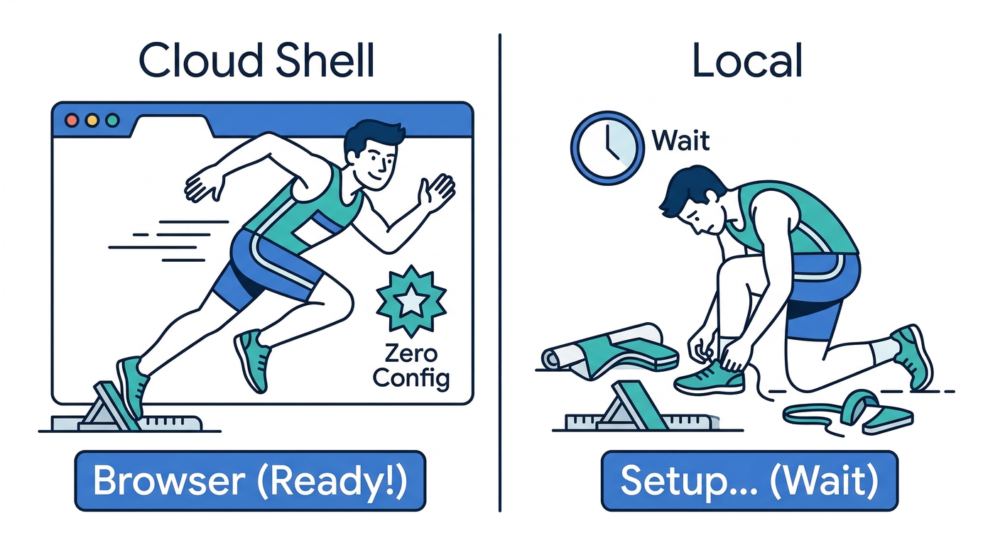
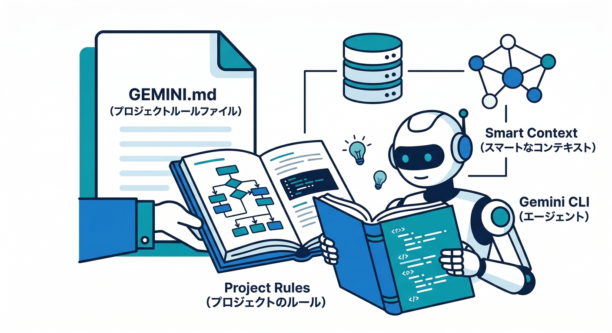
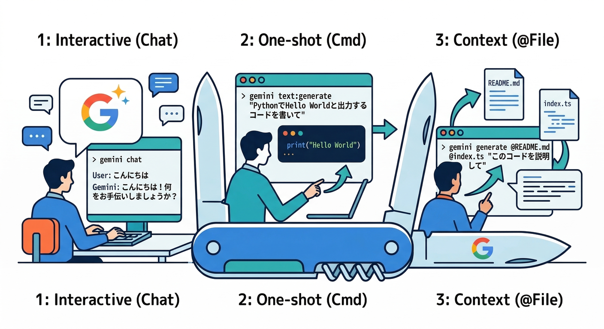
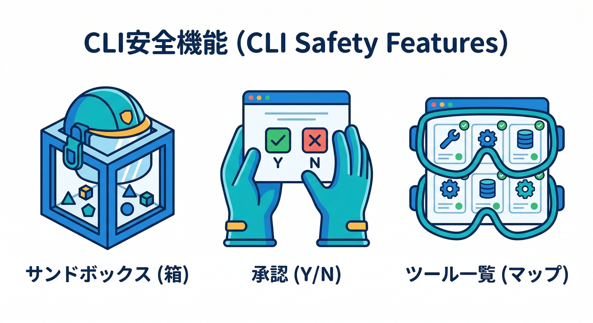
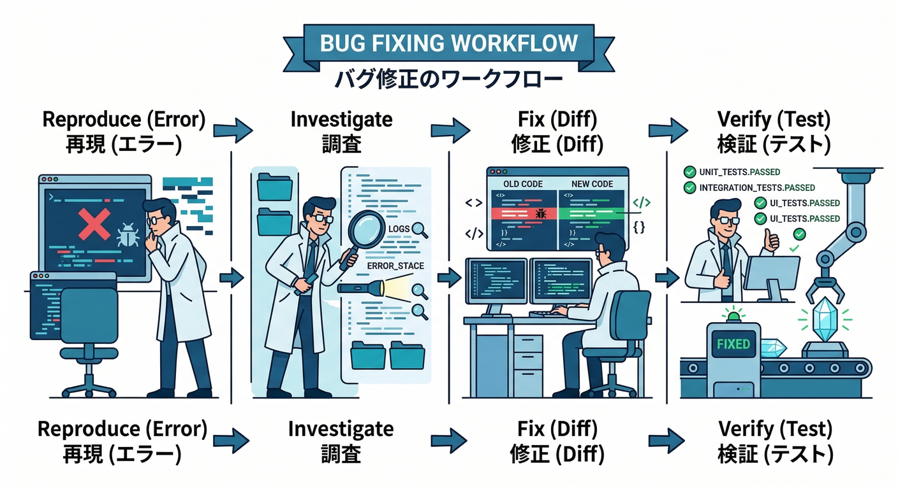
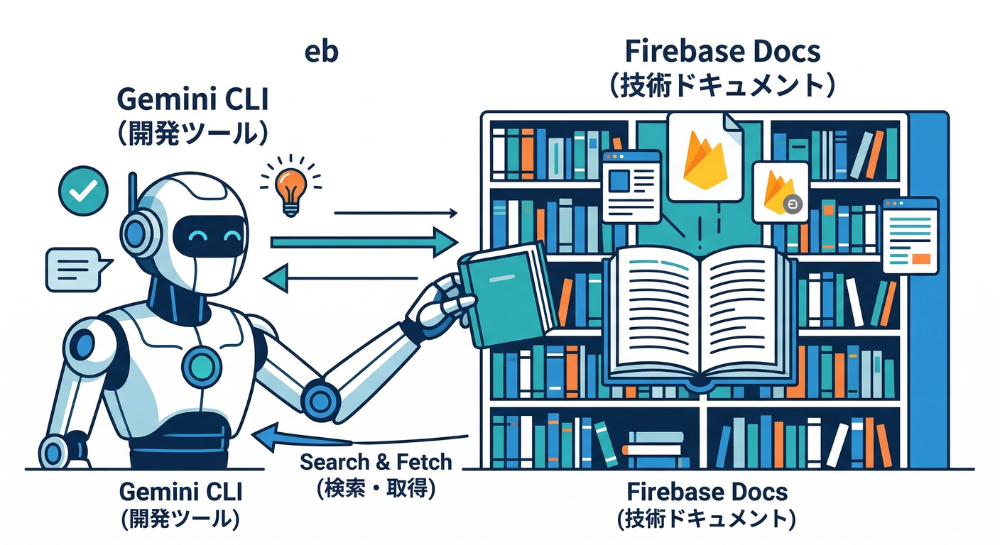

# 第17章：Gemini CLIで“リサーチと修正”をターミナルから回す💻✨

この章のゴールはこれ👇
**「困った→調べる→直す→確かめる」**を、チャットUIじゃなく **ターミナル中心**で回せるようになることです😆🌀

Gemini CLIは、ターミナルで動く **オープンソースのAIエージェント**で、内蔵ツール（grep/ファイル読み書き/コマンド実行/Web search & fetchなど）を使いながら、**ReAct（reason & act）**でバグ修正やテスト改善みたいな複雑タスクを進められます。([Google Cloud Documentation][1])
さらに、**Cloud Shell では追加セットアップなしで使える**のが超つよいです🧨（ブラウザで完結）([Google Cloud Documentation][1])

---

## ✅ ここで「できるようになること」チェックリスト🧠✅

* エラー文を貼って、**原因候補→確認コマンド→直し方**をセットで出させる🧯
* 直し方を「最小diff」で作らせて、人間がレビューして取り込む👀
* テスト（例：Vitest/Jest）を追加して、**再発防止**までやる🧪
* Web検索で一次情報（公式doc/リリースノート）を引いて、**迷いを減らす**🌐([Google Cloud Documentation][1])
* “うっかり事故”を避けるために、**sandbox/承認モード/信頼フォルダ**を理解する🧷([Gemini CLI][2])

---

## 1) 読む：Gemini CLIの「強み」と「やり方の型」📚✨





## 強み①：Cloud Shellで即スタートできる⚡



Cloud Shellでは、Gemini CLIが **追加セットアップなし**で使えます。([Google Cloud Documentation][1])
なのでWindowsでも「ローカル環境のややこしさ」を避けて、**ブラウザ上のターミナル**でスッと始められます😆

## 強み②：Web search/fetch と内蔵ツールで“根拠を取りに行ける”🔎

Gemini CLIは、Web search/fetch を含む機能が案内されています。([Google Cloud Documentation][1])
「これって仕様？バグ？」「今の推奨はどれ？」みたいな時に、**検索→引用→結論**の流れが作りやすいです📌

## 強み③：プロジェクト用の“ルールブック”を持てる（GEMINI.md）🗂️



プロジェクトの指示（例：使っていいnpmスクリプト、守るべきルール、触っちゃダメなファイル）を `GEMINI.md` に置くと、**毎回の説明コストが激減**します。しかも `/init` で雛形を生成できます。([Gemini CLI][3])

---

## 2) 手を動かす：5分で起動して“使える状態”にする🚀🧩

## パターンA：Cloud Shell（最短コース）☁️💨

1. Cloud Shell を開く
2. そのまま `gemini` を起動（Cloud Shellは追加セットアップ不要）([Google Cloud Documentation][1])
3. ログイン方式を選んで進む（画面の案内どおり）

※ ここで「CLIの枠」はできたので、次から“型”に入ります🌀

## パターンB：ローカルに入れる（必要なら）🖥️🧰

Gemini CLIの推奨要件には、OS（Windows 11 24H2+ 等）・Node.js 20+・Bash/Zsh が書かれています。([Gemini CLI][2])
インストールは npm でOKです。([Gemini CLI][2])

```bash
npm install -g @google/gemini-cli
gemini
```

---

## 3) 手を動かす：まず覚える「3つの使い方」🕹️✨



## ① 対話モード（基本）

```bash
gemini
```

## ② 1発実行（短い質問に強い）

例：いまのコードの構造を説明して、みたいな時👇（非対話で動かせます）([GitHub][4])

```bash
gemini -p "Explain the architecture of this codebase"
```

## ③ “必要ファイルだけ渡す”（@で注入）📎

ファイル/ディレクトリを `@` で渡せます。([Gemini CLI][3])

```text
@src/ @package.json このプロジェクトの実行手順と、テストの走らせ方を教えて
```

---

## 4) 読む：事故らないための「安全3点セット」🧷🛡️



## 安全①：ツールの一覧を把握する（/tools）🔧

Gemini CLI内で使えるツールを確認できます。([Gemini CLI][3])
「今、何ができる状態？」が見えるだけで安心感が上がります😌

## 安全②：承認モード（特にYOLOは慎重に！）⚠️

設定画面（`/settings`）で、承認やセキュリティ周りを調整できます。([Gemini CLI][3])
YOLO（自動でガンガン実行）系は便利だけど、初心者ほど **OFF推奨**です🙅‍♂️

## 安全③：sandboxで隔離する🧊

公式のインストール/実行ガイドに、sandbox（Docker/Podman）や `--sandbox` の案内があります。([Gemini CLI][2])

```bash
gemini --sandbox -p "Run tests and explain failures"
```

---

## 5) 手を動かす：GEMINI.mdで“説明コストゼロ化”🗂️✨

`/init` で、今のフォルダを解析して `GEMINI.md` を生成できます。([Gemini CLI][3])
その後 `/memory` で、読み込まれている指示（階層メモリ）を確認・更新できます。([Gemini CLI][3])

## まずはこのテンプレを置く（例）🧾

```md
## GEMINI.md（例：日報整形ボタン + NGチェック）

## 目的
- “日報を整える” と “投稿のNG表現チェック” の品質を上げる
- バグ修正は最小diff、テスト追加で再発防止まで

## 守ること
- 秘密情報（APIキー等）は絶対に貼らない／ログにも出さない
- 変更は小さく、理由を説明する
- まずテストを走らせてから直す
- 直したら必ずテストを追加する

## 実行コマンド
- install: npm ci
- dev: npm run dev
- test: npm test
- lint: npm run lint

## 返答フォーマット
1) 原因候補（3つ）
2) 確認手順（コマンドつき）
3) 修正案（最小diff）
4) 再発防止テスト案
```

---

## 6) 手を動かす：本題！「エラー→原因→修正→検証」の回し方🌀🧪



ここからが“仕事で使える型”です😆🔥

## ステップ0：まず失敗を再現する（ここが一番大事）🎯

```bash
npm test
```

エラーが出たら、**エラー全文**と、関連しそうなファイル（例：エラーに出たファイル）を用意します📦

---

## ステップ1：Gemini CLIに“調査フォーマット”で投げる🧯

ポイントは「丸投げ」じゃなくて **出力の型を固定**すること✨

```text
以下のエラーの原因候補を3つ出して。
それぞれ「確認コマンド」も書いて。
最後に、最小diffで直す方針を1つ提案して。

エラー：
（ここにエラー全文）

関連ファイル：
@src/...（必要なら）
```

---

## ステップ2：修正案を“最小diff”で作らせる✂️

```text
提案のうち1つでいいので、最小diffで修正して。
変更ファイル一覧と、修正理由を1行ずつ添えて。
```

※ ここで **そのまま採用しない** が超重要👀🧠
「変更が大きすぎない？」
「別の副作用ない？」
「テストで守れてる？」
って確認します✅

---

## ステップ3：再発防止のテストを作る🧪🧷

```text
同じバグが再発しないように、テストを1本追加して。
（Vitest/JestのどちらでもOK。既存の流儀に合わせて）
```

そして最後に👇

```bash
npm test
npm run lint
```

---

## 7) 章トピックに“Firebase要素”を絡めるコツ🔥🔗



Gemini CLIは **Web search/fetch** を使えるので、Firebase周りの「詰まり」もターミナルで解決しやすいです🌐([Google Cloud Documentation][1])

たとえばこんな使い方👇

* 「AI LogicのApp Check設定で詰まった」→ 公式docを検索して、チェックリスト化🧿
* 「Functions 2nd genのデプロイ失敗」→ ログを貼って原因候補→修正→検証まで一気通貫🧯
* 「Remote Configで段階解放の設計」→ 仕様を箇条書きにして、実装タスクに分解🎛️

---

## 8) ミニ課題：第17章の“ゴール確認”🎒✅

## ミニ課題（30〜45分）⏱️

1. `GEMINI.md` を置く（上のテンプレでOK）🗂️
2. `npm test` を走らせて、失敗を1個拾う🧯
3. Gemini CLIで

   * 原因候補（3つ）
   * 確認コマンド
   * 最小diff修正案
   * 再発防止テスト
     を出させる🧪
4. 人間レビューして取り込み、テストが通るところまでやる🎉

## チェック（できたら勝ち）🏁

* 「原因候補→確認→修正→検証」が **1セット**で説明できる？🙂
* `GEMINI.md` のルールで、AIの暴走（余計な変更）を抑えられた？🧷
* “そのまま採用しない”レビュー手順が守れた？👀✅

---

## 9) ちょい最新トピック（知ってると得）🆕✨

* Gemini CLIは **Cloud Shellで追加セットアップ不要**で使えます☁️([Google Cloud Documentation][1])
* 公式ドキュメント（Google Cloud側）は **2026-02-19 更新**になっています📅([Google Cloud Documentation][1])
* 拡張機能（Extensions）まわりも改善が進んでいて、設定を保存して自動適用しやすくする変更などが案内されています🧩([Google Developers Blog][5])

---

次の第18章（Firebase Studio）では、この章で作った「ルールブック＋CLI運用」を、**“環境ごと再現できる形”**に固めていきます🧰🧊
必要なら、この第17章のミニ課題用に「わざと失敗する小さなバグ（JSON壊れ/型ズレ/テスト落ち）」を仕込んだ練習シナリオも用意できますよ😆🧪

[1]: https://docs.cloud.google.com/gemini/docs/codeassist/gemini-cli "Gemini CLI  |  Gemini for Google Cloud  |  Google Cloud Documentation"
[2]: https://geminicli.com/docs/get-started/installation/ "Gemini CLI installation, execution, and releases | Gemini CLI"
[3]: https://geminicli.com/docs/reference/commands "CLI commands | Gemini CLI"
[4]: https://github.com/google-gemini/gemini-cli "GitHub - google-gemini/gemini-cli: An open-source AI agent that brings the power of Gemini directly into your terminal."
[5]: https://developers.googleblog.com/making-gemini-cli-extensions-easier-to-use/ "
            
            Making Gemini CLI extensions easier to use
            
            
            \- Google Developers Blog
            
        "
