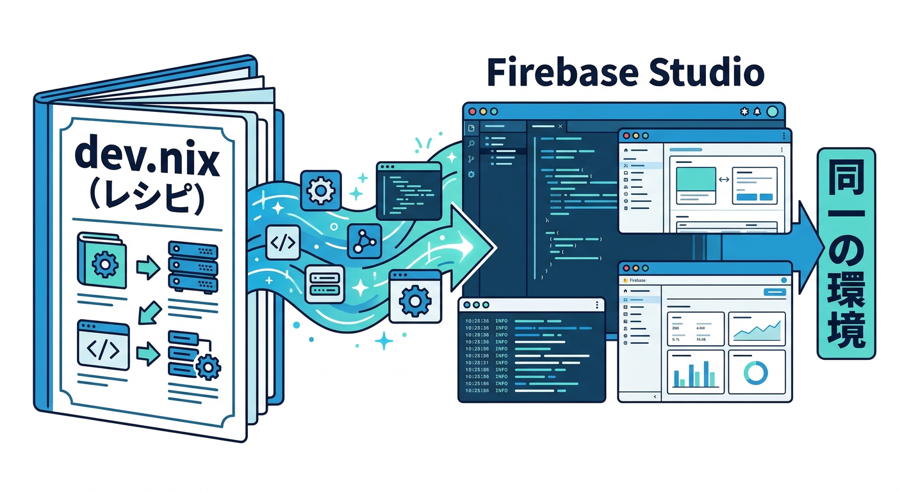
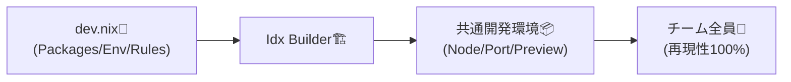
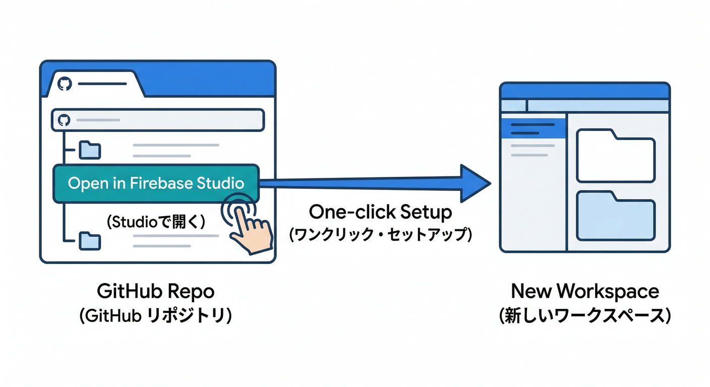
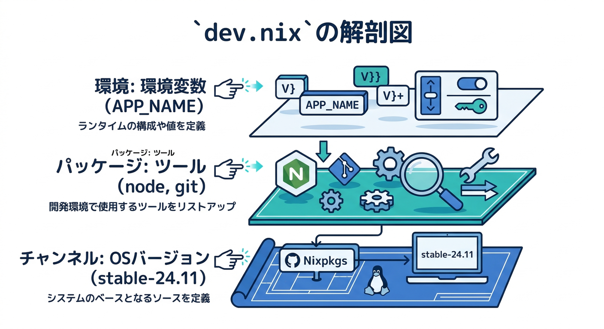
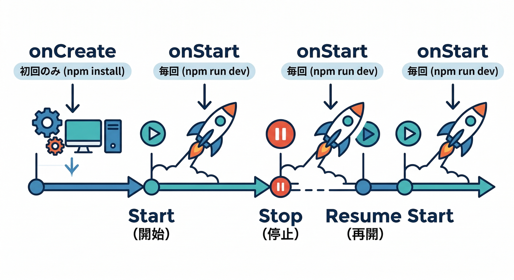
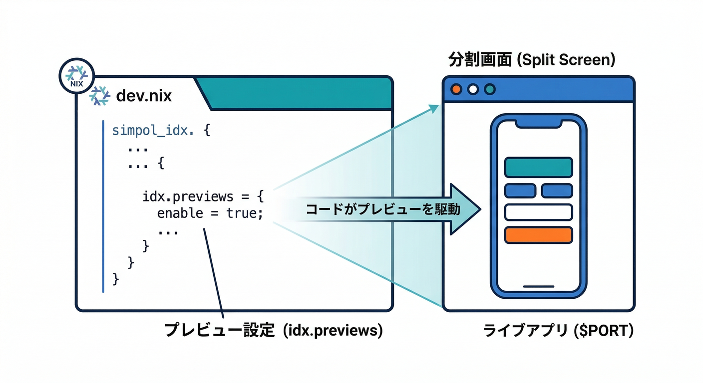
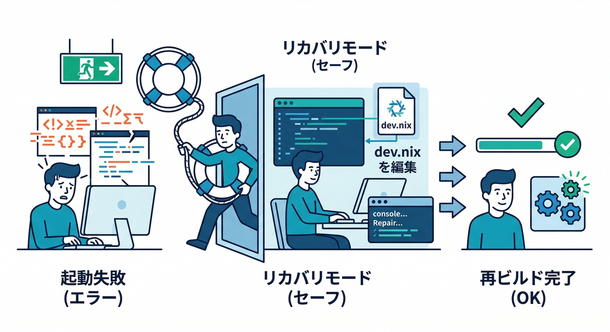
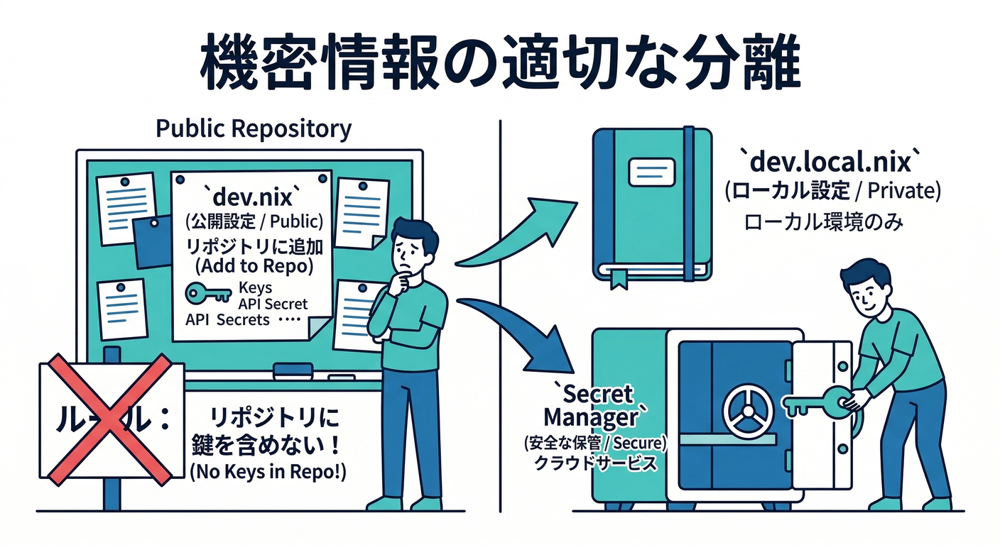

# 第18章：Firebase Studioで“環境を再現可能”にする🧰🧊

この章はひとことで言うと、**「誰が開いても、同じ開発環境が“自動で”立ち上がる状態」**を作る回です😆✨
合言葉は **`dev.nix = 環境のレシピ`** 🍳📦（これをGitに入れるのが勝ち筋）

---

## ゴール🎯

* 新しい人がリポジトリを開いたら、**Node/ツール/拡張機能/プレビュー起動**までだいたい自動で揃う👥✨
* 「自分のPCでは動くのに…😇」を消す🔥
* さらに、AI支援（Studio内Gemini / エージェント / MCP / CLI）も**同じ流儀**で回せるようにする🤖🧠

---

## 読む📖：Firebase Studioの“再現可能”ってこういうこと





Firebase Studioは、ワークスペースの環境を **`.idx/dev.nix`** で定義できます。
このファイルに **使うパッケージ・環境変数・VS Code拡張・プレビューコマンド**などを書いて、**環境をRebuild**すると反映されます🔁✨
もし `dev.nix` をミスって環境が壊れても、**Recovery environment**（最低限のエディタだけで起動）で復旧できます🛟（壊れても直せる設計がえらい！）([Firebase][1])

---

## 手を動かす🧪：チームで“同じ環境”を作る手順

## 0) まずはリポジトリをStudioへ取り込む📥



* GitHub / GitLab / Bitbucket などから取り込みOK
* もしくはプロジェクト側に **「Open in Firebase Studio」ボタン**を置いて、ワンクリック導線にするのも強い💪（導入体験が神）([Firebase][2])

---

## 1) 最小の `.idx/dev.nix` を作る🧾



まずは**小さく始める**のがコツです🙂
（あとで足す！）

```nix
{ pkgs, ... }: {
  # nixpkgs のチャンネル（安定版がおすすめ）
  channel = "stable-24.11";

  # 環境に入れたいツールたち
  packages = [
    pkgs.nodejs_22
    pkgs.git
    pkgs.jq
  ];

  # 例：環境変数（秘密は入れない！後で説明するよ🔐）
  env = {
    APP_NAME = "ai-daily-report";
  };
}
```

* `channel` は選べる候補が決まっていて、`stable-23.05 / 23.11 / 24.05 / 24.11 / unstable` のように指定します。([Firebase][3])
* `packages` はNixのパッケージ検索から探せます🔎([Firebase][1])

---

## 2) “初回だけやりたいこと”を `onCreate` に入れる🪄



依存インストールを毎回手でやるの、地味に事故ります😇
なので初回に自動で走らせます！

```nix
{ pkgs, ... }: {
  channel = "stable-24.11";
  packages = [ pkgs.nodejs_22 ];

  idx.workspace.onCreate = {
    # 初回に依存を入れる（npm / pnpm どっちでもOK）
    npm-install = "npm install";
    # 初回に開いてほしいファイル（任意）
    default.openFiles = [ "README.md" ];
  };
}
```

`onCreate` / `onStart` の使い分けも公式にまとまってます。([Firebase][3])

---

## 3) プレビュー（Preview）を“標準装備”にする👀✨



Studioは **プレビュー用コマンド**も `dev.nix` に書けます。
Reactなら「`npm run dev` を $PORT で起動」みたいな形に寄せると安定です👍

```nix
{ pkgs, ... }: {
  channel = "stable-24.11";
  packages = [ pkgs.nodejs_22 ];

  idx.previews = {
    enable = true;
    previews = {
      web = {
        command = [
          "npm" "run" "dev" "--"
          "--port" "$PORT"
          "--host" "0.0.0.0"
        ];
        manager = "web";
        # 例：サブディレクトリ構成ならここで指定
        # cwd = "apps/web";
      };
    };
  };
}
```

`idx.previews` の形（`command` は配列、`manager` は `"web"` など）も仕様が明記されています。([Firebase][1])

---

## 4) VS Code拡張も揃えて“見た目と品質”を統一🎨🧹

ESLint/Prettier/各種言語拡張を `idx.extensions` に固定すると、フォーマット差で揉めません😆

```nix
{ pkgs, ... }: {
  idx.extensions = [
    "dbaeumer.vscode-eslint"
    "esbenp.prettier-vscode"
  ];
}
```

拡張はOpen VSXで探して `publisher.id` 形式で指定します。([Firebase][1])

---

## 5) 反映：Rebuild → もし壊れたらRecoveryで復旧🛟



`dev.nix` を変えたら、Studioが **Rebuild** を促してくれます。
もし設定ミスで環境が起動しなくなったら、**Recovery environment**で立ち上げて `dev.nix` を直して再Rebuildできます🧯✨([Firebase][1])

---

## 重要🔐：秘密情報（APIキー等）を“レシピに混ぜない”



`dev.nix` は基本 **リポジトリにコミットする前提**なので、**秘密を直書きしない**のが鉄則です🚫

おすすめのやり方はこの2段構え：

## ✅ A) “個人だけの設定”は `dev.local.nix` に逃がして gitignore

`dev.nix` から `dev.local.nix` を「存在したら読み込む」方式にできます。
（チーム全体の再現性を壊さず、個人の差分だけローカル管理できる）([Firebase][3])

## ✅ B) 共有の秘密は Secret Manager を使う🗝️

Firebase Studioは **Google/Firebaseサービス連携**の流れの中で、**Secret Manager** を使った安全な扱いを案内しています。([Stack Overflow][4])
Functions 側も、秘密は安全な方法（Secret Manager 等）へ寄せるのが基本です。

---

## ついでに強化🚀：Firebaseプロジェクト接続も“迷子ゼロ”にする

StudioからFirebaseプロジェクトに接続して、サービス連携（例：App Hosting / Functions など）を進められます。
さらに **Gemini CLI や Firebase MCP server** を使ったAI支援も、プロジェクト接続とセットで組み立てられます🧠🔌([Firebase][5])

---

## ミニ課題💡（30分）

**「初見の人が1時間以内に同じ状態」**を目指して、次をやってみよう🔥

1. `.idx/dev.nix` を作ってコミット
2. `packages` に **Node + git + jq** を入れる
3. `idx.previews` でReactのプレビューが自動起動するようにする
4. `idx.extensions` で ESLint/Prettier を入れる
5. わざと `dev.nix` を壊して Recovery → 修正 → Rebuild を体験（保険の練習）🛟

---

## チェック✅（ここまでできたら勝ち！）

* [ ] 新しい人が開いても、Nodeやツールが揃う
* [ ] `npm install`（または同等）が初回で走る
* [ ] プレビューが自動で立ち上がる
* [ ] ESLint/Prettierが全員同じ状態
* [ ] Secretsを `dev.nix` に書いてない🔐
* [ ] 壊してもRecoveryで直せる🛟

---

## おまけ🤖✨：AI導入済み前提なら“再現性”はもっと上がる

* Studio内のAI支援は、**Agent skills（エージェントにやらせる作業の型）**も使えます。チームで「この作業はこの型で」って揃えると、属人性が減ります🧩([Firebase][6])
* AntigravityとGemini CLIは得意分野が違うので、**「調査→実装→検証」**の流れをどっちで回すか決めておくと迷いが減ります🧭([Firebase][2])

---

次の第19章では、ここで作った“再現できる環境”の上で、**コンソール運用（Gemini in Firebase）**を「手順書に落とす」方向に繋げると気持ちよく進められます🧯📝

[1]: https://firebase.google.com/docs/studio/get-started-workspace "About Firebase Studio workspaces"
[2]: https://firebase.google.com/docs/studio/import-workspace?utm_source=chatgpt.com "Create a button to import code to Firebase Studio - Google"
[3]: https://firebase.google.com/docs/studio/devnix-reference "dev.nix Reference  |  Firebase Studio"
[4]: https://stackoverflow.com/questions/65080574/how-to-read-environmental-variables-from-env-file-in-firebase?utm_source=chatgpt.com "How to read Environmental Variables from .env file in ..."
[5]: https://firebase.google.com/docs/studio/firebase-projects "Connect to a Firebase project  |  Firebase Studio"
[6]: https://firebase.google.com/docs/ai-assistance/agent-skills?hl=ja&utm_source=chatgpt.com "Firebase エージェントのスキル | Develop with AI assistance"
