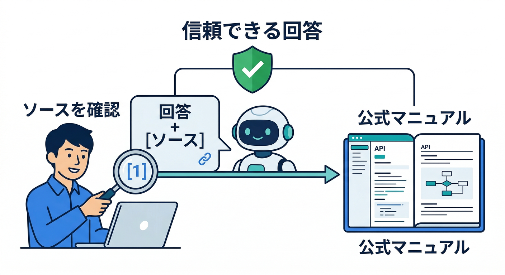
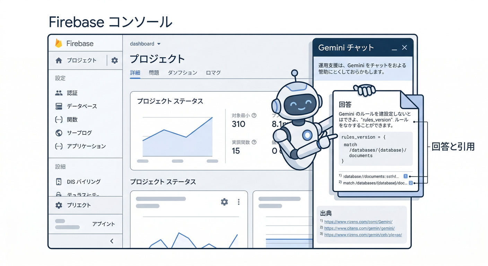
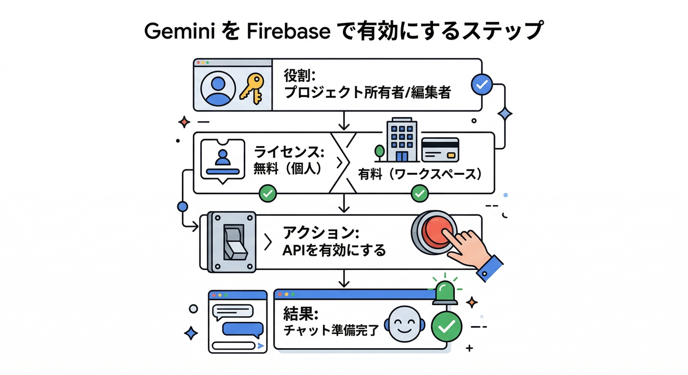
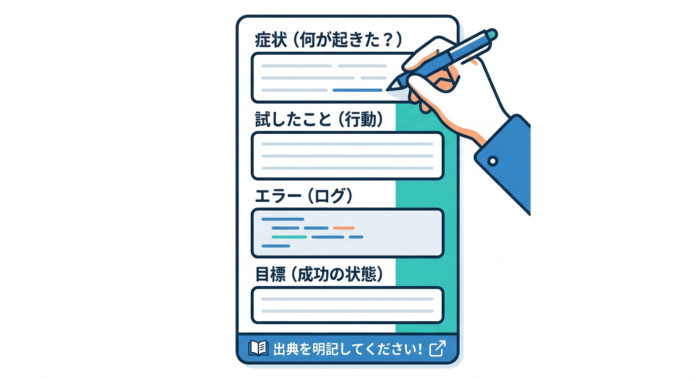
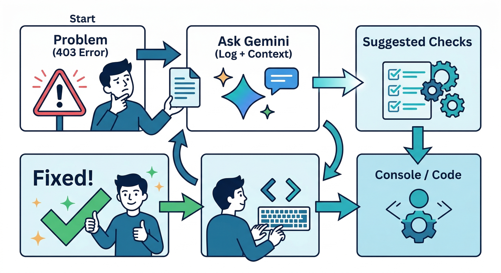
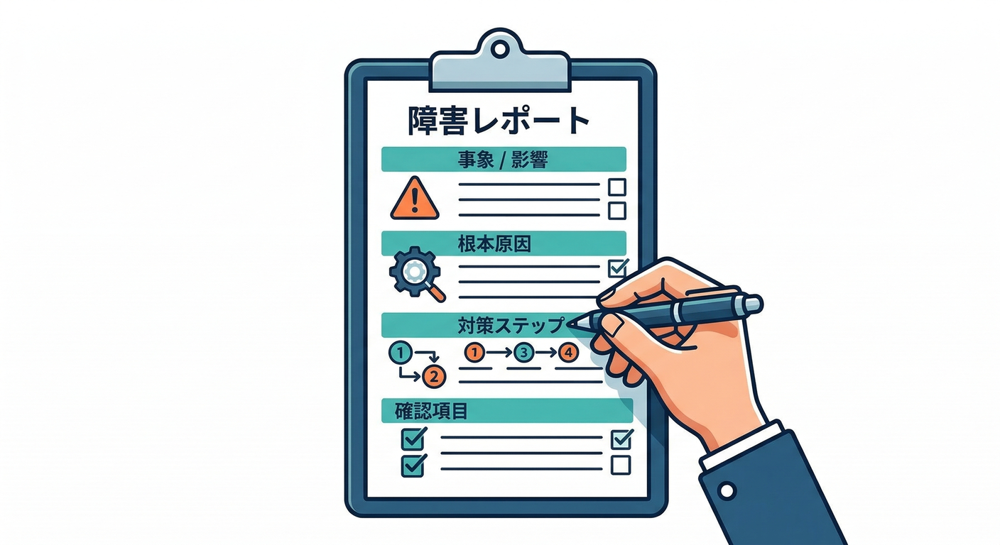
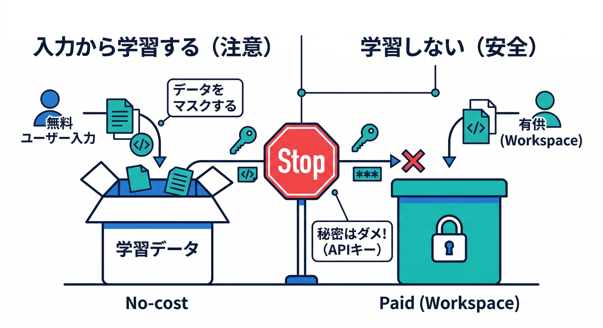

# 第19章：Gemini in Firebaseで“コンソール運用”を助けてもらう🧯🔧

この章はひとことで言うと、**「Firebaseコンソールの操作・設定・トラブル対応を、Geminiに“相談しながら”進める力をつける回」**です💬✨
Gemini in Firebaseは、Firebase製品の疑問に即答してくれたり、エラーを“人間語”に翻訳して次の一手を提案してくれたりします👀🧠（しかも**参考にした公式ドキュメント等の“出典”も返せる**のが強い！）([Firebase][1])

---

## 0) この章のゴール🎯✨



* コンソールで詰まったときに、**Geminiに“良い質問”を投げて最短で前に進める**💨
* 回答をそのまま流さず、**出典（source citations）を見て裏取り**できる👓([Firebase][1])
* そして最重要：**回答を“運用メモ（手順書）”に変換して、次回の自分を救う**📝🛟

---

## 1) Gemini in Firebaseって、何ができるの？🤖📌



できること（初心者が嬉しい順）👇

* **Firebaseの設定・機能の質問に答える**（しかもプロダクト横断で）💬([Firebase][1])
* **エラー文の解読＆トラブルシュート提案**（ログも見ながら考え方を出してくれる）🧯([Firebase][1])
* **コード断片の提案**（複数言語OK）＋**参照したドキュメントの出典つき**🧩📚([Firebase][1])
* （任意）CrashlyticsやMessaging、Data ConnectにもAI支援がある🧠📨([Firebase][1])

ただし⚠️

* **“もっともらしい間違い”もありうる**ので、重要な判断は出典と実機確認でガードします🙅‍♂️([Firebase][2])
* **Security Rulesは回答はできても「あなたのコードを見て生成」はできません**（コンソールAIはあなたのコードベースにアクセスできないため）🛑([Firebase][1])

---

## 2) まず使える状態にする（表示されない時のチェック）🧰✅



Gemini in Firebaseの有効化・権限まわりは、まずここを疑うと早いです🔍

## 2-1) 役割（権限）で詰まるパターン👥🔒

* **プロジェクトの編集権限がある人**（Owner/Editor相当）は、基本的にGemini in Firebaseを有効化できます。([Firebase][3])
* **閲覧者（Viewer）**に使わせたい場合は、**「Gemini for Google Cloud User」ロール**を付与する案が用意されています。([Firebase][3])

## 2-2) “無料”と“ライセンス必須”の分かれ目💸🧾

* 個人のGoogleアカウント（Workspaceじゃない）だと、コンソールやIDEで**no-cost**で使えるケースがあります。([Firebase][1])
* **Google Workspaceユーザーは、Gemini Code AssistのStandard/Enterpriseライセンスが必要**と書かれています（ここがハマりやすい！）([Firebase][1])

## 2-3) もし「Google Cloud側で購入/有効化」するなら注意⚠️

Spark（無料）運用のつもりが、手順によってはプロジェクトがBlaze（課金）に紐づく可能性があるので、**購読や管理の導線は公式の注意書きを一読**してね💦([Firebase][3])

---

## 3) ハンズオン①：Geminiペインで“相談→裏取り→メモ化”を1周する🌀📝

## 3-1) まず“相談の型”を作る（これが9割）📌💬



Geminiに投げる文章は、これだけ揃うと強いです👇

* **いま困ってること（症状）**：何が起きてる？
* **やったこと（試したこと）**：何を変更した？
* **エラー文（原文そのまま）**：ログ/メッセージ
* **ゴール**：どうなれば成功？
* **制約**：今は止めたい？ 本番影響ある？ など

さらに最後にこれを付けると神👼✨

* **「手順を番号付きで」「確認ポイント付きで」「出典リンクも」**

> Gemini in Firebaseは、回答に使ったドキュメントやサンプルを“source citations”として返せます。ここが裏取りの鍵になります👓([Firebase][1])

---

## 3-2) 練習用：この章の題材アプリで“ありがち相談”を投げる🧩🧯



## 例A：AI Logicが失敗する（403/権限/トークン系）🧿

質問テンプレ👇

* 「AI Logicの呼び出しが失敗する。App Checkを入れた後から発生。何を順に確認すべき？」
* 「“想定原因の優先順位”と“確認手順（コンソールでどこを見るか）”を番号で」

※App CheckやAIの乱用対策と絡みやすいので、**確認順が命**です🧠🔥

## 例B：onCallGenkit/Functionsがエラーになる（ログ解読）🧯

* 「Callable（onCall）でInternal error。Functionsログのこの行が怪しい。原因候補→切り分け→最短修正案は？」
* 「修正したら“どのログがどう変わると成功”？」

Gemini in Firebaseは**エラー文の解読やログ解析の提案**が得意分野に入っています。([Firebase][1])

## 例C：Remote Configで“段階解放”が効かない🎛️😵

* 「無料ユーザーはAIボタンOFFにしたいのにONのまま。条件式の考え方と、コンソールで見るべき点は？」
* 「“停止スイッチ”を作るなら、どういうパラメータ設計が無難？」

---

## 4) ハンズオン②：回答を“運用メモ”に変換して保存する📝🧊



Geminiの回答って、その場では助かるけど、**翌週に同じ罠に落ちる**と悲しいんですよね🥲
なので、この章は「メモ化」が本体です🔥

## 運用メモの型（コピペして使ってOK）📋✨

```text
## 事象：
（例）AI Logicの呼び出しが403で失敗する

## 影響範囲：
- どの機能がダメ？（日報整形 / NGチェック / 画像生成 など）
- 本番影響：あり/なし

## 症状：
- エラー文（原文）
- 発生条件（いつから？何を変えた？）

## 原因（確定）：
- 何が根本原因だった？

## 対応手順（再現→確認→修正）：
1.
2.
3.

## 確認ポイント（成功のサイン）：
- どの画面/ログで何を見ればOK？

## 予防策：
- 同じ事故を防ぐ設定/チェックリスト

## 参考：
- Gemini回答の出典リンク（source citations から）
```

“誰が読んでも再現できる”が合格ラインです✅✨

---

## 5) データ取り扱いの注意（ここは絶対）🧯🔐



Gemini in Firebaseは、利用形態によって**「入力が学習に使われるか」が変わります**。ここは運用上かなり重要です⚠️

* **no-cost版**：プロンプトや回答がモデル学習に使われる可能性がある、と明記されています。([Firebase][1])
* **Gemini Code Assistライセンスあり**：プロンプト/回答/データは学習に使われない、と明記されています。([Firebase][1])

どっちにしても、基本ルールはこれ👇

* **秘密（鍵・トークン・個人情報）は貼らない**🙅‍♂️
* 貼るなら、**伏せ字**（`AIza...` → `AIz***` みたいに）で相談する🕵️‍♂️
* 回答は**鵜呑みにせず**、出典と実機で確認する👓([Firebase][2])

---

## 6) 使いすぎ・止まる問題：クォータを見に行く🚦📈

「急にGeminiが返してくれない」「制限っぽい」みたいなときは、**Gemini for Google Cloud APIのクォータ**が関係します。
Gemini in Firebaseは **“Chat API requests per day per user” のクォータ**を使う、と書かれています。([Firebase][1])

---

## 7) ちょい上級：コンソール相談→“手を動かすAI”へ橋渡し🛸🔗

Gemini in Firebase（コンソール）は「相談」に強い。
でも「実際に作業を進める（プロジェクト操作/データ確認/設定反映）」までAIに寄せたいときは、**Firebase MCP server**が便利です🧰✨

* Firebase MCP serverは、AIツール（AntigravityやGemini CLI等）からFirebaseを操作できるようにする仕組みです。([Firebase][4])
* さらに**Firebase エージェントのスキル**を入れると、ベストプラクティス寄りの手順で案内してくれる、という位置づけです。([Firebase][5])

（この章では“存在を知る”だけでOK🙆‍♂️ 次章で運用の仕上げに繋がります🔥）

---

## ミニ課題（15〜25分）🧪📝

1. Gemini in Firebaseに、題材アプリの“困りごと”を1つ相談する（AI Logic / App Check / Functions / Remote Config のどれでもOK）💬
2. 回答の**source citations（出典）**を最低2つ辿って、内容が一致してるか確認👓([Firebase][1])
3. その結果を、上の「運用メモの型」に落として保存📝
4. 最後に、メモの末尾に「次回は最初にここを見る」を1行で書く✨

---

## チェック（合格ライン）✅🏁

* Geminiの回答を、**出典で裏取り**できた？([Firebase][1])
* “もっともらしい間違い”を前提に、**確認ポイント**を自分で用意できた？([Firebase][2])
* 運用メモが「自分以外でも再現できる」粒度になってる？👥
* Security Rulesみたいに、**コンソールAIだけでは完結しない領域**を見抜けた？([Firebase][1])

---

次の第20章は、ここで作った運用メモを土台にして、**鍵・設定・コスト・停止スイッチ**を“事故らない形”に仕上げます💸🧯🔒🔥

[1]: https://firebase.google.com/docs/ai-assistance/gemini-in-firebase "Gemini in Firebase"
[2]: https://firebase.google.com/docs/ai-assistance/gemini-in-firebase/try-gemini "Try Gemini in the Firebase console  |  Gemini in Firebase"
[3]: https://firebase.google.com/docs/ai-assistance/gemini-in-firebase/set-up-gemini "Set up Gemini in Firebase"
[4]: https://firebase.google.com/docs/ai-assistance/mcp-server "Firebase MCP server  |  Develop with AI assistance"
[5]: https://firebase.google.com/docs/ai-assistance/agent-skills?hl=ja "Firebase エージェントのスキル  |  Develop with AI assistance"
