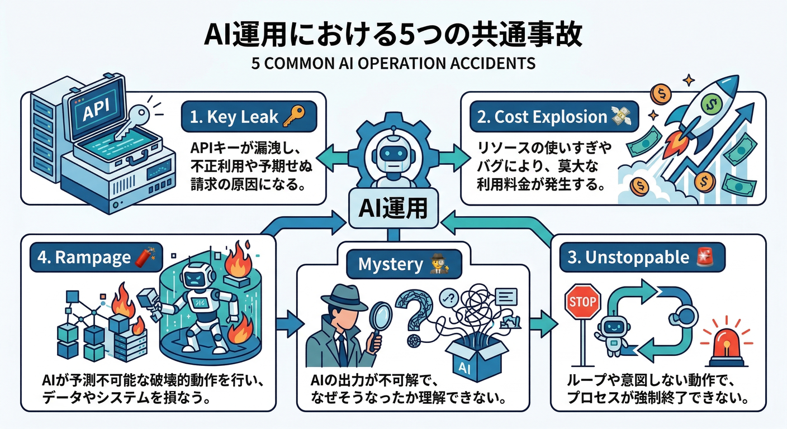
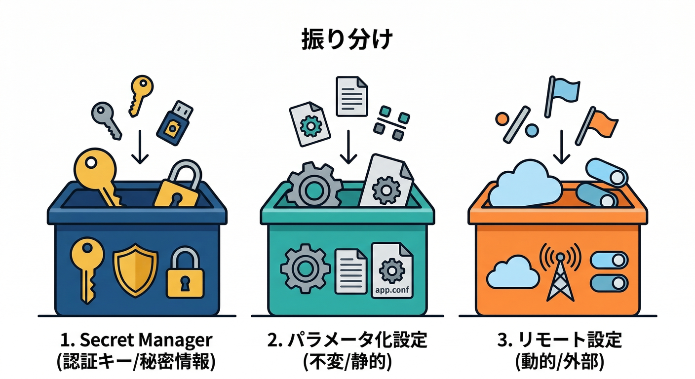
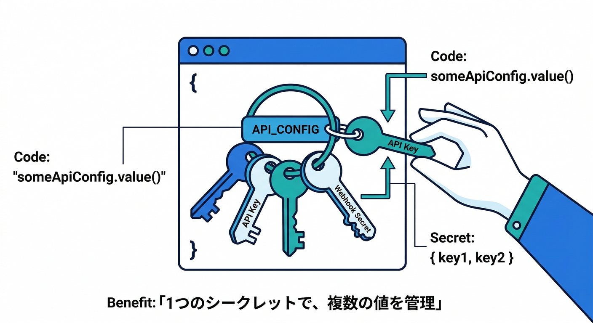
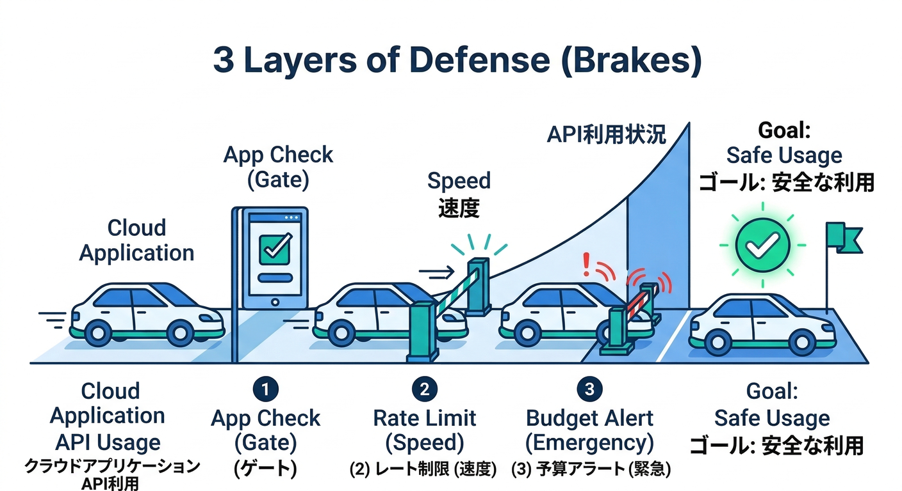
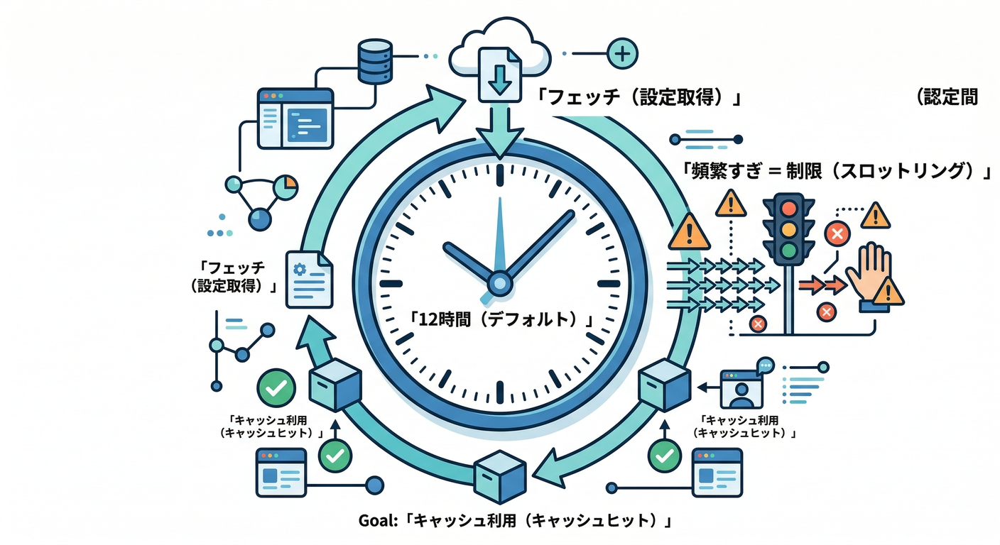
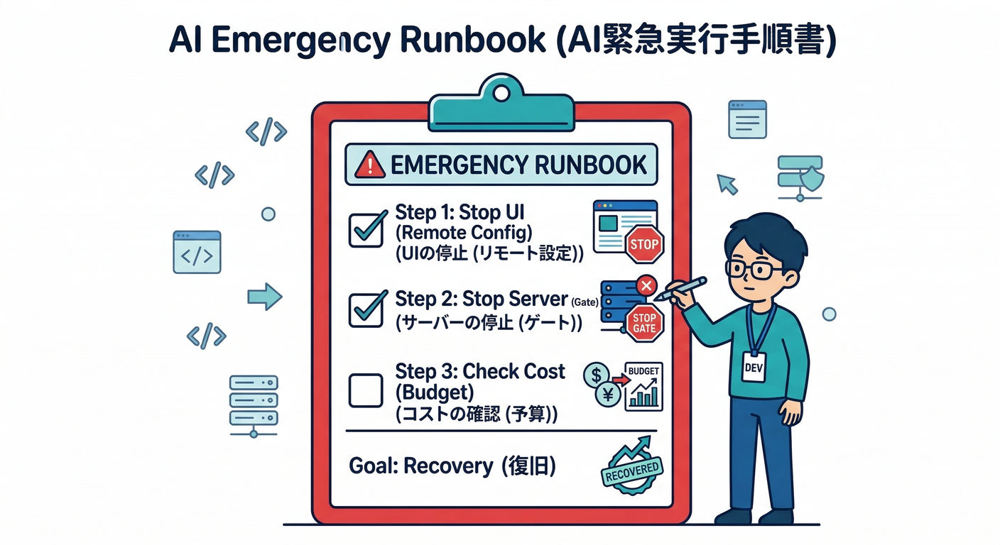

# 第20章：運用の仕上げ「鍵・設定・コスト・停止スイッチ」💸🧯🔒

この章はひとことで言うと、**「AI機能を“事故らせない仕組み”を完成させる回」**です😇✨
AIは便利だけど、運用をなめると **財布🔥・信用🔥・API鍵🔥** が一気に燃えます…！なので、最後に“安全装置”を全部つけます🧰🛡️

---

## この章でできるようになること ✅✨

* **秘密情報（鍵）を安全に置ける**🗝️
* **設定の置き場所を整理できる**（コード／Remote Config／Secrets）🧠
* **使いすぎ・請求事故のブレーキ**を二重化できる🚦
* **停止スイッチ**で「ヤバい！」と思った瞬間にAIを止められる🎛️🧯
* **“最悪の日でも被害を小さくする”手順書（Runbook）**が作れる📋✨

---

## まず知っておく「AI運用の事故パターン」💥😵



1. **鍵が漏れる**（repoに混入／ログに出す／共有しちゃう）🗝️💦
2. **使いすぎ請求**（ボット乱用／誤ループ／想定外トラフィック）💸🔥
3. **止められない**（止め方が“再デプロイしかない”とか）🚨
4. **AIの出力が暴れる**（NG判定の誤爆、文章が攻撃的、炎上ワード）🧨
5. **障害時に誰も状況が追えない**（ログ不足／再現不能）🕵️‍♀️❓

今日のゴールは、これ全部にフタをすることです🧯🧷

---

## 1) 鍵と秘密情報は「Secret Manager」に寄せる 🗝️🔐

Cloud Functions には、**安全な環境設定の仕組み**があります。おすすめは **Parameterized configuration**（型付きでデプロイ時チェック）で、秘密は **Secret Manager** 連携が王道です。([Firebase][1])

## 何をどこに置く？ざっくりルール 🧠📦



* **秘密（APIキー、webhook secret、外部サービスの秘密）** → **Secret Manager**🔐([Firebase][1])
* **秘密じゃない設定（閾値・UIのデフォ）** → Parameterized config or `.env`（ただしGit管理注意）📝([Firebase][1])
* **動的に変えたい（ON/OFF、プロンプト、モデル切替）** → **Remote Config**🎛️([The Firebase Blog][2])

## Secret を作る（CLI）🧰

`firebase functions:secrets:set` で作れます。([Firebase][1])

## TypeScriptで “JSONひとまとめSecret” が超便利 🧾✨



外部API設定が複数あるなら、**`defineJsonSecret()`で1個にまとめる**のが整理しやすいです。([Firebase][1])

```ts
import { onRequest } from "firebase-functions/v2/https";
import { defineJsonSecret } from "firebase-functions/params";

const someApiConfig = defineJsonSecret("SOMEAPI_CONFIG");

export const myApi = onRequest(
  { secrets: [someApiConfig] },
  (req, res) => {
    const { apiKey, webhookSecret, clientId } = someApiConfig.value();
    // ここで apiKey などを利用（ログに出さない！）
    res.send("ok");
  }
);
```

> ✅ ポイント：**“秘密はログに出さない”**（出した瞬間に終了です😇🧨）

---

## 2) `functions.config()` は移行前提で扱う 🧨➡️🔐

昔の `functions.config()` は **非推奨**で、公式ドキュメントでも **移行推奨**が明記されています。デプロイ失敗を避けるために **Secret Manager へ移行**が推されます。([Firebase][1])

さらに、CLIや周辺情報では shutdown の告知が出るケースもあるので、**“先送りしない”が正解**です（早め移行が一番安い）🧯([GitHub][3])

---

## 3) 使いすぎ防止は「3段ブレーキ」🚦🚦🚦



AIは“便利＝呼ばれやすい”ので、**ブレーキは多いほど良い**です😆

## ブレーキ① App Check で “正規アプリ以外” を弾く 🧿🛡️

AI呼び出しは乱用されやすいので、**App Check で不正クライアントをブロック**します。([Firebase][4])

## ブレーキ② Firebase AI Logic のデフォルトレート制限を理解する 🧯

Firebase AI Logic には **ユーザー単位のデフォルト制限（100 RPM / user）** があり、**プロジェクト単位で全アプリ・全IPに効く**点が重要です。([Firebase][5])
ただし、**Gemini側（プロバイダ）の上位制限が優先**されるので、そっちも意識します。([Firebase][5])

## ブレーキ③ 請求事故対策は「予算アラート＋追加ロジック」💸🧯

* **Cloud Billing の budgets / alerts** で、段階アラート（例：50% / 80% / 100% / 150%）を飛ばす📨([Google Cloud Documentation][6])
* さらに踏み込むなら、**Pub/Sub を起点に“追加ロジック”**（Slack通知や機能制限など）を組めます。([Firebase][7])

> ⚠️ 「課金を自動で止める」系は影響範囲がデカいので、まずは **“AI機能だけ止める”** を自動化対象にするのが安全です🎛️🧯

---

## 4) 停止スイッチは「ソフト停止」と「ハード停止」🎛️🧱


停止スイッチは1種類だと不安なので、2つ持ちます😎

## ソフト停止：Remote Config で UI と挙動を止める 🎛️✨



Firebase側でも、Remote Config で **モデル・プロンプト・パラメータ・機能フラグ**を動的に変えられる流れが推されています。([The Firebase Blog][2])

Remote Config（Web）は、**推奨の最小fetch間隔が12時間**（＝むやみに取りに行かない）という基本も押さえます。([Firebase][8])

例：`ai_enabled` が false ならボタンを消す／押しても動かない

```ts
import { getRemoteConfig, fetchAndActivate, getBoolean } from "firebase/remote-config";

const rc = getRemoteConfig(app);

// 例：本番はむやみに短くしない（デフォ推奨は12h）
rc.settings.minimumFetchIntervalMillis = 12 * 60 * 60 * 1000;

await fetchAndActivate(rc);
const aiEnabled = getBoolean(rc, "ai_enabled");

if (!aiEnabled) {
  // AIボタンを非表示 or 無効化
}
```

## ハード停止：サーバー側で“必ず止める”🧱🧯

UIを止めても、古いクライアントや改造クライアントは呼び出してきます😇
なので **Cloud Functions / Genkit 側でも “最終ゲート”** を置きます（ここが本命）🔐

* App Check（不正クライアント排除）🧿([Firebase][4])
* 認証（ユーザー特定）🔐
* レート制御（AI Logicの制限や自前制限）🚦([Firebase][5])
* そして **“AI停止フラグ”**（Remote Config / 別途サーバー設定）🎛️

---

## 5) 「障害が起きたらこれ」Runbook 10行テンプレ 📋🧯



この10行をコピペして、あなたのアプリ用に埋めてください✍️✨

1. 事象：何が起きた？（請求急増 / AI暴走 / エラー増加）
2. まず止める：Remote Config の `ai_enabled=false` 🎛️
3. サーバー最終ゲート：AI呼び出しを一時ブロック（必要なら全ユーザー）🧱
4. App Check：未通過リクエスト増えてない？🧿([Firebase][4])
5. レート：AI Logicの制限に当たってない？（100RPM/user）🚦([Firebase][5])
6. プロバイダ：Gemini側クォータ/障害を確認👀([Firebase][5])
7. 鍵：漏れ疑いがあれば Secret を更新（ローテ）🗝️([Firebase][1])
8. コスト：Budget alert 到達点を確認、通知先へ共有💸([Google Cloud Documentation][6])
9. 原因メモ：いつから・誰が・何をした で時系列📝
10. 再開条件：どこまで直ったらONに戻す？（条件を文章化）✅

---

## 手を動かす 💻✨

## 手順A：秘密情報を Secret Manager へ移す🗝️

* 使ってる外部キーを洗い出し
* `firebase functions:secrets:set` で登録([Firebase][1])
* 関数側で `defineJsonSecret()` などに置き換え([Firebase][1])

## 手順B：停止スイッチを Remote Config で実装🎛️

* `ai_enabled`（bool）を作る
* UIの表示・ボタン活性・呼び出し前ガードに反映
* “押した瞬間に確認する”導線も用意（緊急時に効かせる）🧯

## 手順C：Budget alerts を段階で設定💸

* Cloud Billing budgets & alerts を作る([Google Cloud Documentation][6])
* 余裕があれば Pub/Sub 連動で通知強化（Slack等）([Firebase][7])

---

## ミニ課題 🧩✨

「AIが暴走した想定」で、**停止→原因調査→再開**までの文章を、あなたのRunbookテンプレに沿って **5分で書いてみる**✍️🔥
（書けたら勝ちです。事故は“文章化”で8割防げます😆）

---

## チェック ✅🧠

* [ ] 秘密情報が repo / ログに出ない設計になってる？🔐([Firebase][1])
* [ ] `functions.config()` を使ってたら移行方針ある？🧨([Firebase][9])
* [ ] App Check をAI呼び出しの前提にできてる？🧿([Firebase][4])
* [ ] AI Logic の 100RPM/user と “プロジェクト全体に効く” を理解した？🚦([Firebase][5])
* [ ] Remote Config の停止スイッチが UI と呼び出し前ガードに入ってる？🎛️([The Firebase Blog][2])
* [ ] Budget alerts が段階で飛ぶ？💸([Google Cloud Documentation][6])
* [ ] 「障害が起きたらこれ」が10行で出せる？📋🧯

---

## おまけ：開発AIで“運用ドキュメント作り”を高速化🚀🤖

* **Gemini CLI** は Cloud Shell で追加セットアップなしで使える案内があり、調査・手順書作りに向いてます（ただし提案は必ず人間レビュー！）([Google Cloud Documentation][10])
* **Antigravity** は“ミッション管理”型で、運用タスク（ログ整理・手順書整備・事故想定演習）を小分けにして進めやすいです🛸([Google Codelabs][11])

---

次の一手としては、今作ったRunbookを **第14章のログ設計**や **第15章の評価**とつなげて、**「止める→直す→品質を上げる」**のループを完成させると、実務っぽさが一気に出ますよ🔥🧪📈

[1]: https://firebase.google.com/docs/functions/config-env "Configure your environment  |  Cloud Functions for Firebase"
[2]: https://firebase.blog/posts/2025/11/gemini-3-firebase-ai-logic/?utm_source=chatgpt.com "Bring any idea to life with Gemini 3 and Firebase AI Logic"
[3]: https://github.com/firebase/firebase-tools/issues/8925?utm_source=chatgpt.com "Functions config deprecation warning even though I'm not ..."
[4]: https://firebase.google.com/docs/ai-logic/app-check?utm_source=chatgpt.com "Implement Firebase App Check to protect APIs from ..."
[5]: https://firebase.google.com/docs/ai-logic/quotas?utm_source=chatgpt.com "Rate limits and quotas | Firebase AI Logic - Google"
[6]: https://docs.cloud.google.com/billing/docs/how-to/budgets?utm_source=chatgpt.com "Create, edit, or delete budgets and budget alerts"
[7]: https://firebase.google.com/docs/projects/billing/advanced-billing-alerts-logic?utm_source=chatgpt.com "Set up advanced billing alerts and logic - Firebase - Google"
[8]: https://firebase.google.com/docs/remote-config/web/get-started?utm_source=chatgpt.com "Get started with Remote Config on Web - Firebase"
[9]: https://firebase.google.com/docs/functions/2nd-gen-upgrade?hl=ja&utm_source=chatgpt.com "第 1 世代の Node.js 関数を第 2 世代にアップグレードする"
[10]: https://docs.cloud.google.com/gemini/docs/codeassist/gemini-cli?utm_source=chatgpt.com "Gemini CLI | Gemini for Google Cloud"
[11]: https://codelabs.developers.google.com/getting-started-google-antigravity?utm_source=chatgpt.com "Getting Started with Google Antigravity"
