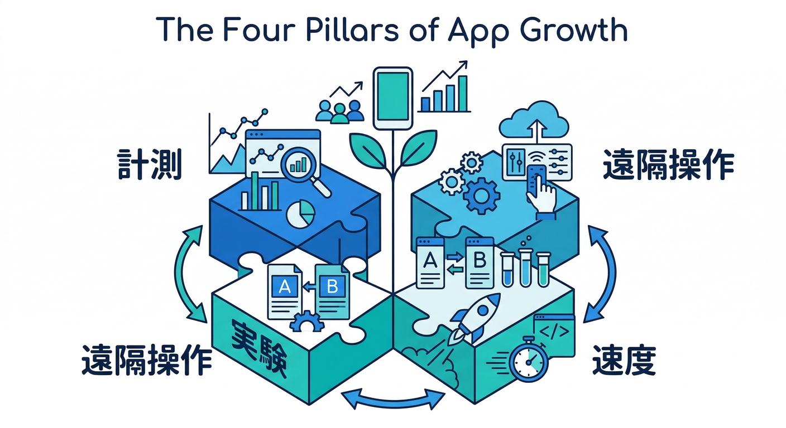
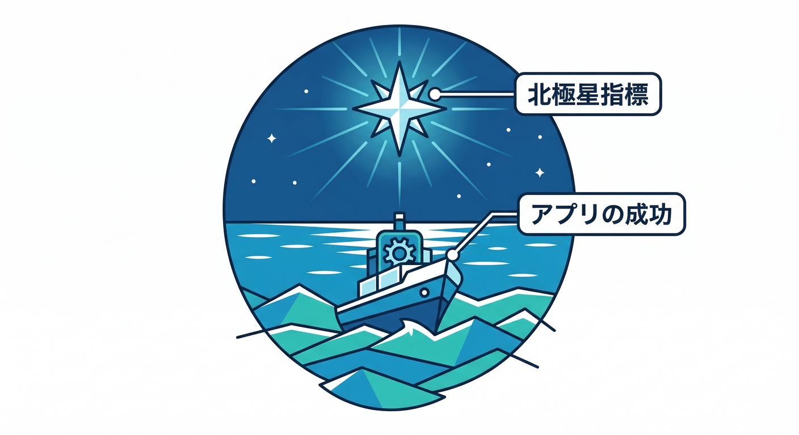
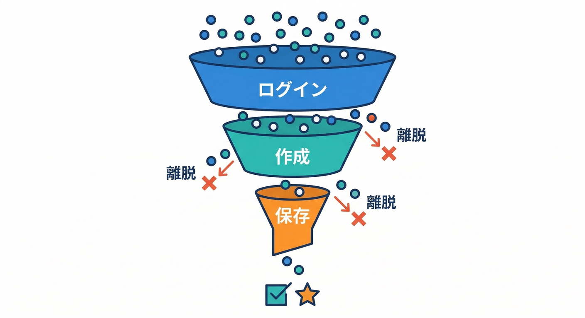
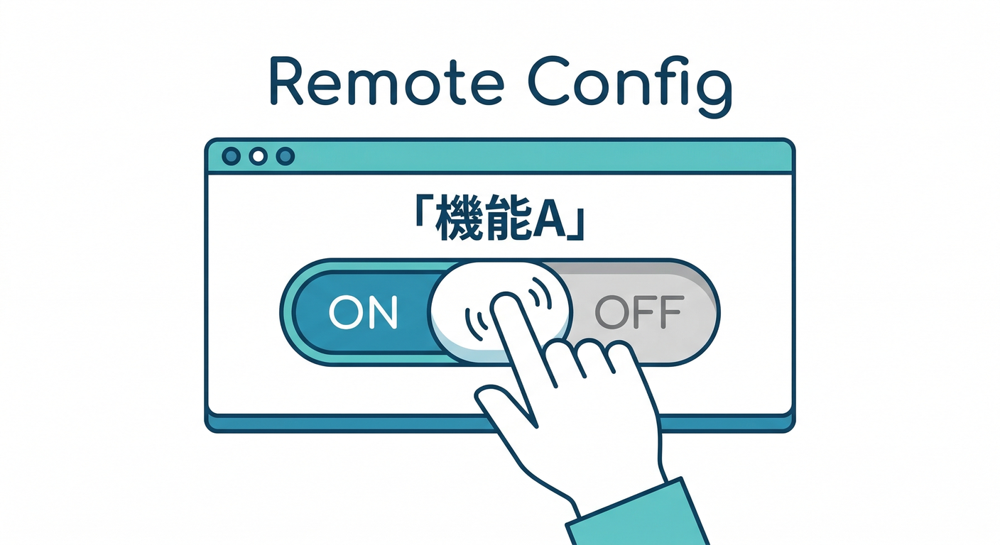
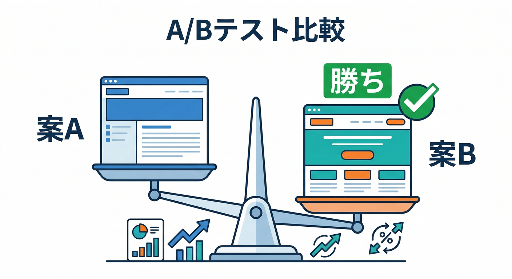
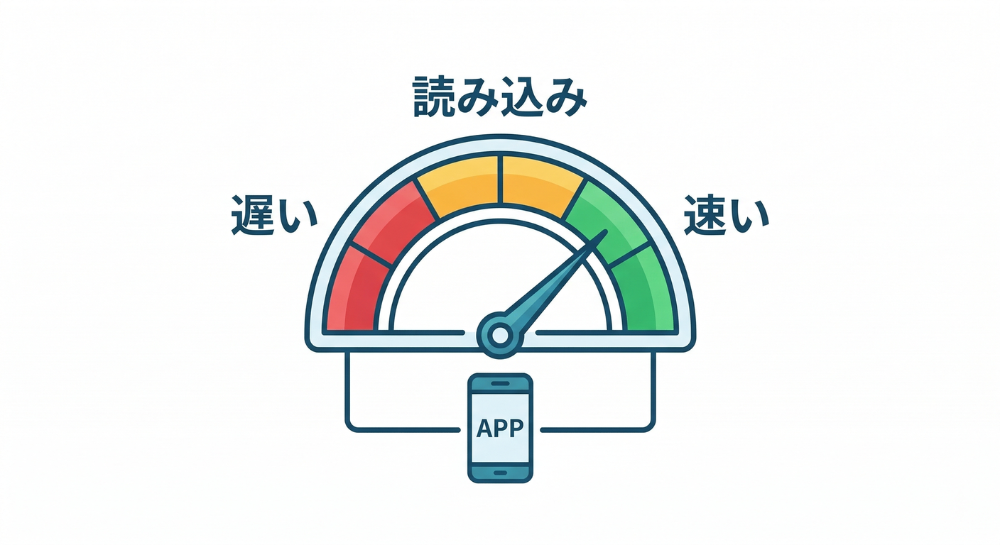
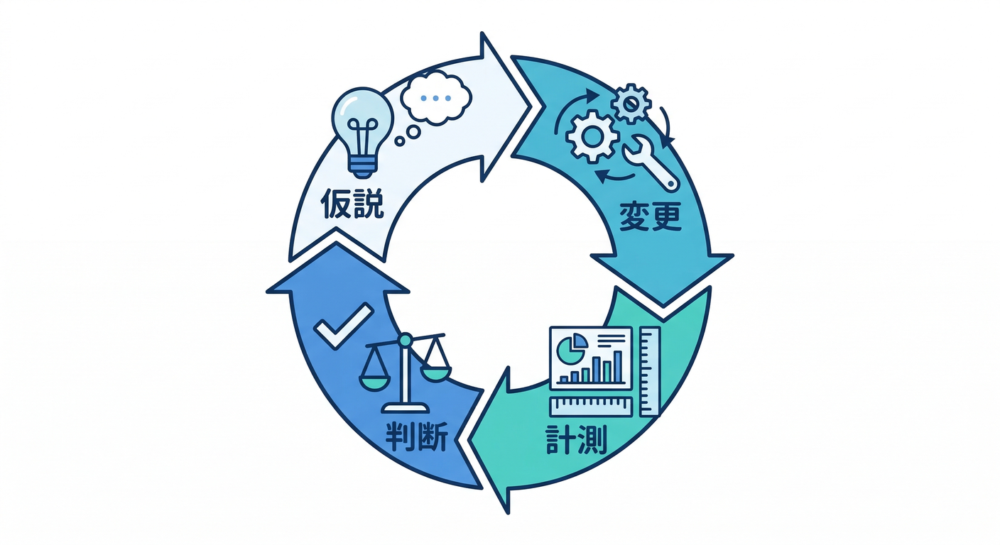

# 計測・改善：Analytics＋Remote Config＋A/B＋Performance📊🔁⚡：20章アウトライン

このカテゴリは「作って終わり」から卒業して、**数字で“育てる”**ための道具（Analytics / Remote Config / A/B / Performance）を、ミニアプリに**順番に後付け**していく回です📊🌱
最後は「改善 → 計測 → 次の改善」を**ぐるぐる回せる**状態にします🔁✨

（公式の土台：([Firebase][1])）

---

## このカテゴリの完成イメージ 🧩🏁



* **Analytics**：ユーザーがどこで詰まったか分かる👀📊（イベント設計ができる）
* **Remote Config**：機能を“段階リリース”できる🎛️🚦（フラグ運用ができる）
* **A/B**：改善案を“勘”じゃなく“比較”できる⚖️🧪（実験→判断ができる）
* **Performance**：遅い原因を“当てずっぽう”じゃなく“証拠”で直せる⚡🛠️

---

## 第1章：なぜ計測するの？「北極星」づくり🌟📌



* 読む：KPI/北極星指標/ガードレール（悪化してはダメな指標）🙂
* 手を動かす：自分のアプリで「成功」を1行で定義✍️
* ミニ課題：「成功=◯◯が◯回/週」みたいに書く📈
* チェック：数字にできてる？（Yes/No）✅

## 第2章：Analyticsの全体像（Google Analytics/GA4）🧠📊

* 読む：FirebaseのAnalyticsはGA4基盤で動く話🙂 ([Firebase][1])
* 手を動かす：ConsoleでAnalyticsの有効化・連携を確認👀
* ミニ課題：既定イベント（自動収集系）が来てるか見る📥
* チェック：リアルタイムで1件でも見えた？✅

## 第3章：イベント設計のコツ（名前・粒度・パラメータ）🧩📝

* 読む：イベント命名の考え方（「動詞_目的語」系）🧠
* 手を動かす：イベント表を作る（5個でOK）🗒️
* ミニ課題：例）`memo_create` / `ai_format_click` などを決める✍️
* チェック：各イベントに「何を知りたい？」が書けてる？✅

## 第4章：Reactでカスタムイベント送信📣🧑‍💻

* 読む：イベント送信（logEvent）の基本🙂 ([Firebase][2])
* 手を動かす：ボタン押下でイベント送信を実装🖱️
* ミニ課題：「保存ボタン」押したらイベント1件送る📤
* チェック：DebugView/Realtimeで確認できた？✅

例（イメージ）👇（APIの詳細は公式へ）([Firebase][2])

```typescript
import { getAnalytics, logEvent } from "firebase/analytics";

const analytics = getAnalytics();
logEvent(analytics, "memo_create", { screen: "memo", method: "button" });
```

## 第5章：ユーザープロパティで“層”を見る👥🔎

* 読む：ユーザープロパティ＝属性で絞れるやつ🙂 ([Firebase][2])
* 手を動かす：例）`plan` / `role` / `has_avatar` を1つ付ける🏷️
* ミニ課題：「初回ユーザーだけ」みたいな切り口を作る🧠
* チェック：セグメントで切れそう？✅

## 第6章：ファネル（どこで離脱？）の発想🚪➡️🏁



* 読む：導線＝「1→2→3」で落ちる場所がある🙂
* 手を動かす：ログイン→作成→保存 の3段ファネルを書く✍️
* ミニ課題：各段にイベントを対応づける🧩
* チェック：離脱ポイントを説明できる？✅

## 第7章：計測の品質チェック（デバッグの基本）🧯👀

* 読む：イベントは“間違って送る”のが一番こわい😇
* 手を動かす：イベント名/パラメータの表記ゆれを直す🧹
* ミニ課題：`memo_create` と `memo_created` が混ざってない？確認🔍
* チェック：イベント表と実装が一致した？✅

---

## 第8章：Remote Configの全体像（機能フラグ）🎛️🚦



* 読む：Remote Config＝「アプリの挙動を後から変える」🙂 ([Firebase][3])
* 手を動かす：フラグ案を3つ作る（例：AIボタン表示）🧩
* ミニ課題：`enable_ai_format` を作る✍️
* チェック：ON/OFFでUIが変わる設計になってる？✅

## 第9章：WebでRemote Config導入（取得→反映）🛠️📦

* 読む：Web SDKでの導入・基本フロー🙂 ([Firebase][4])
* 手を動かす：起動時に `fetchAndActivate` を入れる🚀
* ミニ課題：フラグでボタンの表示/非表示を切り替え🎚️
* チェック：Consoleで値を変えたら画面が変わった？✅

イメージ👇（設定の要点は公式の手順に合わせる）([Firebase][4])

```typescript
import { getRemoteConfig, fetchAndActivate, getValue } from "firebase/remote-config";

const rc = getRemoteConfig(app);
// 開発中は短くしてOK（本番は控えめに）※公式に目安あり
await fetchAndActivate(rc);

const enabled = getValue(rc, "enable_ai_format").asBoolean();
```

## 第10章：配布の作法（フェッチ間隔・段階リリース）🧠🚦

* 読む：本番で頻繁に取りに行きすぎない考え方🙂 ([Firebase][4])
* 手を動かす：開発/本番で “取り方” を分ける設計にする🔁
* ミニ課題：起動時だけ取得、あとはキャッシュに任せる🗃️
* チェック：ムダに連打してない？✅

## 第11章：条件付き配布（ユーザー別に出し分け）👥🎛️

* 読む：条件（Condition）の考え方🙂 ([Firebase][5])
* 手を動かす：例）「新規だけON」「管理者だけON」など作る👮‍♂️
* ミニ課題：新規ユーザーにだけ新UIを出す🚀
* チェック：狙った人だけ変わる？✅

## 第12章：Remote Configで“AIを安全に運用”する🤖🛡️

* 読む：AIは便利だけど「回数・コスト・暴走」対策が要る🙂 ([Firebase][6])
* 手を動かす：`ai_daily_limit` / `ai_prompt_variant` を作る🎛️
* ミニ課題：上限超えたらボタンを無効化（優しいメッセージ）🙂
* チェック：制御できてる？✅

---

## 第13章：A/Bテストの基本（仮説→実験→判断）🧪⚖️



* 読む：A/Bは「勝つか負けるか」を決める仕組み🙂 ([Firebase][7])
* 手を動かす：仮説を1つ書く（例：文言を変えると保存率↑）✍️
* ミニ課題：「何を変える？」「何で勝ち負け？」を決める📊
* チェック：勝敗が数字で言える？✅

## 第14章：Remote Config Experiments（A/B）を作る🎛️🧪

* 読む：Remote ConfigのExperimentでA/Bする流れ🙂 ([Firebase][7])
* 手を動かす：`cta_copy` を A/B で出し分け🗣️
* ミニ課題：A:「保存する」 B:「メモを残す」みたいに変える✍️
* チェック：端末ごとに固定されて見える？✅

※A/BはWebでも使えるけど、**仕組みとしてFirebase Installations（FID）**が関わるので、公式の注意点は必ず読むのがおすすめです👀 ([Firebase][7])

## 第15章：結果の読み方（“統計”をやさしく）📈🙂

* 読む：有意差っぽい話を「雰囲気で」理解する🙂
* 手を動かす：勝ち/負け/保留を判断するルールを作る⚖️
* ミニ課題：「期間」「最低サンプル」「ガードレール悪化なら中止」🧯
* チェック：止めどきが決まってる？✅

## 第16章：サーバー側もからめる（計測/制御の“裏側”）⚙️📦

* 読む：フロントだけじゃ取れない/守れないケース🙂
* 手を動かす：どの処理をサーバー側に置くか仕分け🧠
* ミニ課題：例）「不正っぽい連打を検知→制限」案を作る🛡️
* チェック：責務が分かれた？✅

ここで“バージョン感”も押さえる（後で詰まらないため）📌

* Cloud Functions for Firebase：Node.js **22/20**（18はdeprecated）([Firebase][8])
* 同じく Python も選べる（例：`python310` / `python311`）([Firebase][8])
* もっと自由度が欲しい時の Cloud Run functions：.NET **10** / Python **3.13** などが選べる([Google Cloud Documentation][9])

---

## 第17章：Performance Monitoring導入（遅いを“見える化”）⚡👀



* 読む：Performance Monitoringで分かること🙂 ([Firebase][10])
* 手を動かす：Web SDKを入れて計測開始🏁
* ミニ課題：まずは “ページ読み込み” を眺める📊
* チェック：ダッシュボードにデータが出た？✅

## 第18章：遅い原因の当たりをつける（画面/通信）🕵️‍♂️🌐

* 読む：遅さは「初回表示」「API」「画像」あたりが多い🙂
* 手を動かす：ネットワーク/ページロード指標を確認👀
* ミニ課題：遅いページTOP1を特定する🏆😇
* チェック：改善対象が“1つ”に絞れた？✅

## 第19章：カスタムトレースで“証拠”を取る🧾⚡

* 読む：自分の処理（例：AI整形）を計測できる🙂 ([Firebase][11])
* 手を動かす：`ai_format` の処理にカスタムトレースを入れる🧩
* ミニ課題：AI処理の前後で時間を測ってみる⏱️
* チェック：改善前/後で数字が変わった？✅

## 第20章：改善サイクル完成（AIも使って回す）🔁🤖🏁



* 読む：「仮説→変更→計測→判断→次へ」の型🙂
* 手を動かす：①イベント追加→②フラグで段階ON→③A/B→④性能改善 を一周回す🚴‍♀️✨
* ミニ課題：Geminiに“改善案のたたき台”を出させて、人間が採用判断する🤝

  * Gemini CLI：調査・実装案・テスト案の生成に使える💻 ([Google for Developers][12])
  * コンソール側の支援：Gemini in Firebaseでトラブルシュートの補助🧯 ([Firebase][13])
  * Antigravity：エージェントで「イベント表→実装→確認」まで一気に進めやすい🛸 ([Google Codelabs][14])
* チェック：最終的に「数字で良くなった」が言えた？✅🎉

---

## ついでに覚えると強い“小ワナ回避”🧯

* 「環境変数でフラグ運用したくなる」問題 → **Remote Config**が本職🎛️（Functionsの古い `functions.config` は移行推奨の流れがあるので、使い分けが安全🛡️）([Firebase][15])
* Performanceは「入れたけど見ない」が多い → **“見る曜日”を決める**と勝ちやすい📅🙂 ([Firebase][16])

---

必要なら次のステップとして、この20章をさらに「各章10〜20分の本文（読み物＋手順＋よくあるミス＋小テスト）」まで一気に“教科書化”できます📚✨
どのミニアプリ（ToDo/メモ/画像/AI整形）をベースに、イベント例を最適化して書くのが一番しっくり来そう？😆

[1]: https://firebase.google.com/docs/analytics?utm_source=chatgpt.com "Google Analytics for - Firebase"
[2]: https://firebase.google.com/docs/analytics/events?utm_source=chatgpt.com "Log events | Google Analytics for Firebase"
[3]: https://firebase.google.com/docs/remote-config?utm_source=chatgpt.com "Firebase Remote Config - Google"
[4]: https://firebase.google.com/docs/remote-config/web/get-started?utm_source=chatgpt.com "Get started with Remote Config on Web - Firebase"
[5]: https://firebase.google.com/docs/remote-config/condition-reference?utm_source=chatgpt.com "Remote Config conditional expression reference - Firebase"
[6]: https://firebase.google.com/docs/ai-logic?utm_source=chatgpt.com "Gemini API using Firebase AI Logic - Google"
[7]: https://firebase.google.com/docs/ab-testing?utm_source=chatgpt.com "Firebase A/B Testing - Google"
[8]: https://firebase.google.com/docs/functions/manage-functions "Manage functions  |  Cloud Functions for Firebase"
[9]: https://docs.cloud.google.com/functions/docs/runtime-support "Runtime support  |  Cloud Run functions  |  Google Cloud Documentation"
[10]: https://firebase.google.com/docs/perf-mon/get-started-web?utm_source=chatgpt.com "Get started with Performance Monitoring for web - Firebase"
[11]: https://firebase.google.com/docs/perf-mon/custom-code-traces?utm_source=chatgpt.com "Add custom monitoring for specific app code - Firebase - Google"
[12]: https://developers.google.com/gemini-code-assist/docs/gemini-cli?hl=ja&utm_source=chatgpt.com "Gemini CLI | Gemini Code Assist"
[13]: https://firebase.google.com/docs/ai-assistance/overview?hl=ja&utm_source=chatgpt.com "AI アシスタンスを使用して開発する | Develop with AI assistance"
[14]: https://codelabs.developers.google.com/getting-started-google-antigravity?utm_source=chatgpt.com "Getting Started with Google Antigravity"
[15]: https://firebase.google.com/docs/functions/config-env?utm_source=chatgpt.com "Configure your environment | Cloud Functions for Firebase"
[16]: https://firebase.google.com/docs/perf-mon?utm_source=chatgpt.com "Firebase Performance Monitoring - Google"
