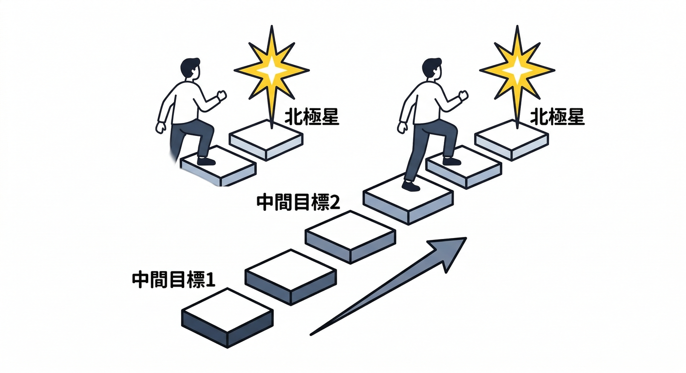
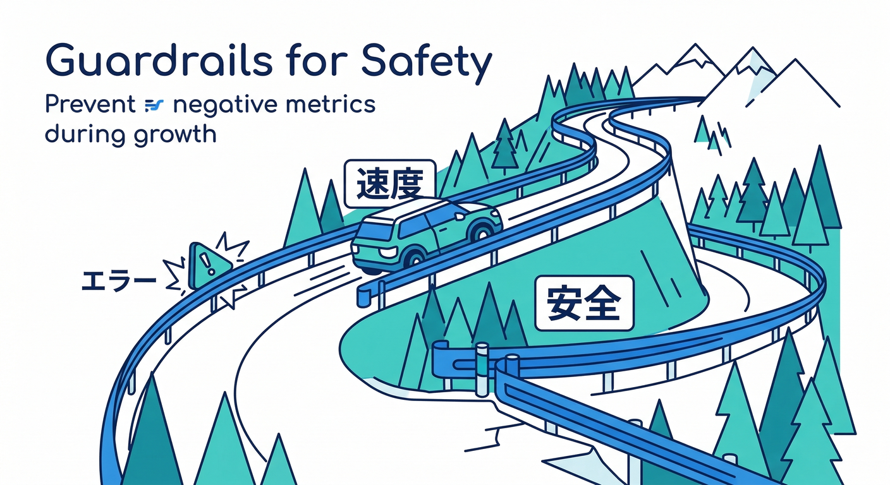
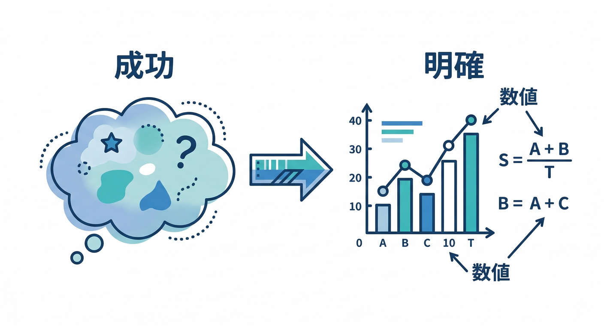
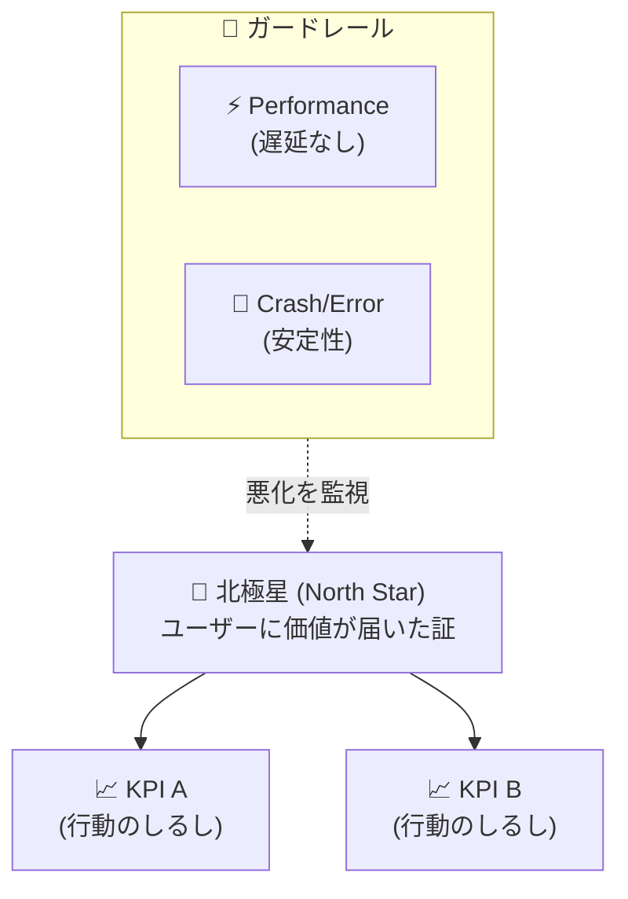
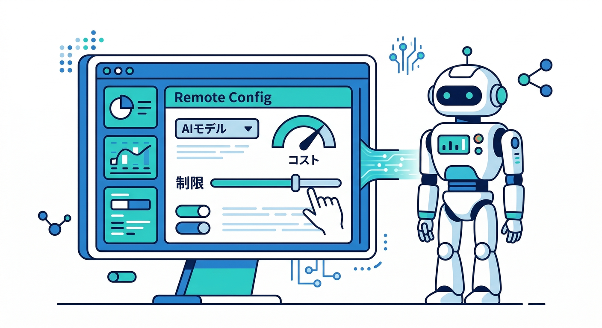
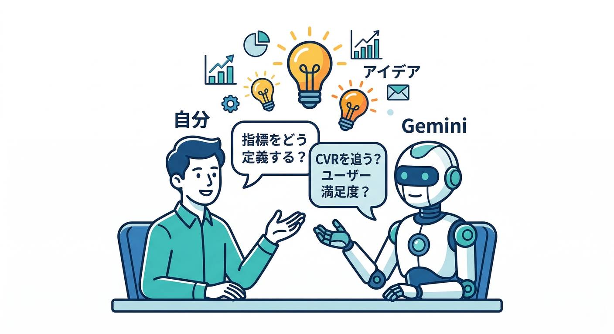

# 第01章：なぜ計測するの？「北極星」づくり🌟📌

この章は、まだ何も計測してなくてOKです🙆‍♂️✨
まずは **「このアプリ、成功って何？」** を “1行” で言えるようにします✍️
それができると、あとで Analytics / Remote Config / A/B / Performance を入れたときに、迷子になりません🧭😊

---

## 1) 「作って終わり」だと起きがちな悲劇🥲📉

アプリって、ちゃんと動いてても…

* どこでユーザーが詰まってるか分からない🙈
* 良くしたつもりが、逆に悪化してるかも分からない😱
* AI機能を入れると、コスト/暴走/品質の調整が勘になりがち🤖💸

…になりやすいです。

そこで必要なのが **“北極星（North Star）”** 🌟
たった1つの数字（または率）で「今、良くなってる？」を判断する軸です🧠✨

---

## 2) 今日覚える3語だけ🧩📚

## ✅ 北極星（North Star）

**「このアプリの価値がユーザーに届いた証拠」** になる指標🌟
例）

* メモアプリ：**保存できたメモ数/週** 📝
* 画像アプリ：**アップロード完了数/週** 🖼️
* AI整形：**AI整形完了数/週** 🤖✨

## ✅ KPI

北極星を増やすための **中間指標**（改善の手がかり）📈
例）「保存ボタン押下率」「編集開始率」など👆

## ✅ ガードレール（悪化したらダメな指標）🚧

北極星が上がっても、これが悪化したら“勝ちじゃない”やつ😇
例）

* 遅くなってない？（Performance で見るやつ⚡） ([Firebase][1])
* エラー増えてない？（将来 Crashlytics も絡む）
* AIの使いすぎでコスト爆発してない？💸🤖（Remote Config で制御しやすい🎛️）

---

## 3) 「成功」を1行で定義しよう✍️🌟（手を動かす）

ここがこの章のメインです🔥
次のテンプレで **1行だけ** 書きます。

**テンプレ（コピペOK）👇**

* 成功 = 「◯◯が◯回/週」
* 成功 = 「◯◯率が◯%以上」
* 成功 = 「◯◯まで到達したユーザーが◯人/日」

**例（ミニアプリっぽく）👇**

* 成功 = 「メモ保存が 30回/週」📝
* 成功 = 「AI整形完了が 10回/日」🤖
* 成功 = 「画像アップロード完了率が 70% 以上」🖼️

ポイントはこれだけ👇

* “気持ち”じゃなくて **数にする**📊
* “やった感”じゃなくて **価値が届いた証拠** にする🌟

---

## 4) 「北極星 → KPI → ガードレール」を1セット作る🧠🔁

次のミニ表を埋めます（紙でもメモでもOK）🗒️✨
※まだ実装しません。設計だけです😊

| 種類       | あなたのアプリだと何？ | 例                       |
| -------- | ----------- | ----------------------- |
| 北極星🌟    | （1つ）        | AI整形完了数/日               |
| KPI📈    | （2〜3個）      | 整形ボタン押下率 / 整形成功率        |
| ガードレール🚧 | （1〜2個）      | ページ表示が遅くならない / エラーが増えない |

ここまでできたら、次章以降で **イベント（行動ログ）** を送って、レポートで見える化していきます📥👀
Analyticsはイベントを記録して、アプリ内で何が起きたかを見られるようにします📊 ([Firebase][2])
そして実装が正しいかは DebugView で“ほぼリアルタイム”に確認できます🧯👀 ([Firebase][3])

---

## 5) AI機能があるアプリは「制御できる設計」が命🎛️🤖🛡️

AIは便利だけど、リリース後にこういう調整が絶対来ます👇

* モデル変えたい（品質/料金/速度）
* 生成設定（温度/最大トークン）変えたい
* 1日の利用回数を制限したい（コスト防止）
* “危ないプロンプト”を抑えたい

これを **アプリ更新なしで** 調整しやすくするのが Remote Config の得意技です🎛️✨
実際に「Firebase AI Logic と Remote Config を組み合わせて、モデル名などを動的に切り替える」ガイドもあります📘 ([Firebase][4])
（重要：Remote Config の値は“ユーザー側から見える可能性がある”ので、機密は入れない⚠️ という注意も書かれています） ([Firebase][4])

さらに、AIの世界はモデルの入れ替わりが起きます。たとえば Firebase AI Logic のドキュメントには **特定モデルが 2026-03-31 に退役予定** といった注意が明記されています📌 ([Firebase][5])
だからこそ、**計測して→影響を見て→安全に切り替える** が強いです💪🤖

---

## 6) Gemini活用コーナー🧠✨（超おすすめ）

「北極星って何がいい？」って、最初は迷います😵‍💫
そこで **Gemini CLI** や コンソールの **Gemini in Firebase** に壁打ちします💬

* Gemini in Firebase：コンソール内で開発・デバッグの補助をしてくれるAI相棒🤝 ([Firebase][6])
* Gemini CLI：ターミナルで使えるAIエージェント（ハンズオン教材も更新されています）💻 ([Google Codelabs][7])

**投げると強い質問例👇（そのままコピペでOK）**

* 「メモ＋画像＋AI整形アプリの北極星候補を3つ。理由も短く。」
* 「北極星を増やすためのKPIを5つ。実装しやすい順に。」
* 「ガードレール指標を2つ。Performanceで見やすいもの中心で。」 ([Firebase][1])
* 「A/Bテストに向く“UI文言”の案を5つ。勝敗の測り方も。」 ([Firebase][8])

---

## ミニ課題🧪✍️

次の形で、あなたのアプリ版を完成させてください👇

1. 成功 = 「＿＿＿＿＿＿」（1行）🌟
2. 北極星：＿＿＿＿＿＿（1つ）🌟
3. KPI：＿＿＿＿＿＿、＿＿＿＿＿＿（2〜3個）📈
4. ガードレール：＿＿＿＿＿＿（1〜2個）🚧

---

## チェック✅

* [ ] 北極星が **数** になってる？（気持ちじゃない）📊
* [ ] 北極星が **価値が届いた証拠** になってる？🌟
* [ ] ガードレールがある？（暴走防止）🚧
* [ ] AIが絡むなら「後から制御できる」発想が入ってる？🎛️🤖 ([Firebase][4])

---

次の第2章では、Analytics（Google Analytics）側の全体像をつかんで、「どこで数字を見るの？」をサクッと押さえます📊👀 ([Firebase][9])

[1]: https://firebase.google.com/docs/perf-mon?utm_source=chatgpt.com "Firebase Performance Monitoring - Google"
[2]: https://firebase.google.com/docs/analytics/events?utm_source=chatgpt.com "Log events | Google Analytics for Firebase"
[3]: https://firebase.google.com/docs/analytics/debugview?utm_source=chatgpt.com "Debug events | Google Analytics for Firebase"
[4]: https://firebase.google.com/docs/remote-config/solutions/vertexai?utm_source=chatgpt.com "Dynamically update your Firebase AI Logic app with ... - Google"
[5]: https://firebase.google.com/docs/ai-logic?utm_source=chatgpt.com "Gemini API using Firebase AI Logic - Google"
[6]: https://firebase.google.com/docs/ai-assistance/gemini-in-firebase?utm_source=chatgpt.com "Gemini in Firebase - Google"
[7]: https://codelabs.developers.google.com/gemini-cli-hands-on?utm_source=chatgpt.com "Hands-on with Gemini CLI"
[8]: https://firebase.google.com/docs/ab-testing?utm_source=chatgpt.com "Firebase A/B Testing - Google"
[9]: https://firebase.google.com/docs/analytics?utm_source=chatgpt.com "Google Analytics for - Firebase"
