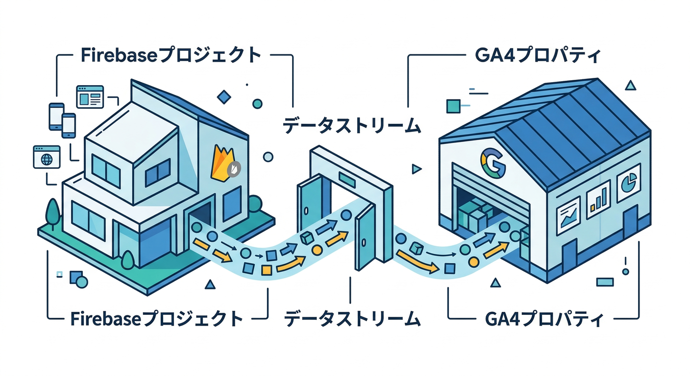
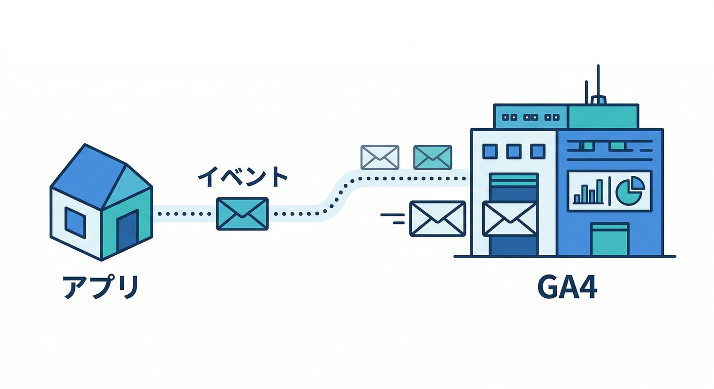
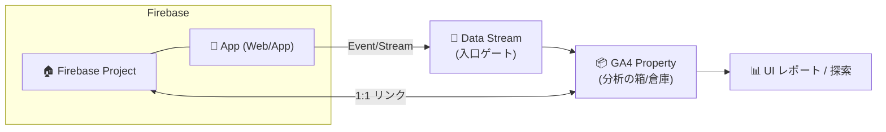
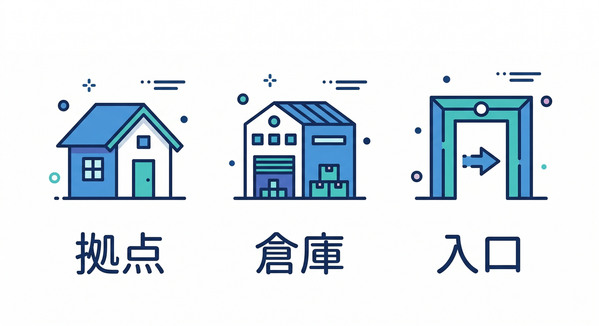
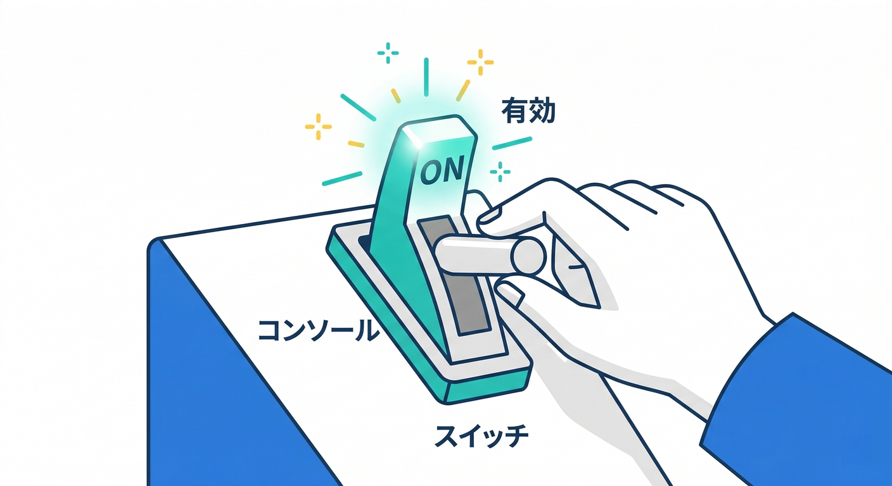
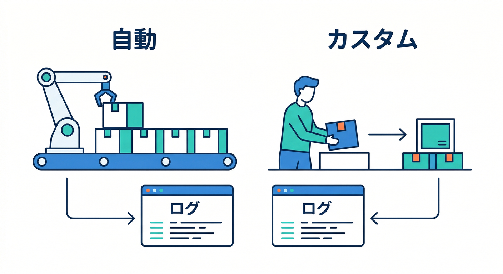
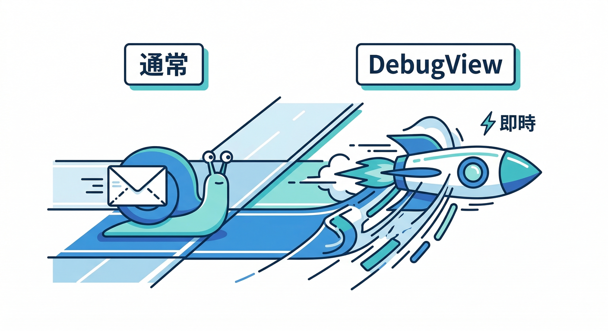
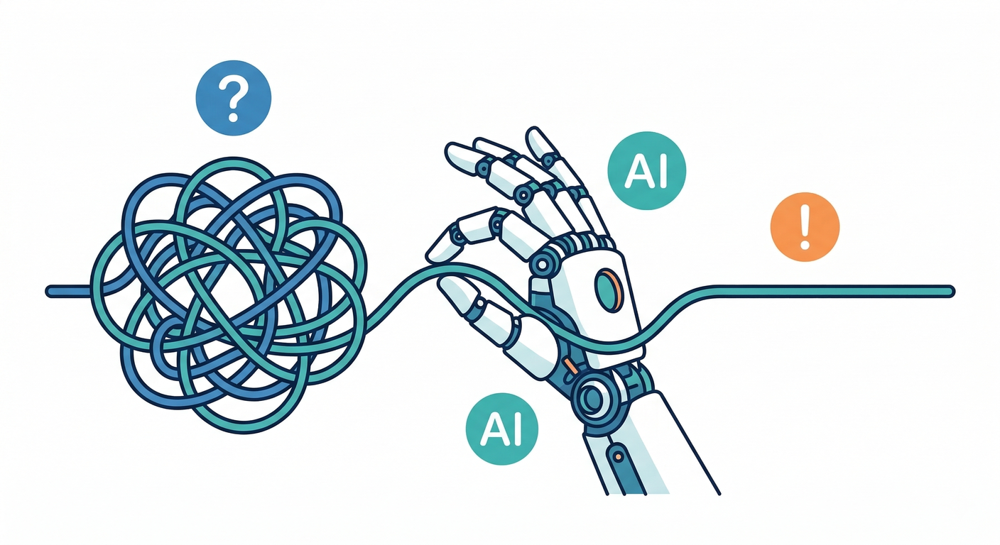

# 第02章：Analyticsの全体像（Google Analytics/GA4）🧠📊

この章は「**FirebaseのAnalyticsって、結局なに？どこに集まって、どこで見るの？**」をスッキリさせる回です🧩✨
（ここを曖昧にしたまま進むと、あとで **“見えてると思ったら見えてない”** が起きがち😇）

---

## この章でできるようになること ✅🎯

* FirebaseのAnalyticsが **GA4（Google Analytics 4）基盤**で動くことを説明できる🗣️📊 ([Firebase][1])
* 「Firebaseプロジェクト」「GA4プロパティ」「データストリーム」の関係が分かる🧠🔗 ([Firebase][2])
* Consoleで **有効化＆リンク確認**できる👀✅ ([Firebase][2])
* まずは **既定（自動）イベント**が来てるかを確認できる📥✨ ([Firebase][3])
* “早く確かめたい”ときは **DebugView**でほぼリアルタイムに追える🕵️‍♂️⚡ ([Firebase][4])

---

## まずは全体図 🗺️✨（ここが今日のメイン）

イメージはこれです👇

* **Firebaseのアプリ（Web/Android/iOS）**が
* 「ユーザーが何をしたか」の**イベント**を投げる📨
* そのイベントは **GA4の“データストリーム”**に入って🌊
* 最終的に **GA4プロパティ**という“分析の箱”にたまる📦📊 ([Firebase][2])

しかも重要ポイント👇

* **Firebaseプロジェクト ↔ GA4プロパティは “基本1対1”**（1つのFirebaseプロジェクトの全アプリが、同じGA4プロパティに送る）📌 ([Google ヘルプ][5])

---

## 用語を3つだけ覚えよう 🧠📚（超ざっくりでOK）

| 用語             | たとえ         | 何がうれしい？                           |
| -------------- | ----------- | --------------------------------- |
| Firebaseプロジェクト | “アプリの拠点”🏠  | Auth/Firestore/Hostingなども全部ここに紐づく |
| GA4プロパティ       | “分析の倉庫”🏢📊 | イベントが集まってレポートになる                  |
| データストリーム       | “入口ゲート”🚪🌊 | Web/Android/iOSそれぞれの入口がある         |

Firebase側でAnalyticsを有効化すると、Webアプリは **GA4のデータストリームにリンク**されます🔗 ([Firebase][2])

---

## 手を動かす：Consoleで有効化＆リンク確認 👀🛠️

## 1) まず「Analyticsが有効になってる？」を確認 ✅

* 既存プロジェクトなら、Firebase Console の **Project settings → Integrations** から **Google Analyticsを有効化**できます🎛️ ([Firebase][2])

> ここがOFFだと、いくら頑張ってもイベントは届きません🙃

---

## 2) 「ちゃんとGA4プロパティに繋がってる？」を確認 🔗📊

GA4側でもリンク状態が見れます👀

* GA4の **Admin（管理）→ Product links → Firebase links** に、該当Firebaseプロジェクトが出ていればOKです✅ ([Google ヘルプ][5])

ついでに嬉しい小ネタ👇

* リンクすると、Firebaseプロジェクトのユーザー権限に応じて、Analytics側のロールも自動で付与されます👥🔐（チーム開発で地味に助かる） ([Google ヘルプ][5])

---

## 3) Web（React）で「measurementId」が取れてるかチェック 🧪

WebでAnalyticsを動かすには、Firebase設定に **measurementId** が必要です📌 ([Firebase][2])
さらに：

* Firebase JS SDK **v7.20.0以降**は、初期化時にmeasurementIdを動的に取ってくるので、設定に無くても“保険的に”動く場合があります（ただしフォールバックとして入れておくのもアリ）🧯 ([Firebase][2])

---

## 「既定イベント」ってなに？ 🤔📥（まずはこれが届けば勝ち！）

Analyticsは、**いくつかのイベントを自動で記録**してくれます✨
そして足りない分は、こちらで **カスタムイベント**を追加していく感じです🧩

* 自動で記録されるイベントがある（＝最初から0になりにくい）🧠 ([Firebase][3])
* カスタムイベントは **最大500種類**まで（名前は大文字小文字を区別するので注意！）😇 ([Firebase][3])

---

## “今すぐ見たい！”なら DebugView が最強 🕵️‍♂️⚡

通常、イベントは**だいたい1時間くらいでまとめて送られる**ことがあり（バッテリーや通信のため）🔋📶 ([Firebase][4])
なので開発中は **DebugView** が便利です✨

## WebでDebugViewを使う（超カンタン）🧩

* ブラウザでDebugモードにするには、**Chrome拡張「Google Analytics Debugger」**を入れて有効化 → ページ更新🔄
* その状態で操作すると、DebugViewにイベントが流れます📺✨ ([Firebase][4])

さらに大事な注意👇

* **Debugモード中のイベントは、通常の集計や日次BigQueryエクスポートに含まれない**（テストで本番数値を汚さないため）🧼🧯 ([Firebase][4])

---

## よくある詰まりポイント集 🧯😵‍💫（ここだけ見れば救われる）

* **Analyticsが有効化されてない** → そもそも入口が無い🚪❌ ([Firebase][2])
* **Webの設定にmeasurementIdが無い/初期化してない** → イベントが飛ばない📡❌ ([Firebase][2])
* **通常レポートに出ない！** → まずDebugViewで確認（通常はまとめ送信がある）🕵️‍♂️ ([Firebase][4])
* **広告ブロッカー等で計測が阻害** → DebugViewでも怪しいときは一旦OFFで切り分け🧪（現象としてよくあるやつ）

---

## AIで爆速に理解＆切り分け 🤖⚡（ここ、今どきの勝ち筋）

## 1) ConsoleのGeminiで「今なにが起きてる？」を日本語で聞く 🗣️💡

Firebase Console内の **Gemini in Firebase** は、自然文で質問→該当ドキュメントへの誘導もしてくれます📎✨ ([Firebase][6])
例）

* 「Analyticsが有効になってるか、どこで確認する？」
* 「DebugViewが出ないときのチェック項目は？」

## 2) 端末側（コードや設定）まで踏み込むなら Gemini CLI 💻🧠

Gemini CLI はターミナルで使えるエージェントで、調査・修正案・テスト案まで出してくれます🛠️ ([Google for Developers][7])

## 3) “流れ作業”をエージェントに任せるなら Antigravity 🛸📋

複数エージェントで「調べる→直す→検証する」を回しやすい、エージェント志向の開発環境です🚀 ([Google Codelabs][8])

（このカテゴリ後半で Remote Config / A/B をやると、AI機能の段階リリースも絡むので、ここでAI補助に慣れておくと強いです🤝）

---

## ミニ課題 🧩✍️（5〜10分）

1. Firebase Consoleで、プロジェクトの **Analytics有効化＆リンク状態**を確認する✅ ([Firebase][2])
2. Chrome拡張でDebugモードにして、アプリを1回触る🖱️🔄 ([Firebase][4])
3. DebugViewで **イベントが1件でも流れた**のを確認する📺✅ ([Firebase][4])

---

## チェック ✅✅✅

* GA4側で Firebase links が確認できた？🔗 ([Google ヘルプ][5])
* DebugViewでイベントが見えた？👀 ([Firebase][4])
* 「Firebase → データストリーム → GA4プロパティ」の流れを、口で説明できる？🗣️📊 ([Firebase][2])

---

次の第3章は、ここで見えるようになったイベントを「**どういう名前で、どの粒度で、何をパラメータにするか**」を決めて、計測が“育つ”状態にしていきます🧩📝🌱

[1]: https://firebase.google.com/docs/analytics "Google Analytics for Firebase"
[2]: https://firebase.google.com/docs/analytics/get-started "Get started with Google Analytics  |  Google Analytics for Firebase"
[3]: https://firebase.google.com/docs/analytics/events "Log events  |  Google Analytics for Firebase"
[4]: https://firebase.google.com/docs/analytics/debugview "Debug events  |  Google Analytics for Firebase"
[5]: https://support.google.com/analytics/answer/9289234?hl=en "Connect Firebase to Google Analytics - Analytics Help"
[6]: https://firebase.google.com/docs/ai-assistance/gemini-in-firebase "Gemini in Firebase"
[7]: https://developers.google.com/gemini-code-assist/docs/gemini-cli "Gemini CLI  |  Gemini Code Assist  |  Google for Developers"
[8]: https://codelabs.developers.google.com/getting-started-google-antigravity "Getting Started with Google Antigravity  |  Google Codelabs"
