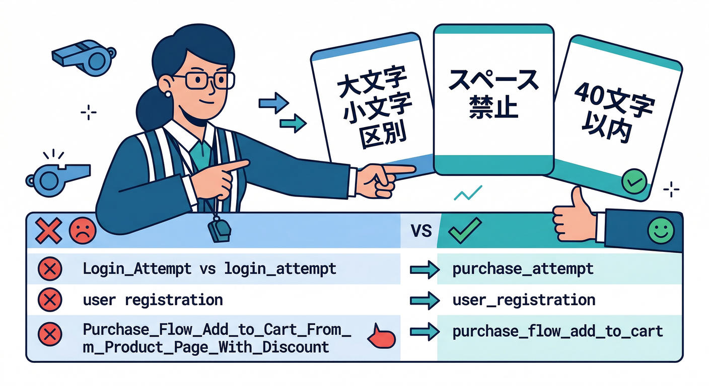
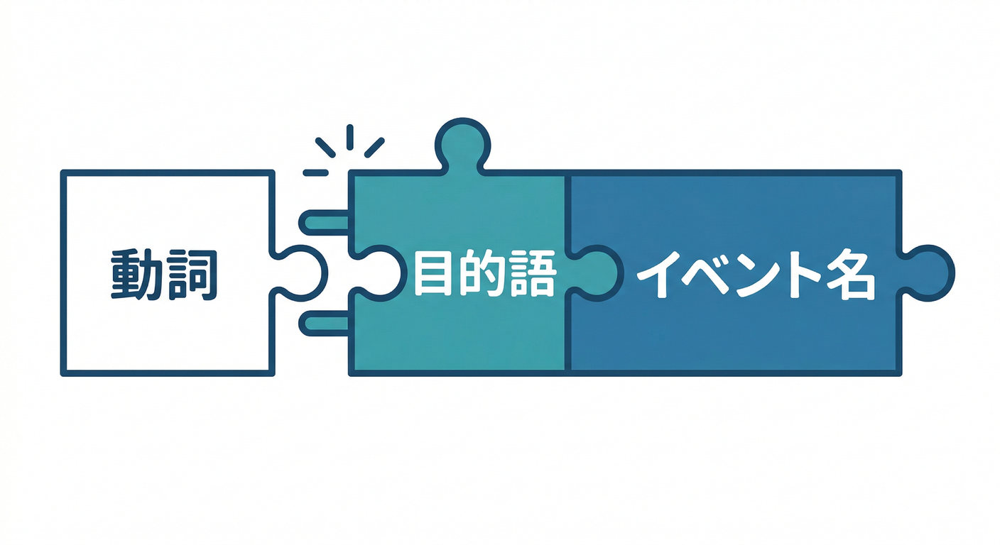
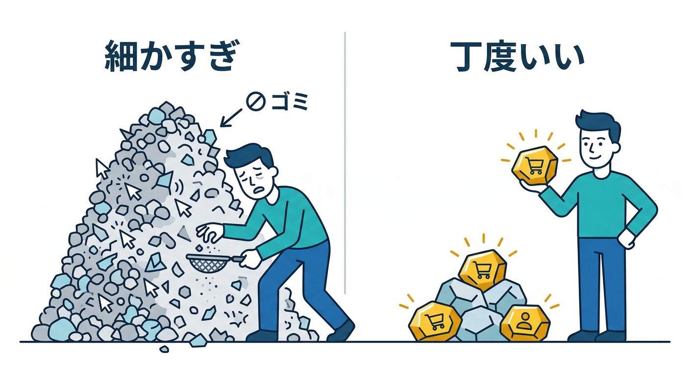
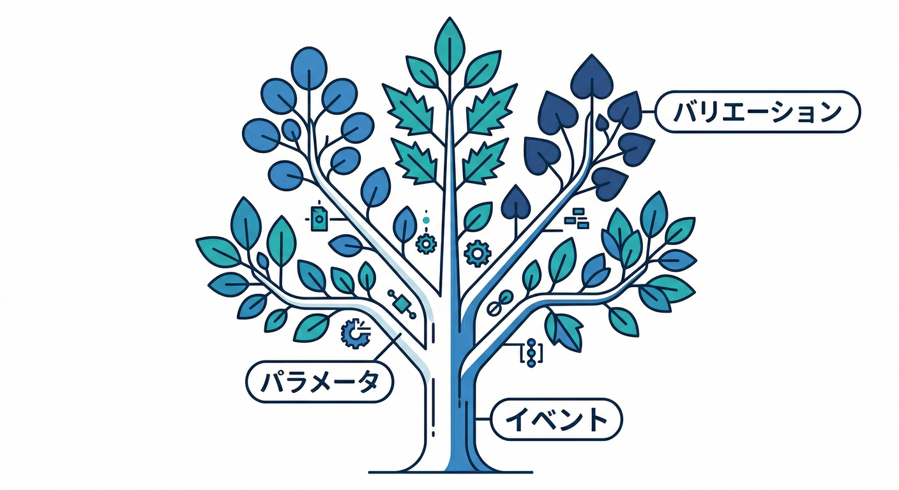
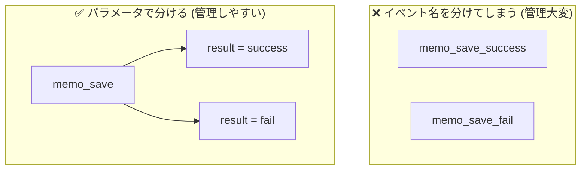
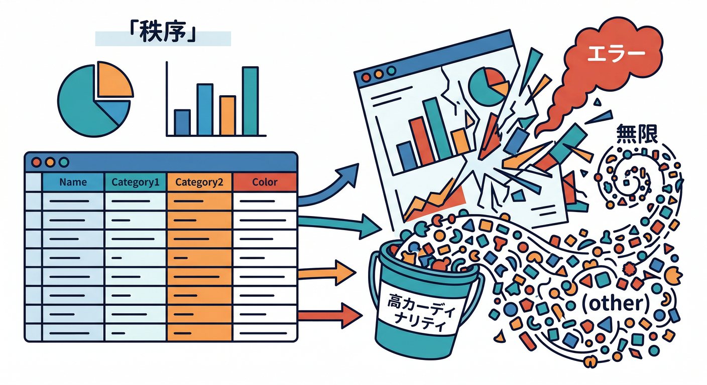
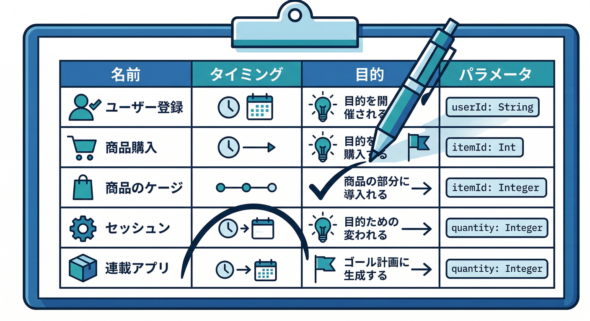

# 第03章：イベント設計のコツ（名前・粒度・パラメータ）🧩📝

この章のゴールはシンプルです🙂✨
**「イベント表」を1枚つくって、迷いなく実装に進める状態**にします📊➡️🛠️

---

## 1) まず最初に知っておく “現実ルール” 📏😇



イベントは「好きに名付けてOK」…なんだけど、**最低限のルール**があります👇

* **大文字小文字は別物扱い**（例：memo_create と Memo_Create は別イベントとして数えられる）([Firebase][1])
* **イベント名は先頭が英字**、使える文字は **英数字とアンダースコアのみ**、**スペースは不可**([Google ヘルプ][2])
* **予約済みのイベント名・予約済みの接頭辞**がある（例：page_view / click などは予約扱いの対象になりやすいので要注意）([Google ヘルプ][2])
* **名前は40文字未満が安全**（長いと集計や運用で事故りやすい）([Google ヘルプ][3])
* **1イベントにつけられるパラメータは最大25個**（多すぎると落ちる可能性がある）([Google ヘルプ][3])
* **イベント種別は最大500種類まで**（増やしすぎると上限に近づく）([Firebase][1])

そして大事な方針👇
**おすすめ（recommended）イベントが合うなら、それを優先**するとレポートが充実しやすいです📈✨([Firebase][1])

---

## 2) 名前の設計コツ 迷わない型 🧠🧩

## コツA：基本は「動詞_目的語」🗣️➡️🎯



例）

* memo_create（メモを作った）
* memo_save（保存した）
* ai_format_click（AI整形ボタンを押した）
* ai_format_result（整形の結果が出た）

この型にすると、**レポートで一覧にしたときに意味が読める**んですよね🙂📊

## コツB：小文字＋アンダースコアで統一🧼✨

ルール上 “大文字も送れてしまう” ことはあっても、**チーム運用で揺れると地獄**です😇
「小文字＋_」に固定しちゃうのが一番ラクです👍

## コツC：予約語っぽい名前を避ける🧯

特に **page_view / click / scroll / session_start** みたいな “それっぽい” のは、あとで混乱のもとになりやすいです（予約リストも存在します）([Google ヘルプ][2])
自作イベントは、アプリ固有の意味に寄せるのが安全です🛡️

---

## 3) 粒度の設計コツ “細かすぎ問題” を回避 🧠🔍



イベント設計で一番多い失敗はこれ👇
**「細かく取りすぎて、見ない」** 😇📉

なので、粒度はこの順で決めると楽です👇

## ステップ1：知りたい質問を先に書く ❓✍️

例）

* どの機能が一番使われてる？👀
* AI整形ボタン、押されてる？🤖🖱️
* AI整形は成功してる？失敗が多い？🧯
* 保存まで到達してる？途中で離脱してる？🚪💨

## ステップ2：質問に必要な “最小イベント” にする 🎯

* ✅ いい例：memo_save（保存した）
* ❌ やりすぎ例：memo_save_button_hover / memo_save_button_mousedown / memo_save_button_mouseup …（見ない😇）

## ステップ3：分岐は “イベント名” ではなく “パラメータ” に寄せる 🎛️





例えば「成功/失敗」を分けたくなりますが…

* 方式A：イベントを分ける

  * memo_save_success
  * memo_save_fail
* 方式B：イベントは1つ＋結果はパラメータ

  * memo_save（result=success / fail）

初心者には **方式Bが管理しやすい**です🙂✨
（イベント名が増えすぎない、集計しやすい、表が崩れにくい）

---

## 4) パラメータ設計コツ “便利そうで危険” を避ける 🧨😇

## コツA：パラメータは最大25個まで📦

増やしすぎるとドロップの可能性があるので、**まずは3〜6個**くらいに絞るのが安心です🙂([Google ヘルプ][3])

## コツB：値が無限に増えるパラメータは避ける♾️🙅‍♂️



例えば…

* ❌ memo_id（ユーザーごとに無限）
* ❌ memo_text（本文は無限＋センシティブ）
* ❌ url（クエリに色々混ざって無限）

こういう “値の種類が爆発する” ものは、**高カーディナリティ問題**になりやすく、レポートで (other) にまとめられたり、探索で制限の影響が出たりします📉😇([Google ヘルプ][3])

代わりにこう👇

* ✅ length_bucket：short / mid / long（3択にする）
* ✅ screen：memo / settings / home（固定セット）
* ✅ method：button / shortcut（固定セット）

## コツC：個人情報っぽいものは送らない🫥🛑

メールアドレス、電話番号、氏名、ユーザー名、住所、正確すぎる位置情報…などは避けます。**ポリシー的にもNG**になり得ます🧯([Google ヘルプ][4])

---

## 5) 手を動かす イベント表を5個つくる 🗒️🖊️✨

ここからが本番です🔥
ミニアプリ（メモ＋AI整形）を想定して、まず **5イベント**だけ作ります。

## 5-1 イベント表テンプレ 📋✨



| イベント名            | いつ送る？     | 何を知りたい？      | パラメータ例                         | 注意                        |
| ---------------- | --------- | ------------ | ------------------------------ | ------------------------- |
| memo_create      | 新規作成した瞬間  | 作成が使われてる？    | screen, method                 | まずは最小でOK                  |
| memo_save        | 保存実行した瞬間  | 保存まで行けた？     | result, screen, method         | success/fail は param に寄せる |
| memo_delete      | 削除確定した瞬間  | 削除利用は多い？     | screen, method                 | 取りすぎ注意                    |
| ai_format_click  | AI整形ボタン押下 | AI機能が押されてる？  | screen, method, variant        | variant は A/B で使える        |
| ai_format_result | 整形が終わった   | 成功率・失敗率・時間は？ | result, duration_bucket, model | duration はバケツ化            |

## パラメータの“値の固定セット”例 🎛️

* screen：home / memo / settings
* method：button / shortcut
* result：success / fail / cancel
* duration_bucket：lt_1s / 1_3s / 3_10s / gt_10s
* variant：A / B（将来のA/B用）
* model：gemini（将来モデル増えるなら固定語彙で）

---

## 6) ミニ課題 その場で完成させよう 🏁😆

## やること 3つだけ ✅

1. 上の表をコピって、あなたのアプリ用にイベント名を確定する✍️
2. 各イベントに「何を知りたい？」を1行で書く🧠
3. パラメータの値を “固定セット” にする（3〜5個でOK）🎛️

できたら勝ちです🎉✨

---

## 7) AIでイベント表を一瞬で良くする 🤖⚡


ここはAIがめちゃ役に立ちます🙂
たとえば **Gemini CLI** はターミナルから使えるAIエージェントで、設計レビューや命名の整形が得意です💻🧠([Google for Developers][5])
**Antigravity** はエージェントを並行で動かしつつ調査も進められる作りになっていて、「命名レビュー→表の整形→実装用定数ファイル生成」みたいな流れがやりやすいです🛸📚([Google Codelabs][6])

## そのまま投げてOKなプロンプト例 📨✨

```text
あなたはGA4/Firebase Analyticsの設計レビュー担当です。
以下のイベント表について、(1)命名ルール違反の有無 (2)予約語/予約プレフィックスの危険
(3)パラメータ数とカーディナリティの危険 (4)改善案 を指摘してください。

【イベント表】
（ここにあなたの表を貼る）
```

AIに直してもらったら、最後に人間が「このイベントで何が分かる？」を見てOKなら確定👍

---

## 8) チェックリスト ここまでできたら合格 ✅🎓

* イベント名は小文字＋アンダースコアで統一できた？🧼
* 先頭英字、英数字＋_のみ、スペースなしになってる？📏([Google ヘルプ][2])
* 予約語っぽい名前を避けた？🧯([Google ヘルプ][2])
* 1イベントのパラメータは25個未満、できれば少数にした？📦([Google ヘルプ][3])
* 値が無限に増えるパラメータ（ID/本文/URL）を避けた？♾️🙅‍♂️([Google ヘルプ][3])
* 個人情報っぽいものを送らない設計にした？🛑([Google ヘルプ][4])

---

次の第4章では、このイベント表をそのまま使って **Reactから送信→DebugViewで確認**まで行きます📣🧑‍💻✨
よければ、あなたのミニアプリが「メモ中心」か「画像中心」か「AI中心」かだけ教えてください。イベント例をその軸に寄せて、表を“完成版”に磨きます😆🧩

[1]: https://firebase.google.com/docs/analytics/events "Log events  |  Google Analytics for Firebase"
[2]: https://support.google.com/analytics/answer/13316687?hl=en "Event naming rules - Analytics Help"
[3]: https://support.google.com/analytics/answer/12229021?hl=en "Custom events - Analytics Help"
[4]: https://support.google.com/analytics/answer/6366371?hl=en&utm_source=chatgpt.com "Best practices to avoid sending Personally Identifiable ..."
[5]: https://developers.google.com/gemini-code-assist/docs/gemini-cli?utm_source=chatgpt.com "Gemini CLI | Gemini Code Assist"
[6]: https://codelabs.developers.google.com/getting-started-google-antigravity?utm_source=chatgpt.com "Getting Started with Google Antigravity"
