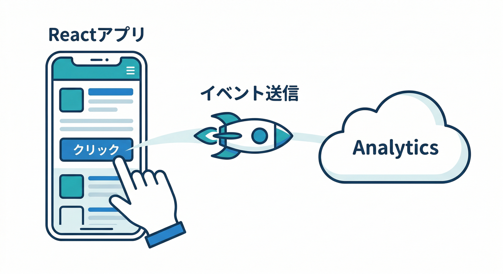
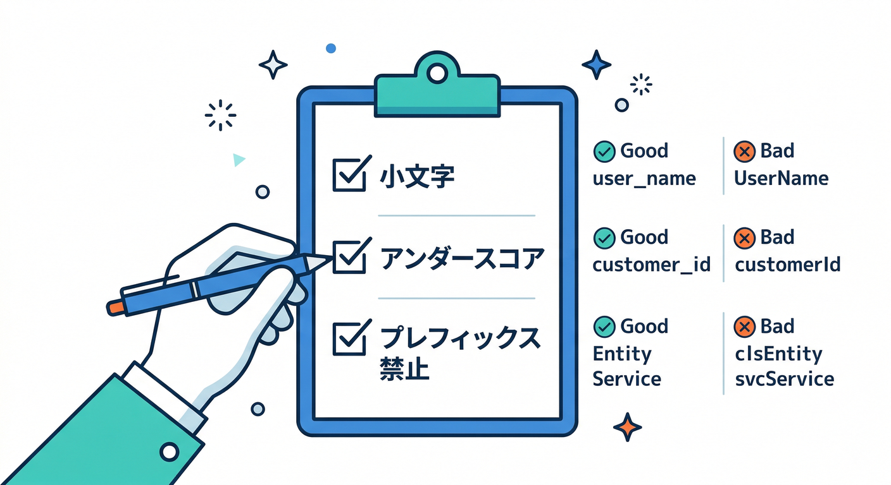
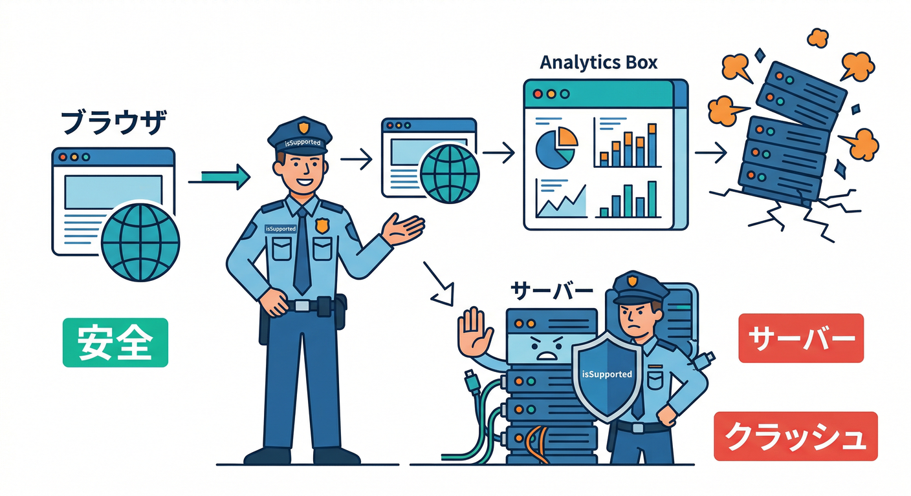
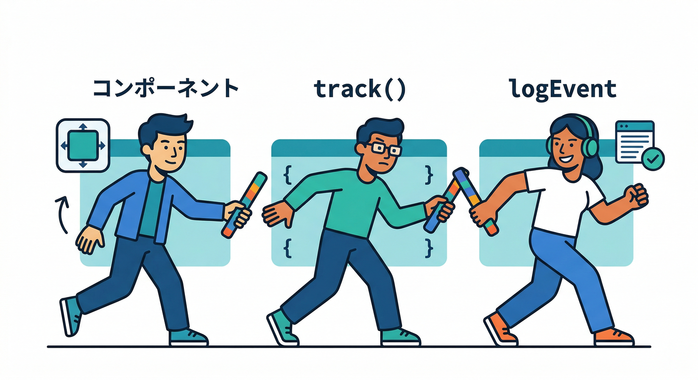
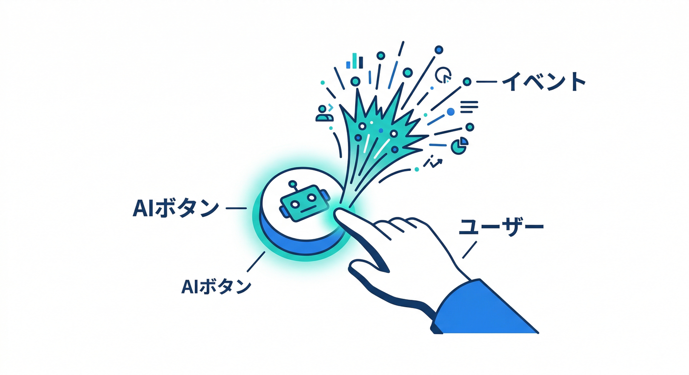
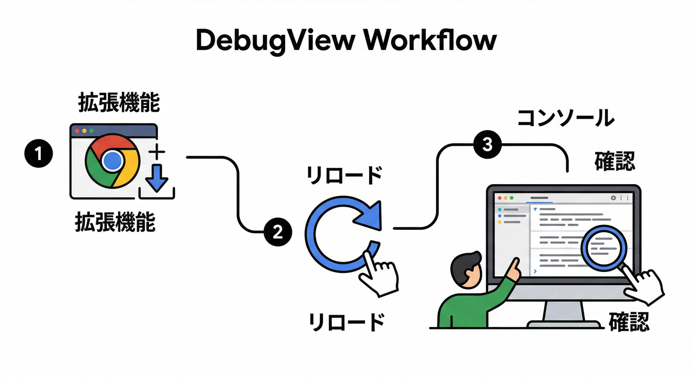
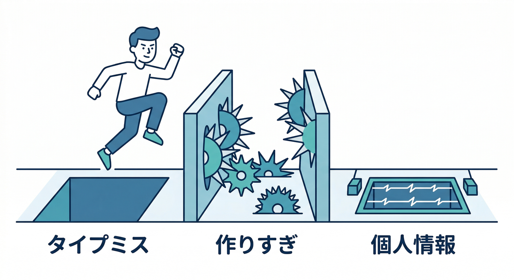

# 第04章：Reactでカスタムイベント送信📣🧑‍💻

この章は「ボタンを押した」「保存した」「AI整形した」みたいな**あなたのアプリ固有の行動**を、Analytics（GA4）に送れるようになる回です📊✨
送れたら、Console の **DebugView** で「今まさに飛んでる！」を確認します👀🔥 ([Firebase][1])

---

## この章のゴール🏁✨



* React のクリックなどをトリガーに、`logEvent()` で **カスタムイベントを送信**できる📤 ([Firebase][2])
* **DebugView** でイベントを目視確認できる👀🧪 ([Firebase][1])
* 「イベント名・パラメータの作法」を守って、あとで分析しやすい形にできる🧠🧩 ([GA4Spy][3])

---

## まず“作法”だけ先に押さえる🧠🧯

## 1) できれば「推奨イベント」→無理なら「カスタム」🎯

GA4には、分析しやすいように **推奨イベント名**が用意されてます（該当しそうなら寄せるのが吉）📚✨ ([Google for Developers][4])
ただ、メモアプリの `memo_save` みたいにピッタリが無いなら、**カスタムでOK**です🙆‍♂️

## 2) イベント名のルール（地味だけど超重要）🧷



* **英小文字+`_`** で統一すると事故りにくい（例：`memo_save`）
* **40文字以内／英数字と `_` ／先頭は英字**…などの命名ルールがあります✍️ ([GA4Spy][3])
* `firebase_` / `google_` / `ga_` みたいな **予約プレフィックスは避ける**のが安全です🚫 ([Google ヘルプ][5])

## 3) パラメータは「少なく・固定」🧩

* 1イベントあたり **最大25個**まで（上限あり）📦 ([Google ヘルプ][6])
* イベント種類（イベント名）はプロジェクトあたり **500種類**を超えないように（増やしすぎ注意）⚠️ ([Firebase][7])
* 「同じイベントなのに param 名が毎回ブレる」が一番つらいので、**表を作って固定**が正解です🗒️✨

## 4) 個人情報（PII）は絶対に送らない🙅‍♂️🔒

メール・電話番号・住所・氏名など、個人を直接特定できる情報は **イベントに入れない**でください🚫 ([Google ヘルプ][8])
（例：`user_email` みたいなパラメータ名は論外…！😇）

---

## 実装：Reactからイベントを送る🛠️✨

ここでは「保存ボタンで `memo_save` を送る」を作ります📝💾

## 手順1：Analyticsを“安全に初期化”する（ブラウザだけ）🌐



Reactでも、SSR混在（Next.jsなど）だと「サーバー側で落ちる」ことがあるので、`isSupported()` を挟んでおくのが安心です🧯 ([Firebase][2])

```ts
// src/lib/analytics.ts
import { getAnalytics, isSupported, logEvent, type Analytics } from "firebase/analytics";
import { app } from "./firebaseApp"; // initializeApp済みのappをexportしてる想定

let analytics: Analytics | undefined;

export async function getAnalyticsSafe() {
  if (analytics) return analytics;

  // Analyticsが使える環境かチェック（ブラウザ要件など）
  if (await isSupported()) {
    analytics = getAnalytics(app);
    return analytics;
  }
  return undefined;
}

export async function track(eventName: string, params?: Record<string, unknown>) {
  const a = await getAnalyticsSafe();
  if (!a) return; // SSRや未対応環境では何もしない
  logEvent(a, eventName, params);
}
```

* `getAnalytics()` / `logEvent()` / `isSupported()` は Firebase Web SDK のAPIです📚 ([Firebase][2])
* `logEvent()` は「イベント名＋（任意で）パラメータ」を送れます📣 ([Firebase][7])

---

## 手順2：ボタン押下で `track()` を呼ぶ🖱️📤



```tsx
// 例：保存ボタン（React）
import { track } from "../lib/analytics";

function SaveButton() {
  const onSave = async () => {
    // 保存処理（Firestoreなど）…

    // ✅ イベント送信
    await track("memo_save", {
      screen: "memo",
      method: "button",
    });
  };

  return <button onClick={onSave}>保存</button>;
}
```

ポイント🧠✨

* `screen` や `method` みたいな「分析に効く最小パラメータ」だけで十分です👌
* 「送ったパラメータをレポートで見たい」なら、GA4側で **カスタム定義として登録**が必要になることがあります（DebugViewでは見えても、標準レポートに出ない問題）📌 ([Firebase][7])

---

## 手順3：AIボタン（Firebase AI Logic）にもイベントを付ける🤖📣



「AI整形」みたいな機能は、のちの A/B やコスト管理にも効くので、今のうちに送ると強いです💪
Firebase AI Logic 自体は「クライアントからGemini/Imagenを安全に呼ぶ」ための土台として用意されています。([Firebase][9])

例）AI整形ボタン押下時：

```ts
await track("ai_format_click", { screen: "memo" });
```

例）AI処理が終わった時（成功/失敗だけ）：

```ts
await track("ai_format_result", { status: "success" }); // error もあり
```

---

## 確認：DebugViewで“今飛んでる”を目で見る👀🧪



Webの DebugView は **Google Analytics Debugger（Chrome拡張）**を使うのが公式手順です🧩 ([Firebase][1])

やることはこの流れ👇

1. Google Analytics Debugger を入れる（Chrome拡張）🧩
2. 拡張を有効化して、対象ページをリロード🔄
3. Firebase Console → Analytics → **DebugView** を開く👀
4. ボタンを押して、`memo_save` が出るか確認✅ ([Firebase][1])

注意⚠️

* Debugモードで送ったイベントは **通常の集計や BigQuery エクスポートに含まれない**扱いになります（デバッグ専用）🧯 ([Firebase][1])

---

## よくある詰まりポイント集🧯😇



* **イベント名の表記ゆれ**：`memo_save` と `memoSave` が混ざる → **別イベント扱い**で地獄👹（イベント名は大小文字区別）([Firebase][7])
* **イベント種類を増やしすぎ**：画面ごとに別名にして 500種類に近づく → 後で詰む⚠️ ([Firebase][7])
* **PIIを入れちゃう**：メールなどを送ってしまう → そもそもNG🚫 ([Google ヘルプ][8])
* **SSRで落ちる**：サーバー側で analytics を触って例外 → `isSupported()` で回避🧯 ([Firebase][2])

---

## ミニ課題🧩✍️

次の3イベントを実装して、DebugViewで見えるところまでやってみてください🔥

1. `memo_save`（保存ボタン）💾
2. `ai_format_click`（AI整形ボタン）🤖
3. `settings_open`（設定画面を開いた）⚙️

それぞれに共通で `screen` を付ける（例：`memo` / `settings`）📌

---

## チェック✅🎉

* DebugViewでイベントがリアルタイムに見えた？👀 ([Firebase][1])
* イベント名はルール通り（40文字以内・`_`・予約プレフィックス回避）？🧷 ([GA4Spy][3])
* 送ってる情報に個人情報が混ざってない？🔒 ([Google ヘルプ][8])

---

## AIで“イベント表→実装→テスト観点”を一気に作る🤝🤖

ここ、AIがめちゃくちゃ得意です⚡

* FirebaseのAI支援（Gemini in Firebase など）は、Firebaseの画面やツール上で開発・デバッグを助けてくれます🧠🛠️ ([Firebase][10])
* Gemini CLI はエージェント的に作業を進められる設計で、Firebase向けのワークフロー連携（MCP/拡張）も案内されています💻🧩 ([Google for Developers][11])
* Google の Antigravity は “エージェントを束ねて開発する” 方向のIDEで、導入用の公式Codelabもあります🛸 ([Google Codelabs][12])

おすすめの投げ方（コピペ用）👇

* 「このアプリ機能一覧から、GA4の推奨イベントに寄せつつ、足りない分はカスタムで。イベント名・params・目的を**表**で出して」
* 「イベント名ルール（40文字以内、`_`、予約プレフィックス回避）と、PII禁止を守れてるかレビューして」 ([GA4Spy][3])

---

次の第5章（ユーザープロパティ）へ行く前に、もし「このミニアプリはメモ＋画像＋AI整形だよ」みたいに機能が決まってるなら、その前提で **イベント表（5〜10個）を“あなた用に最適化”**して作れます📊🧩
（この章のコードに、そのまま落とし込める形で出します😆🔥）

[1]: https://firebase.google.com/docs/analytics/debugview "Debug events  |  Google Analytics for Firebase"
[2]: https://firebase.google.com/docs/reference/js/analytics "analytics package  |  Firebase JavaScript API reference"
[3]: https://data.ga4spy.com/ga4-events-parameters?utm_source=chatgpt.com "GA4 Events and Parameters Cheatsheet"
[4]: https://developers.google.com/analytics/devguides/collection/ga4/reference/events "Recommended events  |  Google Analytics  |  Google for Developers"
[5]: https://support.google.com/analytics/answer/13316687?hl=en&utm_source=chatgpt.com "Event naming rules - Analytics Help"
[6]: https://support.google.com/analytics/answer/9267744?hl=en&utm_source=chatgpt.com "Event collection limits - Analytics Help"
[7]: https://firebase.google.com/docs/analytics/events "Log events  |  Google Analytics for Firebase"
[8]: https://support.google.com/analytics/answer/6366371?hl=en&utm_source=chatgpt.com "Best practices to avoid sending Personally Identifiable ..."
[9]: https://firebase.google.com/docs/ai-logic?utm_source=chatgpt.com "Gemini API using Firebase AI Logic - Google"
[10]: https://firebase.google.com/docs/ai-assistance/overview?hl=ja&utm_source=chatgpt.com "AI アシスタンスを使用して開発する | Develop with AI assistance"
[11]: https://developers.google.com/gemini-code-assist/docs/gemini-cli?utm_source=chatgpt.com "Gemini CLI | Gemini Code Assist"
[12]: https://codelabs.developers.google.com/getting-started-google-antigravity?utm_source=chatgpt.com "Getting Started with Google Antigravity"
