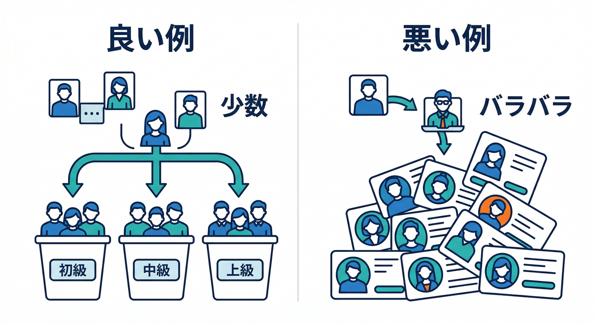
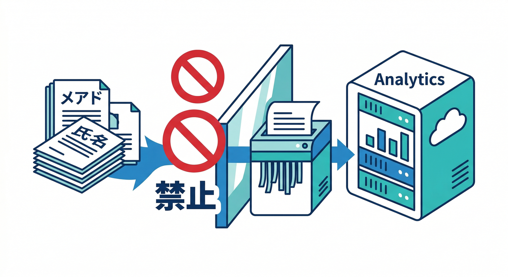
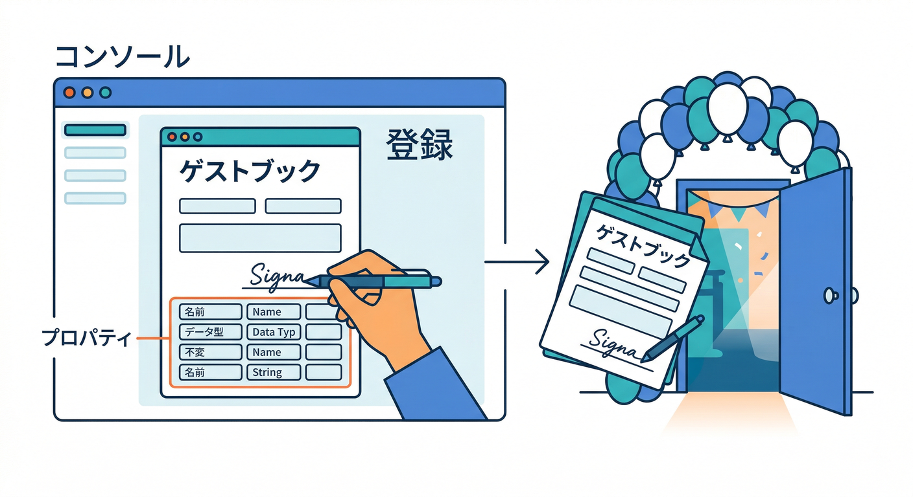
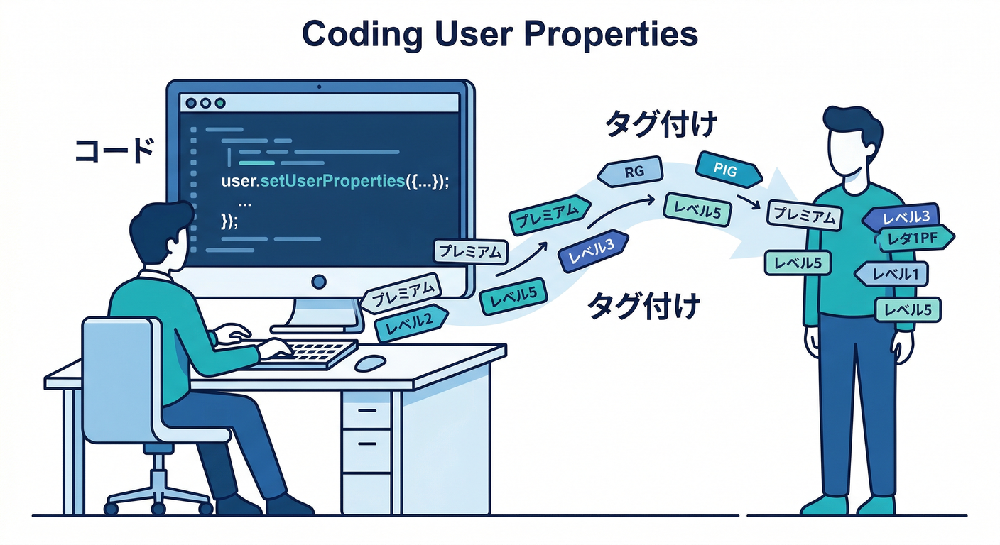
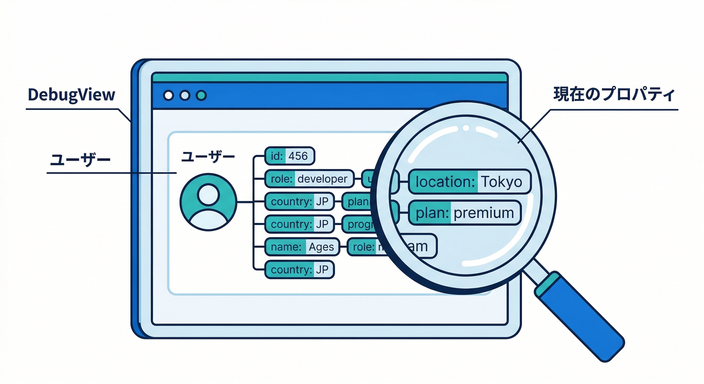

# 第05章：ユーザープロパティで“層”を見る👥🔎

この章は「イベントは見えてきたけど、**誰が**やってるの？」を分けられるようになる回です📊✨
ざっくり言うと、ユーザープロパティはユーザーに付ける“タグ”🏷️で、**同じイベントでも「初心者」「課金」「アバター設定済み」みたいに層別**して見られます👀

---

## 1) ユーザープロパティって何？🏷️🙂


* **ユーザーに紐づく属性**（例：`plan` / `role` / `has_avatar`）を送る仕組みです👤
* レポートの比較（Comparisons）や、オーディエンス（Audiences）の条件に使えます🎯
* ただし数に上限があり、**プロジェクトあたり最大25個**まで。名前は大文字小文字も区別されます（`Plan` と `plan` は別扱い）😇
* 使っちゃダメな予約語もあります（`Age` / `Gender` / `Interest`）🚫 ([Firebase][1])

---

## 2) 先に“設計のコツ”だけ押さえる🧠🧩

ここで雑にやると、あとで分析が地獄になります😇🌀

## ✅ コツA：値は「種類が少ない」ものにする



* 良い例：`plan = free | pro` / `has_avatar = true | false` / `role = admin | member` 👍
* ダメ例：`user_name = komiyamma`（ユーザーごとにバラバラ）👎
  → 値がバラけすぎると、分析が崩れます。

## ✅ コツB：**個人情報は絶対に送らない**🛑



メールアドレス・電話番号・氏名などのPII（個人を特定できる情報）は送らないルールです🙅‍♂️ ([Google ヘルプ][2])

## ✅ コツC：名前は `snake_case` で短く統一🧼

* 例：`has_avatar` / `signup_method` / `ai_tier`
  （命名ルールは運用の命です🧯）

おまけ：一般的に **名前は最大40文字**などの制約があるので、長文は避けるのが安全です✂️ ([Google ヘルプ][3])

---

## 3) 手を動かす①：Console側で「登録」する🖱️🧾



ユーザープロパティは、**作っただけだとレポートで使えません**。
まず Console の **Custom Definitions（カスタム定義）**で登録します🧾✨ ([Firebase][1])

やることはシンプル👇

1. Analytics の **Custom Definitions** を開く
2. **ユーザープロパティ**として `plan` などを追加
3. 以後、比較やセグメント条件に使えるようになります🎛️

※反映は「すぐ」じゃないです。**数時間かかることがある**ので、焦らない😂 ([Firebase][1])

---

## 4) 手を動かす②：Reactで user properties を付ける🧑‍💻🏷️



Web の場合は `setUserProperties()` を使います。公式の例はこんな感じ👇 ([Firebase][1])

```typescript
import { getAnalytics, setUserProperties } from "firebase/analytics";

const analytics = getAnalytics();
setUserProperties(analytics, { favorite_food: "apples" });
```

## 実戦：ミニアプリ向け「3つだけ付ける」🧩

例：

* `plan`: `free` / `pro`（課金層）
* `role`: `member` / `admin`（権限層）
* `has_avatar`: `true` / `false`（プロフィール完成度）

Reactで「ログイン後にプロフィール読めたタイミング」で付けるのが楽です📌

```typescript
import { getAnalytics, setUserProperties } from "firebase/analytics";

// 例：ログイン後に呼ぶ
export function applyUserProps(user: {
  plan: "free" | "pro";
  role: "member" | "admin";
  hasAvatar: boolean;
}) {
  const analytics = getAnalytics();
  setUserProperties(analytics, {
    plan: user.plan,
    role: user.role,
    has_avatar: user.hasAvatar ? "true" : "false",
  });
}
```

👀ポイント

* boolean は `"true"/"false"` の文字列にしておくと後で扱いやすいことが多いです🙂
* “いつ付ける？”は **1回でOK**（ログイン直後 or プロフィール確定時）で十分👍
* 値が変わったら **同じキーで上書き**すればOKです🔁

---

## 5) 手を動かす③：DebugViewで「本当に付いたか」見る🧯👀



Analytics は通常、イベントをまとめて送ります（約1時間単位のバッチ）⏳
でも DebugView を使うと **ほぼリアルタイム**に確認できます⚡ ([Firebase][4])

## Webでのデバッグ手順（いちばんラク）

* ブラウザに **Google Analytics Debugger** 拡張を入れて有効化 → リロード🔄
* その状態でアプリを操作
* DebugView を見ると、右側に **Current User Properties** が出ます👀 ([Firebase][4])

※注意：デバッグモード中のイベントは、**通常の集計や日次BigQueryエクスポートから除外**されます（テスト汚染を防ぐため）🧼 ([Firebase][4])

---

## 6) ミニ課題🎒✨

1. `plan` / `role` / `has_avatar` の3つを Custom Definitions に登録🧾
2. ログイン後に `applyUserProps()` を1回呼ぶ🏷️
3. DebugViewで **Current User Properties** をスクショ📸
4. そのあと Explore/比較で「has_avatar=true の人だけ」みたいに切ってみる👥🔎

---

## 7) よくある詰まりポイント集🧯😇

* **Q. DebugViewに出ない！**
  A. 拡張がONか、リロードしたか確認🔁（DebugViewはデバッグモードが鍵） ([Firebase][4])

* **Q. レポートの比較条件に出てこない！**
  A. Custom Definitions で登録した？🧾 さらに反映まで数時間かかることもあります⏳ ([Firebase][1])

* **Q. `plan` と `Plan` が混ざった…**
  A. 大文字小文字は別物として記録されます😇（運用ルールで固定！） ([Firebase][1])

* **Q. メールアドレス入れちゃダメ？**
  A. ダメです🙅‍♂️（PII禁止） ([Google ヘルプ][2])

---

## 8) AIで“設計”を一気に楽にする🤖🪄


「プロパティ何にする？」って悩むところ、AIにたたき台を出させるのが超効きます💡

* Gemini in Firebase：Console上での支援（設計・デバッグの相談に便利）🧠 ([Firebase][5])
* Gemini CLI：ターミナルで「命名・イベント表・プロパティ表」を作らせやすい💻 ([Google for Developers][6])
* Antigravity：エージェントで“調査→表→実装”をつなげやすい🛸 ([Google Codelabs][7])
* Firebase AI Logic：アプリ側のAI機能と計測（例：AI整形を使った層）をつなげやすい🤝 ([Firebase][8])

例：Gemini CLI に投げるお題（コピペ用）👇

```text
あなたはGA4/Firebase Analyticsの設計者です。
メモ+画像+AI整形のミニアプリに適した「ユーザープロパティ」を最大5個提案してください。
条件:
- 値の種類が少ない（低カーディナリティ）
- PIIは含めない
- Remote Config/A-B/Performanceの改善に繋がる
各プロパティについて: key / 取りうる値 / 何が分かるか を表で。
```

---

## まとめ🏁✨

この章でできたことはコレ👇

* ユーザープロパティで「層」を作る👥🏷️
* Reactで `setUserProperties()` を入れる🧑‍💻
* DebugViewで“今の端末の属性”まで確認できる🧯👀 ([Firebase][4])

次の章（第6章：ファネル🚪➡️🏁）に進むと、
「どの層が、どこで離脱してる？」が一気に見えるようになりますよ〜🔎📈

* [itpro.com](https://www.itpro.com/software/development/automated-code-reviews-are-coming-to-googles-gemini-cli-conductor-extension-heres-what-users-need-to-know?utm_source=chatgpt.com)
* [theverge.com](https://www.theverge.com/news/692517/google-gemini-cli-ai-agent-dev-terminal?utm_source=chatgpt.com)
* [theverge.com](https://www.theverge.com/news/822833/google-antigravity-ide-coding-agent-gemini-3-pro?utm_source=chatgpt.com)

[1]: https://firebase.google.com/docs/analytics/user-properties "Set user properties  |  Google Analytics for Firebase"
[2]: https://support.google.com/analytics/answer/6366371?hl=en&utm_source=chatgpt.com "Best practices to avoid sending Personally Identifiable ..."
[3]: https://support.google.com/analytics/answer/9267744?hl=en&utm_source=chatgpt.com "Event collection limits - Analytics Help"
[4]: https://firebase.google.com/docs/analytics/debugview "Debug events  |  Google Analytics for Firebase"
[5]: https://firebase.google.com/docs/ai-assistance/gemini-in-firebase?utm_source=chatgpt.com "Gemini in Firebase - Google"
[6]: https://developers.google.com/gemini-code-assist/docs/gemini-cli?utm_source=chatgpt.com "Gemini CLI | Gemini Code Assist"
[7]: https://codelabs.developers.google.com/getting-started-google-antigravity?utm_source=chatgpt.com "Getting Started with Google Antigravity"
[8]: https://firebase.google.com/docs/ai-logic?utm_source=chatgpt.com "Gemini API using Firebase AI Logic - Google"
