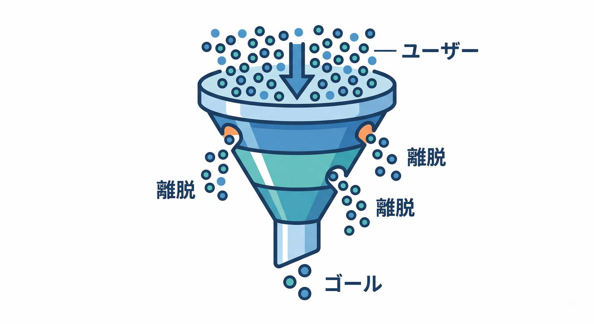
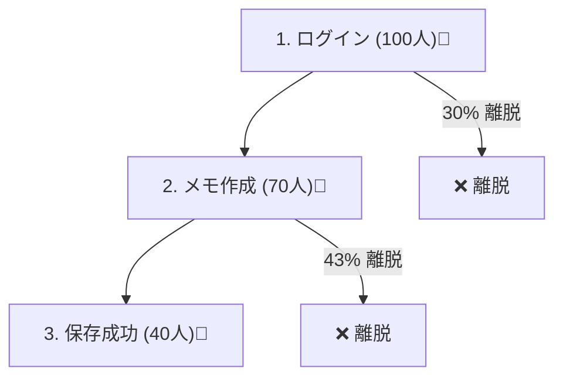
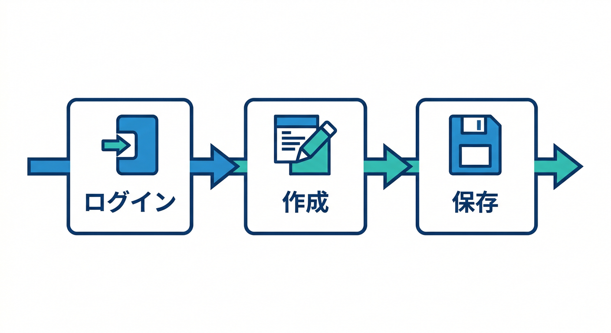
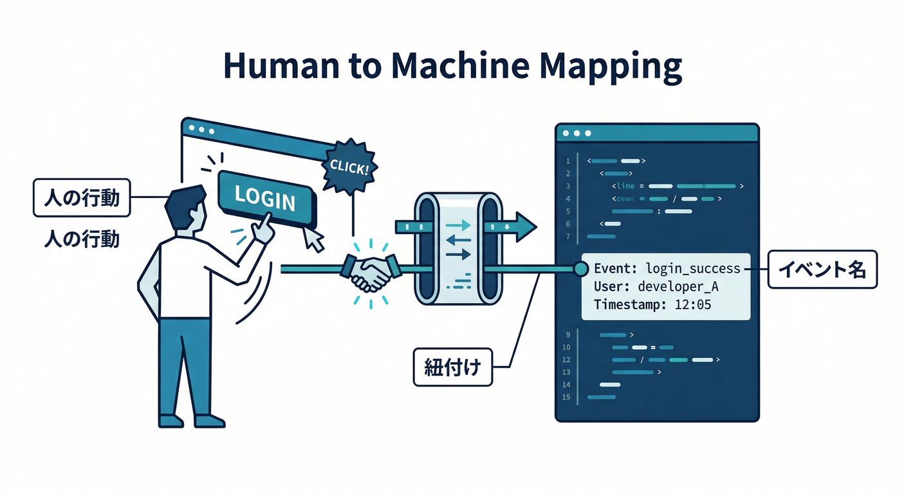
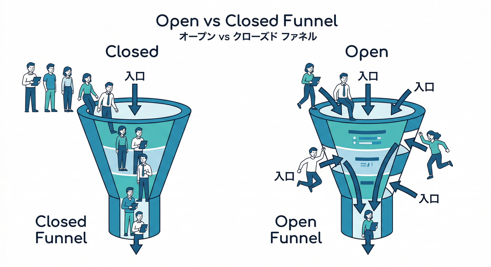
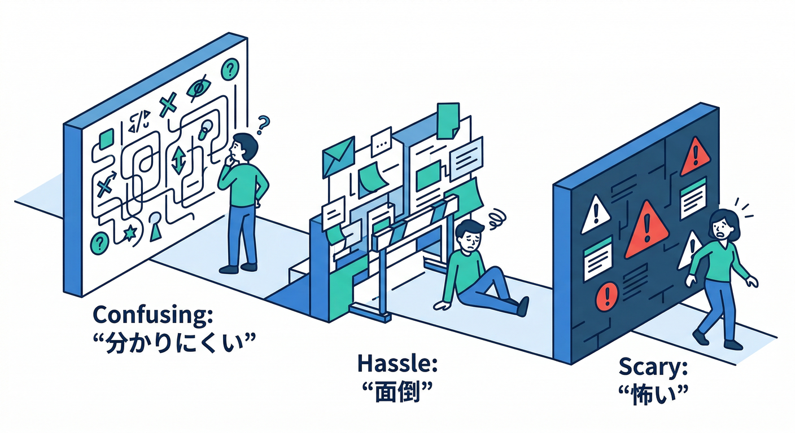
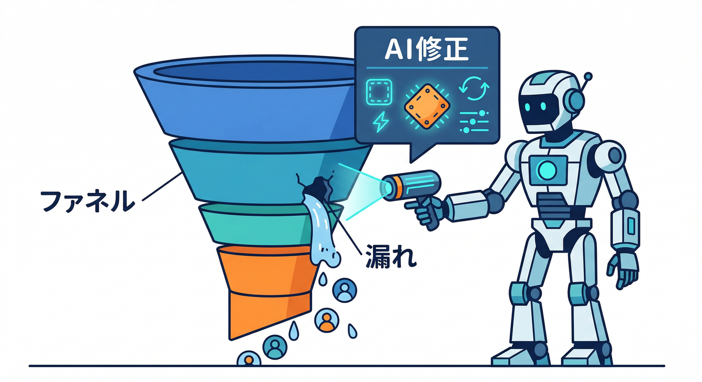

# 第06章：ファネル（どこで離脱？）の発想🚪➡️🏁

この章は、「ユーザーがゴールまで行けてる？」「どこで脱落してる？」を **1→2→3 の“導線”**として見える化する回です📊✨
やることはシンプルで、**(1) 導線を3段に分ける → (2) 各段にイベントを対応づける → (3) Google Analytics（GA4）の“ファネル探索”で落ちる場所を見る** だけです😊

---

## 1) ファネルってなに？🧠📉





ファネル（Funnel）は、ユーザーがタスクを完了するまでの **ステップの列**を作って、
各ステップで **何人残って / 何人落ちた**かを見られる考え方です🚶➡️🚶➡️🏁

* 例：**ログイン → メモ作成画面を開く → 保存成功**
* 例：**一覧を見る → AI整形ボタン押す → 整形完了**

ポイント：昔の「Analytics for Firebase」の画面にあった“Funnels”機能は **2021年12月に削除**され、今は **GA4 の Explorations（探索）の「Funnel exploration」**で作る流れです。([Google ヘルプ][1])
つまり「Firebase側の画面だけで完結しない」前提で、GA4側で作ります🙆‍♂️

---

## 2) まずは“ファネル1本だけ”決めよう🎯🧩



初心者がやりがちな罠は、最初から10本作ろうとして混乱すること😂
まずは **たった1本**、アプリの最重要導線を選びます。

ミニアプリ（メモ＋AI整形）なら、超定番はこれ👇

* **Step1：ログイン成功**（login_success）
* **Step2：メモ作成開始**（memo_create）
* **Step3：保存成功**（memo_save_success）

この3つが見えるだけで、改善の当たりが一気に付きます👀✨
（例：「Step2までは多いのにStep3が少ない」→ 保存UXが怪しい、など）

---

## 3) “イベント ↔ ステップ”対応表を作る🗂️🧠



ここが本章のメイン作業です💪
「ステップ名」と「使うイベント」を **1行ずつ**対応させます。

**おすすめ：ステップ名は“人間向け”、イベント名は“機械向け”**に分けると事故りにくいです🙂

例（この章の完成形イメージ）👇

| ファネルのステップ名（人間向け） | イベント名（機械向け）         | つけたいパラメータ例                |
| ---------------- | ------------------- | ------------------------- |
| ①ログインできた         | `login_success`     | `method`（google/email）    |
| ②作成を始めた          | `memo_create`       | `screen`（memo）            |
| ③保存できた           | `memo_save_success` | `source`（button/shortcut） |

イベントは「アプリで起きたこと」を記録する仕組みです。([Firebase][2])
なので、**“画面が出た”より“ユーザーが前進した”**を優先すると、ファネルが強くなります🔥

---

## 4) 実装：React側でステップイベントを送る📣🧑‍💻

既に第4章で `logEvent` を触ってる前提で、**“ステップになってるイベントだけ”**を確実に送ります✅
（ここで重要なのは「正確さ」なので、イベント数は少ない方がむしろ良いです🙂）

サンプル（イメージ）👇

```typescript
import { getAnalytics, logEvent } from "firebase/analytics";

const analytics = getAnalytics();

// ①ログイン成功
export function trackLoginSuccess(method: "google" | "email") {
  logEvent(analytics, "login_success", { method });
}

// ②メモ作成を開始（例：作成画面を開いた瞬間 or 「新規作成」押下）
export function trackMemoCreate() {
  logEvent(analytics, "memo_create", { screen: "memo" });
}

// ③保存成功（保存が“成功した瞬間”に送るのがコツ）
export function trackMemoSaveSuccess(source: "button" | "shortcut") {
  logEvent(analytics, "memo_save_success", { source, screen: "memo" });
}
```

✅コツ

* **保存ボタン押下**ではなく、**保存成功（例：Firestore write 成功後）**で送る
* イベント名はブレない（`memo_save_success` と `memo_saved` が混ざると地獄😇）

---

## 5) DebugViewで“今送れてるか”を即チェック🧯👀

ファネル作る前に、まず **イベントが正しく届いてるか**を DebugView で確認します📡
DebugView は「開発端末からのイベント」をほぼリアルタイムで見られて、実装ミスの発見に超便利です。([Firebase][3])

Webの場合は **ブラウザで debug mode を有効化**します。公式手順では **Chrome拡張（Google Analytics Debugger）**を使う流れです。([Firebase][3])

⚠️大事ポイント：debug mode のイベントは **通常の集計には入らない**（＝汚さない）し、**日次の BigQuery エクスポートにも入らない**です。([Firebase][3])
つまり「安心してテストしてOK」👍

---

## 6) GA4の“ファネル探索”を作る🧪📊

イベントが届いたら、GA4側でファネル探索を作ります🧭
GA4のヘルプにある基本手順はこうです👇

* Explore（探索）で **Funnel exploration テンプレート**を選ぶ
* ステップを追加していく（最大10ステップ）
* 「Open / Closed（開放 / 閉鎖）」を選ぶ（入口の扱いが変わる）([Google ヘルプ][4])

## Open と Closed、どっち？🤔



* **Open（開放）**：途中のステップから入ってきた人も数える
* **Closed（閉鎖）**：必ず Step1 から始めた人だけ数える([Google ヘルプ][4])

初心者のおすすめはだいたいこれ👇

* 「ログイン→保存」みたいな **一本道の成功率**を見たい → **Closed**
* 「どの画面からでも来る」導線を見たい → **Open**

さらにGA4では、ステップ条件にイベントやディメンション条件を入れたり、
「直後に続いた（directly）」か「途中に別行動あってもOK（indirectly）」かも選べます。([Google ヘルプ][4])
（最初は **indirectly** 寄りがラクです🙂）

---

## 7) “離脱”が見えたら、改善案は3択で考える🛠️💡



ファネルで落ちてる場所が分かったら、改善はだいたいこの3パターンです👇

1. **分かりにくい**（次に何すればいいか不明）🌀
2. **面倒くさい**（入力が多い・手数が多い）🫠
3. **怖い**（失敗しそう・取り返しつかない雰囲気）😱

例：Step2→Step3が落ちる（作成→保存）なら

* 保存ボタンが目立たない？
* 保存後のフィードバックが弱い？
* エラー時のメッセージが怖い？
  みたいに当たりを付けられます🎯

---

## 8) Gemini / AIで“ファネルの設計”を爆速にする🤖⚡



ここ、AIがめちゃ強いです💪✨（ただし「答えを決める」のは人間）

やり方は超簡単で👇

* **イベント表（ステップ↔イベント）をAIに作らせる**
* **落ちてるステップに対する改善案をAIに出させる**
* **採用する案だけ人間が選ぶ**（安全🎛️）

AIへの頼み方（例）📝

* 「メモアプリの北極星は“週3回メモ保存”です。ログイン→作成→保存のファネルに必要なイベント名とパラメータ案を表にして」
* 「Step2→Step3の離脱が大きい。UX改善案を10個。工数（小/中/大）とリスクも添えて」

この章は「設計の筋肉」を付ける章なので、AIで下書きを出して、あなたが“筋トレ”するのが最強です💪😆

---

## ミニ課題🎒✅（この章のゴール確認）

## やること（15〜25分）

1. ファネルを1本決める（3ステップ）🎯
2. ステップ↔イベント対応表を作る🗂️
3. 3イベントだけ実装して送る📤
4. DebugViewで届いてるのを確認👀([Firebase][3])
5. GA4で Funnel exploration を作る🧪([Google ヘルプ][4])

## チェック✅

* 「どこで離脱してるか」を **文章で説明**できた？✍️
  例：「ログインはできるけど、保存成功まで行けてない人が多い」

---

次の章（第7章）は、ここで作ったイベントが **“間違って送られてないか”**を徹底的に潰して、計測の品質を上げます🧯✨ DebugViewも引き続き大活躍です👀

[1]: https://support.google.com/firebase/answer/11091821?hl=en "New Google Analytics 4 functionality in Google Analytics for Firebase - Firebase Help"
[2]: https://firebase.google.com/docs/analytics/events?utm_source=chatgpt.com "Log events | Google Analytics for Firebase"
[3]: https://firebase.google.com/docs/analytics/debugview "Debug events  |  Google Analytics for Firebase"
[4]: https://support.google.com/analytics/answer/9327974?hl=en "[GA4] Funnel exploration - Analytics Help"
