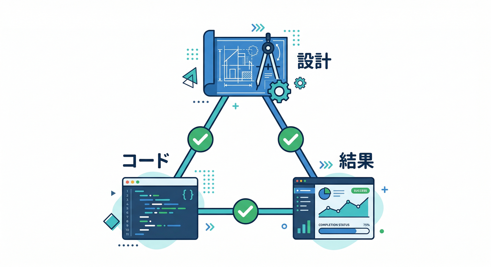
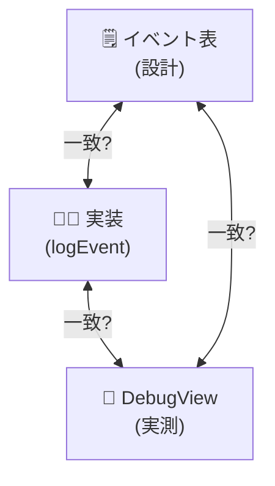
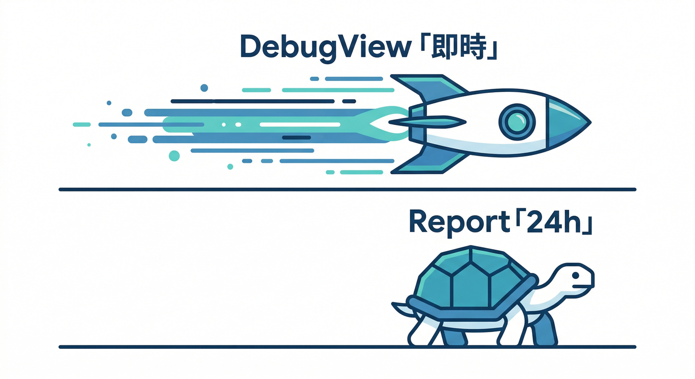
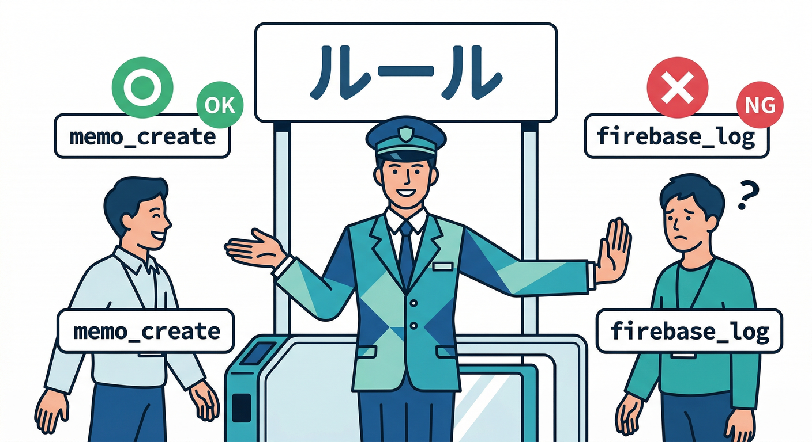
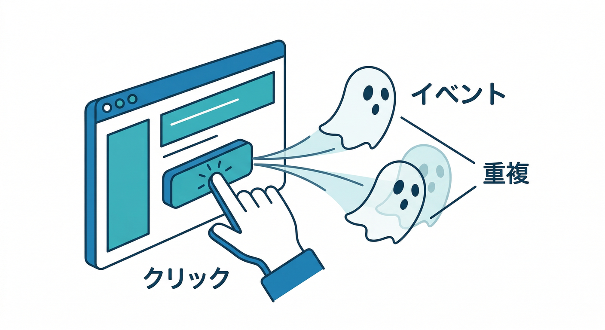
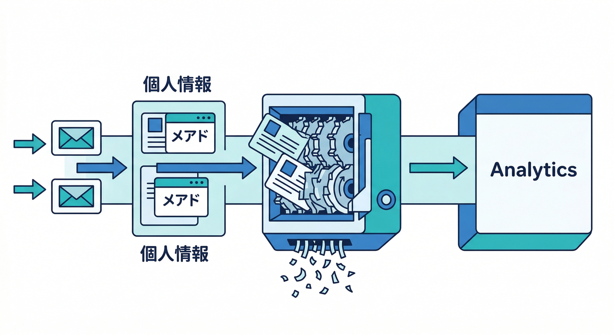
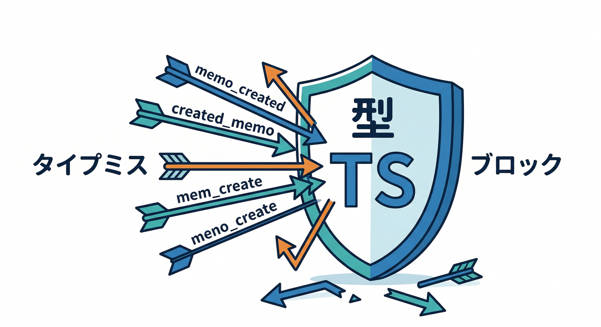
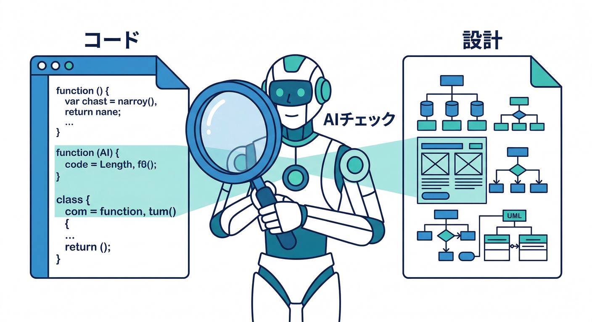

# 第07章：計測の品質チェック（デバッグの基本）🧯👀

「計測」って、入れた瞬間はワクワクするんだけど……**いちばん怖いのは“間違って送れてる”状態**です😇
数字がキレイに見えても、裏で **イベント名が揺れてる / 二重送信してる / パラメータが欠けてる** と、改善がぜんぶズレます📉💥

この章では、**“正しく送れてる自信”を作る**ための、デバッグの型を身につけます💪✨

---

## この章のゴール 🎯✅

* **DebugView** で「生のイベント」を見て、**正しく送信されている**と確認できる👀📡 ([Firebase][1])
* **Realtime / DebugView** を使い分けて、**“すぐ確認”**できる（通常レポートは時間がかかる）⏱️ ([Google ヘルプ][2])
* イベント名・パラメータのルール違反（長さ/文字/個数など）を防げる🧹🧩 ([Google for Developers][3])
* **二重送信（Reactの罠）**を見抜いて止められる🕵️‍♂️🧯 ([React][4])
* **PII（個人情報）を絶対に送らない**設計にできる🛡️🙅‍♀️ ([Google ヘルプ][5])

---

## まず結論：品質チェックは「三点照合」🔺🔍





イベントの品質は、いつもこの **3つが一致してるか**で見ます👇

1. **イベント表（設計）**：名前・目的・パラメータが決まってる🗒️
2. **実装（コード）**：その通りに `logEvent` してる🧑‍💻
3. **送信結果（DebugView）**：実際にその形で届いてる📡👀 ([Firebase][1])

この「3つ」がズレた瞬間に、事故が起きます💥

---

## DebugView で “生ログ” を見る 🧪📺

DebugView は **開発中の端末から送られたイベント**を、かなりリアルタイムで見せてくれます👀✨ ([Firebase][1])
計測の“正誤判定”は、まずここでやるのが最速です🏃‍♂️💨

## DebugView を “自分だけ” 有効にする（Webの現実的なやり方）🧷🕵️‍♀️

Web の場合、**自分のブラウザだけ**をデバッグ扱いにするのが安全です🔐
おすすめは **Google Tag Assistant** を使う方法で、URL にデバッグ用のパラメータが付与されます🔗🧩 ([Google ヘルプ][6])

⚠️注意：`debug_mode` をコードやタグ側で “全員” に付けちゃうと、DebugView が全ユーザーで埋まってカオスになります😇
しかも、`debug_mode=false` にしても無効化にならず、**パラメータ自体を外す**必要があります🧯 ([Google ヘルプ][6])

---

## 「レポートに出ない！」は普通。確認は Realtime / DebugView 🧠⏱️



GA4（Analytics）の多くのレポートは、反映まで **24〜48時間**かかることがあります⌛
だから、開発中の確認は **Realtime と DebugView** を使うのが基本です📍 ([Google ヘルプ][2])

---

## 品質チェックの “7つの観点” 🧰✅

## ① イベント名のルール違反がない？（地味に多い）🧨



最低限これ👇（破ると後で困ります）

* **40文字以内**
* **英数字 + アンダースコアのみ**
* **先頭は英字**
* 予約プレフィックス（例：`firebase_` / `google_` / `ga_`）は避ける ([Google for Developers][3])

👉 “memo_create” と “memo_created” が混ざる、とかが一番つらいです🥲

---

## ② パラメータ数・名前のルールは守れてる？🧩

イベントに付けられるパラメータには上限があります👇

* **1イベント最大 25 パラメータ**（付けすぎ注意） ([Google for Developers][3])
* パラメータ名にも命名ルール（英字開始・英数字/underscore など）がある ([Firebase][7])

---

## ③ “型” がブレてない？（文字列と数値が混ざる系）🌀

例：`method` がある時は `"button"`、別の時は `1`…みたいにすると、分析が地獄になります😇
👉 **同じパラメータ名は、同じ型・同じ意味**に固定しましょう🔒

---

## ④ 二重送信してない？（Reactの罠）🪤



開発中に **StrictMode** が有効だと、バグ検知のために “追加のチェック” が動き、特定の処理が余計に走ることがあります👀
「useEffect で画面表示イベントを送ってたら、2回送られてた！」が起きがちです😇🔥 ([React][4])

✅ 対策の基本：

* **ユーザー操作（クリック等）で送るイベント**を中心にする🖱️
* 画面表示など “一度だけ” を送りたい時は、ガードを入れる🧯

例（“一度だけ”ガードの考え方）👇

```tsx
import { useEffect, useRef } from "react";

export function useLogOnce(fn: () => void) {
  const fired = useRef(false);

  useEffect(() => {
    if (fired.current) return;
    fired.current = true;
    fn();
  }, [fn]);
}
```

---

## ⑤ PII（個人情報）を送ってない？🚫👤



Google Analytics は **メールアドレス等のPIIを送るのは禁止**です🙅‍♀️
“うっかり URL にメールが入ってた” とかでも事故り得ます😱 ([Google ヘルプ][5])

✅ ルール（超ざっくりでOK）

* **ユーザー名/メール/電話/住所/正確すぎる位置**は送らない
* AI機能があるアプリでも、**プロンプト全文をそのまま送らない**（混入しがち）🧯🤖

---

## ⑥ “必要なイベント” が欠けてない？（取りこぼし）🕳️

ファネル（例：ログイン → 作成 → 保存）の各段に、**対応するイベントがちゃんとあるか**を見ます🚪➡️🏁
DebugView で操作しながら「ここで来るはず」が来ないなら、実装漏れです🔍

---

## ⑦ “余計なイベント” が増えてない？（ノイズ）📣💭

* タイピングのたびに送ってる
* スクロールで大量に送ってる
* リトライで連打される
  …みたいなのが入ると、**イベント数制限や分析の見通し**が悪くなります😵‍💫
  上限・制限も意識して、粒度を整えましょう🧹 ([Google ヘルプ][8])

---

## 実装を “揺れない” ようにする小ワザ（TypeScript編）🧠🧷



「文字列でイベント名を直書き」だと、表記ゆれが起きます😇
なので、**イベントを型で縛る**と強いです💪✨

```typescript
type AppEvent =
  | { name: "memo_create"; params: { screen: "memo"; method: "button" | "shortcut" } }
  | { name: "ai_format_click"; params: { screen: "memo"; source: "toolbar" | "menu" } };

export function logAppEvent(e: AppEvent) {
  // logEvent(analytics, e.name, e.params) の形に寄せておく
}
```

こうすると👇

* “memo_created” みたいなタイポが **コンパイルで落ちる**✅
* params の不足や型違いも **即バレ**✅

---

## AIで“品質チェック”を爆速にする 🤖⚡



ここが2026っぽい勝ち筋です✨

## 1) Gemini で「イベント表 ↔ 実装」の差分を出す🔍🤖

やりたいことは単純👇

* コードから **イベント名一覧を抽出**
* イベント表と突き合わせて **表記ゆれ・未使用・不足**を出す

たとえば検索はこう👇

```bash
rg "logEvent\\(" -n src
```

その結果を **Gemini** に投げて、
「イベント表（設計）と一致してる？」「揺れてる候補を直して」と頼むと、作業がめちゃ速いです💨🧠

## 2) Console側の AI（Gemini in Firebase）で詰まりを潰す🧯✨

Firebase コンソール内の **Gemini in Firebase** は、開発やデバッグの時間を減らすための支援を目的にしています🛠️🤝 ([Firebase][9])
「DebugView に出ない」「設定が怪しい」みたいな時の **一次相談役**として便利です🙂

## 3) AI機能（Firebase AI Logic）を入れてるなら、計測も“安全運用”寄りに🤖🛡️

Firebase AI Logic は、アプリから **Gemini / Imagen** などを呼ぶための仕組みです📦✨ ([Firebase][10])
AI機能はログが増えやすいので、

* 送るパラメータを最小に
* PII混入を避ける
* 回数や負荷を見える化
  …みたいに、計測も“運用目線”で作ると強いです💪

---

## ミニ課題 📝🎮（15分）

1. DebugView を開いて、アプリを操作しながら **イベントが期待通りに並ぶ**のを確認👀📺 ([Firebase][1])
2. 次をチェックして、直す🧹

   * “memo_create” と “memo_created” が混ざってない？
   * “method” の値がバラバラじゃない？
   * クリック1回でイベント2回送られてない？🪤

---

## チェックテスト ✅🧠

* DebugView で **イベント名・パラメータが設計と一致**して見えた？👀
* イベント名のルール（40文字、英字開始、英数字＋_）を守れてる？🧩 ([Google for Developers][3])
* **PIIを送ってない**と言い切れる？🛡️ ([Google ヘルプ][5])
* React の “二重送信” を疑って、対策できた？🧯 ([React][4])

---

次の章（第8章）からは **Remote Config** に入っていくので、ここで作った「計測の品質」が、そのまま **機能フラグ運用・A/B・改善サイクル**の土台になります🎛️🔁✨

[1]: https://firebase.google.com/docs/analytics/debugview?utm_source=chatgpt.com "Debug events - Google Analytics for Firebase"
[2]: https://support.google.com/analytics/answer/9333790?hl=en&utm_source=chatgpt.com "Confirm that you're collecting data - Analytics Help"
[3]: https://developers.google.com/analytics/devguides/collection/protocol/ga4/sending-events?utm_source=chatgpt.com "Send Measurement Protocol events to Google Analytics"
[4]: https://react.dev/reference/react/StrictMode?utm_source=chatgpt.com "<StrictMode> – React"
[5]: https://support.google.com/analytics/answer/6366371?hl=en&utm_source=chatgpt.com "Best practices to avoid sending Personally Identifiable ..."
[6]: https://support.google.com/analytics/answer/7201382?hl=en&utm_source=chatgpt.com "Monitor events in DebugView - Analytics Help"
[7]: https://firebase.google.com/docs/reference/cpp/group/parameter-names?utm_source=chatgpt.com "Analytics Parameters | Firebase - Google"
[8]: https://support.google.com/analytics/answer/9267744?hl=en&utm_source=chatgpt.com "Event collection limits - Analytics Help"
[9]: https://firebase.google.com/docs/ai-assistance/gemini-in-firebase?utm_source=chatgpt.com "Gemini in Firebase - Google"
[10]: https://firebase.google.com/docs/ai-logic?utm_source=chatgpt.com "Gemini API using Firebase AI Logic - Google"
