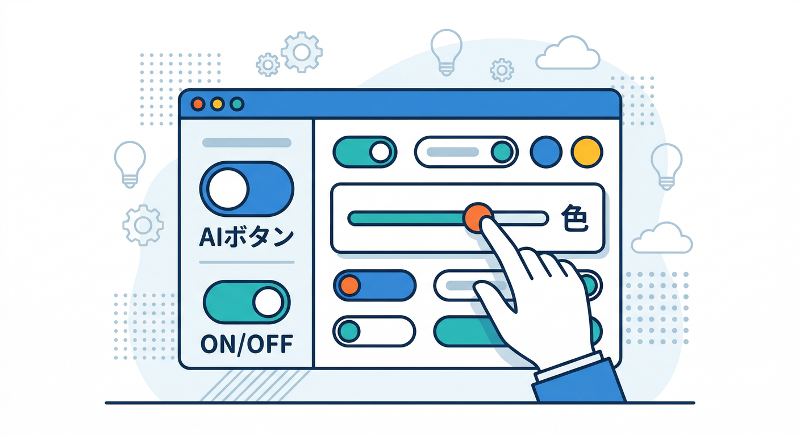
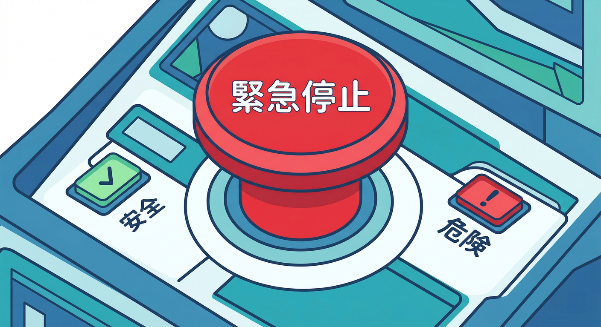
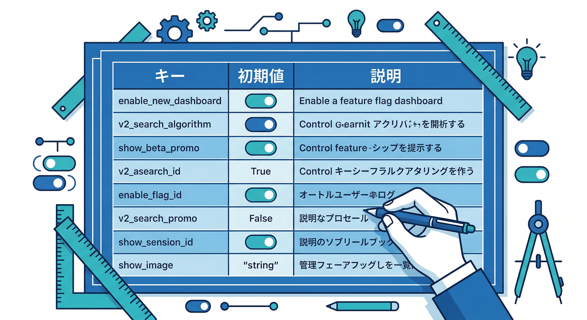
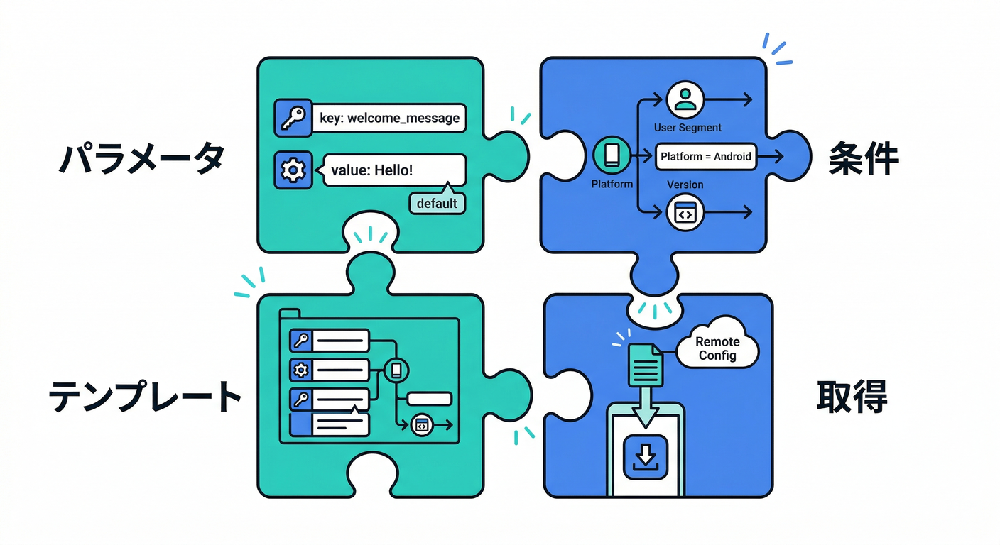
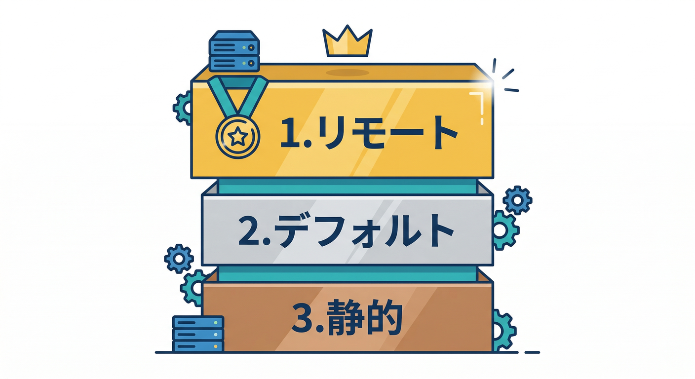
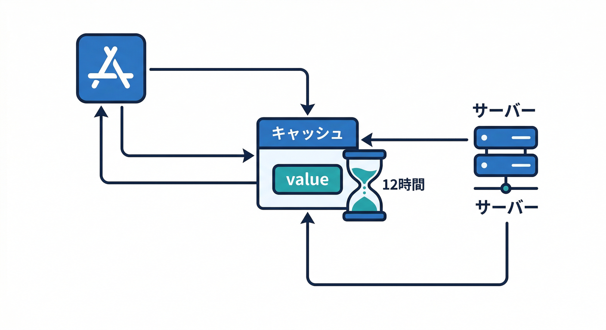
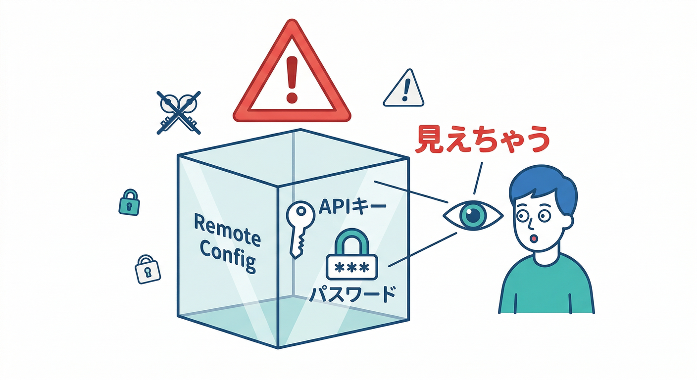
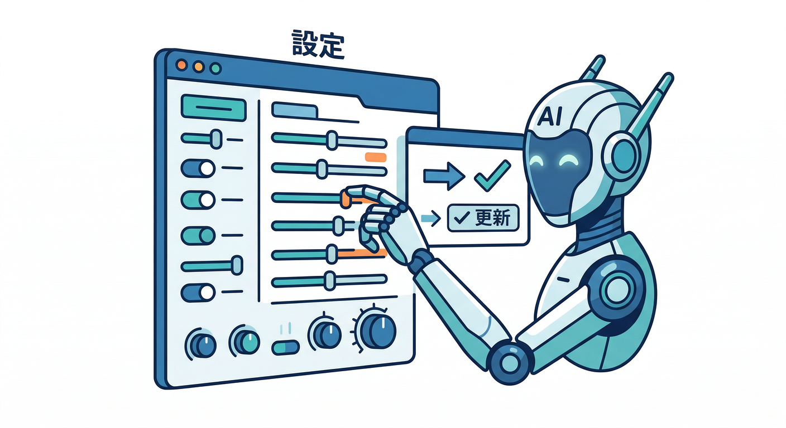

# 第08章：Remote Configの全体像（機能フラグ）🎛️🚦

この章は、「アプリを再リリースしなくても、あとから挙動を変えられる」**スイッチ盤**を手に入れる回です🧩
Remote Config は、**パラメータ（設定値）**をクラウド側で切り替えて、アプリの見た目・機能・AIの使い方まで“後付け運用”できる仕組みです📦✨ ([Firebase][1])

---

## 1) Remote Configって結局なに？🤔🎛️



ひとことで言うと…

* アプリの中に「変えたい部分」を **キー（名前）付きの変数**として用意しておく
* あとは Firebase コンソール側で値を変えるだけで、ユーザーのアプリが“あとから”切り替わる
* **機能フラグ（Feature Flag）**＝ON/OFFスイッチとして使うのが鉄板 🔥 ([Firebase][1])

例）こんなことができます👇

* 「AI整形ボタンを出す/隠す」
* 「新しいUIを一部の人だけに出す」
* 「AIのモデル名・温度・最大トークン・システム指示を差し替える」 🤖⚙️ ([Firebase][2])

---

## 2) “機能フラグ”の考え方（超重要）🚦🧠



Remote Configを使うと、改善のスピードが上がります🏎️💨
でも同時に「雑にやると事故る」ので、**フラグ設計の型**を持つのがコツです🧯

## ✅ フラグ設計の型（安全第一）🛡️

* **デフォルトは安全側**（例：AI機能は最初OFF）
* 失敗しても「UIがちょっと出ない」程度にする（致命傷を避ける）
* “緊急停止ボタン（Kill Switch）” を必ず用意（例：`enable_ai_format=false`）🚨

---

## 3) まずは「フラグの設計図」を作ろう✍️🗺️



第8章の“手を動かす”は、コードより先に **設計図づくり**です🙂
（ここができると、9章の実装が爆速になります⚡）

| キー（例）                   |       型 | 初期値（安全側） | 目的             | 失敗しても平気？  |
| ----------------------- | ------: | -------: | -------------- | --------- |
| `enable_ai_format`      | boolean |  `false` | AI整形ボタンのON/OFF | UIが出ないだけ✅ |
| `ai_model_name`         |  string |   既定モデル名 | モデル差し替え        | 既定に戻せる✅   |
| `ai_max_output_tokens`  |  number |      小さめ | コスト/暴走抑制       | 出力短いだけ✅   |
| `ai_system_instruction` |  string |    無難な指示 | 品質・安全性の調整      | 文章が少し変わる✅ |

AI系のパラメータをRemote Configで動かすのは、公式でも強く推奨される“実務パターン”です🤖🎛️ ([Firebase][2])

---

## 4) Remote Configの中身（用語をやさしく）📚🙂



Remote Configで覚える言葉は4つだけでOKです👇

## ① パラメータ（Parameter）🧩

* `enable_ai_format` みたいな「キー」と「値」のセット

## ② 条件（Condition）👥🎯

* 「この人たちだけON」みたいな出し分けルール
  ※条件の作り込みは **第11章** でガッツリやります！

## ③ テンプレート（Template）📦

* 「パラメータ＋条件＋値のセット」
* しかも **履歴が残って、ロールバック（巻き戻し）できる**のが強い💪 ([Firebase][3])

## ④ フェッチ & アクティベート（Fetch & Activate）🔄

* アプリがクラウドから値を取りに行く＝Fetch
* 取りに行った値を“採用する”＝Activate
* これを自分のタイミングで制御できるのがRemote Configの良さです🎛️ ([Firebase][1])

---

## 5) アプリ側の動き（頭の中の図）🧠🧩



「値って結局どれが使われるの？」問題は、この優先順だけ覚えればOK👇

1. **フェッチ済み＆アクティベート済みの値**（採用済み）
2. アプリ内の **デフォルト値**
3. それも無いなら型の既定値（booleanならfalse…みたいな） ([Firebase][4])

なので、最初にやるべきは **“安全なデフォルト値”を決める** です🛡️✨

---

## 6) 「取りに行きすぎ問題」とキャッシュ感覚🗃️😇



Remote Configは、呼べば毎回サーバーに取りに行く…わけじゃないです🙆‍♂️
Webの推奨（本番）では **12時間**が基本のフェッチ間隔で、取りすぎを防ぎます⏳ ([Firebase][5])

* 本番：基本はゆったり（12h）
* 開発：短くして動作確認しやすくする（でも本番は戻す）🎛️

この「フェッチ間隔」をコントロールするのが `minimumFetchIntervalMillis` です🧠 ([Firebase][5])

---

## 7) やっちゃダメ！Remote Configの地雷🧨🧯

## ❌ 秘密を入れない（超重要）🔒



Remote Configの値は通信で暗号化されますが、**アプリが受け取れる値は、エンドユーザー側から見えてしまう可能性があります**。
だから **APIキー・秘密情報・管理者パスワード**みたいなのは絶対に入れません🙅‍♂️ ([Firebase][1])

## ❌ ユーザーの許可が必要な“本質的変更”をこっそりやらない🙃

プラットフォーム要件をすり抜けるような使い方はNG、信用が死にます😇 ([Firebase][1])

---

## 8) AIとRemote Configは相性が良すぎる🤖🎛️✨

生成AIは「ちょっと変えたい」が頻発します👇

* モデルを新しい版にしたい
* システム指示を修正したい
* safety設定を微調整したい
* コストが増えたのでトークン上限を下げたい

これを**アプリ更新なしで**回せるのがRemote Configの強みです🔁🔥 ([Firebase][2])

さらに、分析（Analytics）と組み合わせると
「A/B」「条件付き配布」「コスト制御」まで繋がります📊🧪 ([Firebase][2])

---

## 9) 手を動かす（コンソールで `enable_ai_format` を作る）🖱️🎛️

ここは“最短手順”だけいきます👇

1. Firebase コンソール → **Remote Config** を開く
2. 上部の **Client**（クライアント）側テンプレートになっているのを確認
3. **Add parameter**（または Create Configuration）
4. キー：`enable_ai_format`
5. 型：boolean（真偽）
6. 値：まずは `false`（安全側）で公開🚨
7. 公開したら、**履歴（Change history）**が残ってるのを確認👀（ロールバックできる） ([Firebase][3])

※まだコードは書かなくてOK！実装は第9章で `fetchAndActivate → getValue` をやります🛠️ ([Firebase][5])

---

## 10) AIでRemote Config作業を速くする（Antigravity / Gemini CLI）🛸🤝



2026年はここが便利です✨
Firebase公式の **Firebase MCP server** を使うと、Antigravity や Gemini CLI などのAI開発ツールから、Firebaseプロジェクト作業を支援できるようになります（Remote Config も対象に含まれます）🧠⚙️ ([Firebase][6])

* Antigravity：MCP Servers から Firebase をインストールして連携できる流れが案内されています🛸 ([Firebase][6])
* Gemini CLI：Firebase拡張を入れる方法が公式に載っています💻 ([Firebase][6])

そして、Firebaseコンソール内の Gemini（Gemini in Firebase）でも、Remote Configの使い分け相談みたいな会話例が公式にあります🙂📎 ([Firebase][7])

> ここは「AIに全部やらせる」じゃなくて、**“設計図（キー一覧）をAIに作らせて、人間が採用する”**のが一番事故りにくいです🧯✨

---

## 11) ミニ課題🎒✨（5〜10分）

## お題：フラグ3つ作る🎛️🎛️🎛️

Remote Configに次の3つを作ってみてください👇

1. `enable_ai_format`（boolean / false）
2. `ai_model_name`（string / 既定モデル名）
3. `ai_max_output_tokens`（number / 小さめ）

**ゴール：**「AIが暴走したら、`enable_ai_format` を false にして一発停止できる」設計になってること🚨🤖

---

## 12) チェックテスト✅🙂

* [ ] “安全側のデフォルト”が決まってる？（まずOFFでOK？）
* [ ] キー名がブレない？（`enable_ai_format` と `enable_aiFormatting` みたいな事故が無い）
* [ ] 秘密情報を入れてない？（入れたらアウト）🔒 ([Firebase][1])
* [ ] 変更履歴（ロールバック）できるのを確認した？⏪ ([Firebase][3])

---

## おまけ：第9章に向けた“予告コード”（雰囲気だけ）👀✨

第9章ではこんな流れを実装します（今は眺めるだけでOK）👇 ([Firebase][5])

```typescript
import { getRemoteConfig, fetchAndActivate, getValue } from "firebase/remote-config";

const rc = getRemoteConfig(app);

// 開発中だけ短く（本番は推奨に合わせて戻す）
rc.settings.minimumFetchIntervalMillis = 60 * 60 * 1000; // 1h

await fetchAndActivate(rc);

const enabled = getValue(rc, "enable_ai_format").asBoolean();
```

---

次は第9章で、**実際に「ON/OFFでUIが変わる」瞬間**を作ります🎛️➡️🧑‍💻✨
第8章の段階で「フラグ設計図（キー一覧）」ができてると、ほんとにスイスイ進みますよ〜😆💨

[1]: https://firebase.google.com/docs/remote-config "Firebase Remote Config"
[2]: https://firebase.google.com/docs/ai-logic/solutions/remote-config "Dynamically update your Firebase AI Logic app with Firebase Remote Config  |  Firebase AI Logic"
[3]: https://firebase.google.com/docs/remote-config/templates "Remote Config Templates and Versioning  |  Firebase Remote Config"
[4]: https://firebase.google.com/docs/remote-config/parameters "Remote Config Parameters and Conditions  |  Firebase Remote Config"
[5]: https://firebase.google.com/docs/remote-config/web/get-started "Get started with Remote Config on Web  |  Firebase Remote Config"
[6]: https://firebase.google.com/docs/ai-assistance/mcp-server "Firebase MCP server  |  Develop with AI assistance"
[7]: https://firebase.google.com/docs/ai-assistance/gemini-in-firebase/try-gemini?hl=ja&utm_source=chatgpt.com "Firebase コンソールで Gemini を試す"
