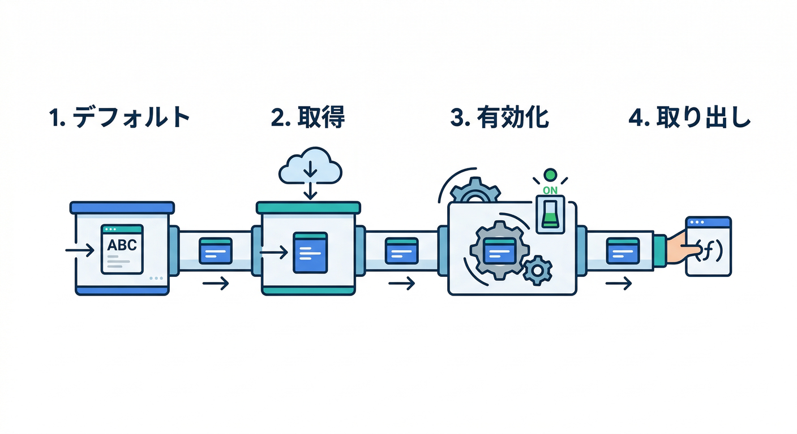
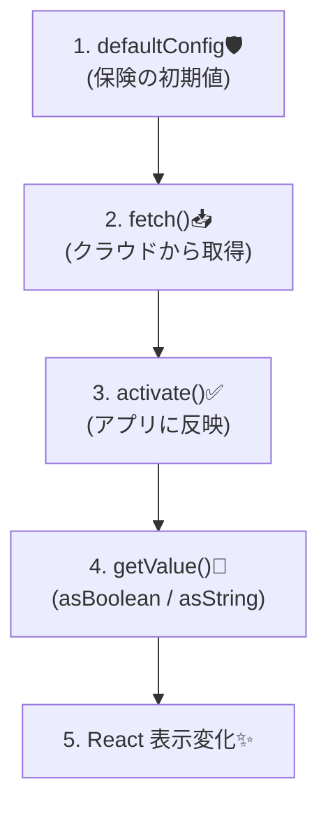
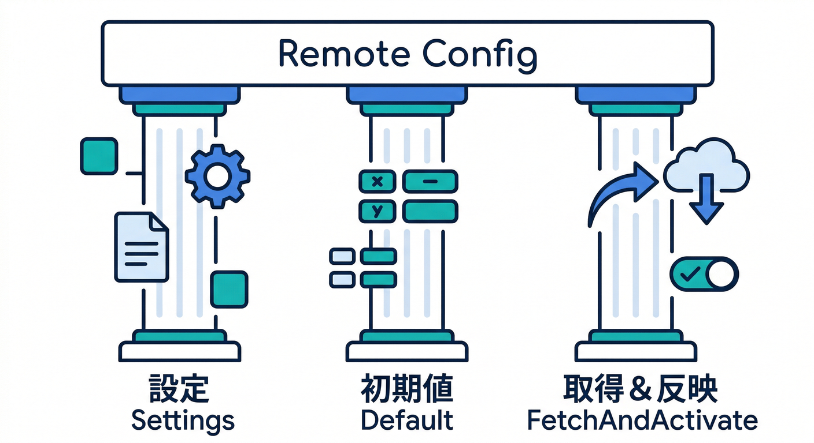
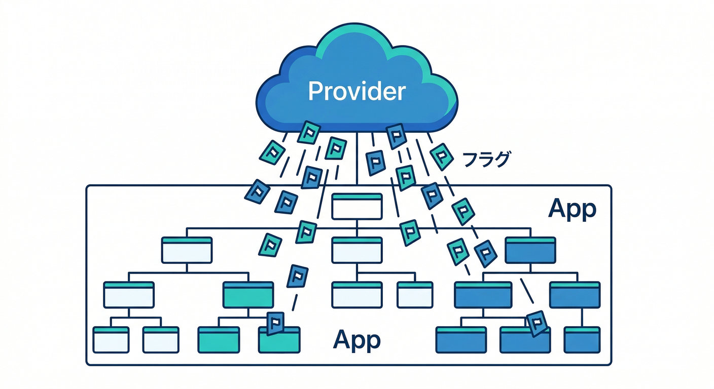
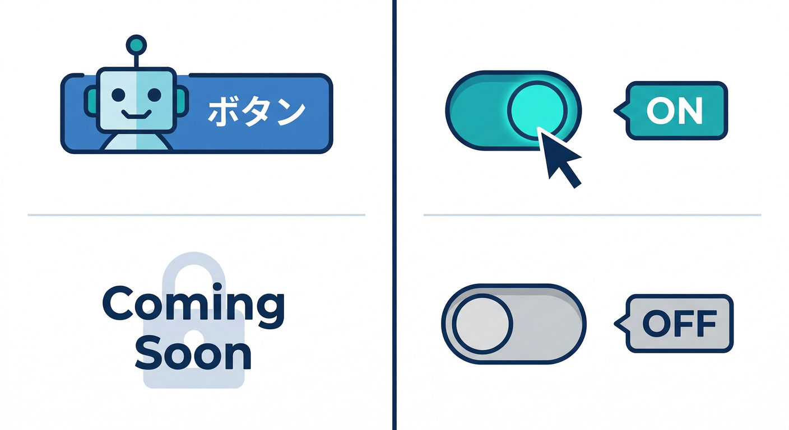
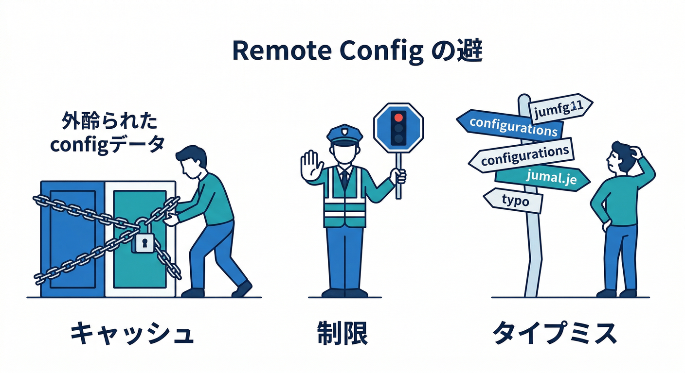
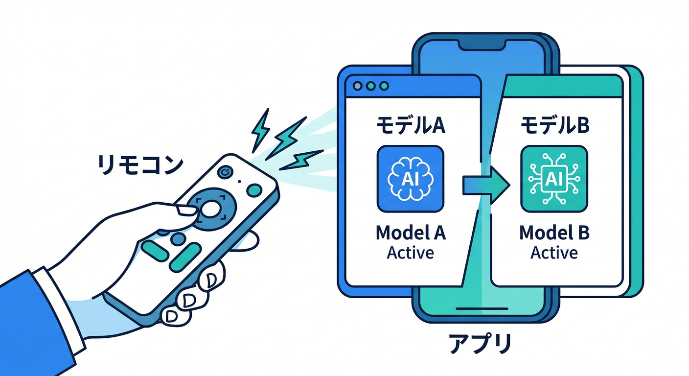

# 第09章：WebでRemote Config導入（取得→反映）🛠️📦

この章は「Consoleのスイッチを変えたら、Reactの画面が変わる！」を体験する回です🎛️✨
Remote Config は **(1) デフォルト値 → (2) フェッチ → (3) 有効化(activate) → (4) 取り出し(getValue)** の流れで動きます🧠
Webの公式手順でも、`fetchAndActivate()` で「取得＋反映」を一気にやるのが基本になってます。([Firebase][1])

---

## 1) 今日作るフラグ（最小セット）🧩





まずは「変化が目で分かる」ものが最強です👀✨

* `enable_ai_format`（boolean）… AI整形ボタンを出す/隠す🤖🔘
* `ai_model`（string）… AIで使うモデル名を切り替え（後で超便利）🧠🔁
* `ai_daily_limit`（number）… 1日上限（暴走＆課金事故よけ）🧯💸

⚠️超重要：Remote Config は**秘密を置く場所じゃない**です。デフォルト値でもフェッチ後でも、クライアントが持つ値はユーザー側から見えてしまいます（なのでAPIキーとかは絶対NG）🙅‍♂️🔑([Firebase][1])

---

## 2) Remote Config 初期化の“型”を1つ作ろう 🧱✨



ポイントはこの3つです👇

1. **settings**：取りに行く頻度（キャッシュ）＆タイムアウト
2. **defaultConfig**：通信できない時でも動く「保険」🛟
3. **fetchAndActivate**：取得→反映を一発で🚀([Firebase][1])

## 例：`src/lib/remoteConfig.ts`（そのまま使える形）👇

```typescript
import { FirebaseApp } from "firebase/app";
import {
  getRemoteConfig,
  fetchAndActivate,
  getValue,
} from "firebase/remote-config";

export type RemoteFlags = {
  enableAiFormat: boolean;
  aiModel: string;
  aiDailyLimit: number;
};

const ms = {
  minute: 60 * 1000,
  hour: 60 * 60 * 1000,
};

export async function loadRemoteFlags(app: FirebaseApp): Promise<RemoteFlags> {
  const rc = getRemoteConfig(app);

  // ✅ 取りに行く設定（デフォルトでもOKだけど、意図をコードに残すと強い）
  // - fetchTimeoutMillis のデフォルトは 60秒
  // - minimumFetchIntervalMillis のデフォルトは 12時間（本番推奨も12時間）
  //   開発中だけ短くするのが定番 👍
  rc.settings.fetchTimeoutMillis = 60 * 1000;
  rc.settings.minimumFetchIntervalMillis = import.meta.env.DEV ? 0 : 12 * ms.hour;

  // ✅ デフォルト値（通信できなくても“最低限”動く）
  rc.defaultConfig = {
    enable_ai_format: false,
    ai_model: "gemini-2.5-flash-lite",
    ai_daily_limit: 20,
  };

  try {
    await fetchAndActivate(rc);
  } catch (e) {
    // 失敗しても defaultConfig で動くのでOK！
    // ただし、短時間に叩きすぎると throttle されることがあるので注意🧯
    // （FETCH_THROTTLE など）→ 必要ならリトライは間隔を伸ばす
    console.warn("Remote Config fetch failed:", e);
  }

  // ✅ 取り出し（全部 getValue → asXxx）
  const enableAiFormat = getValue(rc, "enable_ai_format").asBoolean();
  const aiModel = getValue(rc, "ai_model").asString();
  const aiDailyLimit = getValue(rc, "ai_daily_limit").asNumber();

  // デバッグ用：その値が「default 由来」か「remote 由来」か見れる👀
  // getSource() があるのが地味に便利！
  console.log("enable_ai_format source:", getValue(rc, "enable_ai_format").getSource());

  return { enableAiFormat, aiModel, aiDailyLimit };
}
```

* **本番の推奨キャッシュは12時間**で、短時間にフェッチしまくると throttle されることがあります🧯([Firebase][1])
* `getSource()` で「どっちの値？」が追えるので、ハマりにくくなります👀([Firebase][2])

---

## 3) React に流し込む（Provider でラクする）🧑‍💻🧩



画面のあちこちで使うので、Context にしてしまうのが楽です✨

## 例：`src/lib/RemoteFlagsProvider.tsx`

```typescript
import React, { createContext, useContext, useEffect, useMemo, useState } from "react";
import type { FirebaseApp } from "firebase/app";
import { loadRemoteFlags, type RemoteFlags } from "./remoteConfig";

type RemoteFlagsState = {
  flags: RemoteFlags | null;
  reload: () => Promise<void>;
};

const Ctx = createContext<RemoteFlagsState | null>(null);

export function RemoteFlagsProvider({
  app,
  children,
}: {
  app: FirebaseApp;
  children: React.ReactNode;
}) {
  const [flags, setFlags] = useState<RemoteFlags | null>(null);

  const reload = async () => {
    const next = await loadRemoteFlags(app);
    setFlags(next);
  };

  useEffect(() => {
    void reload();
    // eslint-disable-next-line react-hooks/exhaustive-deps
  }, []);

  const value = useMemo(() => ({ flags, reload }), [flags]);

  return <Ctx.Provider value={value}>{children}</Ctx.Provider>;
}

export function useRemoteFlags() {
  const v = useContext(Ctx);
  if (!v) throw new Error("RemoteFlagsProvider is missing");
  return v;
}
```

---

## 4) 反映：フラグでUIを切り替える🎚️👀



## 例：`App.tsx` のイメージ

```typescript
import React from "react";
import { useRemoteFlags } from "./lib/RemoteFlagsProvider";

export function App() {
  const { flags, reload } = useRemoteFlags();

  if (!flags) return <div>設定を読み込み中…⏳</div>;

  return (
    <div>
      <h1>メモアプリ📝</h1>

      <button onClick={reload}>設定を更新🔄</button>

      {flags.enableAiFormat ? (
        <button>AIで文章を整える🤖✨</button>
      ) : (
        <div>AI整形は準備中です🙇‍♂️</div>
      )}

      <div style={{ marginTop: 12 }}>
        <div>ai_model: {flags.aiModel} 🧠</div>
        <div>ai_daily_limit: {flags.aiDailyLimit} 🧯</div>
      </div>
    </div>
  );
}
```

これで **Consoleで `enable_ai_format` を ON/OFF** すると、画面のボタンが変わるようになります🎛️🎉
（ただし「すぐ反映されない！」時は次の章の注意点👇）

---

## 5) 「変えたのに変わらない！」あるある🧯😇



だいたいこの3つです👇

## A. キャッシュ（minimum fetch interval）に引っかかってる🗃️

Remote Config は **デフォルトで12時間**キャッシュします。開発中だけ短くするのが推奨です。([Firebase][1])
→ さっきの例みたいに `import.meta.env.DEV ? 0 : 12h` で切り替えるとラク👍

## B. フェッチしすぎて throttle された🚦

短時間に叩きまくると `FETCH_THROTTLE` になり得ます。公式も「catchして、必要なら待ってリトライ（指数バックオフ）」を推奨してます🧯([Firebase][1])

## C. キー名の打ち間違い🫠

`enable_ai_format` と `enable_ai_fromat`（👈地獄）みたいなやつ。
→ `getSource()` をログに出すと「default しか出てない」などで気づけます👀([Firebase][2])

---

## 6) 🌟ボーナス：公開直後に“即反映”したいなら Real-time Remote Config ⚡

最近のWeb手順には **リアルタイム更新**（`onConfigUpdate` で変更を検知→自動 fetch→activate）が入っています📡✨
「値をPublishしたら、待たずに拾いたい」系で強いです。([Firebase][1])

---

## 7) AI連携のリアル：Remote Config は AI運用の“リモコン”になる🤖🎛️



AIって「モデル更新」「安全設定」「プロンプト微調整」「コスト制御」が頻繁に起きますよね😇
公式のソリューションガイドでも、**AIのモデル名をアプリ内でリモート変更したいなら Remote Config を強く推奨**って書かれてます。([Firebase][3])

さらに、Firebase AI Logic では **Gemini 2.0 Flash / Flash-Lite が 2026-03-31 に retire** 予定なので、アプリを更新せずモデルを差し替えられる設計が安心です🧯（例：`gemini-2.5-flash-lite` へ）([Firebase][4])

> つまり：`ai_model` を Remote Config にしておくと「急にモデル切替が必要」でも助かる🙏✨

---

## ミニ課題🎒✅

1. Console に `enable_ai_format`（false）を作る🎛️
2. React でボタンを出し分ける🤖🔘
3. `getSource()` をログに出して「default→remote」を目視チェック👀
4. `ai_model` を追加して、画面に表示（将来のAI切替の土台）🧠🔁

---

## チェック✅🎉

* Console の値変更で UI が切り替わった？🎛️
* 開発中に「すぐ反映されない」をキャッシュ原因だと説明できる？🗃️
* 秘密情報を Remote Config に置かない理由を言える？🙅‍♂️🔑([Firebase][1])
* （余裕）Real-time Remote Config の存在を把握した？📡([Firebase][1])

---

次の第10章では、この章で作った `minimumFetchIntervalMillis` を「本番運用の作法」に寄せて、**段階リリースっぽい動かし方**（取り方・反映タイミング・事故らない設計）に整えていきます🚦✨

[1]: https://firebase.google.com/docs/remote-config/web/get-started "Get started with Remote Config on Web  |  Firebase Remote Config"
[2]: https://firebase.google.com/docs/reference/js/remote-config.value "Value interface  |  Firebase JavaScript API reference"
[3]: https://firebase.google.com/docs/remote-config/solutions/vertexai?hl=ja "Firebase Remote Config を使用して Firebase AI Logic アプリを動的に更新する"
[4]: https://firebase.google.com/docs/ai-logic "Gemini API using Firebase AI Logic  |  Firebase AI Logic"
