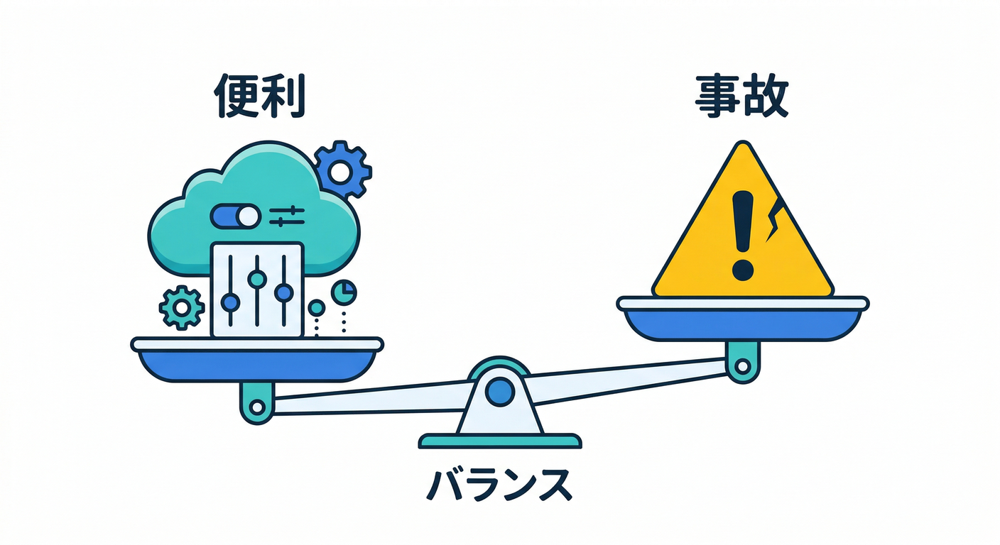
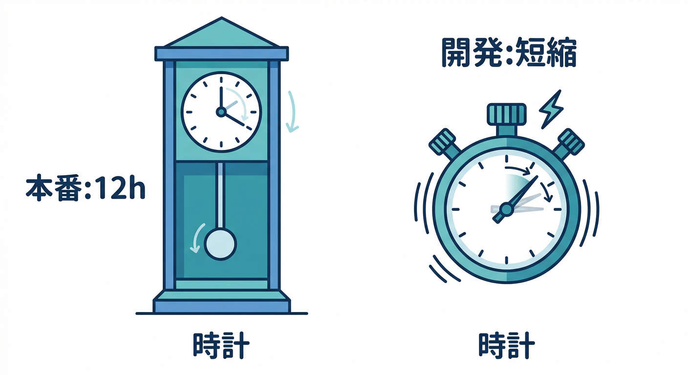
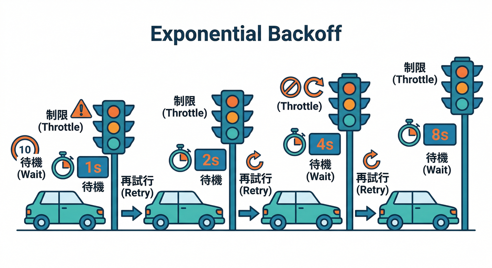
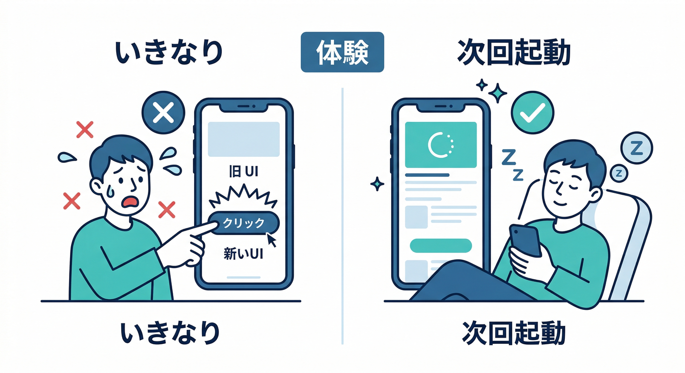
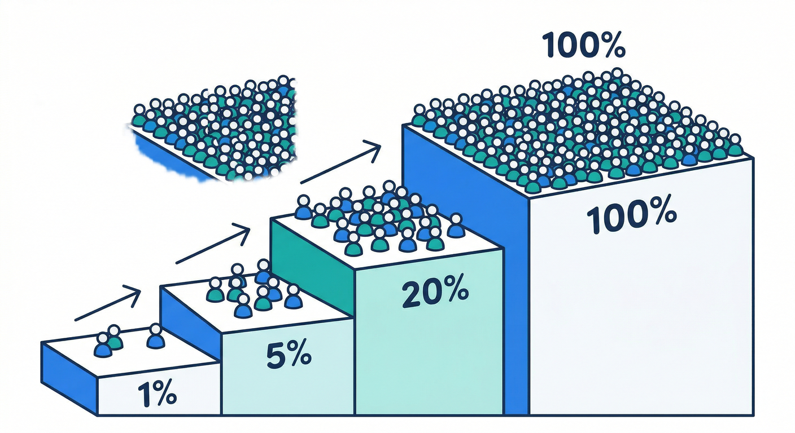
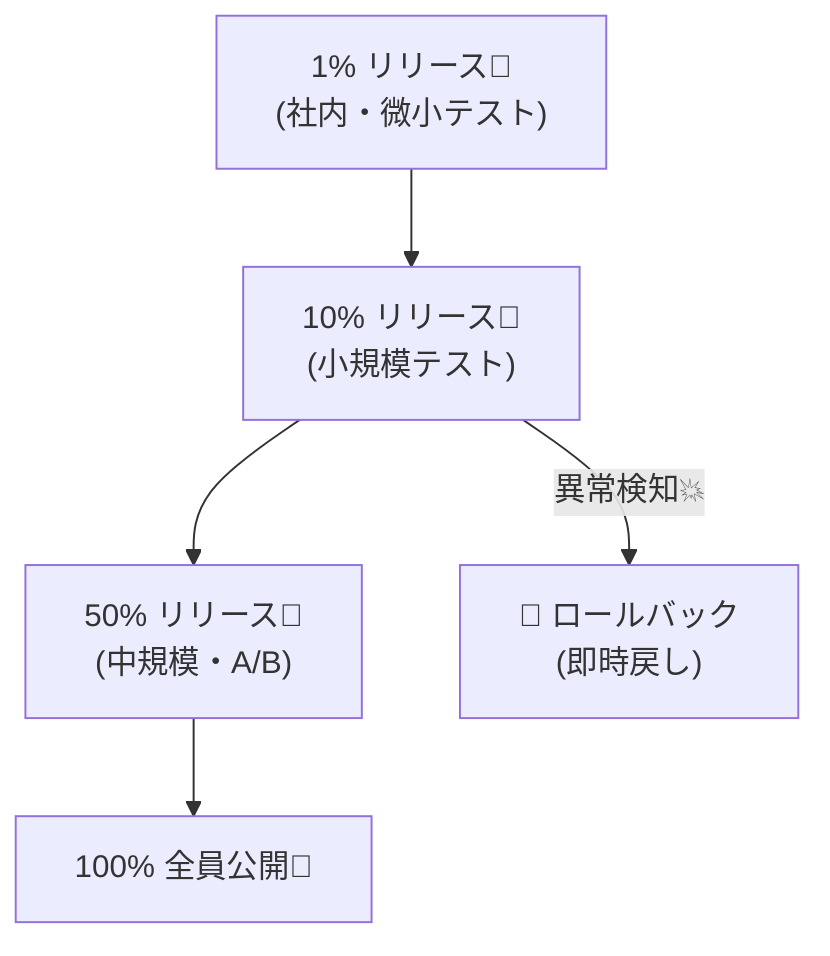
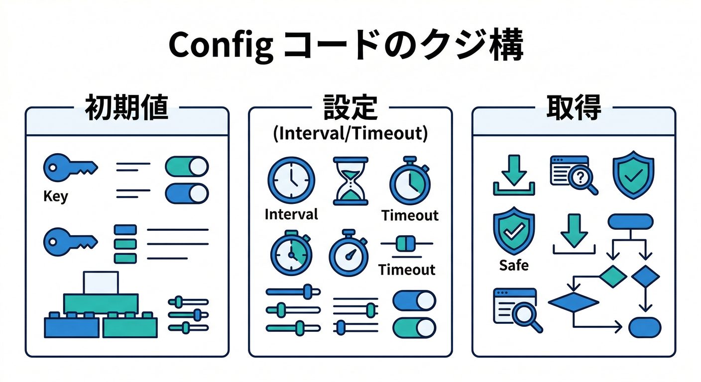
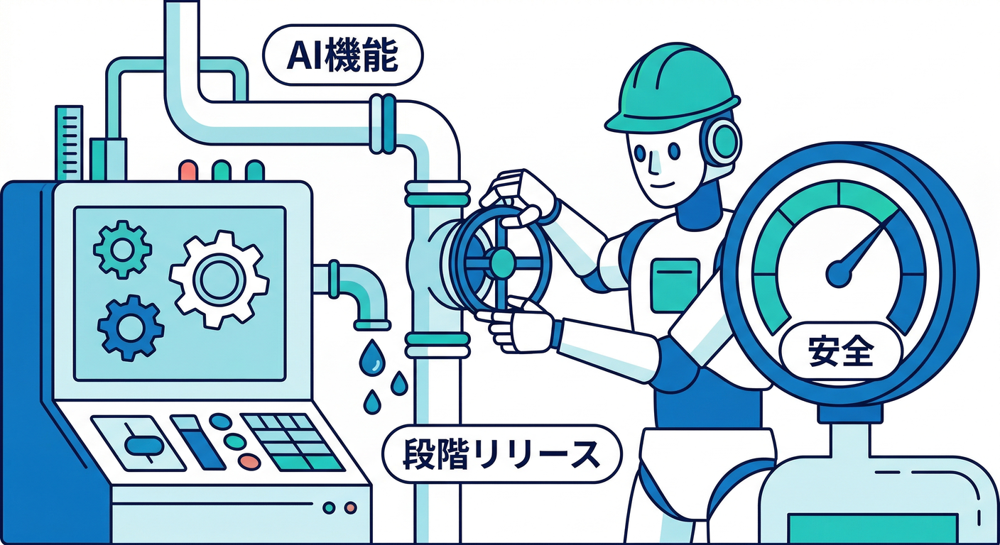

# 第10章：配布の作法（フェッチ間隔・段階リリース）🧠🚦

この章はひとことで言うと、**「Remote Config を“便利に使いつつ、やりすぎて事故らない”運用ルールづくり」**です😇
Remote Config は強いぶん、雑に使うと👇みたいな事故が起きます。

* アプリが起動中に UI が急に変わって、ユーザーが混乱🤯
* 画面描画のたびに fetch して、**アクセス集中＆スロットリング**🧨
* 開発用の設定（頻繁フェッチ）を本番に混ぜて、クォータに当たる🚨

この章で、**“正しい取り方”＋“安全な出し方（段階リリース）”**を固めます✍️

---

## 1) まず用語を3行で📘✨



* **fetch**：サーバーから新しい設定を取りに行く📥
* **activate**：取りに行った設定を、アプリの挙動に反映する✅
* **キャッシュ**：毎回取りに行かず、しばらく使い回す🗃️

Remote Config は「**fetch しすぎると制限（throttle）される**」のがポイントです⚠️ ([Firebase][1])

---

## 2) フェッチ間隔の“本番ルール”はこれ🕰️



## ✅ 原則：本番は「12時間」ペースで十分

Web の Remote Config は、**本番のデフォルト＆推奨フェッチ間隔が 12時間**です。
つまり「12時間の窓では、何回 fetch を呼んでも、裏側では最大1回しか取りに行かない」イメージです🧠 ([Firebase][1])
（この“窓”を変えるのが `minimumFetchIntervalMillis` です） ([Firebase][2])

## ✅ 開発だけ例外：短くしてよい（でも“本番に混ぜない”）

開発中は試行回数が多いので、**一時的に短く**できます。
ただし公式も「これは開発用で、本番ではやらないでね」と釘を刺しています⚠️ ([Firebase][1])

---

## 3) スロットリング（FETCH_THROTTLE）対策🧯



fetch しすぎると SDK が `FETCH_THROTTLE` を投げます。
このときは **指数バックオフ（exponential backoff）でリトライ**が推奨です🐢➡️🐇 ([Firebase][1])

> 「エラーなら即リトライ！」は逆に悪化しがちなので、待ち時間を伸ばしていくのがコツです😇

---

## 4) “いつ activate するか”がUXを決める🎮✨



Remote Config は **見た目や挙動を変える**ので、activate のタイミングが超大事です。
公式も「ユーザー体験が滑らかになるタイミング（例：次回起動時）で activate しよう」と言っています🚦 ([Firebase][1])

さらに「配布の作法」としては👇が鉄板です。

## ✅ 鉄板パターン：起動時に fetch → 次の自然なタイミングで反映

* 起動中にいきなり UI が切り替わると混乱しやすい
* **“次にアプリを開いたとき”に反映**する設計が安全🙆‍♂️ ([Firebase][1])

## ✅ タイムアウトも意識（待たせすぎない）

Remote Config の fetch タイムアウトはデフォルト **60秒**です（長い！） ([Firebase][2])
状況によっては短くして、失敗したら **デフォルト値で進む**のが親切です🙂

---

## 5) 段階リリース（Rollouts）で“安全に出す”🪜🚦





「いきなり全員に ON」は危険なので、**少しずつ出して、ダメなら即戻す**が基本です🔁

Remote Config には **Rollouts（段階リリース）**があり、更新を小さく出して安全に運用できます。 ([Firebase][3])
さらに、Rollouts では **コントロールグループ**を使って比較もできます（同サイズで、100%前は最大50%まで等の制約あり）。 ([Firebase][4])

## ✅ 段階リリースの“レシピ”（おすすめ）

1% → 5% → 20% → 50% → 100% 🎛️
各段階で見るもの👇

* Analytics のイベント（使われた？離脱増えた？）📊
* Performance（遅くなってない？）⚡
* 問題があれば **ロールバック**🧯

---

## 6) ハンズオン：配布ポリシーをコードにする🧩🧑‍💻

ここでは「**フェッチ間隔を dev/prod で切り替え**」「**タイムアウト短縮**」「**安全な fetchAndActivate**」を入れます。

## 6-1. `remoteConfig.ts` を作る（設定まとめ役）📦



```typescript
// remoteConfig.ts
import { getRemoteConfig, fetchAndActivate } from "firebase/remote-config";
import type { FirebaseApp } from "firebase/app";

const TWELVE_HOURS = 12 * 60 * 60 * 1000;

export function initRemoteConfig(app: FirebaseApp) {
  const rc = getRemoteConfig(app);

  // まず「デフォルト値」を必ず置く（通信できなくてもアプリが動く🛟）
  rc.defaultConfig = {
    enable_new_ui: false,
    // AI系フラグ例（第12章にもつながる🤖）
    enable_ai: false,
    ai_daily_limit: 3,
    model_name: "gemini-2.5-flash",
  };

  // dev/prod で “取り方” を分ける（本番は12時間が基本）
  const isDev = import.meta.env.DEV;

  rc.settings = {
    // 失敗してもすぐ諦めてデフォルトで進む（体験が軽い）
    fetchTimeoutMillis: 10_000, // 10秒（好みで調整）
    // 開発は短く、本番は長く
    minimumFetchIntervalMillis: isDev ? 60_000 : TWELVE_HOURS, // dev:1分 / prod:12時間
  };

  return rc;
}

export async function safeFetchAndActivate(rc: ReturnType<typeof getRemoteConfig>) {
  try {
    const updated = await fetchAndActivate(rc);
    return { ok: true as const, updated };
  } catch (e) {
    // FETCH_THROTTLE などが来ても、アプリはデフォルト値で動かす方針🙂
    return { ok: false as const, error: e };
  }
}
```

ポイントはこれ👇

* `minimumFetchIntervalMillis`（キャッシュの鮮度） ([Firebase][2])
* 本番は 12時間が推奨 ([Firebase][1])
* fetch タイムアウトはデフォルト 60秒（必要なら短縮） ([Firebase][2])

## 6-2. `App.tsx` で起動時に1回だけ fetch（連打しない）🚀

```typescript
// App.tsx（イメージ）
import { useEffect, useMemo, useState } from "react";
import { getValue } from "firebase/remote-config";
import { initRemoteConfig, safeFetchAndActivate } from "./remoteConfig";
import { app } from "./firebaseApp"; // getApps/init済みの想定

export default function App() {
  const rc = useMemo(() => initRemoteConfig(app), []);
  const [ready, setReady] = useState(false);

  useEffect(() => {
    (async () => {
      await safeFetchAndActivate(rc);
      // 反映タイミングは「ここ」か「次回起動」か設計次第
      // まずは章の練習として “起動時に反映” にする🙂
      setReady(true);
    })();
  }, [rc]);

  const enableNewUi = getValue(rc, "enable_new_ui").asBoolean();
  const enableAi = getValue(rc, "enable_ai").asBoolean();

  if (!ready) return <div>準備中…⏳</div>;

  return (
    <div>
      <h1>{enableNewUi ? "新UI✨" : "旧UI🙂"}</h1>
      <button disabled={!enableAi}>AI整形🤖</button>
    </div>
  );
}
```

---

## 7) さらに強い：リアルタイム更新（必要な人だけ）📡✨

「更新が出たら端末側が自動で取りに行く」仕組みもあります（Real-time Remote Config）。
Web では `onConfigUpdate` で listen できます📣 ([Firebase][1])
ただし **Realtime API が必要**なので、API 有効化の確認も入ります。 ([Firebase][1])

> そして重要：リアルタイム更新は **最小フェッチ間隔（minimumFetchIntervalMillis）を“無視して”更新を取る**ので、使いどころは選びましょう⚠️ ([Firebase][5])
> （例：社内検証ユーザーだけ／管理者だけ、など）

---

## 8) AI と Remote Config は相性よすぎ問題🤝🤖



Firebase の公式ガイドでも、生成AIアプリは Remote Config と組み合わせるのが強く推奨されています。
たとえば👇

* **モデル名を後から切り替える**（新しい Gemini が出たら差し替え） ([Firebase][6])
* **システム指示や安全設定を後から直す**（問題が出たら即修正） ([Firebase][6])
* **コスト管理**（使うモデルや頻度、max tokens 的なものを調整） ([Firebase][6])
* Web でも `defaultConfig` → `fetchAndActivate` → `getValue` の流れで値を使う例が載ってます📘 ([Firebase][6])

この章の“段階リリース”と組み合わせると、AI機能を **1%だけON → 問題なければ増やす**ができます🪜🤖

---

## 9) ミニ課題🧩✍️（10〜15分）

## 課題A：自分の「配布ポリシー」を1枚にする📝

次を埋めてください🙂

* 本番の `minimumFetchIntervalMillis`：＿＿＿＿
* 開発の `minimumFetchIntervalMillis`：＿＿＿＿
* fetch タイムアウト：＿＿＿＿
* activate タイミング：起動時 / 次回起動時 / その他（＿＿）
* ロールアウト手順：1%→5%→…（＿＿＿＿）

## 課題B：事故シナリオ1つ書いて、対策を書く🧯

例：「dev の 1分設定を本番に出してしまった」→「ビルド時に prod では固定、CIでチェック」✅

---

## 10) チェックリスト✅🎯

* `fetchAndActivate` を **UIのレンダーループで呼んでない** ✅
* 本番のフェッチ間隔が **12時間ベース**になってる ✅ ([Firebase][1])
* `FETCH_THROTTLE` が来ても **アプリが壊れない** ✅ ([Firebase][1])
* activate のタイミングを意識して、**ユーザーが混乱しない** ✅ ([Firebase][1])
* 段階リリースの手順が決まってる ✅ ([Firebase][3])

---

次の第11章は「**条件付き配布（ユーザー別に出し分け）**」だけど、今日の第10章ができてると、**“出し分けても事故らない土台”**がもう完成してます🏗️✨
もしよければ、あなたのミニアプリ（メモ＋画像＋AI整形）前提で、**実際のフラグ設計（キー名・型・デフォルト・ロールアウト表）**をこちらで“完成版テンプレ”にして出しますよ😆📋

[1]: https://firebase.google.com/docs/remote-config/web/get-started "Get started with Remote Config on Web  |  Firebase Remote Config"
[2]: https://firebase.google.com/docs/reference/js/remote-config.remoteconfigsettings "RemoteConfigSettings interface  |  Firebase JavaScript API reference"
[3]: https://firebase.google.com/docs/remote-config/rollouts "Remote Config rollouts  |  Firebase Remote Config"
[4]: https://firebase.google.com/docs/remote-config/rollouts/about "About Remote Config rollouts  |  Firebase Remote Config"
[5]: https://firebase.google.com/docs/remote-config/loading "Firebase Remote Config loading strategies"
[6]: https://firebase.google.com/docs/ai-logic/solutions/remote-config?hl=ja "Firebase Remote Config を使用して Firebase AI Logic アプリを動的に更新する"
