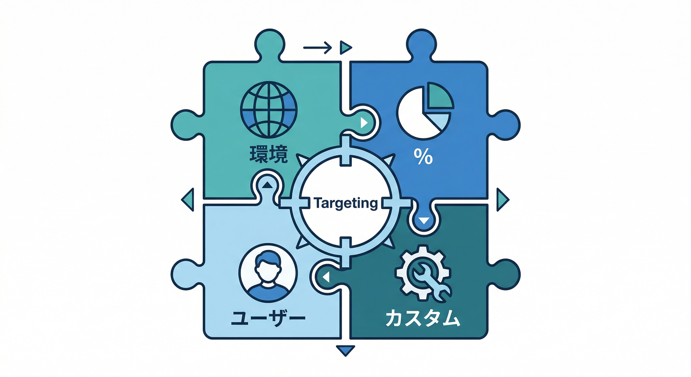
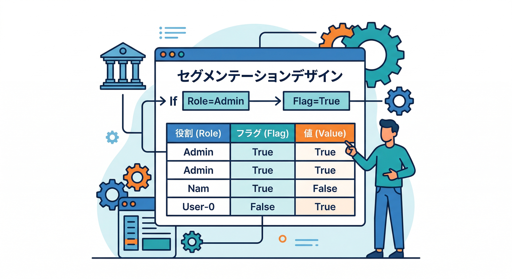
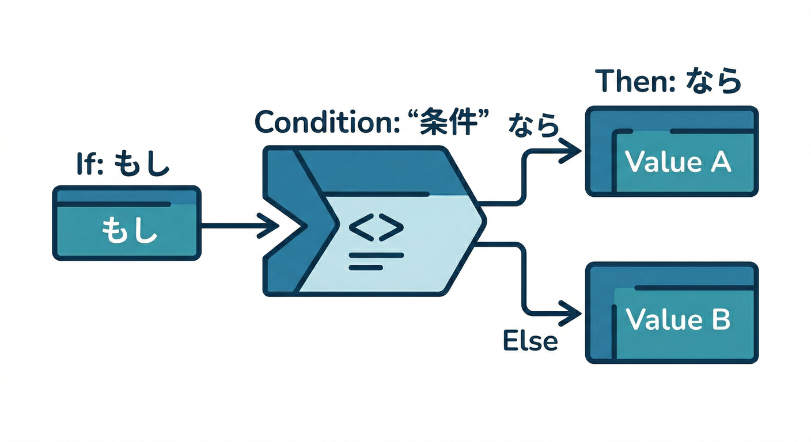
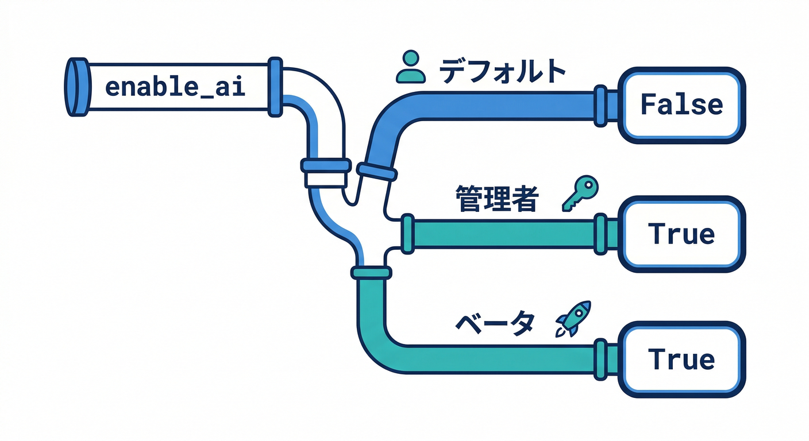
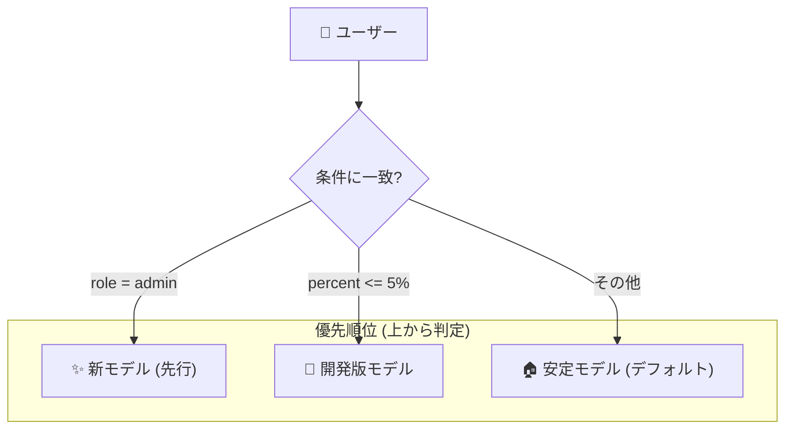
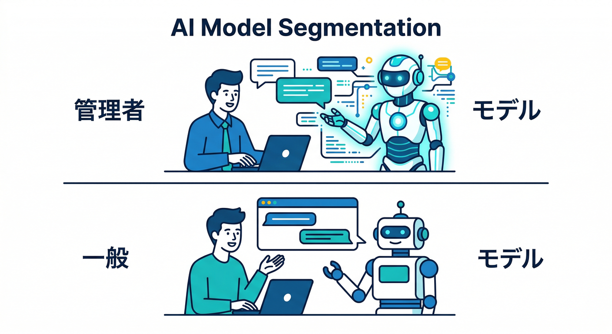

# 第11章：条件付き配布（ユーザー別に出し分け）👥🎛️

この章のゴールはこれ👇

* 「人によってUIや機能を変える」を **Remote Configだけで**できるようにする🎛️✨
* “新機能の事故”を減らす（いきなり全員に出さない）🧯
* AI機能（例：文章整形ボタン🤖）を **安全に段階解放**できるようにする🚦

---

## 1) “出し分け”って、どんな時に使うの？🎁


たとえばこんなシーン👇

* 新規ユーザーだけ「チュートリアルUI」をON🌱
* 管理者だけ「デバッグ表示」をON👮‍♂️
* まずは5%だけ「AI整形ボタン」をON（問題なければ20%→100%）🧪➡️🚀
* ブラウザや言語で文言を変える（日本語だけ文言A、英語は文言B）🌏🗣️

Remote Configの“条件”は、ざっくり言うと **巨大な if 文**です😆
「もし条件が真なら、この値を使う。違えば別の値」みたいなやつ👇 ([Firebase][1])

---

## 2) 条件はだいたい4系統🧩（Webで重要なやつ中心）



Remote Configの条件でよく使う材料はこれ👇 ([Firebase][1])

## A. 環境で出し分け（すぐ効く）🖥️🌐

* 端末の言語（device.language）🗣️
* 端末の国/地域（device.country）🌏
* Webなら「OSやブラウザ」（app.operatingSystemAndVersion / app.browserAndVersion）も使える🪟🌐 ([Firebase][1])

## B. 割合で出し分け（段階リリースの王様）📊🚦

* ランダムに“何%だけ”ON（percent）
  「まず5%だけ」みたいな段階解放に便利です🧪 ([Firebase][1])

## C. ユーザー属性で出し分け（本命）👤🏷️

* ユーザープロパティ（app.userProperty）
* オーディエンス（app.audiences）
  ※これ、Analyticsが関わります📊（後述） ([Firebase][1])

## D. さらに強い出し分け（上級）🔧

* インストールID指定（app.firebaseInstallationId）＝「この人たちだけ」🎯
* カスタムシグナル（app.customSignal）＝「自前の属性」で条件を作る🧠 ([Firebase][1])

---

## 3) ハンズオン：新規だけ新UI、管理者だけAIボタン🤖🧑‍💼

ここではミニアプリ（メモ＋AI整形）を想定して進めるね📝✨
やることは大きく5ステップ👇

## ステップ1：まず“出し分け設計表”を作る🗂️✍️



迷子防止に、最初にこれだけ決めよう👇

* ユーザープロパティ名：例「role」「cohort」

  * role：admin / user
  * cohort：new / existing
* Remote Configのパラメータ：例

  * enable_ai_format（AI整形ボタンを出すか）
  * enable_new_editor（新UIを出すか）
  * ai_prompt_variant（AIの指示文パターンA/B）
  * ai_model（AIのモデル名を切り替え）

この“表”を作ると、後がめちゃ楽になります😌✨

---

## ステップ2：Web（React）でユーザープロパティを付ける🏷️👤


Webでもユーザープロパティは付けられます（例：favorite_food みたいに）🧺 ([Firebase][2])
Reactだと、ログイン直後やプロフィール確定後に付けるのが自然👍

```typescript
import { getAnalytics, setUserProperties } from "firebase/analytics";

// 例：ログイン後に呼ぶ想定
export function applyUserSegmentation(role: "admin" | "user", isNew: boolean) {
  const analytics = getAnalytics();

  setUserProperties(analytics, {
    role,                    // "admin" or "user"
    cohort: isNew ? "new" : "existing",
  });
}
```

⚠️注意：ユーザープロパティは「使えるようになるまで数時間かかる」ことがあります（特にWebだと体感しやすい）⏳ ([Firebase][2])
→ だから最初の動作確認は「割合（percent）」や「言語（device.language）」条件でやると早いです🚀

---

## ステップ3：Remote Configのコンソールで“条件”を作る🎛️🧱



Firebase Console → Remote Config → Conditions で、例えばこう作る👇

* 条件「Admins」：ユーザープロパティ role が admin の人
* 条件「NewUsers」：ユーザープロパティ cohort が new の人
* 条件「Beta5Percent」：5%だけ（percent）

使える材料の代表例（ユーザープロパティ、オーディエンス、ブラウザ/OS、言語、割合…）は公式の一覧どおりです📚 ([Firebase][1])

---

## ステップ4：パラメータに“条件付きの値”を設定する🎚️✅



例：enable_ai_format をこうする👇

* デフォルト：OFF（false）
* 条件「Admins」：ON（true）
* 条件「Beta5Percent」：ON（true）※管理者以外でも少しだけ試す

例：ai_prompt_variant をこうする👇

* デフォルト：A
* 条件「Beta5Percent」：B（新しいプロンプトを試す）

例：ai_model をこうする👇

* デフォルト：安定モデル
* 条件「Admins」：新モデル（先行テスト）



💥超重要：Remote Configは **秘密を入れる場所じゃない**です。
キーや値は、クライアント側に届くものはユーザーが見られます🫣
「APIキー」「個人情報入りプロンプト」みたいなのは絶対入れないでね🙅‍♂️ ([Firebase][3])

---

## ステップ5：アプリ側で取得→反映する📥🧩

Webの基本は「取得してから使う」だけ🙂
開発中は最小フェッチ間隔を短くしてOK（本番は推奨どおり抑える）⏱️ ([Firebase][3])

```typescript
import { initializeApp } from "firebase/app";
import { getRemoteConfig, fetchAndActivate, getValue } from "firebase/remote-config";

const app = initializeApp({ /* ... */ });
const rc = getRemoteConfig(app);

// 開発中は短めに（本番は推奨の考え方に合わせる）
rc.settings.minimumFetchIntervalMillis = 60 * 60 * 1000; // 例：1時間

export async function loadFlags() {
  await fetchAndActivate(rc);

  const enableAi = getValue(rc, "enable_ai_format").asBoolean();
  const enableNewEditor = getValue(rc, "enable_new_editor").asBoolean();
  const promptVariant = getValue(rc, "ai_prompt_variant").asString();

  return { enableAi, enableNewEditor, promptVariant };
}
```

---

## 4) よくある落とし穴🕳️（ここで詰まりがち！）

## 落とし穴1：Analyticsを入れてなくて、ユーザー属性で出せない😇

Webガイドでも明言されていて、**ユーザープロパティ/オーディエンスへの条件付けにはAnalyticsが必要**です📊 ([Firebase][3])

## 落とし穴2：ユーザープロパティが“すぐ効く”と思ってた⏳

数時間かかることがあるので、最初は「percent」や「device.language」で動作確認すると早いです🚀 ([Firebase][2])

## 落とし穴3：“新規ユーザー判定”をfirst_openでやろうとしてWebで迷う🤔

条件の材料として first_open 由来のものもありますが、ターゲティングの説明には「初回オープン時刻はモバイルだけ」注意が出ています📌 ([Firebase][1])
→ Webなら「自分で cohort=new を付ける」が一番コントロールしやすいです👍

## 落とし穴4：フェッチ間隔が長くて“変わらない！”ってなる😵

本番は控えめが基本だけど、開発中は短くして検証しやすくするのが定石です⏱️ ([Firebase][3])

## 落とし穴5：条件でAIの“危ないもの”を配ってしまう🧨

Remote Configの値は見られる前提で！
AIのプロンプト運用でも同じ注意が書かれています🛡️ ([Firebase][3])

---

## 5) AI連携で、ここが強い🤖⚡



Remote ConfigでAIを出し分けできると、運用がめちゃ楽になります👇

* 管理者だけ新モデルを試す（問題なければ割合拡大）🧪
* “AIの回数上限”や“プロンプト差し替え”を後から調整🎛️
* モデル更新・切り替えをアプリ更新なしで吸収（重要！）🔁

さらに、モデルの提供終了みたいなイベントがあると「即切替」が効きます（例：特定モデルの提供終了日が明記されている）📅
→ こういう時、Remote Configで「このパラメータのモデル名を差し替え」ができると、復旧が速いです🚑✨

---

## 6) ミニ課題🎒（手を動かそう！）

## 課題A：管理者だけAIボタンを表示👮‍♂️🤖

* role=admin の人だけ enable_ai_format をONにする
* 画面でAIボタンが出る/出ないを確認✅

## 課題B：5%だけ新UIを配布🧪🚦

* enable_new_editor を「Beta5Percent」条件でON
* 友達PCや別ブラウザでも挙動が変わるか観察👀

## 課題C：AIプロンプトをA/Bっぽく切替🗣️🧠

* ai_prompt_variant を A/B で用意（まずは5%だけB）
* 「Bのほうが結果が良い？」をメモで記録📝

---

## 7) チェック✅（できたら勝ち！🎉）

* 条件（Admins / NewUsers / Beta5Percent）を作れた？✅
* Remote Configの値を取得してUIに反映できた？✅ ([Firebase][3])
* ユーザープロパティをアプリから付けられた？✅ ([Firebase][2])
* ユーザープロパティ反映の“時間差”を理解して、検証手順も作れた？✅ ([Firebase][2])
* Remote Configに秘密情報を入れてない？✅ ([Firebase][3])

---

## おまけ：Geminiで一瞬で楽する指示例🧠💻✨

* 「出し分け設計表（ユーザープロパティ名、値、条件、パラメータ、期待UI）を表にして」
* 「検証観点（フェッチ間隔、反映タイミング、誤配布リスク）をチェックリスト化して」
* 「“管理者だけAI”のUI実装案（React）を最小差分で提案して」

---

次の章（第12章）は、この“出し分け”を使って **AIを安全運用（回数・コスト・暴走対策）**に寄せていく感じになるよ🤖🛡️

[1]: https://firebase.google.com/docs/remote-config/condition-reference "Remote Config conditional expression reference  |  Firebase Remote Config"
[2]: https://firebase.google.com/docs/analytics/user-properties "Set user properties  |  Google Analytics for Firebase"
[3]: https://firebase.google.com/docs/remote-config/web/get-started "Get started with Remote Config on Web  |  Firebase Remote Config"
