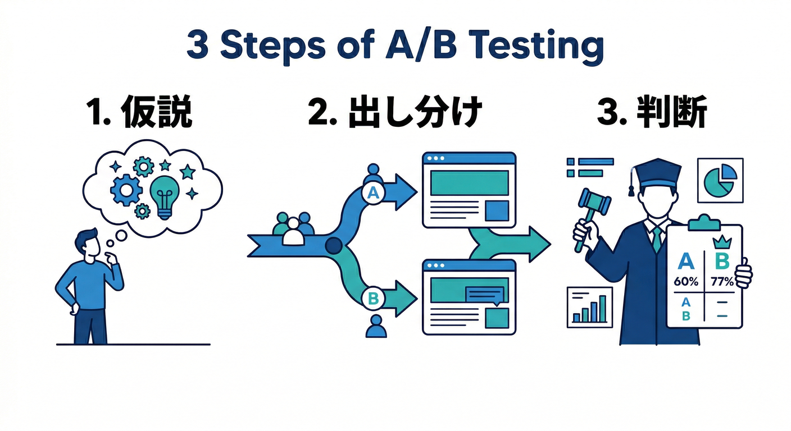
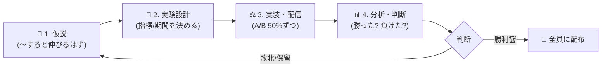
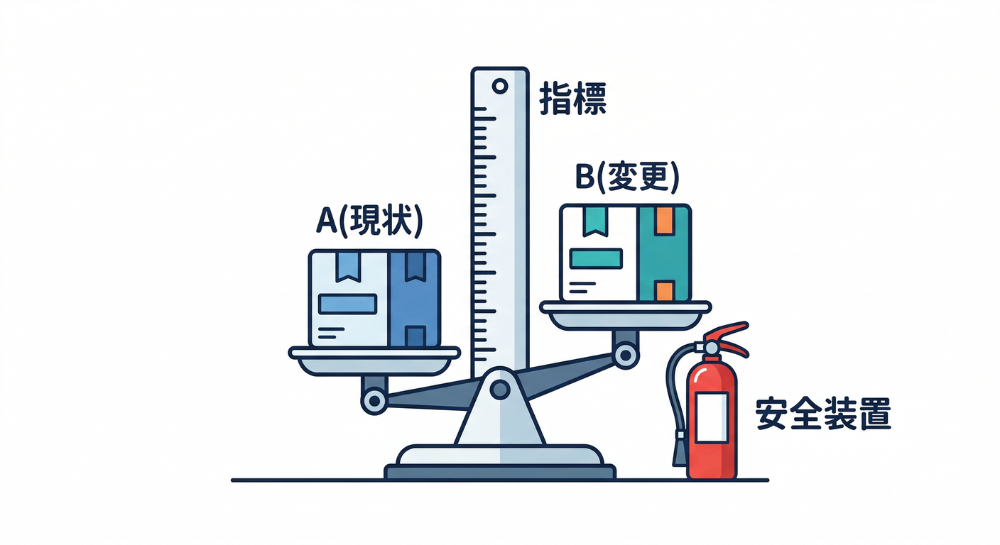
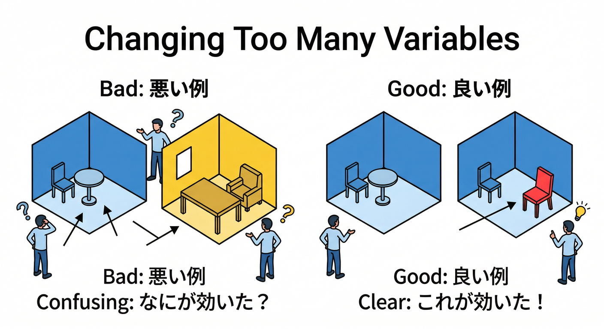
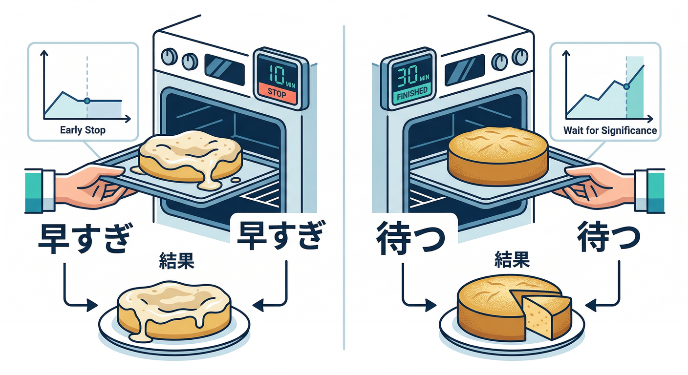
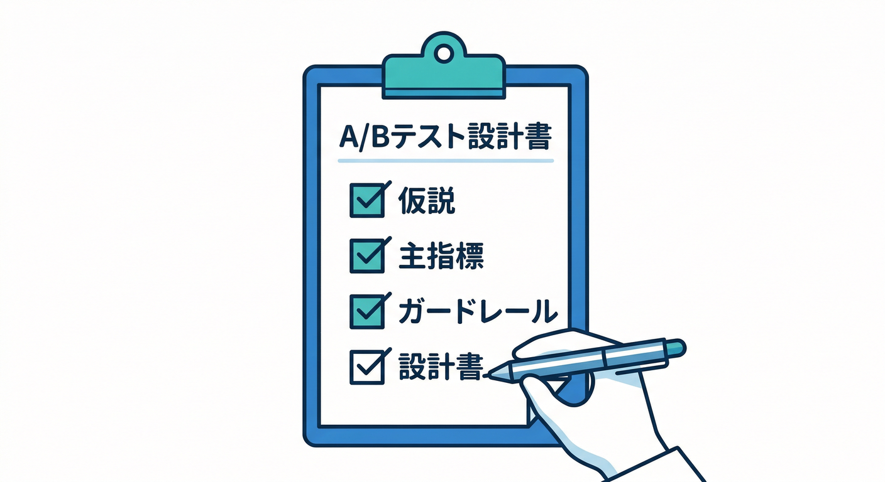
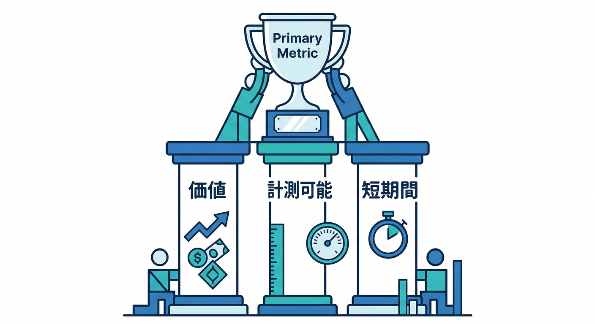

# 第13章：A/Bテストの基本（仮説→実験→判断）🧪⚖️

この章は「A/Bテストを“作る前”に勝ち筋を作る回」だよ〜！😆
Firebase の A/B Testing（Remote Config Experiments）って、作り方より先に **設計（仮説と勝敗ルール）** を固めると、成功率が一気に上がるんだ🧠✨ ([Firebase][1])

---

## この章のゴール🏁✨

最後に、あなたのミニアプリ（メモ／画像／AI整形）について…

* **仮説**を1つ、1行で書ける✍️
* **勝ち負けの指標（主指標）** と **安全装置（ガードレール指標）** を決められる📊🧯
* **A/Bにする“たった1つの変更点”** を決められる🎛️🧪

---

## まず超ざっくり：A/Bテストって何するの？🍱🧪



A/Bテストは、ざっくりこの3手順だけ👇

1. **仮説を立てる**（例：ボタン文言を変えると保存率が上がるはず）🤔
2. **半分ずつ出し分ける**（A=現状 / B=変更案）⚖️
3. **数字で判断する**（良ければ採用、ダメなら戻す）📈✅



Firebase の A/B Testing は、Remote Config の値（UI/機能フラグなど）を出し分けつつ、Google Analytics の指標で結果を測る仕組みだよ📊🎛️ ([Firebase][1])

---

## 用語ミニ辞典📚🙂



* **コントロール（A）**：今のまま（基準）
* **バリアント（B）**：変えた案（比較対象）
* **主指標（Primary metric）**：勝敗を決める“メインの数字”🏆
* **ガードレール指標（Guardrails）**：悪化したら即停止する“安全装置”🧯
* **露出（Exposure）**：その人がA/Bどっちを見たか（見てない人を混ぜると事故る）👀

---

## 初心者がハマりがちな「A/Bあるある」😇🧨

## あるある1：主指標がフワッとしてる☁️

「なんか良さそう」で終わると、判断できない💦
→ **主指標は1個に絞る**のがコツ🏆

## あるある2：変えるものが多すぎる🎛️🎛️🎛️



色も文言も配置も全部変えると、何が効いたか分からない😇
→ **変えるのは“1つだけ”**（最初は特に）🧪

## あるある3：途中でのぞいて早めに止める👀💨



「お、勝ってる！」で止めると、たまたま勝ってただけ…が起きやすい⚠️
→ **実験期間（最低◯日）と最低サンプル** を先に決める📅

## あるある4：Web特有の“別人扱い”問題🕵️‍♂️🌐

Firebase A/B Testing（Web）は **Firebase Installation ID（FID）** を使って割り当てを固定するんだけど、これはブラウザの IndexedDB に保存されるよ📦
だから **シークレット（incognito）や別ブラウザ、IndexedDB削除** で別ユーザー扱いになり、別のバリアントに入り直すことがある⚠️ ([Firebase][2])

（「え、同じ人なのにAもBも見ちゃうの？」が起こり得るってこと😇）

---

## A/B設計シート（これを埋めたら8割勝ち）📝🏆



下の表を、そのままコピって埋めてOKだよ🙆‍♂️✨

| 項目         | 書くこと（例）                          |
| ---------- | -------------------------------- |
| 仮説（1行）     | 「保存ボタンの文言を“メモを残す”にすると、保存完了率が上がる」 |
| 変えるもの（1つ）  | ボタン文言だけ                          |
| 対象ユーザー     | 全員 / 新規のみ / 既存のみ（など）             |
| 主指標（勝敗）    | 保存完了率（例：memo_create イベント発火率）     |
| ガードレール（安全） | エラー率↑なら停止、離脱率↑なら停止、処理時間↑なら停止     |
| 実験の最短期間    | 例：最低7日（曜日偏りを避ける）                 |
| 採用ルール      | 「主指標が改善し、ガードレール悪化なしなら採用」         |

---

## “主指標”を選ぶコツ📊🧠



主指標は、基本この3条件を満たすと強い💪

1. **ユーザー価値に近い**（押した回数より、完了率のほうが価値に近い）
2. **測れる（イベントがある）**（第3〜7章で作ったイベント表が効く📋）
3. **短期間で動く**（1ヶ月に1回しか起きない指標は最初つらい😇）

## このカテゴリのミニアプリなら、主指標はこんなのが分かりやすい👇

* 保存完了率（保存イベントの発火率）📝✅
* AI整形の利用率（AIボタン押下率）🤖📣
* AI整形の完了率（開始→成功まで到達した割合）🏁✨

Remote Config を Analytics と組み合わせて、オーディエンスやユーザープロパティでセグメントを切りながら改善する流れとも相性いいよ🎛️👥 ([Firebase][3])

---

## 結果の読み方を“やさしく”📈🙂（統計アレルギー対策）

Firebase の A/B Testing は（少なくとも近年は）**頻度主義（frequentist）** の推論を使って、差が「偶然っぽいか」を p値で表すよ〜という世界観だよ📊
また、有意水準 0.05 を基準に扱う説明になってる（要するに“たまたま”の可能性が小さければ自信が持てる）🧠✨ ([Firebase][4])

超ざっくり言うと👇

* **差が小さい**：どっちでもいい（保留）🙂
* **差が大きくて安定**：勝ちっぽい🏆
* **ガードレールが悪化**：勝ってても停止🧯

（ここで背伸びして“完璧な統計”を理解しようとしなくてOK！最初は「判断ルールを事前に決める」が最重要だよ😆）

---

## 手を動かす（ミニワーク）🛠️✍️

## Step 1：仮説を1行で書く✍️🧠

例：

* 「AI整形ボタンの説明文を短くすると、クリック率が上がるはず」
* 「AI整形の結果表示を先にプレビューにすると、完了率が上がるはず」

## Step 2：主指標を1つに決める🏆

「勝った！」を言うための数字を1個だけ📌

## Step 3：ガードレールを2つ決める🧯🧯

おすすめはこのへん👇

* エラー率（失敗イベント、例外、失敗レスポンス）💥
* 離脱の増加（途中で戻る／閉じる）🚪
* 体感遅さ（Performance の指標）⚡

## Step 4：変える点を“1つだけ”にする🧪

文言だけ、色だけ、配置だけ。まずはこれ🙆‍♂️

---

## ミニ課題：Geminiに“仮説の候補”を出させて、あなたが採用する🤝🤖

A/Bの仮説って、**AIに出させると早い**よ💨
ただし、最後に決めるのは人間（あなた）ね😉

## 1) Gemini in Firebase で相談（コンソール内でOK）🧯🤖

「このアプリの目的は◯◯。イベントは◯◯を送ってる。改善仮説を3つ。主指標とガードレールも提案して」みたいに聞くといい👍 ([Firebase][5])

## 2) Gemini CLI で“設計シート”を自動生成🧾💻

Gemini CLI はターミナルで使えるオープンソースのAIエージェント、という位置づけだよ🛠️ ([Google for Developers][6])

たとえば「A/B設計シートをMarkdownで出して」って頼む感じ（雰囲気）👇

```text
あなたはプロダクト改善担当です。
目的：メモ保存の完了率を上げたい。
現状イベント：memo_create, ai_format_click, ai_format_success
やりたい：A/Bテストを1本だけ。
条件：
- 変える点は1つ
- 主指標1つ、ガードレール2つ
- Webで起きがちな落とし穴も考慮
A/B設計シートをMarkdown表で出して
```

---

## できたかチェック✅🎉（Yesが多いほど勝てる）

* 仮説が1行で書けた？✅
* 変える点が1つになってる？✅
* 主指標が1つで、イベントで測れる？✅
* ガードレールを2つ決めた？✅
* 最短期間・最低サンプルを事前に決めた？✅
* WebのFID/ブラウザ差の影響を理解した？✅ ([Firebase][2])

---

## 次章（第14章）への“仕込み”🎛️🧪

次は実際に **Remote Config Experiments（A/B）を作る**よ〜！
Firebase の A/B Testing は Remote Config を軸にして実験を作れて、Android/iOS/Web が対象になってる👍 ([Firebase][2])

第14章がスムーズになる“前準備”はこれ👇

* 主指標に使うイベントが、ちゃんと送れてる（DebugView等で確認済み）📥
* 出し分けしたい Remote Config パラメータ名が決まってる🎛️
* 「露出した人だけ測る」の意識がある👀

---

## おまけ：開発AI（Antigravity）で“実験計画→実装→検証”を一気に進めるコツ🛸🤖


Antigravity はエージェント中心の開発体験（Mission Control で複数エージェントを動かす）を想定した説明になってるよ🛰️ ([Google Codelabs][7])
A/Bは「計画」と「実装」と「検証」が分かれてるから、エージェント分業と相性がいい👍

* エージェントA：A/B設計シート作成🧾
* エージェントB：Remote Config パラメータ追加🎛️
* エージェントC：イベントの検証手順（チェックリスト）作成✅

---

* [theverge.com](https://www.theverge.com/news/692517/google-gemini-cli-ai-agent-dev-terminal?utm_source=chatgpt.com)
* [theverge.com](https://www.theverge.com/news/822833/google-antigravity-ide-coding-agent-gemini-3-pro?utm_source=chatgpt.com)
* [androidcentral.com](https://www.androidcentral.com/apps-software/ai/gemini-cli-zed-code-editor-partnership?utm_source=chatgpt.com)

[1]: https://firebase.google.com/docs/ab-testing?utm_source=chatgpt.com "Firebase A/B Testing - Google"
[2]: https://firebase.google.com/docs/ab-testing/abtest-config?utm_source=chatgpt.com "Create Firebase Remote Config Experiments with A/B Testing"
[3]: https://firebase.google.com/docs/remote-config/config-analytics?utm_source=chatgpt.com "Use Firebase Remote Config with Analytics - Google"
[4]: https://firebase.google.com/docs/ab-testing/ab-concepts?utm_source=chatgpt.com "About Firebase A/B tests"
[5]: https://firebase.google.com/docs/ai-assistance/gemini-in-firebase?utm_source=chatgpt.com "Gemini in Firebase - Google"
[6]: https://developers.google.com/gemini-code-assist/docs/gemini-cli?utm_source=chatgpt.com "Gemini CLI | Gemini Code Assist"
[7]: https://codelabs.developers.google.com/getting-started-google-antigravity?utm_source=chatgpt.com "Getting Started with Google Antigravity"
