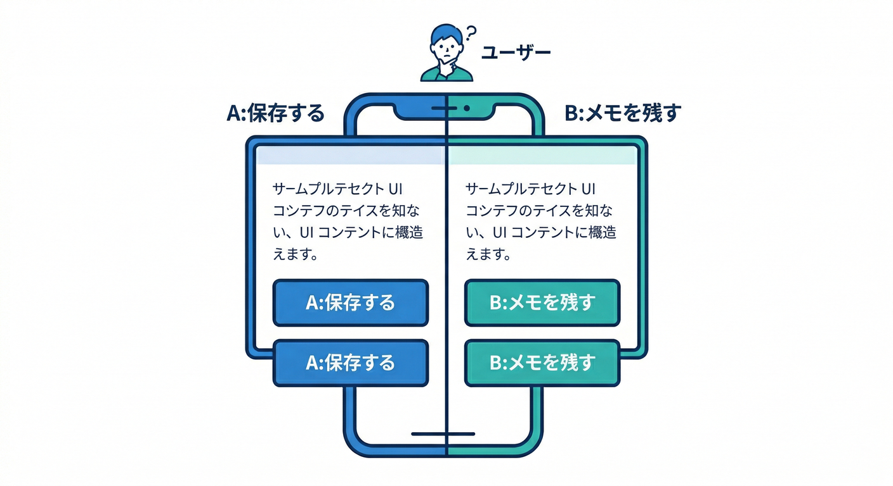
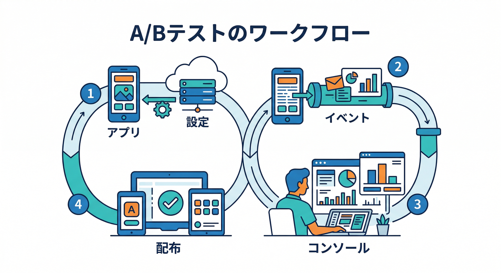
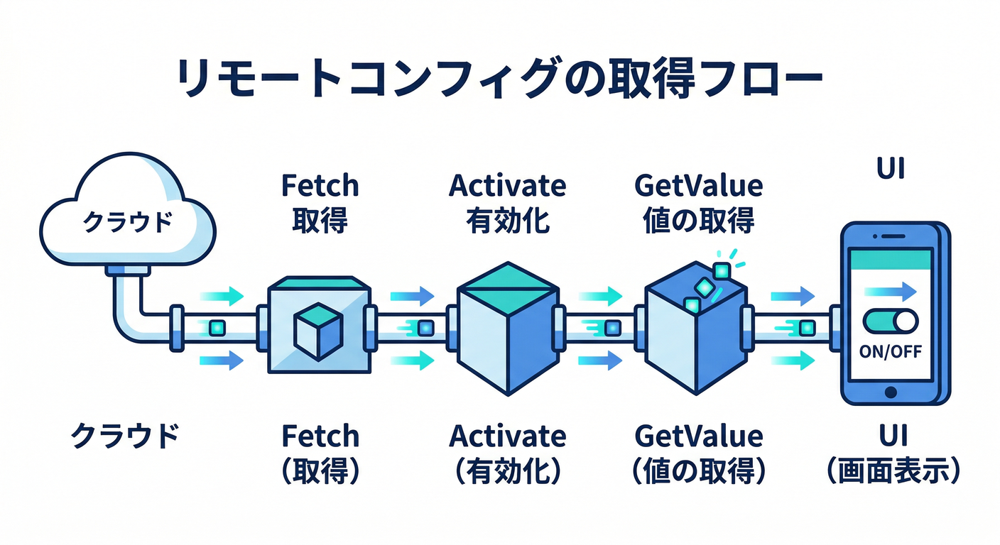
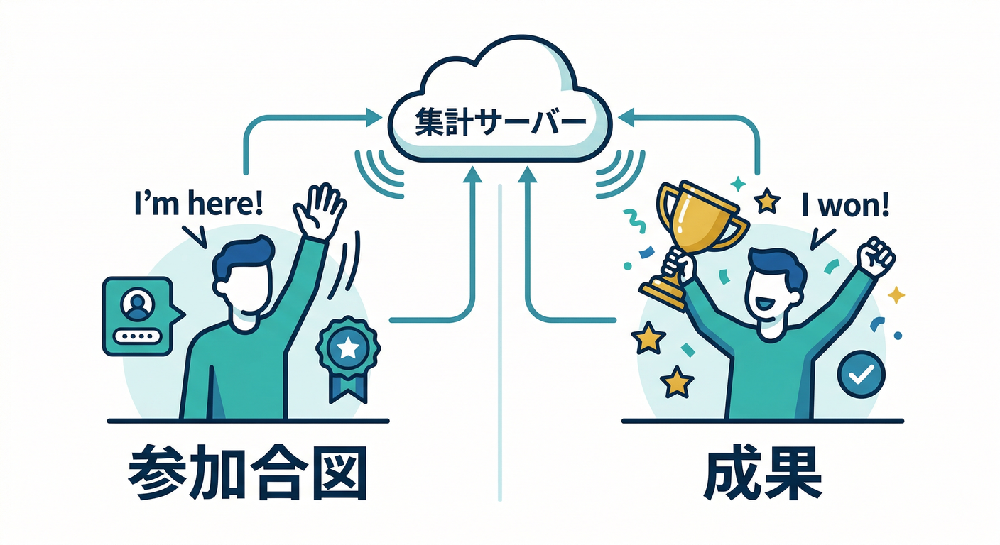
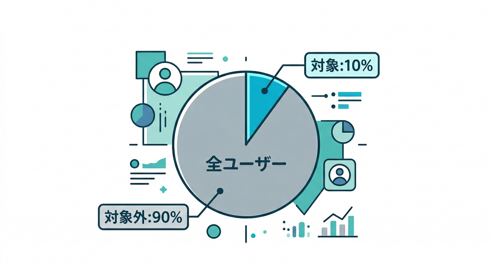
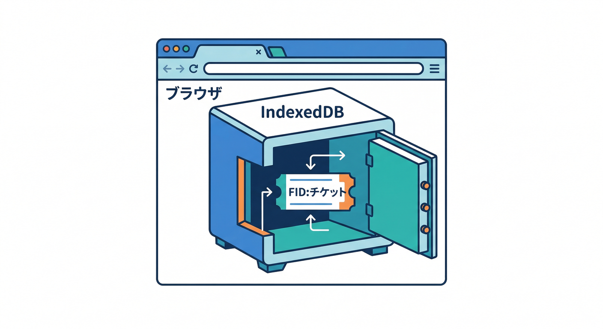

# 第14章：Remote Config Experiments（A/B）を作る🎛️🧪

この章は「Remote Configの値を2パターンに分けて配布して、**どっちが良いか数字で決める**」回だよ〜📊✨
“勘”で直すのを卒業して、「勝った案だけを全員に配布」までやっちゃおう🏁

---

## 1) この章のゴール🌟

* Remote Config の **Experiment（A/B）** を1本作れる🎛️🧪 ([Firebase][1])
* 端末（ブラウザ）ごとに、A/Bどちらかに **固定** される理由がわかる🧷（WebはFIDが鍵） ([Firebase][1])
* 「結果が出ない…😇」の典型原因（特に activation event）を避けられる🧯 ([Firebase][2])

---

## 2) 今日の題材：保存ボタンの文言をA/Bする🗣️🧪



例として、保存ボタンの文言（CTA）を **A/Bで出し分け**してみよう👇

* A（Baseline）：「保存する」
* B（Variant）：「メモを残す」

そして「保存が成功した回数（= conversion）」が増えるかを見る📈✨

---

## 3) ざっくり全体の流れ（これだけ覚えればOK）🧭



1. アプリ側：Remote Config から **cta_copy** を読んでUIに反映🖥️
2. アプリ側：

   * 「このユーザーは実験に参加したよ」＝ **exposure（activation用）イベント** を送る📤
   * 「保存できたよ」＝ **成果（goal）イベント** を送る🎯
3. Console：A/B Testing → Remote Config の Experiment を作成🎛️🧪 ([Firebase][1])
4. Test：**Manage test devices** で、手元の端末をA/Bどっちかに固定して確認🧷 ([Firebase][1])
5. しばらく回して、勝者が見えたら **Roll out variant** で全員に配布🏁 ([Firebase][1])

---

## 4) 手を動かす①：React側で Remote Config を読む🛠️🎛️



ポイントは2つだけ🙂

* 「取得→反映（fetchAndActivate）」を通す
* 値は **文字列（asString）** で受けてUIに使う

```typescript
import { getRemoteConfig, fetchAndActivate, getValue } from "firebase/remote-config";

// app は初期化済み想定
const rc = getRemoteConfig(app);

// 開発中は短くしてOK（本番は控えめに）
rc.settings.minimumFetchIntervalMillis = 0;

export async function loadCtaCopy(): Promise<string> {
  await fetchAndActivate(rc);
  const v = getValue(rc, "cta_copy").asString();
  return v || "保存する"; // フォールバック
}
```

---

## 5) 手を動かす②：A/Bで超重要な「2種類のイベント」を送る📣🎯



A/Bでつまずく人の9割はここ😇
イベントはざっくり2種類あるよ👇

## (A) activation event（実験に参加した人を“集計対象”にする）🧷

activation event は **「集計に含める合図」** で、Remote Config の値配布そのものには影響しないよ🧠
だから「Remote Config を取得して反映した“後”」に送るのが大事！ ([Firebase][2])

## (B) goal event（成功/成果のイベント）🎯

例：保存成功、購入、継続、など。ここを **勝ち負けの基準** にする📊

```typescript
import { getAnalytics, logEvent } from "firebase/analytics";

const analytics = getAnalytics(app);

export function logExperimentExposure() {
  // Remote Configを反映して、UIに使う直前くらいで送るのが安全🙂
  logEvent(analytics, "ab_exposure_cta_copy");
}

export function logSaveSuccess() {
  // 成果（ゴール）イベント
  logEvent(analytics, "memo_save_success");
}
```

---

## 6) Console操作：Remote Config Experiment を作成🎛️🧪

やることは画面に沿って埋めるだけ🙂（場所：Firebase Console → **A/B Testing**） ([Firebase][1])

## 6-1. Create experiment → Remote Config を選ぶ🧩

* 名前：例「CTA copy experiment」
* 対象アプリ：Webアプリを選択

Google Analytics が有効でないと結果が見えないので、そこだけ注意👀 ([Firebase][1])

## 6-2. Targeting（誰に当てる？）👥



* 最初は 1%〜10% くらいでOK（安全運転🚗💨）
* 国/言語/ユーザーオーディエンス等で絞れる ([Firebase][1])

## 6-3. Variants（A/Bの中身）🧪

* パラメータ：**cta_copy**
* Baseline：保存する
* Variant：メモを残す

重み（weights）は開始後に変えられない＆偏らせるほど時間がかかりやすいので、最初は均等が無難🙂 ([Firebase][1])

## 6-4. Metrics（何で勝ち負け？）📊

* **Primary（目標）**：memo_save_success
* **Other metrics（最大5個）**：必要なら追加（例：離脱やエラー悪化を見張る） ([Firebase][1])

## 6-5. Activation event（集計対象にする合図）🧷

ここは **ab_exposure_cta_copy** を選ぶ（自分で送ってるやつ）
「取得・反映の後、UI反映の前」がちょうどいいよ🙂 ([Firebase][2])

---

## 7) Webの超重要ポイント：ブラウザの“固定”はIndexedDBに入る🧠🧷



Webは、初回起動時に **Firebase installation ID（FID）** が作られて、ブラウザの **IndexedDB** に保存されるよ📦
だから👇みたいな時は「別ユーザー扱い」になって、A/Bが変わることがある😇 ([Firebase][1])

* ブラウザを変えた（Chrome → Edge）
* シークレット/プライベートウィンドウ
* サイトデータ（IndexedDB）を消した

「同じ端末なのにA/Bが変わる！」って時は、だいたいこれ🤝 ([Firebase][1])

---

## 8) テスト端末でA/Bを強制する：Manage test devices🧪🧷


Console の実験メニューから **Manage test devices** が使えるよ。
ここで「この端末はA固定 / B固定」ってできる✨ ([Firebase][1])

Webの場合は **installation auth token** を取って貼り付ける流れ👇 ([Firebase][1])

```typescript
import { getInstallations, getToken } from "firebase/installations";

export async function getInstallationAuthToken() {
  const installations = getInstallations(app);
  const token = await getToken(installations);
  return token; // これをConsoleのManage test devicesに貼る
}
```

---

## 9) 実験の結果の見方（やさしく）📈🙂

## Consoleで見える代表的なやつ👀

* ベースラインとの差（どれくらい良く/悪くなった？）
* どっちが勝ってそうか（リーダー）
* 指標ごとの数値（ユーザーあたり等） ([Firebase][1])

## 2026時点の“今どき”メモ📝

Firebase A/B Testing は、以前の Bayesian 方式から **frequentist（p値や信頼区間）** を使う方式へ移行しているよ（新しく開始する実験から順に） ([The Firebase Blog][3])
つまり「p-value が 0.05 未満なら統計的に有意っぽい」みたいな見方ができる📊🙂 ([The Firebase Blog][3])

※ただし、サンプルが少ないとブレやすいので、焦って即決しないのが安全運転だよ🚗💨

---

## 10) つまずきポイント集（ここだけ読めば事故減る🧯）

* **結果が0のまま**：activation event を「取得・反映の前」に送ってる可能性大😇
  → docsでも「取得・反映の後、使う前が大事」と明言されてるよ ([Firebase][2])
* **WebでA/Bが安定しない**：シークレット/別ブラウザ/IndexedDB削除で別ユーザー扱い ([Firebase][1])
* **“リアルタイム更新”を期待しちゃう**：実験パラメータはリアルタイム更新非対応。基本は fetchAndActivate の戦略でいこう🧠 ([Firebase][1])
* **同時に実験を立てすぎ**：同時稼働は上限がある（プロジェクトあたり最大24） ([Firebase][1])

---

## 11) Firebase AI を絡めるならこうする🤖🎛️🧪

Remote Config Experiments は **AIの運用** と相性がめちゃ良いよ👇

* パラメータ例：**ai_prompt_variant**

  * A：短いプロンプト（安い💰）
  * B：丁寧なプロンプト（品質↑✨）
* 目標イベント：**ai_format_success**（整形成功） or **memo_save_success**（保存まで到達）
* 「AIをいきなり全員に当てない」＝コスト事故防止🧯
* アプリからGemini/Imagenを呼ぶなら Firebase AI Logic が土台になる（Webも対応） ([Firebase][4])

---

## 12) ミニ課題📝✨

* **cta_copy** を A/B で出し分け
* activation event：ab_exposure_cta_copy
* goal event：memo_save_success
* Manage test devices で A 固定 / B 固定を確認🧷

---

## 13) チェック（Yesが全部ならクリア✅🎉）

* Remote Config の値でボタン文言が切り替わる✅
* ab_exposure_cta_copy が「取得・反映の後」に送れてる✅ ([Firebase][2])
* memo_save_success が保存成功で送れてる✅
* Webで「同じブラウザ・同じ通常ウィンドウ」だとA/Bが安定する✅ ([Firebase][1])

---

## 14) 小テスト（3問）🧠📝

1. activation event は「配布に影響する？それとも集計に影響する？」
2. WebでA/Bが変わりやすいのは、どこにIDが保存されてるから？
3. 実験開始後に weights を変えられる？（Yes/No）

---

次の章（第15章）は「結果の読み方（統計をやさしく）」だから、この章で作った実験をそのまま題材にして読み解いていけるよ〜📈🙂

[1]: https://firebase.google.com/docs/ab-testing/abtest-config "Create Firebase Remote Config Experiments with A/B Testing  |  Firebase A/B Testing"
[2]: https://firebase.google.com/docs/ab-testing/ab-concepts "About Firebase A/B tests  |  Firebase A/B Testing"
[3]: https://firebase.blog/posts/2023/11/introducing-frequentist-inference-firebase-a-b-testing/ "Introducing frequentist inference in Firebase A/B Testing"
[4]: https://firebase.google.com/docs/ai-logic?utm_source=chatgpt.com "Gemini API using Firebase AI Logic - Google"
