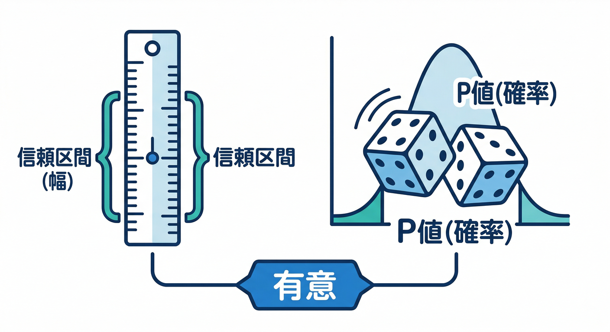
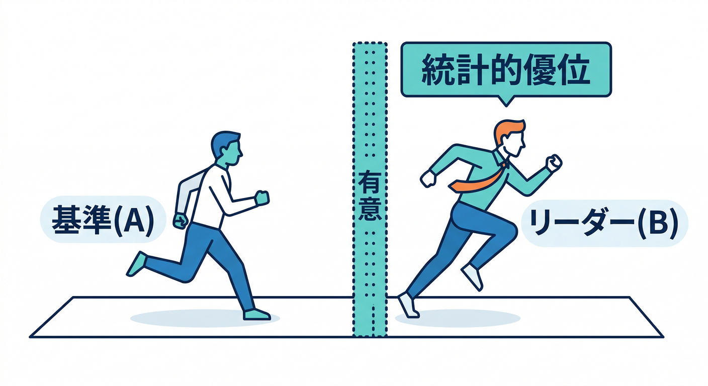
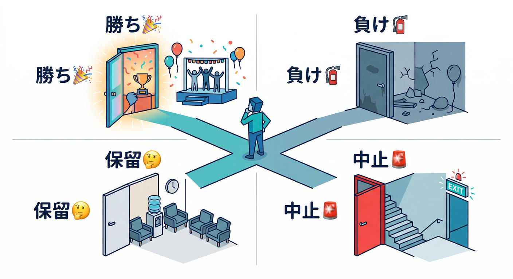
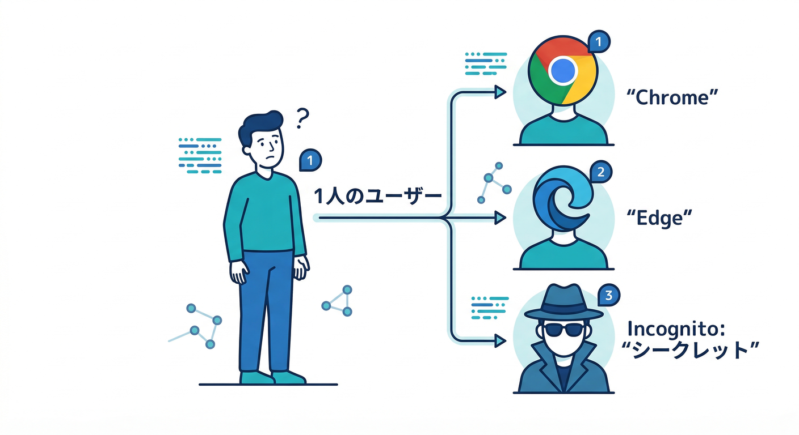
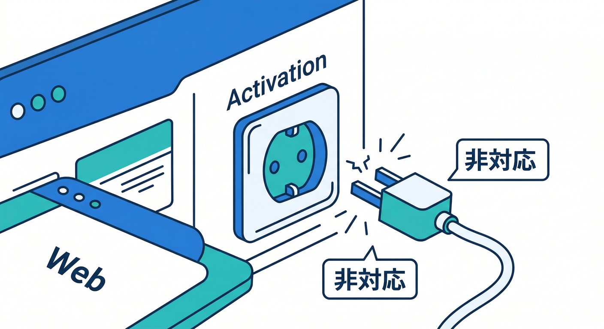

# 第15章：結果の読み方（“統計”をやさしく）📈🙂

この章は「A/Bの結果画面を見て、**勝ち/負け/保留/中止**を“自分の言葉”で言える」ようになる回です🧠✨
数学の授業じゃなくて、**意思決定のための読み方**だけ押さえます👍

---

## 1) まずは“見る場所”を固定しよう🧭👀

Firebase コンソール → **Engage** → **A/B Testing** → 対象の Experiment を開くと、結果ページで “leader（勝ちっぽい案）” が表示されます。
Remote Config 実験は「最低14日くらい回してから」リーダー判定が見えてきやすい、と公式ガイドでも目安が書かれています📅✨ ([Firebase][1])

そして大事：**データ更新は基本「1日1回」**なので、数分で変化しなくても焦らないでOKです😌🕰️ ([Firebase][2])

---

## 2) 結果画面の“用語”は3つだけ覚える🧩📌

A/B Testing（新しい方式＝頻度主義）だと、結果が **Observed data（観測）** と **Inference data（推定）** に分かれます。推定側に出るのがこの2つ👇 ([Firebase][2])

* **95% CI（信頼区間）**：
  「本当の差（真の差）がこの範囲に入ってそう」っていう“幅”📏
  **CI に 0 が入ってたら**「差があるとは言い切れない（有意じゃない）」判定になりやすいです。 ([Firebase][2])
* **P-value（p値）**：
  「本当は差がゼロなのに、たまたまこの差が出る確率」🎲
  **0.05 以下**が “有意差あり” の目安。 ([Firebase][2])

ついでに覚えると安心：Firebase のA/Bは **有意水準0.05** を使っていて、p値は **片側検定**、連続値は **不等分散 t 検定**、割合系は **比率の z 検定** という説明が公式にあります📚 ([Firebase][2])

---

## 3) “leader”の意味をやさしく言うと🏁🙂

Firebase が leader を出すルールはシンプルで、

* **ゴール指標で「ベースラインより統計的に良い」**なら leader
* 複数が条件を満たしたら **p値が一番低い**ものが leader

です。 ([Firebase][2])

ただし！ leader は **主指標だけで決まる**ので、**副指標（ガードレール）を必ず見る**のが推奨されています⚠️
「主指標は勝ったけど、継続率が下がってる」みたいなケースは普通にあり得ます😇 ([Firebase][2])

---

## 4) 今日から使える“判断ルール”テンプレ📋✅

ここがこの章のコアです🔥
A/Bの結論は、だいたい次の4パターンに落ちます👇

**A. 勝ち（採用して rollout 候補）🎉**

* 主指標：p ≤ 0.05
* 95% CI：0 を含まない（プラス方向ならなお良し）
* ガードレール：悪化してない（or 許容範囲）

**B. 負け（やめる）🧯**

* 主指標：明確にマイナス（CI がずっとマイナス寄り）
* ガードレールも悪化…は即撤退が安全

**C. 保留（まだ結論を出さない）🤔**

* p > 0.05 で CI が広い（サンプル不足っぽい）
* 期待効果が小さくてノイズに埋もれてる

**D. 中止（安全側）🚨**

* ガードレール（クラッシュ・離脱など）が悪化
* そもそも挙動が壊れてる／計測が怪しい

ちなみに「最小サンプル数を事前に決めなくても推論できる」設計で、**露出（対象ユーザー割合）を増やすと有意になりやすい**、という説明もあります📌 ([Firebase][2])
（ただし増やす＝影響も増えるので、段階的にね😌）

---

## 5) “罠”を先に潰す（Web実装あるある）🕳️🧹

**罠①：ブラウザ/シークレットで別人扱いになる🫥**

Web の A/B は **Firebase installation ID（FID）** が IndexedDB に保存され、それで割り当てが固定されます。
でも、**別ブラウザ**・**シークレット**・**IndexedDB削除** だと “新規ユーザー扱い” になり、別バリアントに入ることがあります。 ([Firebase][1])
→ テスト中に自分で何回も確認すると、体感が混乱しがち😂

**罠②：Activation event が Web では使えない🧩🚫**

Remote Config 実験では「activation event（集計開始の合図）」という概念がありますが、**Webでは非対応**と明記されています。 ([Firebase][1])
→ だから Web は「配布された人のうち、実際に機能を見た人だけを厳密に集計」みたいな絞り込みが難しめ。
対策としては、**“露出イベント”っぽいイベント（例：`feature_viewed`）を必ず送る**＆結果の解釈で考慮します📣

**罠③：テスト中に挙動を変えちゃう🔧⚠️**
実験を編集できるけど、**途中で挙動を変えると結果に影響**するよ、と注意があります。 ([Firebase][2])
→ “同じ実験番号のまま条件をいじる”は、分析が一気に難しくなるので、基本は「止めて複製」が安心👍

---

## 6) 手を動かす：結果を“日本語で説明”してみよう✍️🗣️

**やること（5分）⏱️**

1. A/B Testing の結果ページで、主指標の

   * %差（lift）
   * 95% CI
   * p値
     をメモ📝
2. ガードレール（例：クラッシュ、継続など）も同じくメモ🧾
3. 次の文を埋める👇

**判断メモ（テンプレ）📄✨**

* 目的（主指標）：________
* 期間：****/****〜****/****（最低○日）
* 結果（主指標）：lift ______ / 95%CI ______ / p ______
* ガードレール：悪化なし ✅ or 悪化あり 🚨（どれが？____）
* 結論：勝ち🎉 / 負け🧯 / 保留🤔 / 中止🚨
* 次アクション：rollout / 露出増やす / 新しい仮説で再実験

---

## 7) ミニ課題：AI（Gemini）で“読み間違い”を減らす🤖🛡️

ここはAI導入済みの強みを使います💪✨
A/Bの読み間違いって、「数字の意味の取り違え」か「ガードレール見落とし」が多いんですよね😇

**Antigravity の Gemini Chat / Agent に投げる質問例💬**

* 「この結果（lift/CI/p）を、非エンジニアにも分かる日本語にして」
* 「“勝ち”と言い切る前にチェックすべき落とし穴を列挙して」
* 「ガードレール悪化の可能性があるなら、どんな追加確認が必要？」

さらに最近のアップデートとして、Firebase のリリースノートに **Firebase AI Logic の“URL context tool”対応**が載っています（URLを追加コンテキストにできるやつ）。 ([Firebase][3])
「社内の運用メモ（Runbook）」をURLで渡して、判断基準をブレさせない、みたいな使い方が相性よさそうです📌✨

---

## 8) 小テスト（3問）🧠✅

1. 95% CI に **0 が含まれる**とき、まず何を疑う？
   → **有意な差が検出できてない（サンプル不足や効果が小さい）** ([Firebase][2])

2. leader になったら、即 rollout していい？
   → **主指標だけで決まるので、副指標（ガードレール）も確認してから** ([Firebase][2])

3. Web で実験中、シークレットで何回も確認すると何が起きうる？
   → **FIDが変わって別ユーザー扱い→別バリアントに入る可能性** ([Firebase][1])

---

## まとめ🏁✨

この章のゴールは「統計を理解する」じゃなくて、**“判断できる形”に翻訳する**ことでした📈🙂
次の第16章では、ここで作った判断ルールを「サーバー側の制御・不正対策・計測の裏側」へつなげていきます⚙️🛡️

[1]: https://firebase.google.com/docs/ab-testing/abtest-config "Create Firebase Remote Config Experiments with A/B Testing  |  Firebase A/B Testing"
[2]: https://firebase.google.com/docs/ab-testing/ab-concepts "About Firebase A/B tests  |  Firebase A/B Testing"
[3]: https://firebase.google.com/support/releases "Release Notes  |  Firebase"
