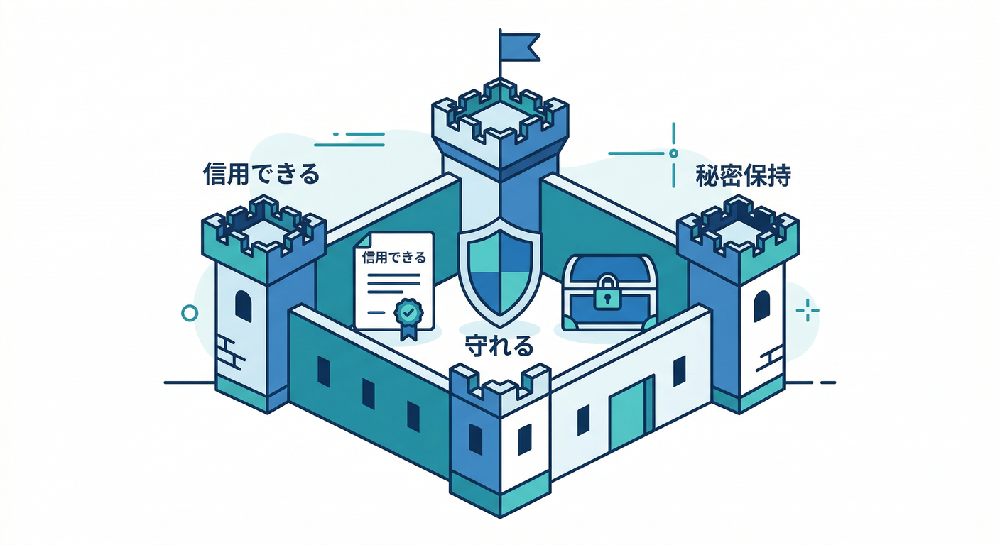
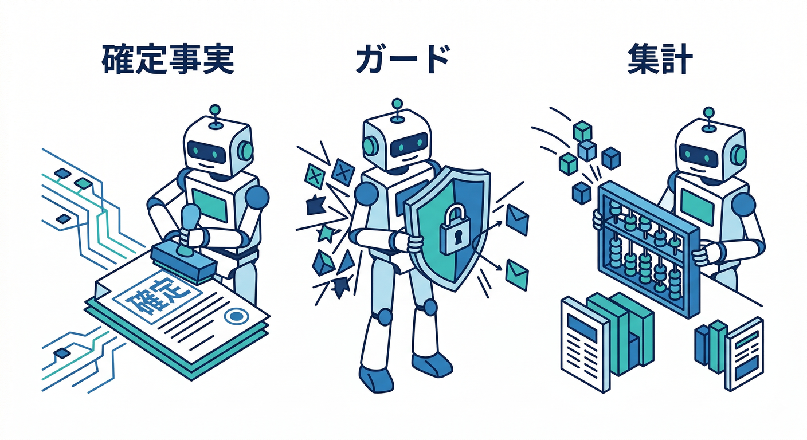
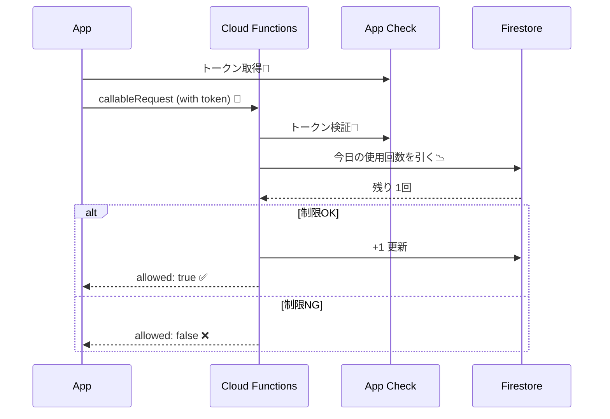
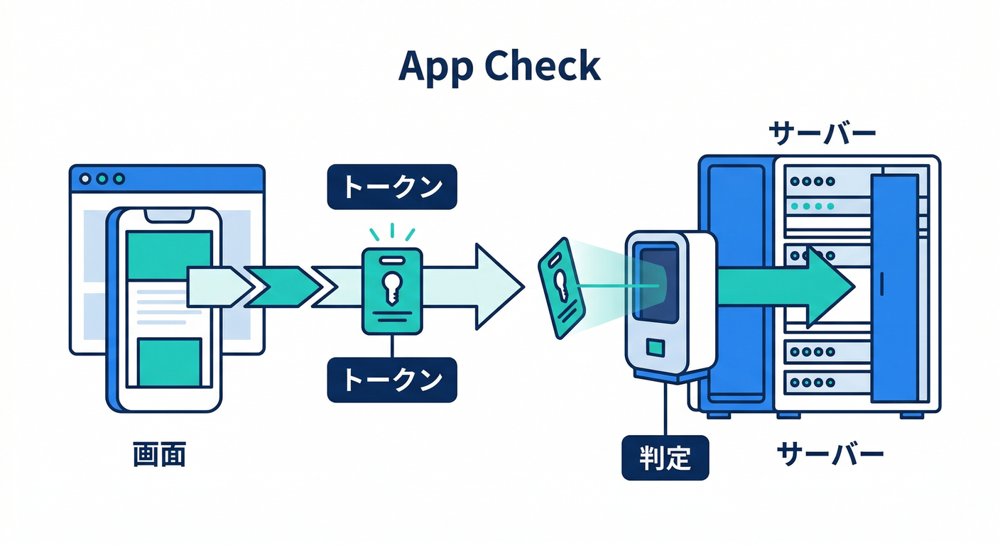
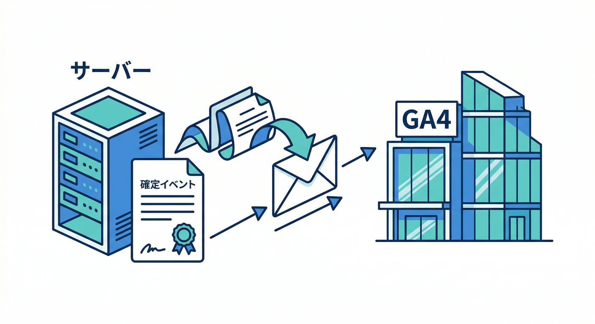
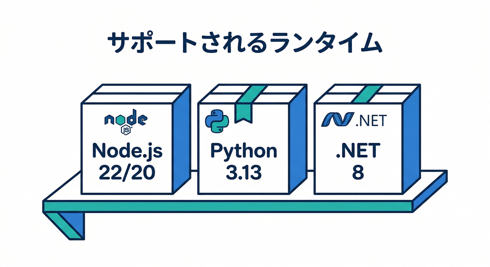
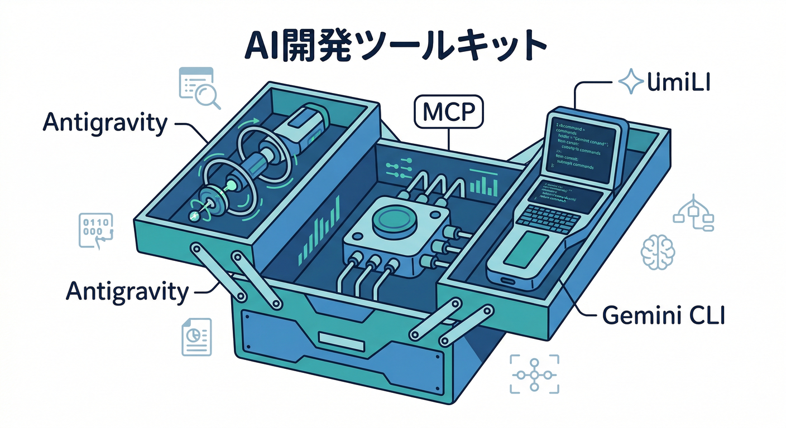

# 第16章：サーバー側もからめる（計測/制御の“裏側”）⚙️📦

この章は「フロントだけで頑張る」から一歩進んで、**サーバー側をちょい足し**して **“正しく測れる・守れる・育てられる”** 状態にする回だよ〜📊🛡️✨
特に **AI機能**って、便利なぶん **連打・コスト・悪用**が起きやすいので、ここで“裏側の守り”を覚えるのがめちゃ大事🤖💸

---

## 1) まず結論：サーバー側を入れると何が嬉しい？🎁



フロントの計測だけだと、こういう「あるある」に弱い😇

* **イベントが信用できない**（改ざん・二重送信・Bot・通信エラー）🌀
* **守れない**（回数制限、課金事故、AI乱用、悪用）🚨
* **秘密を置けない**（APIキー、判定ロジック、セキュリティ）🔑

そこでサーバー側を入れると、こうなる👇

* **確定イベント（＝事実）**をサーバーで作れる✅
* **ガード（制限・検知）**をサーバーで強制できる🛡️
* **秘密**をサーバーに閉じ込められる🔒

---

## 2) “サーバーちょい足し”の3パターン 🍳✨



イメージはこの3つだけ押さえればOK！

1. **確定イベント（事実）を作る** ✅📌
   例：*AI整形が「成功した」/「失敗した」* は、実際にサーバー処理が終わってから確定できる
2. **ガード（制限・不正対策）を強制する** 🛡️⛔
   例：*AIは1日N回まで*、*怪しい連打は止める*
3. **集計・変換をサーバーへ寄せる** 🧮📦
   例：*ログ集計*、*重たい処理*、*安全に整形したデータを返す*

この章では **2のガード**をまず作って、余力で **1の確定イベント**まで触るよ💪✨

---

ここからは“実務の匂い”が一気に出るところ😎
ポイントは **サーバーが最終判断者**になること！



## 3-1. 仕組み（超ざっくり図）🗺️



* 画面：AIボタン押す
* サーバー：今日の使用回数を見て **OK/NG** を返す
* 画面：OKならAI実行、NGなら優しく止める🙂

さらに、**Firebase App Check** を使うと「その呼び出しが“本物のアプリ”から来たか」をチェックできるよ🧿✨（CallableならクライアントSDKがトークンを自動で付ける）([Firebase][1])

---

## 3-2. サーバー側（TypeScript）✍️⚙️

Callable関数で App Check を強制（＋必要ならリプレイ対策もON）できる📌
`enforceAppCheck` / `consumeAppCheckToken` は公式の例がそのまま使えるよ。([Firebase][1])

```typescript
// functions/src/index.ts
import { onCall, HttpsError } from "firebase-functions/v2/https";
import { initializeApp } from "firebase-admin/app";
import { getFirestore, FieldValue } from "firebase-admin/firestore";

initializeApp();
const db = getFirestore();

// JST日付キーを作る（例: 2026-02-20）
function jstDateKey(): string {
  const fmt = new Intl.DateTimeFormat("ja-JP", {
    timeZone: "Asia/Tokyo",
    year: "numeric",
    month: "2-digit",
    day: "2-digit",
  });
  const parts = fmt.formatToParts(new Date());
  const y = parts.find(p => p.type === "year")!.value;
  const m = parts.find(p => p.type === "month")!.value;
  const d = parts.find(p => p.type === "day")!.value;
  return `${y}-${m}-${d}`;
}

export const checkAiQuota = onCall(
  {
    enforceAppCheck: true,          // App Check必須（不正クライアント対策）
    consumeAppCheckToken: true,     // リプレイ保護（beta・遅延増えるので“重要APIだけ”推奨）
  },
  async (req) => {
    if (!req.auth) {
      throw new HttpsError("unauthenticated", "ログインが必要だよ🙂");
    }

    const uid = req.auth.uid;
    const day = jstDateKey();

    // “上限”はまず固定値でOK（後でRemote ConfigやDBにしてもいい）
    const limitPerDay = 20;

    const ref = db.doc(`aiUsage/${uid}_${day}`);

    const result = await db.runTransaction(async (tx) => {
      const snap = await tx.get(ref);
      const used = snap.exists ? (snap.data()?.used ?? 0) : 0;

      if (used >= limitPerDay) {
        return { allowed: false, used, limit: limitPerDay };
      }

      if (!snap.exists) {
        tx.set(ref, { used: 1, day, uid, updatedAt: FieldValue.serverTimestamp() });
        return { allowed: true, used: 1, limit: limitPerDay };
      } else {
        tx.update(ref, { used: FieldValue.increment(1), updatedAt: FieldValue.serverTimestamp() });
        return { allowed: true, used: used + 1, limit: limitPerDay };
      }
    });

    return result;
  }
);
```

💡ポイント

* **App Check強制**：無効トークンは弾ける🧿([Firebase][1])
* **リプレイ保護**：トークン使い回し攻撃に強いけど、遅くなるので“重要な関数だけ”でOK⏱️([Firebase][1])

---

## 3-3. フロント側（React）で呼ぶ📣🧑‍💻

WebのCallable呼び出しでは、**limited-use App Checkトークン**を付ける設定もできるよ（リプレイ保護をONにした場合に効く）([Firebase][1])

```typescript
import { getFunctions, httpsCallable } from "firebase/functions";

const functions = getFunctions();

const checkAiQuota = httpsCallable(
  functions,
  "checkAiQuota",
  { limitedUseAppCheckTokens: true }
);

export async function canUseAi(): Promise<{allowed: boolean; used: number; limit: number;}> {
  const res = await checkAiQuota();
  return res.data as any;
}
```

UI側の流れはこんな感じ👇🙂

* allowed ✅ → AI実行ボタンをそのまま進める
* allowed ❌ → 「今日は上限だよ〜また明日ね🙂」を表示して止める

---

## 4) Remote Configとの“いい関係”🎛️🤝（重要な設計思想）


ここ、めっちゃ大事だよ〜📌

* **Remote Config**：UXのため（“先に”ボタンを灰色にする / 文言を変える）🎛️
* **サーバー側**：最終防衛線（絶対に破れない上限・検知）🛡️

つまり、

* 画面：*「もうすぐ上限だよ」* と優しく案内🙂
* サーバー：*「上限超えは絶対NG」* を強制⛔

これで **ユーザー体験も守りつつ、課金事故も防げる**💸🧯

さらにAI寄りの話をすると、Firebase AI Logic は **App Checkで保護**できるし、**ユーザー単位のレート制限**も用意されてる（設定可能）ので、「AIは守りが必須」って思想にピタッと合うよ🤖🛡️([Firebase][2])

---

## 5) ハンズオン②（発展）：サーバーから“確定イベント”を送る📨📊



フロントイベントは「押した」までは分かるけど、
**本当に成功したか**はサーバーでしか確定できないケースがあるよね🙂

そこで、Google Analytics 4 の **Measurement Protocol** を使うと、サーバーからイベント送信ができる（※基本は “置き換え” じゃなく “補強” のため）📌([Google for Developers][3])

例：

* `ai_format_request`（フロント：押した）
* `ai_format_success`（サーバー：成功した）✅
* `ai_format_fail`（サーバー：失敗した）❌

Measurement Protocolの実装はやや話が広がるので、ここでは「こういうことができる」まででOK！😆
（やるなら **API secret** などの扱いは Secrets/環境変数で管理して、Gitに置かないのが鉄則🔒）([Google Cloud Documentation][4])

---

## 6) “バージョン感”だけはここで固定しよう📌（詰まり防止）



サーバー側をやるなら、ランタイムの「今どれ？」で転ばないのが大事🙂

* Cloud Functions for Firebase：Node.js **22 / 20**（18はdeprecated）([Google Cloud Documentation][4])
* Cloud Functions for Firebase（Python）：**3.10〜3.13**（デフォルト3.13）([Firebase][5])
* Cloud Run functions：Python **3.14/3.13…**、.NET **10/8/6…** が選べる([Google Cloud Documentation][6])

---

## 7) AI導入済みの“時短ムーブ”🚀🤖（Antigravity / Gemini CLI）



ここは開発スピードが一気に上がるやつ✨

* Google Antigravity は、エージェントを管理して「計画→実装→検証」まで進めやすい思想の開発環境だよ🛸([Google Codelabs][7])
* Gemini CLI は、Firebase向けの拡張やMCP連携で、作業を自然言語で進めやすい🧠💻([Firebase][8])
* **Firebase MCP server** は、AIツールに「Firebaseを触る手」を渡せる（プロジェクト操作や観測がしやすくなる）🧰([Firebase][9])
* コンソール側は Gemini in Firebase で調査・トラブルシュートが速くなる🧯([Firebase][10])

## Geminiに投げると強いお題（例）🪄

* 「AI機能の**不正対策チェックリスト**を作って」🛡️
* 「`checkAiQuota` の**例外設計**（unauthenticated / quota exceeded）を提案して」🧩
* 「Analyticsイベント名を **動詞_目的語** で10個候補出して」📊

---

## 8) ミニ課題🎒✅

やることは3つだけ！

1. `checkAiQuota` をCallableでデプロイする🚀
2. Reactで呼んで、NGならボタンを止めてメッセージ表示🙂
3. Analyticsに

   * `ai_format_click`（押した）
   * `ai_quota_blocked`（止めた）
     を送れるようにする📣📊

---

## 9) チェック（できたら勝ち）🏁🎉

* App Check無しの呼び出しが弾かれる（または少なくとも「保護できてる」状態）🧿([Firebase][1])
* 1日上限を超えたら必ず止まる🛡️
* UIが優しく止めて、次の行動が分かる🙂
* 「押した」と「止めた」がイベントで見える📊

---

## 10) よくあるミス🧯（先に潰す）

* **“UIで止めたからOK”と思う** → サーバーで止めないと普通に突破される😇
* **上限カウントをクライアントで持つ** → 端末変えるとズレる・改ざんできる🌀
* **App Checkを“後でやる”** → AI/課金系は特に早めが安全🧿([Firebase][11])
* **秘密（API secret等）をコードに直書き** → Secrets/環境変数へ🔒([Google Cloud Documentation][4])

---

次の章（第17章）は、いよいよ **Performance Monitoring** で「遅い」を証拠で殴れるようになる回⚡👀
この第16章の“裏側ガード”があると、改善サイクルが一気に実務っぽくなるよ〜🔁✨

[1]: https://firebase.google.com/docs/app-check/cloud-functions "Enable App Check enforcement for Cloud Functions  |  Firebase App Check"
[2]: https://firebase.google.com/docs/ai-logic "Gemini API using Firebase AI Logic  |  Firebase AI Logic"
[3]: https://developers.google.com/analytics/devguides/collection/protocol/ga4 "Measurement Protocol  |  Google Analytics  |  Google for Developers"
[4]: https://docs.cloud.google.com/run/docs/runtimes/function-runtimes?hl=ja "Cloud Run functions ランタイム  |  Google Cloud Documentation"
[5]: https://firebase.google.com/docs/functions/1st-gen/manage-functions-1st?utm_source=chatgpt.com "Manage functions (1st gen) - Cloud Functions for Firebase"
[6]: https://docs.cloud.google.com/functions/docs/runtime-support "Runtime support  |  Cloud Run functions  |  Google Cloud Documentation"
[7]: https://codelabs.developers.google.com/getting-started-google-antigravity "Getting Started with Google Antigravity  |  Google Codelabs"
[8]: https://firebase.google.com/docs/ai-assistance/gcli-extension?utm_source=chatgpt.com "Firebase extension for the Gemini CLI"
[9]: https://firebase.google.com/docs/ai-assistance/mcp-server?utm_source=chatgpt.com "Firebase MCP server | Develop with AI assistance - Google"
[10]: https://firebase.google.com/docs/ai-assistance/gemini-in-firebase "Gemini in Firebase"
[11]: https://firebase.google.com/docs/ai-logic/app-check?utm_source=chatgpt.com "Implement Firebase App Check to protect APIs from ... - Google"
