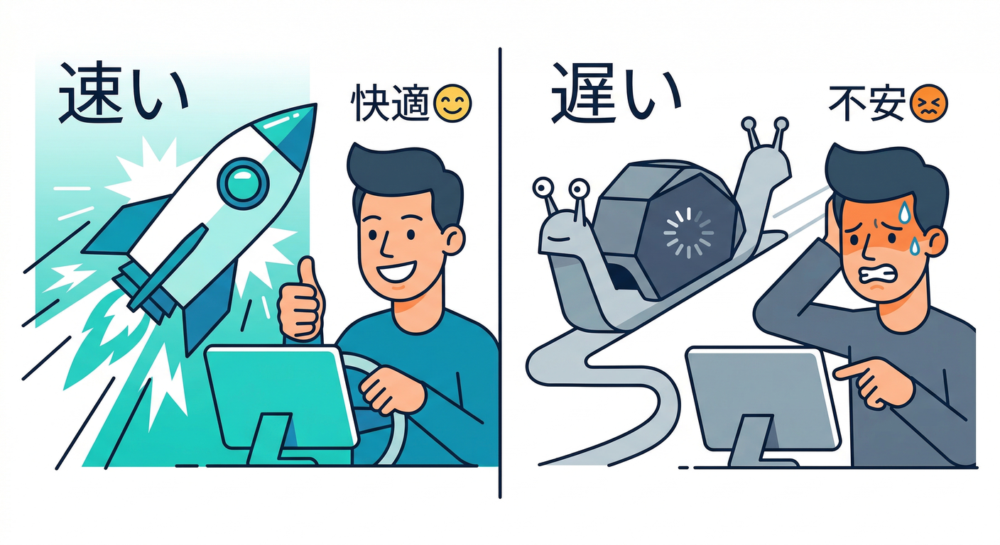
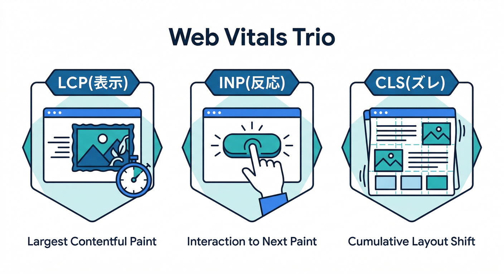
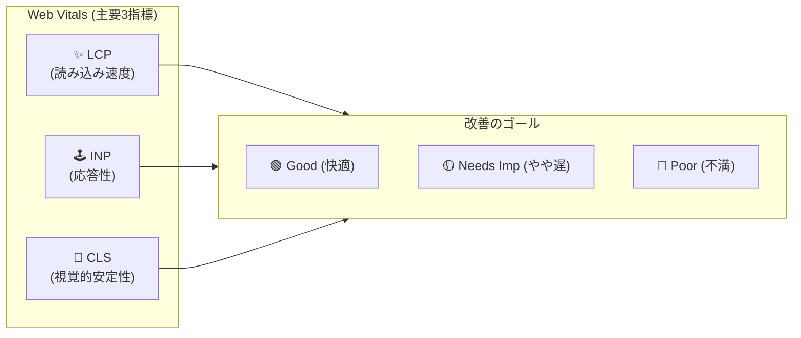
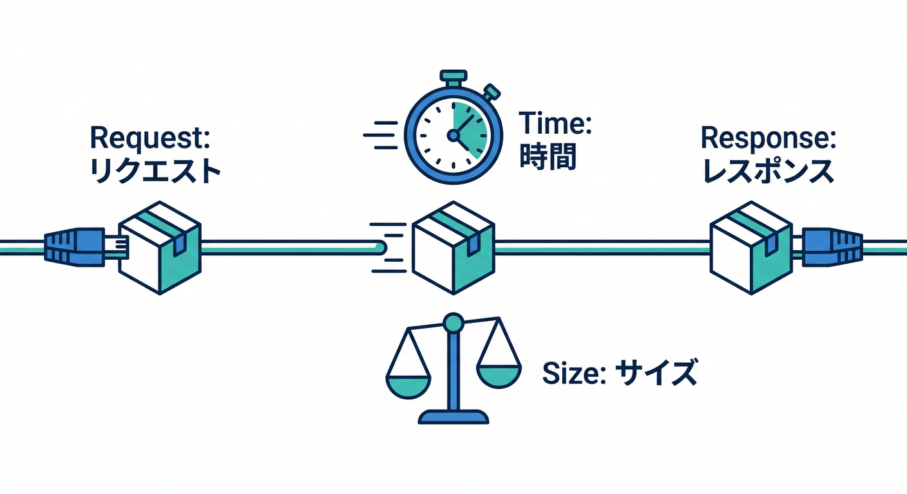
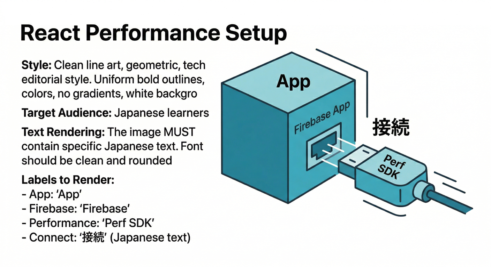
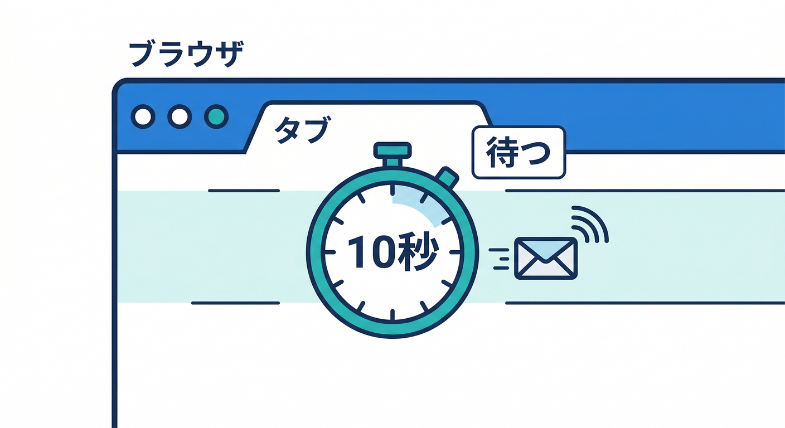
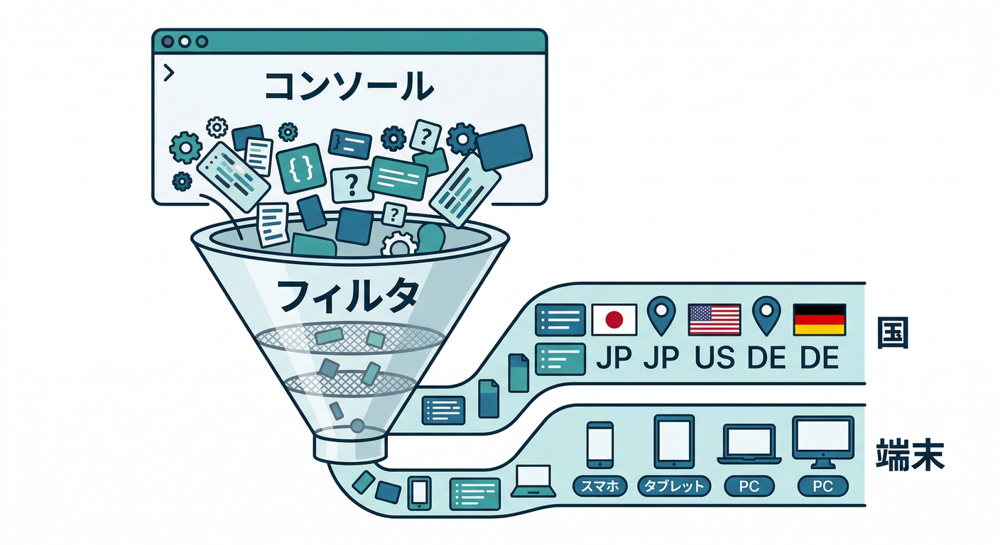
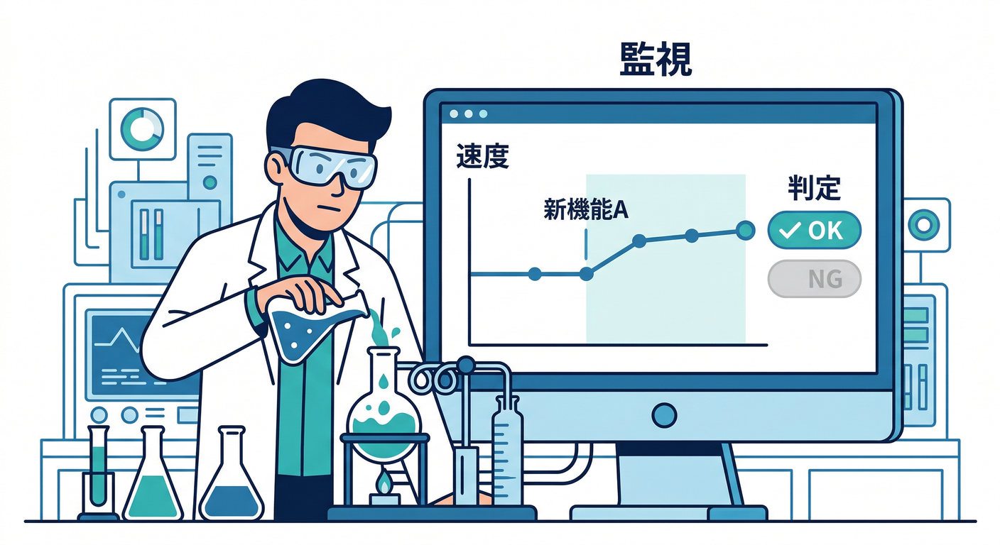

# 第17章：Performance Monitoring導入（遅いを“見える化”）⚡👀

この章はひとことで言うと、**「遅い」を“気合い”じゃなく“証拠”で語れるようになる回**です🕵️‍♂️📊
Analyticsが「使われ方（行動）」を見るなら、Performance Monitoringは「速さ（体感）」を見る感じです🏃‍♀️💨

---

## この章でできるようになること ✅✨

* Web（React）に **Performance Monitoring を入れて**、計測をスタートできる🎛️
* Consoleで **「ページが遅い」「通信が遅い」** を見つける入口が作れる👀
* 「データ出ない…」のありがち原因を潰せる🧯

---

## 1) Performance Monitoring って何がうれしいの？🙂📈



ユーザー目線だと、アプリの評価ってだいたいこれです👇

* 速い→「気持ちいい」😆
* 遅い→「不安」「離脱」😇💔

Performance Monitoringは、**ページ表示や通信の遅さを自動で集めて**、Firebase Consoleに並べてくれます。
Web向けの導入手順と、最初に見るべき場所が公式にまとまっています。([Firebase][1])

---

## 2) Webだと「何が」測れるの？🔍🌐

## 2-1. ページ読み込み（Page load）🖼️⏱️



Webでは、いわゆる “Web Vitals” 系も見えます（**LCP / INP / CLS** など）📏✨
加えて、First Paint / First Contentful Paint / DOM系イベント みたいな「読み込みの節目」も見えます。([Firebase][2])

ざっくり覚え方（超ざっくりでOK）👇

* **LCP**：メインの表示が終わるまで（体感の“重さ”）🧱
* **INP**：操作に対する反応の良さ（“もっさり”検知）🕹️
* **CLS**：レイアウトがガタガタ動く（“画面が揺れる”）🫨



## 2-2. 通信（HTTP/S network request）📡⏱️



通信は「遅い？」を **レスポンスタイム** として追えます。
サイズも出ますが、Webではブラウザの制約があって、**クロスオリジンやキャッシュ**など条件によっては **payload size が 0 になる**こともあります（仕様上そうなることがある）。([Firebase][3])

---

## 3) まずは導入しよう（React/TypeScript）🧩🧑‍💻

## 3-1. 重要ポイント（つまずき予防）🧯

* WebでPerformance Monitoringを使うには、Firebase Consoleで **Webアプリとして登録**されている必要があります。
* 既存アプリに後付けするなら、**Firebase config に `appId` が入っている**ことが大事です。([Firebase][1])
* それと、現時点で **Web向けPerformance SDKは beta** です（互換性が変わる可能性があるよ、という扱い）。([Firebase][1])

## 3-2. コード（最小構成）✍️



Firebase初期化があるプロジェクト前提で、**Performanceを追加**します。

## `src/firebase.ts`（例）

```typescript
import { initializeApp } from "firebase/app";
import { getPerformance } from "firebase/performance";

const firebaseConfig = {
  // ✅ ここに appId が入っているか要チェック！
  // apiKey, authDomain, projectId, appId, ...
};

export const app = initializeApp(firebaseConfig);

// ✅ これだけで “計測開始” の入口ができる
export const perf = getPerformance(app);
```

## `src/main.tsx`（例：読み込み時に firebase.ts が評価されるように）

```typescript
import React from "react";
import ReactDOM from "react-dom/client";
import App from "./App";

// これを import しておくと、Performance の初期化が走る
import "./firebase";

ReactDOM.createRoot(document.getElementById("root")!).render(
  <React.StrictMode>
    <App />
  </React.StrictMode>
);
```

公式も **`getPerformance(app)`** の形（modular API）を案内しています。([Firebase][1])

---

## 4) 「First Input Delay（FID）」だけ注意⚠️🖱️

Webの一部指標（FID）は、**polyfillが必要**と案内されています。
ただし、これは **他の指標（LCP/INP/CLS等）を見るだけなら必須じゃない**です。([Firebase][1])

さらに、FID polyfill の参照先が **別ライブラリ（Web Vitals系）に移動**している流れもあります。([GitHub][4])

この章の結論：

* まずは **polyfill無しで導入 → データが出る状態を作る**🧱
* 「FIDも見たい！」となったら、公式の案内に沿って追加🧩（次の章で深掘りしてもOK）

---

## 5) 最初のデータを“出す”コツ（ここ超重要）🔥



導入しただけだと「静か」なので、**わざとイベントを発生**させます😆

やること👇

1. ローカルでアプリを起動（開発サーバ）🚀
2. 画面をいろいろ開く（サブページ遷移、操作、通信）🖱️📡
3. **ページを開いた後、最低10秒はタブを開いたまま**にする⏳

   * SDKが **約10秒ごとにまとめて送る**ため、すぐ閉じると送信前で終わることがあります。([Firebase][1])
4. Firebase Console の Performance ダッシュボードへ行く（数分待つ）👀([Firebase][1])

---

## 6) 「本当に送れてる？」を秒速で確認する方法⚡🧪

Chrome DevTools などの Network を開いて、数秒後に
**`firebaselogging.googleapis.com`** への通信が見えたら「送れてる」サインです✅([Firebase][1])

---

## 7) Consoleで“最初に見る”場所👀📊



Performance MonitoringのConsoleでは、だいたい次を見ます👇

* **Metric dashboard（メトリクスのカード）**
* **Traces table（トレース一覧）**
* **フィルタ（属性で絞り込み）**

特に便利なのがフィルタで、例えば👇

* Page URLで「このページだけ」
* Effective connection typeで「3Gっぽい回線だと？」
* Countryで「特定地域だけ遅い？」
  みたいに絞れます。([Firebase][5])

---

## 8) Remote Config と相性が良い理由🎛️🤝⚡



新機能を段階リリースするとき、
「出したら遅くなった😇」を早めに気づけると勝ちです🏆

Googleの学習コンテンツでも、Performance Monitoring を使って
**機能ロールアウトを監視しつつ Remote Config で安全に出す**流れが紹介されています。([Google for Developers][6])

この章では“導入”まで。
次の章で「遅いページTOP1を見つける」みたいな捜査に入ります🕵️‍♂️✨

---

## 9) AI活用（Antigravity / Gemini CLI）で導入を速くする🤖💨

「どこに何を書けばいい？」が一番つらいので、そこはAIに投げてOKです🙆‍♂️✨

## 9-1. Firebase MCP server が効く🧠🧰

Firebaseは **MCP server** を用意していて、
**Antigravity / Gemini CLI / Gemini Code Assist** など複数ツールから使える、と明記されています。([Firebase][7])

## 9-2. Gemini CLI にはFirebase拡張がある🧩

Gemini CLI に **Firebase extension** を入れると、MCP serverの設定やFirebase向けのコンテキストが自動で整う、という位置づけです。([Firebase][8])

導入コマンド（例）👇

```bash
gemini extensions install https://github.com/gemini-cli-extensions/firebase/
```

## 9-3. 使えるプロンプト例（コピペ用）📝

* 「React（Vite）で `getPerformance(app)` を追加して、`src/firebase.ts` にまとめて。`appId` が無い場合は指摘して」
* 「Performance dashboard で Page URL フィルタを使って、遅いページを見つける手順を“初心者向け”に箇条書きで」
* 「Network traces の payload size が 0 になるケースがある理由と、判断の仕方を説明して」([Firebase][3])

---

## 10) ミニ課題（10〜20分）🧪🏁

## ミッション🎯

1. Performance Monitoring を入れる（`getPerformance(app)`）([Firebase][1])
2. 画面を3回以上開き、通信も発生させる（API叩く・画像読む等）📡
3. **タブを10秒以上開く**⏳([Firebase][1])
4. Consoleでデータを確認
5. Page URL フィルタで「特定ページだけ」を見てみる👀([Firebase][5])

## 提出物（メモでOK）🗒️

* 「いちばん遅そうなページURL」
* そのページの “気になる指標” を1つ（例：LCP）
* 「次に疑う原因（画像？通信？レンダリング？）」を1行🕵️‍♂️

---

## 11) チェック（理解度テスト）✅🙂

* [ ] `appId` が config に入ってる？([Firebase][1])
* [ ] 導入後、タブを10秒以上開いて試した？([Firebase][1])
* [ ] Networkで `firebaselogging.googleapis.com` を見た？([Firebase][1])
* [ ] Page URL フィルタでページ単位に見られた？([Firebase][5])
* [ ] payload size が 0 でも「壊れた」と決めつけない理由を説明できる？([Firebase][3])

---

## 12) よくある詰まりポイント🧯（ここ見ればだいたい直る）

## 「SDK detected」にならない / データが出ない 😭

* まずは **ログ/送信の確認**（WebならNetworkで送信があるか）([Firebase][1])
* 公式トラブルシュートでは、SDK検出は通常 **10分以内**、初期データ表示は **30分以内**の目安が書かれています（環境差あり）。([Firebase][9])
* それでも怪しいときは Firebase Status Dashboard を確認、という流れも公式が推奨です。([Firebase][9])

---

次の第18章では、いよいよ **「遅い原因の当たりをつける」** に入ります🕵️‍♂️🌐
「ページ」「通信」「画像」「AI処理」…どれが犯人っぽいか、証拠集めしていきましょ😆📌

[1]: https://firebase.google.com/docs/perf-mon/get-started-web "Get started with Performance Monitoring for web  |  Firebase Performance Monitoring"
[2]: https://firebase.google.com/docs/perf-mon/page-load-traces "Learn about page loading performance data (web apps)  |  Firebase Performance Monitoring"
[3]: https://firebase.google.com/docs/perf-mon/network-traces?platform=web "Learn about HTTP/S network request performance data (any app)  |  Firebase Performance Monitoring"
[4]: https://github.com/GoogleChromeLabs/first-input-delay "GitHub - GoogleChromeLabs/first-input-delay: A JavaScript library for measuring First Input Delay (FID) in the browser."
[5]: https://firebase.google.com/docs/perf-mon/console?platform=web "Monitoring performance data in the console  |  Firebase Performance Monitoring"
[6]: https://developers.google.com/learn/pathways/firebase-performance-monitoring "Monitor new features with Firebase Performance Monitoring  |  Google for Developers"
[7]: https://firebase.google.com/docs/ai-assistance/mcp-server "Firebase MCP server  |  Develop with AI assistance"
[8]: https://firebase.google.com/docs/ai-assistance/gcli-extension "Firebase extension for the Gemini CLI  |  Develop with AI assistance"
[9]: https://firebase.google.com/docs/perf-mon/troubleshooting "Performance Monitoring troubleshooting and FAQ  |  Firebase Performance Monitoring"
