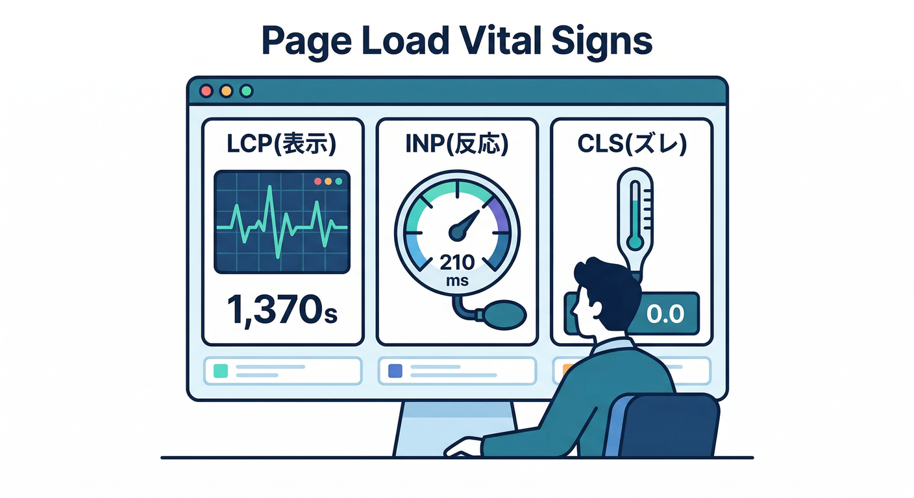
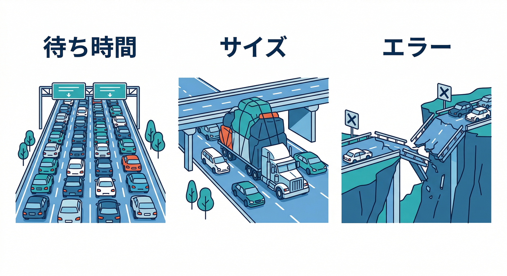
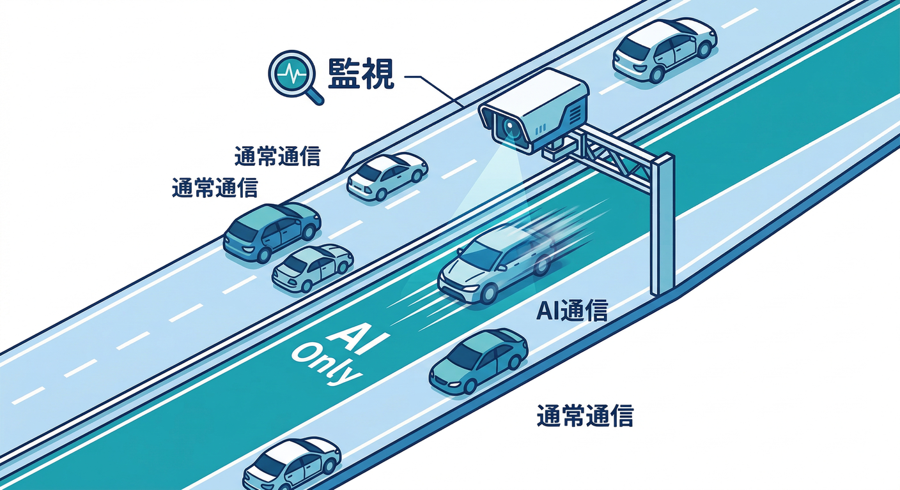
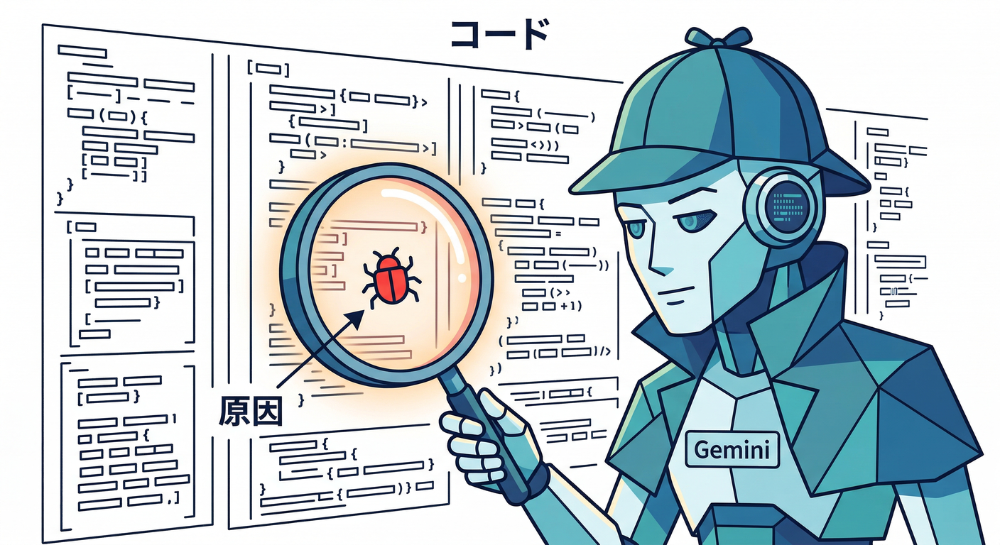

# 第18章：遅い原因の当たりをつける（画面/通信）🕵️‍♂️🌐

この章は「**直す前に、まず“どこが遅いのか”を当てる**」回だよ🎯
Performance Monitoring を使って、遅さを **①画面（ロード）** と **②通信（API）** に分解して、**改善対象を“1つ”に絞る**ところまでやろう💪✨

---

## この章のゴール🏁✨

* 「遅い…😇」を **感覚**じゃなく **数字**で説明できるようになる📊
* 遅さを **画面（ロード）** / **通信（ネットワーク）** のどっちが主犯か当てられる🔍
* 最後に「じゃあ次、何を直す？」を **1つだけ**決められる✅

---

## まず結論：遅さの“主犯”はだいたいこの2つ👀⚡


1. **画面が遅い**（表示・操作できるまでが長い）🖥️🐢
2. **通信が遅い**（API待ち、画像待ち、AI待ち）📡🐢

Firebase Performance Monitoring だと、この2つは **別タブ**で見れるのが強い💡

* **Page load traces（ページ読み込み）**：画面の遅さ🧩 ([Firebase][1])
* **Network traces（HTTP/S リクエスト）**：通信の遅さ🧾 ([Firebase][2])

---

## 1) 画面が遅い：どの数字を見ればいいの？📄🐢➡️🎯



Performance Monitoring の **page load trace** では、ページごとに次みたいな指標が自動で取れるよ（Web）📊
代表どころだと **LCP / INP / CLS / FP / FCP / domInteractive / loadEventEnd** など🧠 ([Firebase][1])

## “症状”→“疑う場所” 早見表🧭✨

* **メインの内容が出るのが遅い**（主役が来ない）😵
  → **LCP** を見る（でかい画像・でかい文章・でかいヒーロー要素が犯人になりがち）🖼️ ([Firebase][1])

* **なんか表示は出るけど、押しても反応が鈍い**😇
  → **INP** を見る（JSが忙しすぎ・重い再レンダリング・巨大な処理）🧠 ([Firebase][1])

* **表示がガタガタ動く／レイアウトがズレる**😖
  → **CLS** を見る（画像サイズ未指定・後出し広告・フォント差し替え等）🧱 ([Firebase][1])

* **最初の“何か”が出るまでが遅い**（真っ白時間が長い）⬜🐢
  → **FP / FCP** を見る（初期JS/CSS/HTMLが重い、初期処理が多い）🧩 ([Firebase][1])

* **見えてるのに、触れるようになるのが遅い**😵‍💫
  → **domInteractive** を見る（初期JSの解析・実行が重い）🧠 ([Firebase][1])

* **全部読み終わるまでが遅い**（画像やサブリソースが重い）📦🐢
  → **loadEventEnd** を見る（画像多すぎ・重いフォント・大量のサブリソース）🧳 ([Firebase][1])

💡さらに嬉しいポイント：
Performance Monitoring は **「どの要素が LCP だったか」**みたいな手がかり（属性）も持ってるよ🕵️‍♂️

* “Largest contentful paint element” とかがヒントになる✨ ([Firebase][1])

---

## 2) 通信が遅い：Network traces の見方📡🐢➡️🎯



Network（HTTP/S）側は「**どのURL（パターン）が遅いか**」をまとめて見れるのが強い💪
しかも Firebase 側で **似たURLを“URLパターン”として自動集計**してくれる🧾 ([Firebase][2])

## 通信が遅いときの“当たりの付け方”🔍

* **いつも遅い**：サーバー側が重い／DBが重い／コールドスタートっぽい🥶
* **たまに遅い**：混雑・外部APIの揺れ・たまたま重い入力データ📈
* **サイズがデカい**：画像が巨大／レスポンスが肥大化／JSON詰め込みすぎ📦
* **エラー多い**：失敗→リトライで余計遅い／認証や権限で詰まってる🚫

Network タブで「遅いURLパターン」を見つけたら、まずはこう考えると早いよ👇
**（A）待ち時間が長い（latency）**のか、**（B）運ぶ量が多い（size）**のか、**（C）失敗してる（error）**のか。

---

## 実践：遅い原因を“画面/通信”に割って、TOP1を特定しよう🏆😇

ここから手を動かすよ〜🖱️✨

## 手順A：遅い“ページ”TOP1を決める（画面）📄🏆

1. Firebase コンソールで **Performance dashboard** を開く📊
2. 下のほうの **Traces table** で **Page load** を選ぶ🧩 ([Firebase][1])
3. 「遅いページ」を **LCP**（または loadEventEnd / domInteractive）で眺める👀
4. **“一番痛そうなページ”を1つ**選ぶ（例：メモ一覧、詳細、画像多い画面など）🎯

✅ここで大事：**平均より“しんどい側”（高いパーセンタイル）の動き**を気にする癖をつけると実務っぽい📈（ユーザーは遅い時の印象で帰る😇）

---

## 手順B：遅い“URLパターン”TOP1を決める（通信）📡🏆

1. 同じく Performance dashboard の **Network** を開く🌐 ([Firebase][2])
2. **遅い URL パターン**を探す（AI呼び出し/Functions呼び出し/画像取得など）🔍
3. TOP1 を1つ決める🎯
4. それが「AI系」なら次の節へ🤖✨

---

## AI機能が遅い時の“近道”🤖⚡（ここ、差がつく）



AI（Gemini呼び出し等）は「便利だけど遅い時は遅い」ので、**AI専用の観測**を混ぜると一気に楽になるよ😆

## ① Firebase AI Logic 側の “AI monitoring dashboard” を見る📊🤖

Firebase 側には **AIの利用状況を可視化して、レイテンシ（遅さ）や成功/失敗、サイズ**を追えるダッシュボードがあるよ🧠✨ ([The Firebase Blog][3])
「Network traces で遅い」→「AI監視で遅い」まで繋がると、犯人がかなり特定できる🎯

## ② Gemini in Firebase で“読み解き”を手伝わせる🧯🤝

コンソール内の **Gemini in Firebase** は、開発やデバッグを手伝う共同作業アシスタント、って位置づけだよ🧠 ([Firebase][4])
「このページの LCP が高い。何を疑う？」みたいに、**仮説出し**に使うのが相性いい✨

---

## Gemini CLI / Antigravity を“調査役”にする🕵️‍♀️💻✨



「TOP1は分かった。じゃあコードのどこ？」ってなるよね😇
ここで AI を **調査係**にすると速い。

* **Gemini CLI**：ターミナルから使えるオープンソースのAIエージェント（ReActでツールも使う）🧠💻 ([Google for Developers][5])
* **Antigravity**：エージェントが計画→調査→実装まで持っていける “agentic IDE” という位置づけ🛸 ([Google Codelabs][6])

## Gemini CLI に投げるプロンプト例🧪（コピペ用）

```text
あなたはパフォーマンス調査役です。

前提：
- React( SPA ) のページ読み込みで LCP が高い
- 対象ページ：/memo（メモ一覧）
- Performance Monitoring で「Largest contentful paint element」がヒントとして出ている

やってほしいこと：
1) /memo のレンダリングで重くなりやすい原因候補を、コードを見て列挙
2) まず疑う順番（優先順位）を3つに絞る
3) “確認手順” を Chrome DevTools ベースで短いチェックリスト化
4) 変更が安全に段階リリースできる案（Remote Configで切れる等）があれば提案
```

## Antigravity に頼むなら（指示の出し方イメージ）🛸

* 「Performance の Page load で遅いページTOP1を特定→該当ページの重い原因候補→最短の確認手順」
  みたいに **“ミッション”形式**で投げると進みやすいよ🚀（調査→実装まで一本道になりやすい） ([Google Codelabs][6])

---

## よくあるハマり🧯（ここ踏む人多い）


* **データが出ない／遅れて出る**
  Web はイベントをローカルでまとめて送るので、操作しても少し待つことがあるよ（送信は一定間隔でバッチされる）⏳ ([Firebase][7])

* **First input delay（FID）が取れてない**
  Webの page load 指標には FID もあるけど、計測には polyfill が必要だったり、条件がある（例：ロード直後にユーザーが操作しないと記録されない等）🧩 ([Firebase][1])

* **「なんか怪しい」時は公式のトラブルシュートへ**
  まずはステータス確認など、基本チェックがまとまってる🧯 ([Firebase][8])

* **Web SDK は beta 扱い**
  将来仕様が変わる可能性がある前提で、公式ページを“正”にして追うのが安全🧠 ([Firebase][1])

---

## ミニ課題🎒✨：遅いページTOP1を“1つだけ”決めよう🏆


1. Performance の **Page load** で遅いページを眺める📊
2. 「これが一番ユーザー体験を壊してる😇」を **1つだけ**選ぶ🎯
3. そのページについて、下の3点をメモ📝

* どの指標が高い？（例：LCP / INP / CLS）
* 主犯は画面？通信？（どっち寄り？）
* “原因候補” を3つだけ書く（画像？JS？API？）

---

## チェック✅🎉

* [ ] 遅いページ（または遅いURLパターン）を **1つ**に絞れた？
* [ ] 「画面/通信」どっちが主犯っぽいか言えた？
* [ ] 次に確認する手順が **3ステップ以内**で書けた？

---

次の第19章では、この章で当てた“主犯”に対して **カスタムトレースで証拠を固める🧾⚡** に入るよ。
もし今の時点で「遅いTOP1」が **AI整形ボタン**っぽいなら、AI monitoring dashboard 側もセットで追う流れがめちゃ気持ちいいはず🤖📊 ([The Firebase Blog][3])

[1]: https://firebase.google.com/docs/perf-mon/page-load-traces "Learn about page loading performance data (web apps)  |  Firebase Performance Monitoring"
[2]: https://firebase.google.com/docs/perf-mon/network-traces "Learn about HTTP/S network request performance data (any app)  |  Firebase Performance Monitoring"
[3]: https://firebase.blog/posts/2025/11/gemini-3-firebase-ai-logic/ "Bring any idea to life with Gemini 3 and Firebase AI Logic"
[4]: https://firebase.google.com/docs/ai-assistance/gemini-in-firebase "Gemini in Firebase"
[5]: https://developers.google.com/gemini-code-assist/docs/gemini-cli "Gemini CLI  |  Gemini Code Assist  |  Google for Developers"
[6]: https://codelabs.developers.google.com/building-with-google-antigravity "Building with Google Antigravity  |  Google Codelabs"
[7]: https://firebase.google.com/docs/perf-mon/get-started-web "Get started with Performance Monitoring for web  |  Firebase Performance Monitoring"
[8]: https://firebase.google.com/docs/perf-mon/troubleshooting "Performance Monitoring troubleshooting and FAQ  |  Firebase Performance Monitoring"
