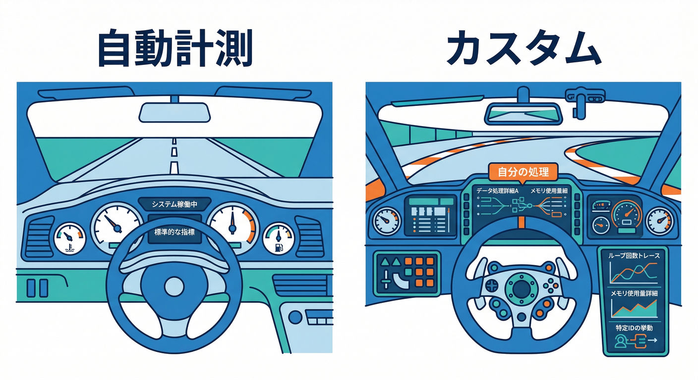
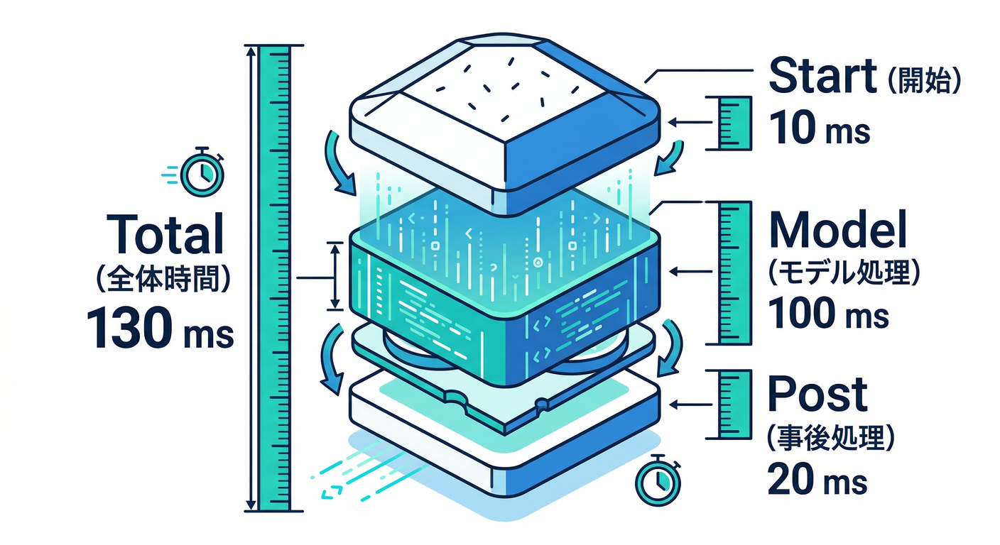
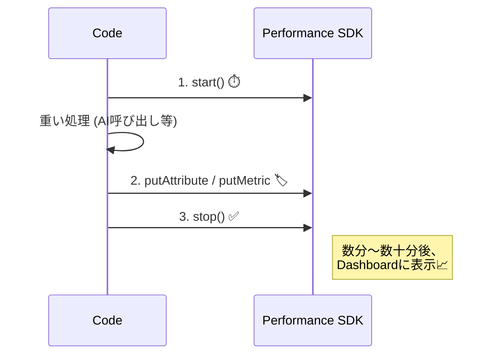
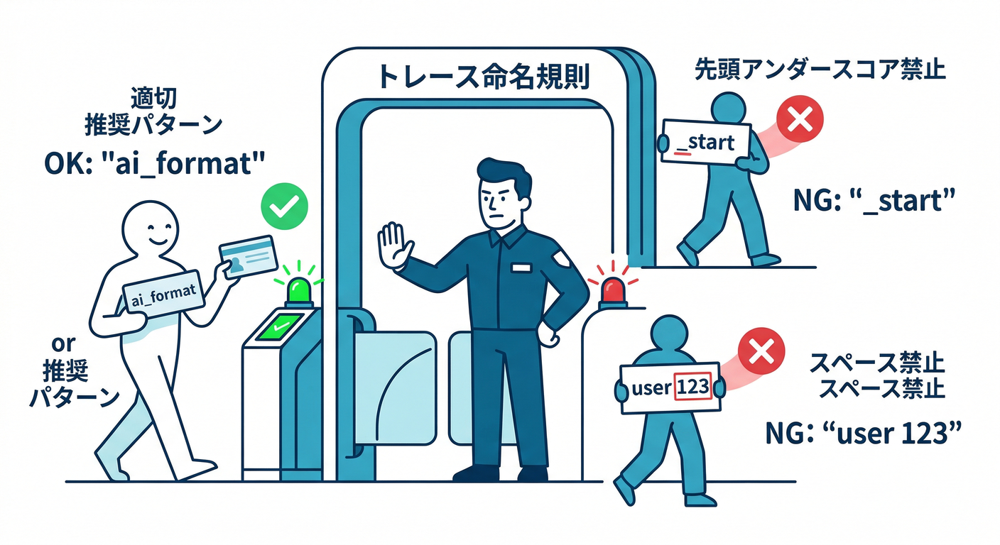
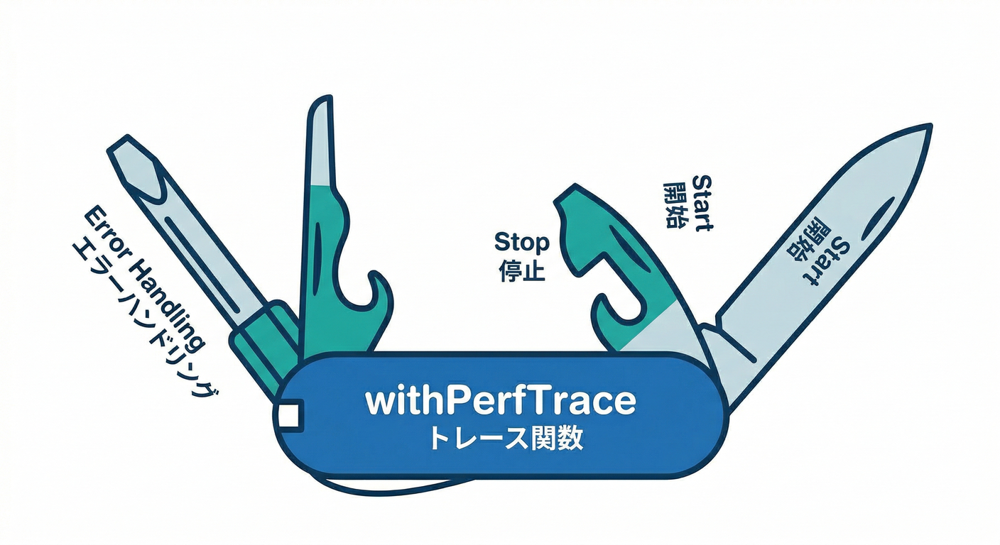
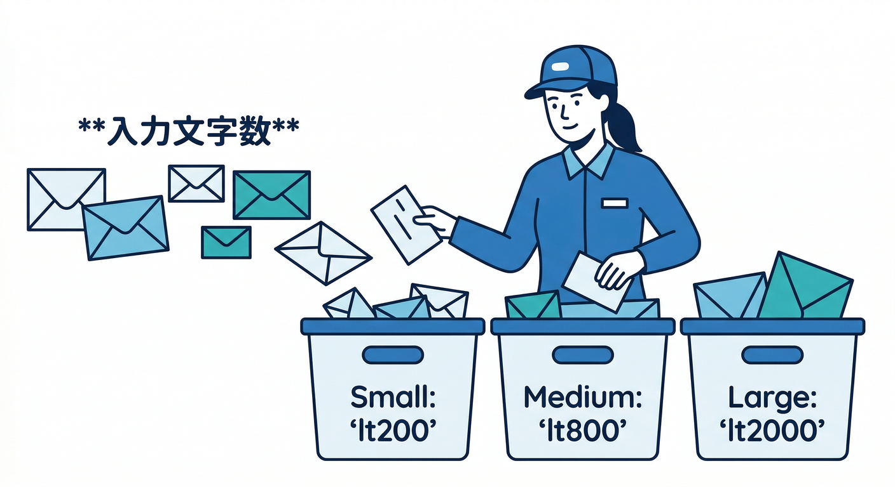
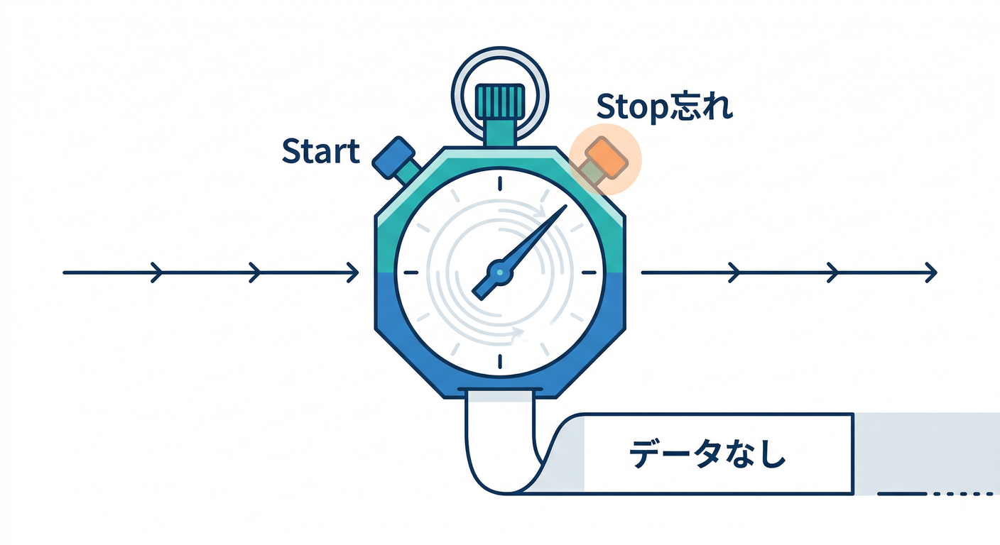

# 第19章：カスタムトレースで“証拠”を取る🧾⚡

この章は、「なんか遅い気がする…😇」を卒業して、**“どこが・どれくらい・誰に”遅いのか**を数字で言えるようにする回です📊✨
Firebase Performance Monitoring の **カスタムトレース（custom traces）**を入れて、たとえば **AI整形ボタン🤖📝**みたいな“自分の処理”を計測できるようにします。([Firebase][1])

---

## 1) カスタムトレースって何？いつ使うの？🧠



Performance Monitoring には、ページロードやネットワークなど “自動で取れる指標” があるんだけど、**「自分で書いた処理」**は自動じゃ分からないことが多いです😵‍💫

そこで **Trace API** を使って、

* `ai_format` の処理時間（開始〜終了）⏱️
* 「キャッシュに当たった回数」🗃️
* 「入力が長いと遅くなる？」📏

みたいな **“アプリ特有の体感”**を、あとからダッシュボードで見れる形にします👀✨
（SDKは計測データをすぐ全部送るんじゃなく、まとめて送る仕組みなので、反映にタイムラグがあるのもポイント👍）([Firebase][2])

---

## 2) 設計が8割：まず「計測ポイント」を決めよう🎯



ここ、超大事です🔥
**測りたい“体験”を1つに絞る**のがコツ。

例：AI整形フロー（おすすめ構成）🤖🧩

* **Trace A：`ai_format_total`**（ボタン押下〜結果表示まで全部）
* **Trace B：`ai_format_model`**（AI呼び出し区間だけ）
* **Trace C：`ai_format_post`**（整形後のUI更新や保存など）



こうすると「AIが遅いのか？UIが重いのか？」が切り分けできます🕵️‍♂️✨

---

## 3) 命名ルール＆やっちゃダメ集🚫（ここで詰まりがち）



カスタムトレースやカスタムメトリクスには、**名前の制約**があります⚠️
代表だけ覚えればOK👇

* **先頭に `_`（アンダースコア）ダメ**
* **前後に空白ダメ**
* **長さ制限あり**（ドキュメントの上限に従う）
* **“動的な値”を名前に入れない**（例：`ai_format_user_123` みたいなの）🙅‍♂️
  ([Firebase][3])

さらに、カスタム属性（attributes）は便利だけど、**個人が特定できる情報（PII）を入れない**のが鉄則です🛡️
属性の数や、メトリクスの数にも上限があるので「入れすぎない」が勝ち🏆([Firebase][1])

---

## 4) 実装：React/TypeScript に “計測の枠” を作る🧩🧑‍💻

ここからは **Web（React）**の例です！
Performance Monitoring の JS SDK には `getPerformance()` と `trace()` があり、`start()` / `stop()` で計測します⏱️([Firebase][4])

### 4-1) まずは「汎用ヘルパー」を作る（最強）💪✨



どの処理にも使い回せるようにしておくと、計測が一気に楽になります🎉

```typescript
import { getPerformance, trace, type PerformanceTrace } from "firebase/performance";
import type { FirebaseApp } from "firebase/app";

type TraceFn<T> = (t: PerformanceTrace) => Promise<T>;

export async function withPerfTrace<T>(
  app: FirebaseApp,
  name: string,
  fn: TraceFn<T>,
  opts?: {
    // カスタム属性（数に上限があるので “少なめ” が基本）
    attrs?: Record<string, string>;
    // カスタムメトリクス（整数で入れるのが基本）
    metrics?: Record<string, number>;
  }
): Promise<T> {
  const perf = getPerformance(app);
  const t = trace(perf, name); // Trace API
  t.start();

  try {
    // 属性
    if (opts?.attrs) {
      for (const [k, v] of Object.entries(opts.attrs)) t.putAttribute(k, v);
    }
    // メトリクス
    if (opts?.metrics) {
      for (const [k, v] of Object.entries(opts.metrics)) t.putMetric(k, Math.trunc(v));
    }

    const result = await fn(t);
    return result;
  } finally {
    // stopし忘れは「データ出ない」の最大原因😭
    t.stop();
  }
}
```

`trace()` / `start()` / `stop()` / `putMetric()` / `putAttribute()` は SDK の Trace API（PerformanceTrace）で提供されています。([Firebase][4])
※名前ルール違反や start/stop のミスは “カスタムトレースが出ない” 典型なので、最後の `finally` が超重要です🧯([Firebase][3])

---

### 4-2) AI整形ボタンに入れる（本題）🤖📝



例として、`formatWithAI()`（中で Firebase AI Logic を呼ぶ想定）を計測します。
Firebase AI Logic は「モバイル/ウェブのクライアントから Gemini/Imagen を安全に呼ぶ」ための仕組みで、他のFirebaseサービスとも連携しやすい設計です。([Firebase][5])

```typescript
import type { FirebaseApp } from "firebase/app";
import { withPerfTrace } from "./withPerfTrace";

// 例：AI整形（中身はあなたの実装に合わせてOK）
async function formatWithAI(input: string): Promise<string> {
  // TODO: Firebase AI Logic の SDK で Gemini を呼ぶ処理
  // ここは教材では “測りたい区間” を作るのが目的！
  await new Promise((r) => setTimeout(r, 400)); // ダミー遅延
  return input.trim();
}

export async function onClickAiFormat(app: FirebaseApp, input: string) {
  const inputLen = input.length;

  // 「長さそのまま」を属性に入れると増えすぎるので、ざっくり分類が安全🙂
  const lenBucket =
    inputLen < 200 ? "lt200" :
    inputLen < 800 ? "lt800" :
    inputLen < 2000 ? "lt2000" : "ge2000";

  const result = await withPerfTrace(
    app,
    "ai_format_total",
    async (t) => {
      // 例：カウント系（キャッシュヒットなど）にも使える
      // t.incrementMetric("cache_hit", 1);
      // ↑ incrementMetric も Trace API にあるよ📌
      // （「何回起きた？」が取れる）:contentReference[oaicite:8]{index=8}

      const out = await formatWithAI(input);

      // 例：出力サイズもメトリクスにしてみる（整数）
      t.putMetric("output_chars", out.length);

      return out;
    },
    {
      attrs: {
        input_len_bucket: lenBucket,
        // model: "gemini-2.5-flash-lite" みたいに “固定の少数値”なら属性にOK🙆‍♂️
      },
      metrics: {
        input_chars: inputLen,
      }
    }
  );

  return result;
}
```

* `incrementMetric()` / `putMetric()` / `putAttribute()` はカスタムトレースに「回数」「サイズ」「分類」を持たせるのに便利です📦([Firebase][6])
* 属性に “無限に増える値” を入れると分析が壊れるので、**バケツ（分類）化**が安全です🪣🙂([Firebase][1])

---

## 5) どこで見れる？どう読めばいい？👀📊


Firebase Console の Performance Monitoring で **Custom traces** として見えるようになります🧾⚡
ただし、**反映はリアルタイムではない**ので「数分〜しばらく待つ」前提で見るのがコツです（SDKがまとめて送る＆集計が入るため）。([Firebase][2])

読み方のおすすめ👇

* **平均より “p90（遅い側）” を見る** 🐢
  → ユーザー体感は「遅い人がどれだけいるか」が効く
* **分けて見る（属性が効く）**
  → `input_len_bucket=ge2000` だけ遅い、とかが分かる
* **改善前/改善後を比較**
  → 施策の効果が「気分」じゃなくなる🎉

---

## 6) 「出ない！」ときの即チェック🧯（99%ここ）



カスタムトレースが表示されない時は、だいたいこれ👇

1. 名前がルール違反（空白、`_` 先頭、長すぎ…）
2. `start()` してない / `stop()` してない / 順番が変
3. `stop()` が例外で飛んで実行されてない（だから `finally`！）
   ([Firebase][3])

それでもダメなら、Performance Monitoring の troubleshooting を見ながら切り分けすると早いです🔍([Firebase][3])

---

## 7) AIで“計測→改善案→実装”を加速する🤖🚀

ここからが2026っぽいところ✨

### 7-1) Gemini in Firebase で「原因の仮説」を作る🧠

Firebase コンソール上の **Gemini in Firebase** は、Firebase製品の質問・コード生成・デバッグ補助などをしてくれます。
「このトレース、p90だけ悪いんだけど原因候補は？」みたいな相談に強いです🧯([Firebase][7])

### 7-2) Gemini CLI で “計測コードの差分” を安全に作る🛠️

Gemini in Firebase のドキュメント自体が「コードベースにアクセスできるAI（例：Gemini CLI）」を併用すると良い、という流れを案内しています。([Firebase][7])
さらに Google Developers Blog でも Gemini CLI の拡張・運用の話が出ていて、**「プロジェクトの仕様をMarkdownで固定してAIの暴走を防ぐ」**みたいな考え方も紹介されています📌([Google Developers Blog][8])

**Geminiに投げると良いお願い（例）**👇

* 「`ai_format_total` を `finally` で必ず stop する形に修正して」
* 「属性を増やしすぎない設計にして。値が爆発しないバケツ設計にして」
* 「改善案を3つ：①キャッシュ ②入力短縮 ③並列度（UIブロック回避）」

### 7-3) Antigravity で “計測タスク” をエージェントに任せる🛸

Antigravity は “エージェント前提の開発プラットフォーム” で、複数エージェントの管理（Mission Control）や、検証をArtifactsで残す思想が説明されています。([Google Codelabs][9])
計測を入れる作業って「複数箇所への追加」「例外時の止め忘れ確認」「命名統一」など、地味にミスりやすいので、エージェント活用と相性いいです🤝✨

---

## 8) ミニ課題🎒✨（この章のゴール確認）

**ミニ課題：AI整形の“遅さの証拠”を取れ！🧾⚡**

1. `ai_format_total` を入れる（今回のサンプル通りでOK）
2. 属性 `input_len_bucket` を入れる（値が爆発しないように）
3. メトリクス `input_chars` と `output_chars` を入れる
4. コンソールで `ge2000` が遅いか確認👀
5. 改善案を1つ入れて（例：長文は警告 or 分割）、改善前/後を比較📈

---

## 9) チェックテスト✅（3問だけ）

1. カスタムトレースが出ない原因で多いのは？

* A. Consoleのバグ
* B. `stop()` し忘れ / 名前ルール違反
* C. GA4の設定不足

2. 属性に入れてよいのはどれ？

* A. userId（固定）
* B. メールアドレス
* C. `input_len_bucket=lt800`（少数の分類）

3. 体感改善でまず見るべきは？

* A. 平均だけ
* B. p90など遅い側も見る
* C. 最速の人だけ

（答え：1=B / 2=C / 3=B 🎉）

---

次の第20章で、この「証拠」を使って **改善サイクル（仮説→変更→計測→判断）**を完成させます🔁🏁
もし今のミニアプリが「メモ＋AI整形」なら、次は **“長文入力の扱い（分割/要約/キャッシュ）”**を改善ネタにするとめちゃ教材っぽくて気持ちいいですよ😆✨

[1]: https://firebase.google.com/docs/perf-mon/custom-code-traces "Add custom monitoring for specific app code  |  Firebase Performance Monitoring"
[2]: https://firebase.google.com/docs/perf-mon/get-started-web?utm_source=chatgpt.com "Get started with Performance Monitoring for web - Firebase"
[3]: https://firebase.google.com/docs/perf-mon/troubleshooting "Performance Monitoring troubleshooting and FAQ  |  Firebase Performance Monitoring"
[4]: https://firebase.google.com/docs/reference/js/performance "performance package  |  Firebase JavaScript API reference"
[5]: https://firebase.google.com/docs/ai-logic "Gemini API using Firebase AI Logic  |  Firebase AI Logic"
[6]: https://firebase.google.com/docs/reference/js/performance.performancetrace.md "PerformanceTrace interface  |  Firebase JavaScript API reference"
[7]: https://firebase.google.com/docs/ai-assistance/gemini-in-firebase "Gemini in Firebase"
[8]: https://developers.googleblog.com/search/?name=%E3%8C%AE1%EC%86%8C%EA%B2%B0%EC%A0%95%EC%B1%85%EB%B0%A9%EB%B2%95%EA%99%83%E2%80%98%E3%85%8C%E3%84%B9+barotk77%E2%80%99%E3%8C%A0%EA%B8%B0%ED%94%84%ED%8A%B8%EC%B9%B4%EB%93%9C%EA%99%80sK%EC%86%8C%EC%95%A1%EA%B2%B0%EC%A0%9C%EA%99%B1kt%EC%86%8C%EC%95%A1%EA%B2%B0%EC%A0%9C%E3%8D%AC%EC%B9%B4%EB%93%9C%EB%A1%A0%E3%8D%9B&page=2&utm_source=chatgpt.com "Search - Google Developers Blog"
[9]: https://codelabs.developers.google.com/getting-started-google-antigravity?utm_source=chatgpt.com "Getting Started with Google Antigravity"
