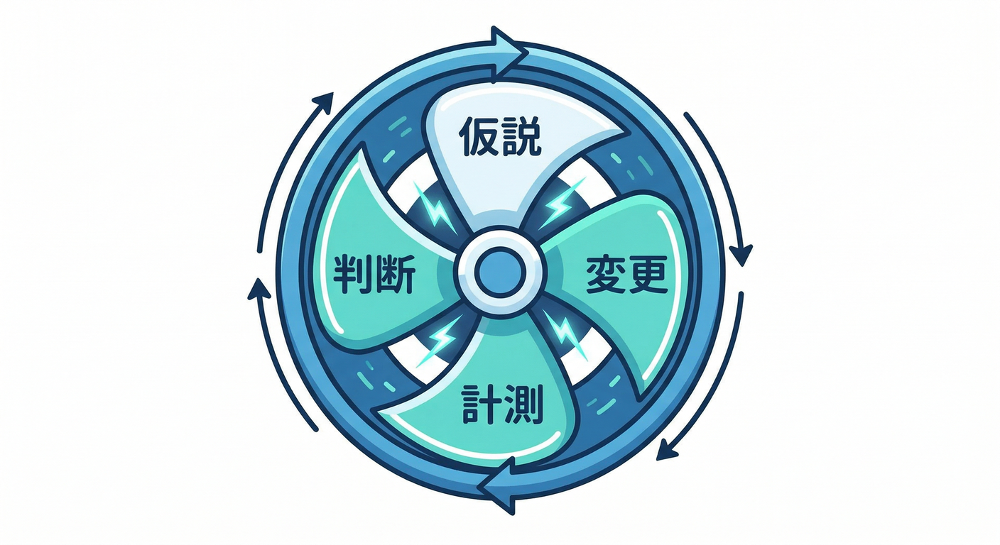
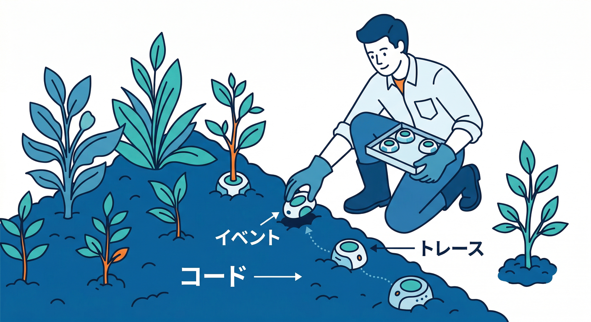
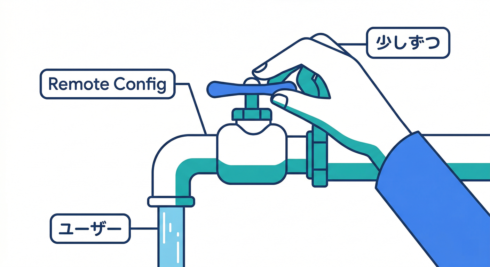
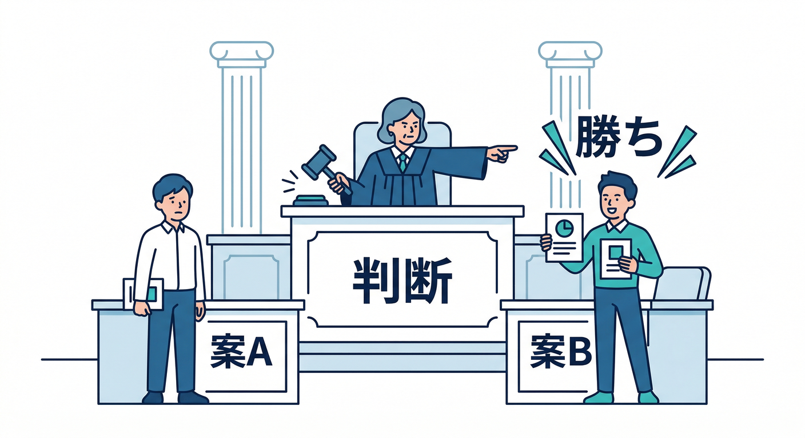
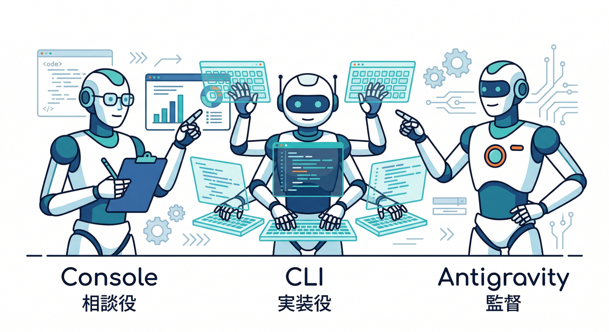
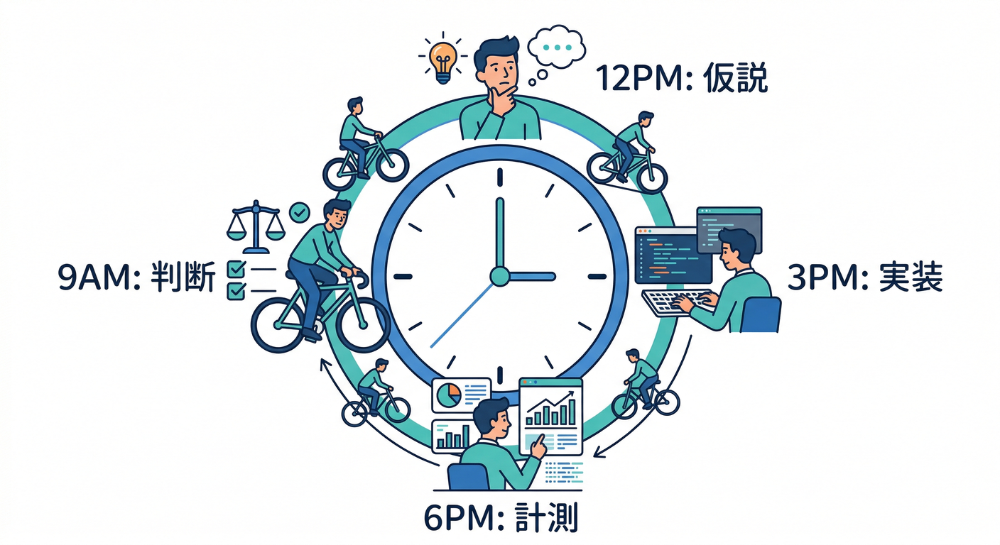

# 第20章：改善サイクル完成（AIも使って回す）🔁🤖🏁

この章はゴール回🏁✨
ここまで作ってきた **Analytics / Remote Config / A/B / Performance** を「バラバラの道具」じゃなく、**改善を回す“1つの型”**にまとめます🧩
さらに、**Gemini（AI）を“開発の相棒”**にして、改善の回転数をグッと上げます🤝🤖

---

## この章でできるようになること 🎯✨

* **仮説 → 変更 → 計測 → 判断 → 次の仮説** を、1日で1周できる🚴‍♀️💨
* 変更をいきなり全員に出さず、**Remote Configで安全に段階ON**できる🎛️🛡️
* **A/Bで勝ち負けを数字で決める**（勘に頼らない）🧪⚖️ ([Firebase][1])
* **遅さも証拠で直す**（Performance + カスタム計測）⚡🧾 ([Firebase][2])
* AI（Gemini CLI / Gemini in Firebase / Antigravity）で
  「調査 → 実装案 → 変更 → 事故防止チェック」まで爆速化できる💻🤖 ([Google for Developers][3])

---

## 今日の“1周セット”の全体図 🗺️🔁



1. **観測**：いまの数字（現状）を取る📊
2. **仮説**：「ここを変えたら良くなるはず」を1つに絞る💡
3. **安全に出す**：Remote Configで段階的にON🎛️
4. **比較する**：A/Bで勝ち負けを見る🧪
5. **遅さも見る**：Performanceで「体感」を数値化⚡
6. **判断して広げる**：勝った案をロールアウト🏁
7. **次の1周へ**：また仮説を立てて回す🔁

---

## 今回の例題（ミニアプリ想定）📝🤖

**「メモ＋AI整形」**でよくある改善テーマ👇

* 課題A：AI整形ボタンが押されない（使われない）😢
* 課題B：押すと処理が遅い（待たされる）🐢💦

この2つを、**1周でまとめて改善**します🔥

---

## Step 1：KPI（北極星）とガードレールを決める 🌟🧯


まず “勝ち負けの定義” を決めます。ふわっと始めると、最後に迷子になります😇

* **KPI（北極星）候補**

  * `ai_format_success_rate`（AI整形の成功率）
  * `ai_format_usage_rate`（AI整形ボタンが押された割合）
* **ガードレール（悪化したら中止）**

  * `error_rate`（エラー増えたらアウト）
  * `perf_p95`（体感遅さが悪化したらアウト）⚡

ここは「1つずつ」でOK🙆‍♂️
今回のKPIは **“AI整形の利用率”** にします📈

---

## Step 2：イベントと“遅さの証拠”を仕込む 🧩📊⚡



## 2-1. イベント（最低これだけ）📣

* `ai_format_click`（押された）
* `ai_format_success`（成功した）
* `ai_format_fail`（失敗した）
* `memo_save`（保存した）←ガードレールにも使える

イベント送信の基本は公式の「Log events」に沿えばOKです📘 ([Firebase][4])

（例：ボタンクリック時に送る）

```typescript
import { getAnalytics, logEvent } from "firebase/analytics";

const analytics = getAnalytics();

export function trackAiFormatClick() {
  logEvent(analytics, "ai_format_click", { screen: "memo" });
}
```

([Firebase][4])

## 2-2. カスタムトレース（AI処理の時間を測る）⏱️🧾

Performance Monitoringは、標準で「ページ読み込み」「ネットワーク」などが取れます。さらに自分の処理も **カスタムトレース**で測れます⚡ ([Firebase][5])

（※Web導入は “Get started” の手順どおりに） ([Firebase][6])

**ポイント：Performanceのデータは少し遅れて届く**（まとめて送るのでタイムラグあり）⌛
([Firebase][2])

---

## Step 3：Remote Configで「安全に出す」🎛️🛡️



いきなり全員に新仕様を出すと事故るので、Remote Configを“ハンドル”にします🚦
Webの導入フローは公式手順どおりでOKです🧰 ([Firebase][7])

## 3-1. 使うパラメータ例（今回の改善用）🧾

* `enable_ai_format`（bool：AI整形ボタン出す？）
* `ai_prompt_variant`（string：プロンプトをA/Bで変える）
* `ai_daily_limit`（number：使いすぎ防止）
* `ai_ui_copy`（string：ボタン文言をA/Bで変える）

## 3-2. 取得の作法（fetchAndActivate）📦

“アプリ起動時にfetchして反映” みたいな戦略は公式の Loading strategy が参考になります🧠
([Firebase][8])

（例：フラグでUIを出し分け）

```typescript
import { getRemoteConfig, fetchAndActivate, getValue } from "firebase/remote-config";
import { app } from "./firebaseApp";

export async function loadFlags() {
  const rc = getRemoteConfig(app);
  await fetchAndActivate(rc);

  return {
    enableAi: getValue(rc, "enable_ai_format").asBoolean(),
    uiCopy: getValue(rc, "ai_ui_copy").asString(),
    promptVariant: getValue(rc, "ai_prompt_variant").asString(),
    dailyLimit: getValue(rc, "ai_daily_limit").asNumber(),
  };
}
```

([Firebase][7])

---

## Step 4：A/Bテストで「勝ち負け」を決める 🧪⚖️



Remote Configの値をA/Bで出し分けて、**Analyticsで成果を測る**のがFirebase流です📊
A/B Testingの公式ガイドを土台に進めます🧭 ([Firebase][1])

## 4-1. 今回のA/B案（超わかりやすいやつ）🗣️

* A案（現状）：ボタン文言「AI整形」
* B案（改善）：ボタン文言「文章をきれいにする✨」

つまり **`ai_ui_copy` をA/Bで変える**だけ。初心者でも回せます🙆‍♂️

## 4-2. コンソールでやること（手順イメージ）🧭

1. Firebase Console → **A/B Testing** → “Remote Config”の実験を作成
2. 対象パラメータ：`ai_ui_copy`
3. 目的（Objective）：例）`ai_format_click` を増やす
4. テスト端末で **バリアントが固定されて見える**か確認
5. 実験を走らせる🏃‍♂️💨
6. 勝ったら **Roll out variant** で全体へ🏁

この流れ自体が公式にまとまっています📘 ([Firebase][9])

## 4-3. Webの注意：シークレットだと別ユーザー扱い🕵️‍♂️

WebのA/Bは **Firebase installation ID（FID）** を使って割り当てが保存されます。
ただし、**ブラウザが違う / シークレット / IndexedDB消去** だと別扱いになって、違うバリアントになることがあります⚠️
([Firebase][9])

---

## Step 5：AI（Firebase AI Logic）で機能改善そのものも加速 🤖⚡

ここからが“今どき”ポイント🔥
AIを入れるなら、Firebase AI Logic の公式導線が土台になります（Gemini/Imagenに安全にアクセス）([Firebase][10])

今回の改善では、例として👇

* `ai_prompt_variant` によって **整形プロンプトを切り替える**
* 反応が良かったプロンプトを **勝ちとして採用**

こういう運用ができます🎛️🤖

---

## Step 6：AIで「改善の回転数」を上げる（開発AIの使いどころ）🧠💻



## 6-1. Gemini in Firebase（コンソールで相談）🧯

Firebaseコンソールの中で、調査・デバッグ・手順確認の助けになるやつです👀
([Firebase][11])

おすすめの聞き方👇

* 「A/Bの結果画面、どこを見れば判断できる？」
* 「Performanceで遅いページロードが出てる。原因候補を並べて」

## 6-2. Gemini CLI（ターミナルで“実装案→変更→テスト案”）⌨️🤖

Gemini CLIは、ターミナルから使える **オープンソースのAIエージェント**で、複雑な作業を ReAct（考えて→行動）で進められます🧠→🛠️
([Google for Developers][3])

おすすめの使い方👇

* 「イベント名の表とコードを突き合わせて、表記ゆれを直して」
* 「Remote Configのキーを一覧化して、未使用を検出して」
* 「A/Bの仮説を3つ出して、実装コストが低い順に並べて」

## 6-3. Firebase エージェントのスキル（AIに“Firebase文脈”を移植）🧩🧠

Firebase公式が用意している “AIにFirebaseの型を覚えさせるモジュール” です📦
Antigravity や Gemini CLI などで動きます。インストール例も公式にあります👇 ([Firebase][12])

* Antigravity：

```bash
npx skills add firebase/agent-skills
```

* Gemini CLI：

```bash
gemini extensions install https://github.com/firebase/agent-skills
```

([Firebase][12])

## 6-4. Antigravity × Firebase MCP（“つなぐ/設定/実装”をエージェントにやらせる）🛸🔌

Firebase公式ブログで、Antigravityに **Firebase MCP server** を追加して、エージェントがFirebase連携を進められる流れが紹介されています🧠
([The Firebase Blog][13])

例：

* エージェントに「Firebase初期化して」「このプロジェクトをリンクして」などを頼める
* 必要なら途中で質問して止まってくれる
* 何をやったかの手順も見せてくれる

この章の結論としては、**“改善サイクルを回す作業”はAIと相性がめちゃ良い**です🔥

---

## ミニ課題：24時間で「改善を1周」してみよう 🏁🧪⚡



次のどっちかでOK（片方だけで十分）👇

## お題1：AI整形ボタンの利用率を上げる 📈✨

1. `ai_format_click` をイベントで送る
2. Remote Configで `ai_ui_copy` を作る
3. A/Bで文言を2案にして走らせる
4. 勝ったらロールアウト🏁 ([Firebase][9])

## お題2：AI整形の“待ち時間”を短くする 🐢➡️🐇

1. Performance導入
2. AI整形処理にカスタムトレース
3. 遅い原因を1つに絞って改善
4. 改善前/後で数字比較🧾 ([Firebase][2])

---

## チェックリスト（できたら勝ち）✅🎉

* KPIとガードレールを1つずつ言える🌟🧯
* Remote Configで **段階ON**できる🎛️ ([Firebase][7])
* A/Bで「勝ち」を判断し、必要ならロールアウトできる🏁 ([Firebase][9])
* Performanceで “遅い” を数字で語れる⚡ ([Firebase][5])
* AI（Gemini CLI / Gemini in Firebase / Antigravity）を「調査・実装・検証」に使えた🤖 ([Google for Developers][3])

---

## よくあるミス集 🧯（先に潰す）

* **イベント名が表とズレる**（`ai_format_click` と `ai_format_clicked` とか）→ 集計が割れる😇
  ([Firebase][4])
* **A/Bテストをシークレットで確認**して「端末ごとに固定されない！」って焦る → Webの仕様あるある🕵️‍♂️
  ([Firebase][9])
* Performanceのダッシュボードにすぐ出ない → **少し遅れて届く**仕様⌛
  ([Firebase][2])
* Remote Configを取りに行きすぎる → 取得戦略は公式の考え方をベースに🎛️
  ([Firebase][8])

---

## ちいさな理解テスト（答えつき）📝✅

1. なぜRemote Configを挟むの？
   → 事故を減らして、段階的に出せるから🎛️🛡️ ([Firebase][7])

2. A/Bの勝ち負けは何で決める？
   → 事前に決めたKPI（目的イベント）で決める📊🧪 ([Firebase][9])

3. WebでA/Bが固定される仕組みは？
   → FIDがIndexedDBに保存されて割り当てが維持される🧠 ([Firebase][9])

4. “遅い” を当てずっぽうで直さないために何する？
   → Performanceで証拠を取り、必要ならカスタムトレースを入れる⚡🧾 ([Firebase][14])

5. AIはこの章で何に使うのが強い？
   → 仮説出し・実装案・チェック項目・デバッグの加速🤖💨 ([Firebase][11])

---

## まとめ 🎊

これで「作って終わり」卒業🎓✨
あなたのミニアプリは、**数字で育てられるアプリ**になりました📊🌱
次にやると超気持ちいいのは👇

* 「毎週この時間にダッシュボードを見る」📅👀
* 「改善ネタをAIに“候補10個”出させて、1個だけ実験」🤖🧪
* 「勝った案だけを静かに全体展開」🎛️🏁

必要なら、この第20章の内容をそのまま **“教材の本文フォーマット（読む→手順→よくあるミス→小テスト）”** に整形して、章末の提出物テンプレ（提出チェック表つき）まで作れます📚✨

[1]: https://firebase.google.com/docs/ab-testing?utm_source=chatgpt.com "Firebase A/B Testing - Google"
[2]: https://firebase.google.com/docs/perf-mon/get-started-web "Get started with Performance Monitoring for web  |  Firebase Performance Monitoring"
[3]: https://developers.google.com/gemini-code-assist/docs/gemini-cli?utm_source=chatgpt.com "Gemini CLI | Gemini Code Assist"
[4]: https://firebase.google.com/docs/analytics/events?utm_source=chatgpt.com "Log events | Google Analytics for Firebase"
[5]: https://firebase.google.com/docs/perf-mon?utm_source=chatgpt.com "Firebase Performance Monitoring - Google"
[6]: https://firebase.google.com/docs/perf-mon/get-started-web?utm_source=chatgpt.com "Get started with Performance Monitoring for web - Firebase"
[7]: https://firebase.google.com/docs/remote-config/web/get-started?utm_source=chatgpt.com "Get started with Remote Config on Web - Firebase"
[8]: https://firebase.google.com/docs/remote-config/loading?utm_source=chatgpt.com "Firebase Remote Config loading strategies - Google"
[9]: https://firebase.google.com/docs/ab-testing/abtest-config "Create Firebase Remote Config Experiments with A/B Testing  |  Firebase A/B Testing"
[10]: https://firebase.google.com/docs/ai-logic?utm_source=chatgpt.com "Gemini API using Firebase AI Logic - Google"
[11]: https://firebase.google.com/docs/ai-assistance/gemini-in-firebase?utm_source=chatgpt.com "Gemini in Firebase - Google"
[12]: https://firebase.google.com/docs/ai-assistance/agent-skills?hl=ja "Firebase エージェントのスキル  |  Develop with AI assistance"
[13]: https://firebase.blog/posts/2025/11/firebase-mcp-and-antigravity/ "Antigravity and Firebase MCP accelerate app development"
[14]: https://firebase.google.com/docs/perf-mon/custom-code-traces "Add custom monitoring for specific app code  |  Firebase Performance Monitoring"
