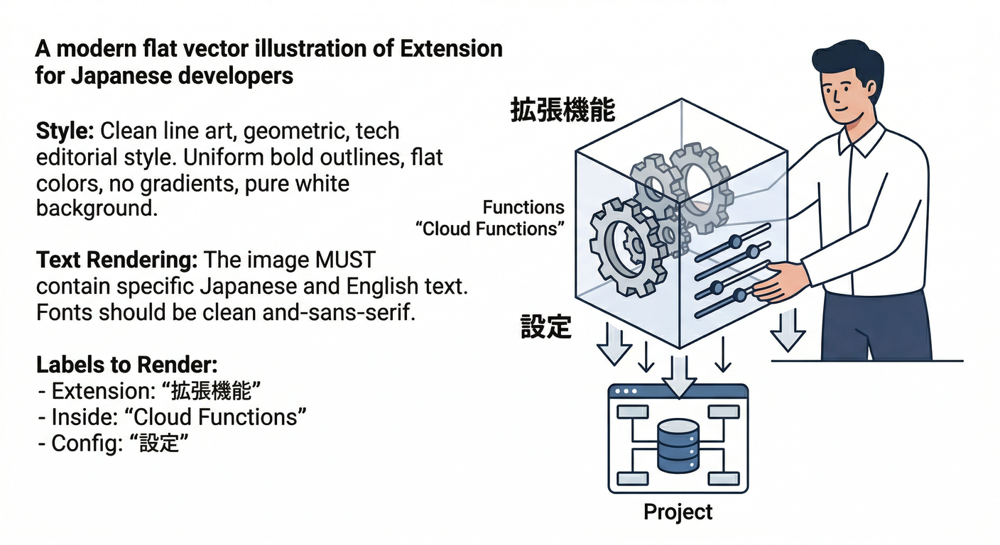
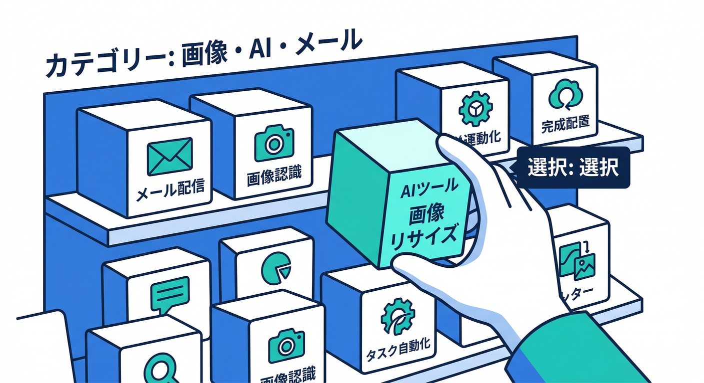
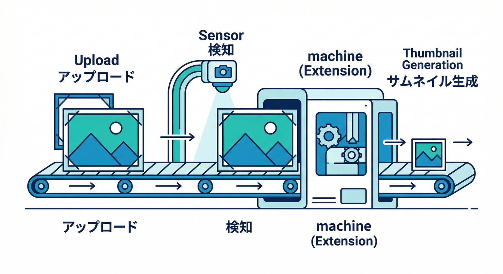
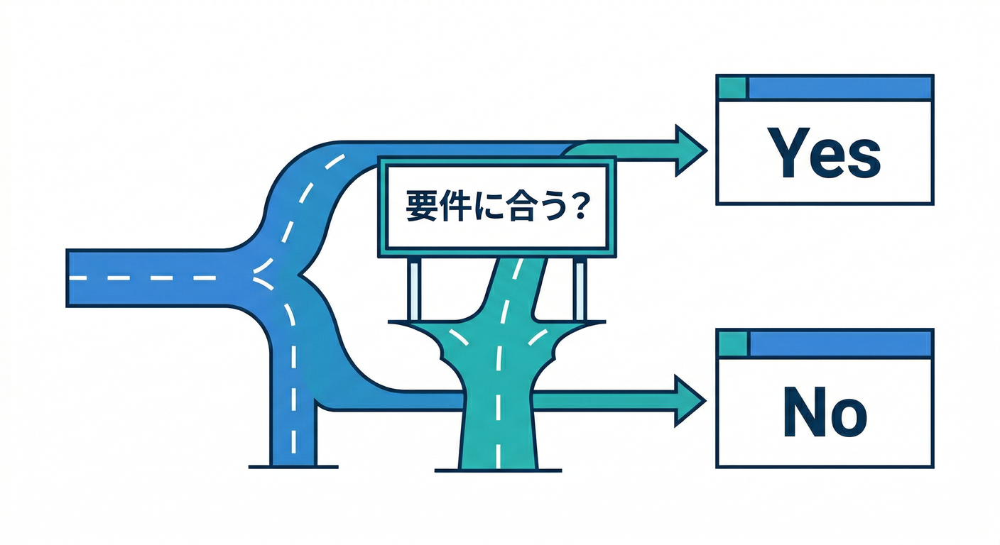


# Extensions：よくある機能を“素早く導入”🧩⚡（20章アウトライン / 2026）

このカテゴリのゴールはシンプル👇
**「作らなくていい機能は、Extensionsで秒速導入」→「自作に切り替える判断もできる」** だよ😎✨
Firebase Extensions は “パッケージ化された機能” をインストールして使える仕組みで、裏では Cloud Functions などが動く感じ🧠⚙️ ([Firebase][1])

---


## 第1章：Extensionsってなに？“入れるだけで動く”の正体🧩

* 読む📚：Extensions の基本（何が入ってて、どう動く？） ([Firebase][1])
* 手を動かす🖐️：Extensions Hub を眺めて「これ入れたい！」を3つメモ📝 ([Firebase][2])
* ミニ課題🎯：「自作しそうだけど拡張で済みそう」な機能を1つ選ぶ
* チェック✅：**“拡張 = 設定パラメータ付きの機能パック”** を説明できる



## 第2章：Extensions Hubの歩き方（探し方のコツ）🧭✨

* 読む📚：Extensions Hub（extensions.dev）でできること ([Firebase][2])
* 手を動かす🖐️：「画像」「メール」「AI」「翻訳」で検索して、用途別に分類📌
* ミニ課題🎯：自分のアプリに効きそうな“Top3拡張”を決める🥇
* チェック✅：**拡張は用途・依存サービス・課金**まで見て選ぶと理解できた



## 第3章：インストール前チェック（落とし穴を先に潰す）🧯💸

* 読む📚：拡張のインストール要件（Blaze必須など） ([Firebase][3])
* 手を動かす🖐️：課金まわりの“事故ポイント”をチェックリスト化🧾
* ミニ課題🎯：**「どのサービス料金が増えそう？」** を1分で説明
* チェック✅：Blaze 必須の理由を言える（裏で Functions 等が動く） ([Firebase][3])

## 第4章：まずは鉄板！画像リサイズ拡張で“それっぽさ”爆上げ📷🖼️

* 読む📚：Resize Images 拡張の概要 ([extensions.dev][4])
* 手を動かす🖐️：プロフィール画像アップロード → サムネ自動生成を想像して設計図を書く🗺️
* ミニ課題🎯：サムネ命名ルール案（例：`thumb_200x200`）を作る
* チェック✅：**「アップロードをトリガーに自動処理」** の流れがわかった ([extensions.dev][4])



## 第5章：パラメータ設計が9割（拡張は“設定”で化ける）🎛️✨

* 読む📚：拡張の中身（extension.yaml / パラメータ / PREINSTALL など） ([Firebase][1])
* 手を動かす🖐️：Resize Images の「入力パス」「出力先」「サイズ」候補を紙に書く📝 ([extensions.dev][4])
* ミニ課題🎯：**「本番/検証でパラメータ変える？」** を決める
* チェック✅：パラメータが“運用そのもの”だと理解できた

## 第6章：Consoleからインストールしてみる（最短ルート）🧩🚀

* 読む📚：拡張のインストール（Consoleで進める前提と注意） ([Firebase][3])
* 手を動かす🖐️：Consoleで拡張を選び、入力パラメータを“安全寄り”で入れる
* ミニ課題🎯：**「いま有効化されるAPI/作られるリソース」** をメモ
* チェック✅：入れた後に何が増えたか追えるようになった ([Firebase][5])

## 第7章：CLIで入れる（再現性のある運用へ）💻🔁

* 読む📚：CLIでの拡張管理（インストール/一覧/更新） ([Firebase][3])
* 手を動かす🖐️：代表コマンドを“自分の手順書”に貼る🧾
* ミニ課題🎯：**検証環境→本番環境** の順で入れる流れを文章化
* チェック✅：人に渡せる手順になった

（例コマンド：雰囲気だけ掴めればOK🙆‍♂️）

```bash
## 拡張一覧
firebase ext:list

## インストール（例）
firebase ext:install <publisher>/<extension-name>

## 更新
firebase ext:update <instance-id>
```

## 第8章：Extensions Emulatorで“課金前に動作確認”🧪🧯

* 読む📚：Extensions Emulator で何ができる？ ([Firebase][6])
* 手を動かす🖐️：ローカルで拡張を走らせる想定で「テスト手順」を作る🧾
* ミニ課題🎯：Resize Images を **“ローカルで試すなら何を観察する？”** を箇条書き
* チェック✅：本番汚さず検証できるイメージがついた ([Firebase][6])


## 第9章：拡張の“中身”を覗く（extension.yamlの読み方）🔍🧠

* 読む📚：extension.yaml / PREINSTALL / POSTINSTALL の役割 ([Firebase][1])
* 手を動かす🖐️：拡張が要求する権限・API・パラメータを表にする📋
* ミニ課題🎯：**「この拡張の怖いところ」** を1つ見つけて対策を書く🛡️
* チェック✅：ブラックボックス感が減った

## 第10章：裏側の仕組み（Functions/イベント/リソース作成）⚙️🧩

* 読む📚：拡張が “リソースを作る” ことの意味 ([Firebase][5])
* 手を動かす🖐️：インストール後の「作られたリソース一覧」を棚卸し🧹
* ミニ課題🎯：**「トリガーはどこ？入力はどこ？」** を矢印で書く➡️
* チェック✅：原因調査ができる土台ができた

## 第11章：Resize Images実践（アップロード→サムネ→表示）📷➡️🖼️➡️🧑‍💻

* 読む📚：Resize Images の挙動（どのタイミングで何が生成される？） ([extensions.dev][4])
* 手を動かす🖐️：React側で「元画像＋サムネURL」を表示するUIを作る✨
* ミニ課題🎯：**サムネ表示を“軽い順”に出す**（体感速度アップ）
* チェック✅：アプリが急に“実在感”出た😆


## 第12章：運用の基本（ログ・失敗・リトライ）🪵🧯

* 読む📚：Consoleで拡張の状態/エラーを見る ([Firebase][5])
* 手を動かす🖐️：よくある失敗（権限・パラメータ・サイズ）を再現→回復手順を書く
* ミニ課題🎯：**「失敗時にユーザーへ何を見せる？」** を決める🙂
* チェック✅：困ったときに“見る場所”が分かる

## 第13章：料金の感覚（どこで課金が起きる？）💸🧠

* 読む📚：拡張は Blaze 前提＆使うサービスに応じて課金 ([Firebase][3])
* 手を動かす🖐️：Resize Images の「想定トラフィック」と「増えそうな費用」を書く🧾
* ミニ課題🎯：**無料枠を超えそうなポイント**を1つ挙げる
* チェック✅：拡張は“便利だけどタダではない”を腹落ち

## 第14章：2026の注意点（デフォルトバケットと課金要件）📅⚠️

* 読む📚：デフォルト Cloud Storage バケットの要件（2026-02-03 など） ([Firebase][7])
* 手を動かす🖐️：自分のプロジェクトが影響受けるかチェック項目化
* ミニ課題🎯：**「いつまでに何を確認？」** を未来の自分向けメモにする📝
* チェック✅：期限系の地雷を踏まない

## 第15章：セキュリティ目線（権限・秘密情報・最小権限）🛡️🔐

* 読む📚：拡張が要求する権限・リソースを理解する ([Firebase][1])
* 手を動かす🖐️：**「この拡張に必要な権限だけ」** という気持ちで見直す👀
* ミニ課題🎯：Secrets/APIキーが出てくる拡張を選んで“守り方”を書く
* チェック✅：便利さと安全のバランスを取れる

## 第16章：バージョン管理（更新・互換性・変更点）🔁🛠️

* 読む📚：拡張の管理・更新・状態確認 ([Firebase][5])
* 手を動かす🖐️：更新時の手順書（事前確認→更新→動作確認）をテンプレ化🧾
* ミニ課題🎯：**更新による影響が怖いところ**を1つ挙げる
* チェック✅：アップデートを“儀式”にできた

## 第17章：環境分離（検証・本番で“同じ拡張”を安全に）🧪➡️🏭

* 読む📚：拡張は複数インスタンス入れられる（用途別に分けられる） ([extensions.dev][8])
* 手を動かす🖐️：検証用インスタンス（別パラメータ）を設計
* ミニ課題🎯：**「本番だけ強めの設定」** を考える（例：ログ、サイズ制限）
* チェック✅：環境ごとに事故を封じ込められる

## 第18章：AI拡張を入れてみる（翻訳・要約・分類）🤖✨

* 読む📚：Translate Text in Firestore（Gemini も選べる＆注意点あり） ([extensions.dev][8])
* 手を動かす🖐️：コメント欄に入った文章を自動翻訳して別フィールドに保存🌍
* ミニ課題🎯：**“AI入力はサニタイズが必要”** を自分の言葉で説明🧼
* チェック✅：Gemini を使うときの注意（プロンプトインジェクション等）が分かった ([extensions.dev][8])

## 第19章：AIで開発も運用もラクにする（Antigravity / Gemini CLI / Console AI）🛸💻🧯

* 読む📚：Antigravity の概要 ([Google Codelabs][9]) ／ Gemini CLI の位置づけ ([Google Cloud Documentation][10]) ／ Gemini in Firebase の活用 ([Firebase][11])
* 手を動かす🖐️：

  * Gemini CLI に「この拡張のパラメータ表を作って」って頼む📋
  * Console の AI でエラーやログを“日本語で噛み砕く”🧠
* ミニ課題🎯：**“更新前チェックリスト”** をAIに下書きさせて、人間が仕上げる🤝
* チェック✅：AIを“便利な部下”として使える（丸投げしない）😎

## 第20章：自作 vs Extensions の分岐点（ここが判断ライン⚖️）＋ランタイム表🧩⚙️

* 読む📚：拡張は便利だが「合わないなら自作へ」 ([Firebase][1])
* 手を動かす🖐️：判断シートを作る（要件フィット / 改造要否 / コスト / ロックイン）🧾
* ミニ課題🎯：自作に切り替える条件を3つ決める
* チェック✅：迷ったときに“判断がぶれない”状態になった



**ランタイム目安（2026）📌**

* Firebase の Cloud Functions（Firebase側の Functions）: **Node.js 22 / 20**（Python も選べる） ([Google Cloud Documentation][12])
* Cloud Run functions（GCP側の Functions）: **.NET 8** や **Python 3.12** なども現役で選べる ([Google Cloud Documentation][12])

---

## このカテゴリの“最終ミニ制作”案（1つに繋げる）🏁✨

**画像アップロード → サムネ自動生成 → FirestoreへURL保存 → （おまけ）AI翻訳/要約拡張で文面整形**

* 画像：Resize Images 拡張で自動化📷🖼️ ([extensions.dev][4])
* AI：Translate Text in Firestore（Geminiも選べる）で“多言語化”🌍🤖 ([extensions.dev][8])

---


[1]: https://firebase.google.com/docs/extensions/publishers/parameters "Set up and use parameters in your extension  |  Firebase Extensions"
[2]: https://firebase.google.com/docs/extensions/manage-installed-extensions?utm_source=chatgpt.com "Manage installed Firebase Extensions"
[3]: https://firebase.google.com/docs/extensions/install-extensions "Install a Firebase Extension  |  Firebase Extensions"
[4]: https://extensions.dev/extensions/firebase/storage-resize-images "Resize Images | Firebase Extensions Hub"
[5]: https://firebase.google.com/docs/extensions/manage-installed-extensions "Manage installed Firebase Extensions"
[6]: https://firebase.google.com/docs/emulator-suite/use_extensions "Use the Extensions Emulator to evaluate extensions  |  Firebase Local Emulator Suite"
[7]: https://firebase.google.com/docs/storage/faqs-storage-changes-announced-sept-2024 "FAQs about changes to Cloud Storage for Firebase pricing and default buckets"
[8]: https://extensions.dev/extensions/firebase/firestore-translate-text "Translate Text in Firestore | Firebase Extensions Hub"
[9]: https://codelabs.developers.google.com/getting-started-google-antigravity "Getting Started with Google Antigravity  |  Google Codelabs"
[10]: https://docs.cloud.google.com/gemini/docs/codeassist/gemini-cli "Gemini CLI  |  Gemini for Google Cloud  |  Google Cloud Documentation"
[11]: https://firebase.google.com/docs/ai-assistance/gemini-in-firebase "Gemini in Firebase"
[12]: https://docs.cloud.google.com/functions/docs/runtime-support "Runtime support  |  Cloud Run functions  |  Google Cloud Documentation"
