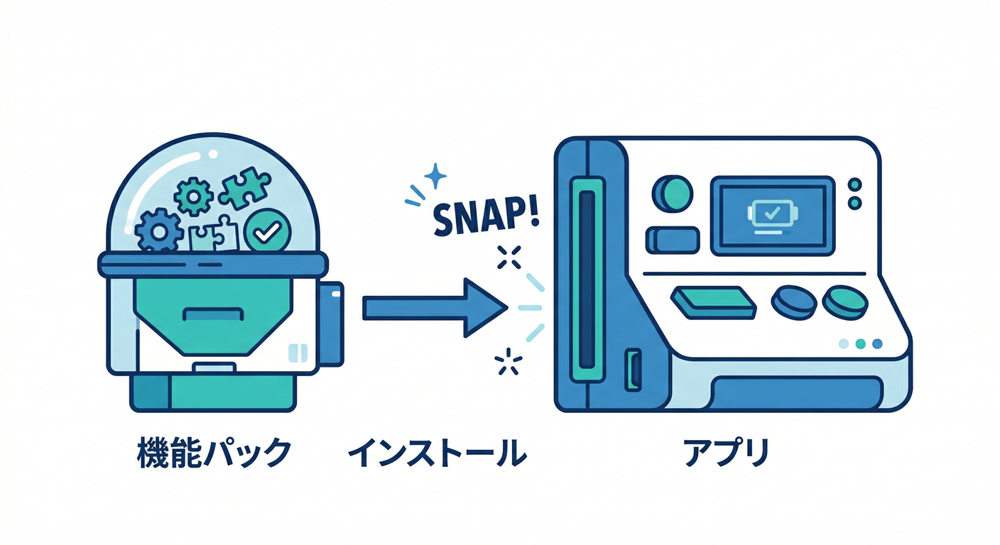
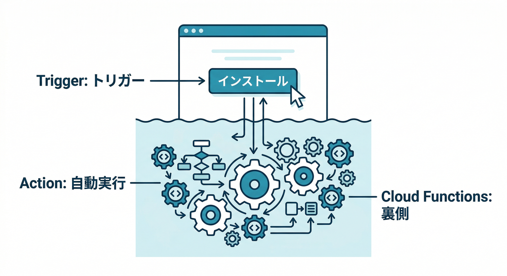
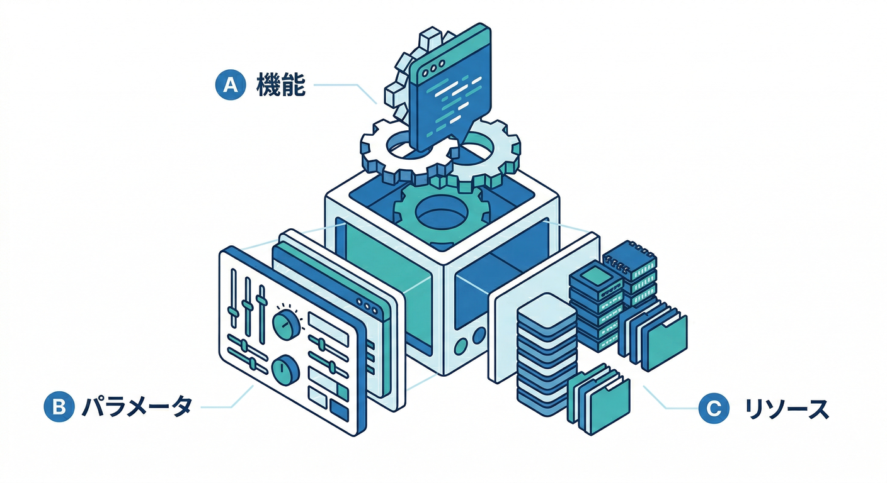

# 第1章：Extensionsってなに？“入れるだけで動く”の正体🧩⚡

この章のゴールはこれ👇
**「Extensions＝“設定つき機能パック”」だと腹落ちして、入れる前に“何が起きるか”を自分で読めるようになる**こと😎✨

---

## 1) Extensionsをひとことで言うと？🧩

Firebase Extensionsは、**よくある機能を“パッケージ化”して、インストールで一気に導入できる仕組み**だよ⚡
そして重要なのがここ👇

* 入れた瞬間に、拡張は **特定のタスクを自動で実行**する（例：イベント・HTTP・スケジュールなど）([Firebase][1])
* その“自動実行”の正体は、裏で **Cloud Functionsなどのリソースが動く**ことが多い([Firebase][1])

つまり「入れるだけで動く」＝「入れたら“自動で動く仕組み”がセットされる」ってことだね🧠⚙️

---

## 2) “入れるだけで動く”の裏側を、3つに分解🧩🔍

Extensionsの中身は、ざっくりこう分けると理解が一気にラク👇

## A. 機能本体（何をする拡張？）⚙️

例：画像をリサイズする、Firestoreの変更でメール送る、翻訳する…など。

## B. パラメータ（あなたのアプリ向けに調整するツマミ🎛️）

Extensionsは基本「設定しないとあなたのアプリに合わない」ので、**パラメータで動きをカスタム**するよ。
パラメータは **拡張の“環境変数みたいなもの”**で、インストール時に入れる値（ユーザーが設定する値）と、インストール後に自動で埋まる値があるんだ🧾([Firebase][2])

## C. 生成されるリソース（インストールで増えるもの🏗️）

インストールすると、拡張が必要とするリソース（関数など）が作られて、それがトリガーで動くイメージ⚙️([Firebase][1])

---

## 3) まずは“読める目”を作ろう：Extensions Hubの見方🧭✨

Extensionsを使いこなすコツは、**入れる前に「何が起きるか」を読む**ことだけ！
そのための場所が **Extensions Hub**（extensions.dev）だよ🧩([Firebase エクステンションズハブ][3])

見るポイントはこの4つ👇（ここだけ覚えればOK🙆‍♂️）

1. **What it does / How it works**（何をする？どう動く？）
2. **Configurable parameters**（どんな設定が必要？）
3. **Resources created**（インストールで何が作られる？）
4. **Billing/コストの匂い**（使うサービス＝費用が出る可能性💸）

---

## 4) 手を動かす：Extensions Hubを眺めて「欲しい拡張」3つメモ📝🔥

やることはシンプル！“観察”だけでOK😆

## 手順🖐️

1. Extensions Hubを開く([Firebase エクステンションズハブ][3])
2. 気になる拡張を3つ選ぶ（直感でOK）
3. それぞれについて、下のテンプレを埋める📝

## メモ用テンプレ（コピペして使ってOK🧾）

* 拡張名：
* 何ができる？（一言で）：
* 何がトリガー？（例：Storageにアップロード / Firestore更新 / HTTP / スケジュール）：
* パラメータで決めること（例：対象パス、出力先、言語…）：
* インストールで増えそうなもの（関数/他サービス）：
* ちょっと怖い点（権限・コスト・誤爆しそう等）：

---

## 5) 例：Resize Imagesを“読む”練習📷➡️🖼️

「読む」ってこういうことだよ、の見本いくね😎

**Resize Images**は、Storageに画像が上がったら…

* 画像かどうか判定して
* 指定サイズにリサイズ画像を作って
* 元ファイル名に幅×高さのサフィックスを付けて
* 同じバケットに保存する
  …という動きが説明されてるよ📌([Firebase エクステンションズハブ][4])

この時点で、もう分かることがある👇

* **トリガー**：Storageアップロードっぽい
* **パラメータ**：サイズ、保存先、命名などがありそう
* **運用の匂い**：大量アップロードで処理回数＝コスト/負荷が増えそう💸

「入れる前に読んだだけで、事故が減る」ってこういう感じ😆🧯

---

## 6) ミニ課題🎯：「自作しそうだけど拡張で済みそう」な機能を1つ選ぶ

次のどれかから1つ選んで、さっきのテンプレを埋めてみてね👇
（例としてHubに載ってる有名どころ！）([Firebase エクステンションズハブ][3])

* 📷 **画像リサイズ（サムネ自動生成）**
* ✉️ **Firestoreをきっかけにメール送信**
* 🌍 **翻訳・要約・分類みたいな“文章処理”**

ポイントは「自分ならこれ作っちゃいそう…」ってやつを選ぶこと😆

---

## 7) チェック✅：ここまで理解できたら勝ち🎉

次の4つ、口で説明できたら合格だよ🙆‍♂️

* ✅ Extensionsは「入れるだけで動く機能パック」である([Firebase][1])
* ✅ 動きは、イベント/HTTP/スケジュール等の“トリガー”で起こる([Firebase][1])
* ✅ パラメータは「拡張の環境変数」みたいなもので、挙動を決めるツマミ🎛️([Firebase][2])
* ✅ ローカルでも“拡張を試す”考え方があり、課金前に理解を深められる([Firebase][5])

---

## 8) AI活用コーナー🤖✨（Gemini in Firebase / Gemini CLI）

## Gemini in Firebase（コンソールで相談🧠）

Firebaseコンソールには **Gemini in Firebase** が用意されていて、セットアップして使えるよ✨([Firebase][6])
第1章では「理解の補助」に使うのが最高！

おすすめプロンプト例👇

* 「この拡張の *parameters / resources created* を、初心者向けに3行で要約して」
* 「この拡張を入れると“運用で困りそうな点”をチェックリスト化して」
* 「コストが増えそうなポイントを、想像でいいから列挙して（根拠も）」

## Gemini CLI（ターミナルで“読解”を爆速化💻🛸）

Gemini CLIは、Cloud Shellでは追加セットアップなしで使える案内があるよ([Google Cloud Documentation][7])
そして「調べ物・理解・手順書づくり」まで面倒見てくれる系🥷✨([Google Cloud][8])

おすすめの使い方（第1章向け）👇

* 「この拡張ページの説明から、**パラメータ表**を作って」
* 「“何がトリガーで、何が出力”かを矢印図にして」
* 「自作した場合との比較（メリット/デメリット）を短く」

※AIエージェント系は便利だけど、**“実行”や“変更”は必ず目で確認してから**ね🧯（丸投げは事故る！）

---

## 9) 次章へのつながり🔜🧩

第1章でやった「拡張を読む目」ができると、次はラクになる👇

* 第2章：Hubでの探し方が速くなる🧭
* 第3章：インストール前の地雷（コスト/権限）を踏みにくくなる🧯
* 第4章：Resize Imagesみたいな鉄板拡張で“アプリ感”が急に出る📷✨

---

必要なら、あなたが選んだ「欲しい拡張3つ」のメモを貼ってくれたら、**それぞれの“トリガー・パラメータ・怖い点”を一緒に読み解いて**、次章に最短で繋げるよ😆🧩

[1]: https://firebase.google.com/docs/extensions?utm_source=chatgpt.com "Firebase Extensions - Google"
[2]: https://firebase.google.com/docs/extensions/publishers/parameters?utm_source=chatgpt.com "Set up and use parameters in your extension - Firebase"
[3]: https://extensions.dev/?utm_source=chatgpt.com "Firebase Extensions Hub"
[4]: https://extensions.dev/extensions/firebase/storage-resize-images?utm_source=chatgpt.com "Resize Images"
[5]: https://firebase.google.com/docs/emulator-suite/use_extensions?utm_source=chatgpt.com "Use the Extensions Emulator to evaluate extensions - Firebase"
[6]: https://firebase.google.com/docs/ai-assistance/gemini-in-firebase/set-up-gemini?utm_source=chatgpt.com "Set up Gemini in Firebase - Google"
[7]: https://docs.cloud.google.com/gemini/docs/codeassist/gemini-cli?utm_source=chatgpt.com "Gemini CLI | Gemini for Google Cloud"
[8]: https://cloud.google.com/blog/ja/topics/developers-practitioners/introducing-gemini-cli?utm_source=chatgpt.com "Gemini CLI : オープンソース AI エージェント"
