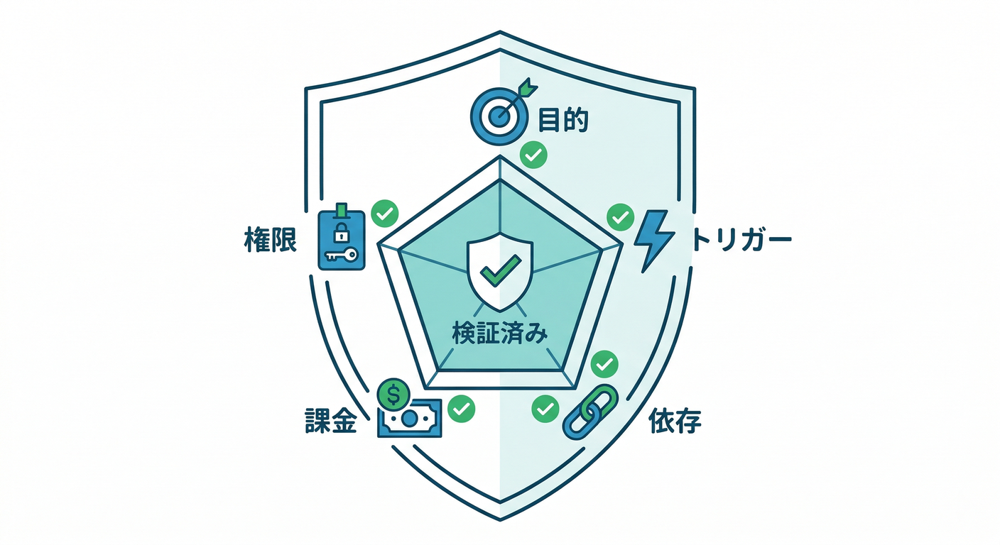
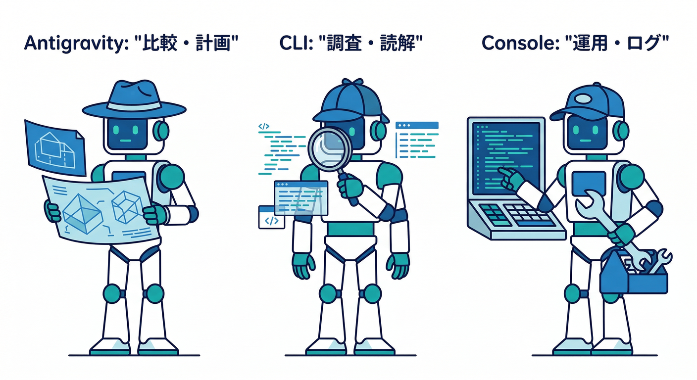
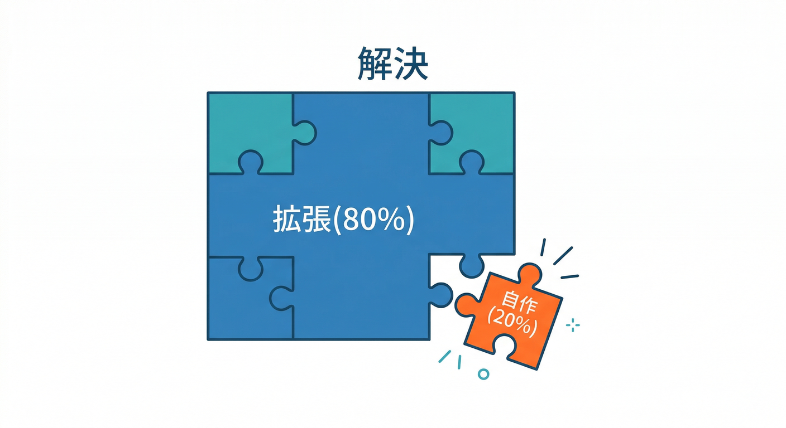

# 第2章：Extensions Hubの歩き方（探し方のコツ）🧭✨

この章のゴールはこれ👇
**「Extensions Hub（extensions.dev）で“目的に合う拡張”を素早く見つけて、入れる前に地雷（依存サービス・課金・権限）まで確認できる」**状態になることだよ😎🧩

---


## 1) Extensions Hubってどんな場所？🏬✨

Firebase Extensions は、**よくある機能を“パッケージ”として入れて、イベントやリクエストに反応して自動で動かす仕組み**だよ🧠⚙️（裏では Cloud Functions などが動くイメージ）([Firebase][1])

その拡張を探す“お店”が **Firebase Extensions Hub（extensions.dev）**！
カテゴリ（AI / Messaging / Utilities など）で並んでて、検索もできるよ🔎([Firebase エクステンションズハブ][2])

---

## 2) Hubの「最短ルート」：探す順番はこれ🧭💨

初心者が迷わない順番を作ると、だいたいこう👇

1. **やりたいことを1行にする**（例：*「画像を自動でサムネにしたい」*）📝
2. Hubで**キーワード検索**（例：`image`, `resize`, `email`, `translate`, `ai`）🔎
3. 出てきた拡張を、**カテゴリ**でざっくり整理📦
4. 詳細ページで **「依存サービス」「課金」「権限」「作られるリソース」「設定パラメータ」** をチェック✅
5. 残った候補で **Top3** を決める🥇🥈🥉


この“型”があるだけで、探すスピードが一気に上がるよ🚀✨

---

## 3) 検索のコツ：キーワードは「名詞＋動詞」が強い💪🔎

## まずは王道キーワード🍣

* 画像系📷：`image` `resize` `thumbnail` `storage`
* メール📩：`email` `send` `smtp`
* 通知📣：`messaging` `fcm` `push`
* 翻訳🌍：`translate` `localize`
* AI🤖：`ai` `gemini` `summarize` `classify`

## ちょい上級：用途を“イベント”で言い換える🧠

拡張はだいたい

* **「何かがアップロードされたら」**（Storage）📦
* **「Firestoreに書き込まれたら」**（DB）🗃️
* **「時間になったら」**（Scheduler）⏰
* **「HTTPで呼ばれたら」**（API）🌐
  みたいに動くことが多い。だから検索も「機能名」だけじゃなく「どこで起こる？」で考えると当たりやすいよ🎯([Firebase][1])


---

## 4) 詳細ページで必ず見る「5大チェック」🧯💸🛡️



Hubで見つけたら、**詳細ページ or Console遷移前に**ここだけは見よう👇

## ✅チェック1：何をしてくれる拡張？（目的）🎯

* “何が自動化されるか”を1文で言える？
  例：「画像アップロードをトリガーに、サムネを自動生成」📷➡️🖼️

## ✅チェック2：何に反応して動く？（トリガー）⚡

* Storage / Firestore / HTTP / Scheduler など
* “いつ動くか”が分かると、あとで事故りにくい😌([Firebase][1])

## ✅チェック3：依存するサービスは？（勝手に増えるもの）🧩

* 拡張は **他サービス（Functions等）を前提**にすることが多いよ🧠
* 依存が増える＝設定箇所も増える（でも便利！）([Firebase][1])

## ✅チェック4：課金が増える可能性は？💸

* Firebaseはプラン（Spark / Blaze）があり、使うサービス量で課金が動くよ📈([Firebase][3])
* 拡張は裏でリソースが動くので、「無料のつもり」が事故になりがち😇
  → 次の章以降で“課金事故の潰し方”をちゃんとやるやつ！

## ✅チェック5：権限・Secretsは？🛡️🔐

* 拡張によっては Secret Manager にシークレットを作ることがあるよ🔑
* 「どんな権限が必要？」を見て、怖かったら候補から外す勇気も大事🙆‍♂️([Firebase][4])

---

## 5) ここで手を動かす🖐️：検索→分類→Top3決定📌🥇

やることはシンプル！紙でもメモでもOK📝✨

## ステップA：4つの単語で検索🔎

Hub（extensions.dev）で👇を順に検索して、出てきた拡張をメモしてね📝

* 「画像」📷
* 「メール」📩
* 「AI」🤖
* 「翻訳」🌍
  （英語キーワードでもOK：`image` `email` `ai` `translate`）

## ステップB：用途別に“棚”を作る📦


メモを次の棚に振り分けるだけ👇

* 画像📷
* メッセージ/通知📣
* データ連携🗃️
* AI/テキスト処理🤖📝
* その他🧩

## ステップC：Top3を決める（超かんたん採点）🥇🥈🥉

各候補に、これだけ点をつける🎯（0〜2点でOK）

* フィット感（欲しい機能ドンピシャ？）🎯
* 依存サービスの許容度（増えても平気？）🧩
* 課金リスクの低さ（想像できる？）💸
* 権限の怖さ（必要最小限っぽい？）🛡️
* 設定の分かりやすさ（パラメータが読めそう？）🎛️

合計点が高い順に **Top3** 決定〜！🎉✨

---

## 6) AIを使って“読むのを速くする”🤖💨（超おすすめ）



## 6-1) GoogleのAntigravityで「比較メモ」を自動生成🛸🧠

Antigravity は“エージェントが計画して作業してくれる”タイプの開発プラットフォームとして紹介されてるよ🛸([Google Codelabs][5])
これを使うと、拡張の候補が増えても整理が速い✨

**例：エージェントに頼むこと（そのままコピペでOK）👇**

* 「候補A/B/Cの違いを、課金・依存サービス・権限・入力パラメータで比較表にして」📋
* 「この拡張、どのイベントで動いて、何のリソースを作りそう？」🔍
* 「初心者が踏みそうな地雷ポイントを3つ挙げて」🧯

## 6-2) Gemini CLIで“調べ物係”を作る💻🤖

Gemini CLI はターミナルで使えるAIエージェントで、Cloud Shell では追加セットアップなしで使える、みたいに案内されてるよ🧰([Google Cloud Documentation][6])

**例：雰囲気だけ掴めればOK🙆‍♂️（コマンドは例）**

```bash
## 例：拡張を選ぶ観点のチェックリストを作らせる
gemini "Firebase Extensionsを選ぶときのチェック項目を、初心者向けに10個で作って"
```

> ポイント：AIは“読むのを速くする”のに使うと強い💪
> 最終判断（入れる/入れない）は人間がやるのが安全😎🛡️

## 6-3) Gemini in Firebaseは「入れた後の調査役」🔧🤖

Gemini in Firebase は、Firebaseコンソール内でAI支援を使える仕組みとして案内されてるよ（セットアップ手順もあり）([Firebase][7])
この章では“探す”がメインだけど、**入れた後にログや不具合を追う**ときに心強い味方になる✨

---

## 7) もしHubにドンピシャが無いときの考え方🧠🧩

「欲しいのが無い…」は普通にある！そのときは👇

* 似てる拡張で **8割解決できる** なら採用🧩
* 残り2割は「自作（Functions等）」に逃がす⚙️
* もしくは **Firebase AI Logic** みたいに、クライアントからGemini API/Imagen APIを安全に呼ぶ仕組みも選択肢になるよ（用途による）🤖([Firebase][8])



“全部を拡張でやる”じゃなくて、**得意なところだけ任せる**のが賢い🎓✨

---

## ミニ課題🎯（5〜15分）📝

1. Hubで「画像」「メール」「AI」「翻訳」を検索🔎
2. 各検索で見つけた拡張を **用途別の棚**に分類📦
3. 候補の中から **Top3** を決定🥇🥈🥉
4. Top3それぞれについて、次の1行メモを書く👇

* 「何をしてくれる？」
* 「何に反応して動く？」
* 「課金が増えそうなのはどこ？」

---

## チェック✅（言えたら勝ち😎）

* ✅ Hubで拡張を検索して、用途別に整理できる📦
* ✅ 詳細ページで **依存サービス・課金・権限** を見る癖がついた🧯💸🛡️
* ✅ 「入れる前に確認すべき5大チェック」を自分の言葉で説明できる🗣️✨

---

次の章（第3章）は、ここで選んだTop候補に対して **「インストール前チェック（落とし穴つぶし）」** をやって、課金・権限・作成リソースまで先に潰していくよ🧯⚡

[1]: https://firebase.google.com/docs/extensions?utm_source=chatgpt.com "Firebase Extensions - Google"
[2]: https://extensions.dev/?utm_source=chatgpt.com "Firebase Extensions Hub"
[3]: https://firebase.google.com/docs/projects/billing/firebase-pricing-plans?utm_source=chatgpt.com "Firebase pricing plans - Google"
[4]: https://firebase.google.com/docs/extensions/manage-installed-extensions?hl=ja&utm_source=chatgpt.com "インストールした Firebase Extensions の管理 - Google"
[5]: https://codelabs.developers.google.com/getting-started-google-antigravity?utm_source=chatgpt.com "Getting Started with Google Antigravity"
[6]: https://docs.cloud.google.com/gemini/docs/codeassist/gemini-cli?utm_source=chatgpt.com "Gemini CLI | Gemini for Google Cloud"
[7]: https://firebase.google.com/docs/ai-assistance/gemini-in-firebase?utm_source=chatgpt.com "Gemini in Firebase - Google"
[8]: https://firebase.google.com/docs/ai-logic?utm_source=chatgpt.com "Gemini API using Firebase AI Logic - Google"
