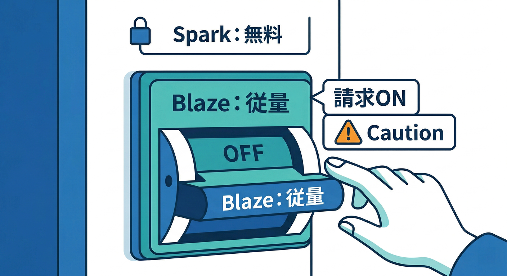
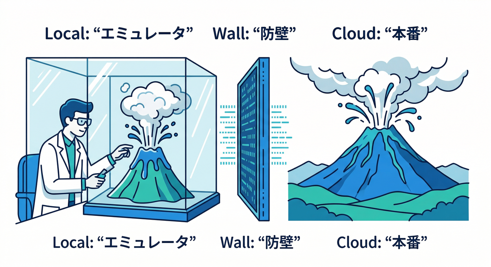

# 第3章：インストール前チェック　落とし穴を先に潰す🧯💸

Extensions は「入れるだけで動く」が強みだけど、**入れる前に 5 分だけ“地雷チェック”**すると、あとがめちゃ楽になるよ😎✨
（2026-02-19 時点の公式仕様だと、拡張のインストール自体に **Blaze プラン必須**が明記されてるよ）([Firebase][1])

---


## まず結論　ここだけ見れば事故が激減する✅

インストール前に見るのはこの 4 つ👇

1. **課金の入口**：Blaze にする必要があるか？どのサービスが増えそう？💳
2. **中身の入口**：その拡張は「何をトリガー」に「何を作る」？🧩⚙️
3. **権限の入口**：どんなロール・API・Secrets が必要？🔐
4. **試す入口**：いきなり本番じゃなく「テスト or エミュ」で触れる？🧪


この章は、これを“チェックリスト化”して手元に残すのがゴールだよ📝✨

---

## 1) いきなり重要　Blaze 必須の意味💳🧨

Firebase Extensions の多くは **Cloud Functions の仕組みで動く**から、裏でクラウドリソースが作られて動き出す感じになるよ⚙️
そのため、公式ドキュメントでは **拡張をインストールするには Blaze（従量課金）が必須**って書かれてる。([Firebase][1])

しかも注意ポイントはここ👇

* **拡張のインストール自体は無料**でも、裏で使う Firebase / Google Cloud の利用が増えると課金されうる（例：Cloud Secret Manager など）([Firebase][1])
* さらに最近の変更として、**Cloud Storage for Firebase を使うには Blaze が必要**（拡張が Storage を使うタイプだと直撃）([Firebase][2])



「Blaze = 即お金が飛ぶ」ではなくて、**“請求できる状態にする”スイッチ**ってイメージが近いよ。無料枠もあるけど、事故ると増えるので“先に見積もり意識”が大事🧠💸([Firebase][3])

---

## 2) インストール前に読むべき場所はここ🔍🧩

拡張ページ（Extensions Hub / コンソール）で、最低でも次をチェックしよ👇

* **What it does**：何をしてくれる？（要約でOK）🧠
* **Triggers**：何が起きたら動く？（Firestore 書き込み？Storage アップロード？など）⚡
* **Resources created**：何が作られる？（Functions / PubSub / Secret / など）🏗️
* **Permissions / APIs**：どの権限・API が必要？🔐
* **Parameters**：どんな設定項目がある？（ここが運用そのもの）🎛️


「中身」を支える設計図が **extension.yaml** で、ここに **作るリソース・必要な API・アクセス・パラメータ**が宣言されるよ。([Firebase][4])

さらに、拡張のロジックは基本 **Cloud Functions** で書かれていて、インストールされるとその Functions がプロジェクトにデプロイされる。([Firebase][5])

---

## 3) 役割と権限の地雷　自分が入れられる人か？👤🔑

インストール・管理には、プロジェクト側で **Owner / Editor / Firebase Admin** などの権限が必要だよ。([Firebase][1])
「入れようとしたら権限エラー」で止まるのは、初心者あるある😇

---

## 4) 課金の事故ポイントを“見える化”しよう💸👀

ここ、超大事だからテンプレでいくよ🧾✨
（この表をそのままコピって、拡張ごとに埋めるのがオススメ！）

| チェック                    | 何が起きる？                    | 見る場所            | 事故るとどうなる？                    |
| ----------------------- | ------------------------- | --------------- | ---------------------------- |
| どの Firebase サービス使う？     | Firestore/Storage/Auth など | 拡張の説明・作成リソース    | 読み書き・保存・転送が増える💸             |
| どの Google Cloud サービス使う？ | Secret Manager など         | インストール要件/作成リソース | 無料枠超えで課金💸([Firebase][1])    |
| 何がトリガー？頻度は？             | 1回の操作で何回動く？               | Triggers / 説明   | 想定より呼ばれて爆増📈                 |
| 生成物のサイズは？               | サムネ/翻訳結果の増加               | Parameters      | Storage が雪だるま☃️              |
| “外部 API 呼び出し”ある？        | エミュでもライブ呼び出しの可能性          | 拡張説明/エミュ注意      | テストなのに課金が出る😱([Firebase][6]) |

「Resize Images」系なら、例えばこんな連鎖が起きやすい👇
**ユーザーが画像を 1 枚アップ** → **拡張 Function が起動** → **サムネを複数枚生成** → **Storage 書き込みが増える** → **表示のダウンロードも増える**📷➡️🖼️➡️📦
だから、**“1操作あたり何が何回増える？”**を先にイメージできると強いよ💪


---

## 5) いきなり本番に入れない　安全な試し方🧪🧯

公式も「最初はテスト/開発用プロジェクトで試してね」って強めに言ってるよ。([Firebase][1])

さらに、**Extensions Emulator** を使うと、ローカル環境で拡張を評価しやすい（請求を最小化しやすい）って案内されてる。([Firebase][6])
ただし注意！拡張によっては **エミュが無い Google Cloud API を呼ぶ**ことがあり、その場合はライブにアクセスして課金が出る可能性があるよ。([Firebase][6])



エミュで触るときの“最初の一歩”はこんな感じ👇([Firebase][6])

```bash
## 拡張をローカル用の manifest に追加（まだ本番には入らない）
firebase ext:install --local firebase/firestore-send-email

## エミュ上でスクリプトを流して評価する例
firebase emulators:exec my-test.sh
```

---

## 6) AI を使ってチェックを秒速化しよう🤖⚡

ここからが 2026 感✨
**Firebase MCP サーバー**は、いろんな AI ツールから Firebase の“専用ツール＆プロンプト”を使える仕組みで、**Antigravity や Gemini CLI** でも使えるって明記されてるよ。([Firebase][7])


さらに **Gemini CLI 用の Firebase 拡張**も公式で案内されてる。([Firebase][8])
なので、インストール前チェックは AI に下書きさせて、人間が仕上げるのが最強ムーブ🤝✨

## 例　Gemini に投げると強いプロンプト集🪄

* 「この拡張の **課金が増えそうなポイント**を “サービス別” に箇条書きして」
* 「Parameters を見て、**安全寄りの初期設定案**（保守的）を作って」
* 「Triggers から、**1日あたりの最大実行回数**の見積もり式を作って」
* 「extension.yaml を読む前提で、**必要な権限と理由**を表にして」([Firebase][4])

そしてコンソール側の AI なら、**Gemini in Firebase**でエラー/設定を噛み砕いてもらう導線もあるよ（セットアップや使い方が公式にまとまってる）。([Firebase][9])

---

## 手を動かすパート🖐️🧾

今日やる作業はこれだけでOK🙆‍♂️

1. “入れたい拡張”を 1 つ選ぶ🧩
2. 上の表をコピって、**空欄を埋める**（5〜10分）📝
3. 「トリガー頻度」だけは、**自分のアプリ想定で数字を書く**（雑でOK）🔢
4. 可能なら Extensions Emulator で **--local** まで進めて「触れる形」にする🧪([Firebase][6])

---

## ミニ課題🎯

**「この拡張で増えそうな料金」**を、1分で説明してみて👇（口頭でOK）

* 増えそうなサービスを **3つ**挙げる
* それぞれ「何が増える？」を一言で言う

  * 例：Functions → 実行回数、Storage → 保存と転送、Firestore → 読み書き…みたいに💡

---

## チェック✅

次の 4 つを言えたら勝ち😎✨

* ✅ 拡張のインストールに Blaze が必要な理由を言える([Firebase][1])
* ✅ 「拡張は Cloud Functions ベースで動く」を説明できる([Firebase][5])
* ✅ extension.yaml が “何を作り、何を要求するか” の設計図だと分かる([Firebase][4])
* ✅ Extensions Emulator で安全に試せるが、ライブ課金の可能性も理解した([Firebase][6])

---

次の第4章では、いよいよ鉄板の「画像リサイズ拡張」みたいに、実際に“それっぽいアプリ感”を一気に出していくよ📷🖼️🔥
第3章のチェック表は、ここから先ずっと使い回せる武器になるので、ぜひテンプレ化してね🧾✨

[1]: https://firebase.google.com/docs/extensions/install-extensions?utm_source=chatgpt.com "Install a Firebase Extension"
[2]: https://firebase.google.com/docs/storage/faqs-storage-changes-announced-sept-2024?utm_source=chatgpt.com "FAQs about changes to Cloud Storage for Firebase pricing ..."
[3]: https://firebase.google.com/docs/projects/billing/firebase-pricing-plans?utm_source=chatgpt.com "Firebase pricing plans - Google"
[4]: https://firebase.google.com/docs/extensions/reference/extension-yaml?utm_source=chatgpt.com "Reference for extension.yaml - Firebase - Google"
[5]: https://firebase.google.com/docs/extensions?utm_source=chatgpt.com "Firebase Extensions - Google"
[6]: https://firebase.google.com/docs/emulator-suite/use_extensions?utm_source=chatgpt.com "Use the Extensions Emulator to evaluate extensions - Firebase"
[7]: https://firebase.google.com/docs/ai-assistance/mcp-server?utm_source=chatgpt.com "Firebase MCP server | Develop with AI assistance - Google"
[8]: https://firebase.google.com/docs/ai-assistance/gcli-extension?utm_source=chatgpt.com "Firebase extension for the Gemini CLI"
[9]: https://firebase.google.com/docs/ai-assistance/gemini-in-firebase/set-up-gemini?utm_source=chatgpt.com "Set up Gemini in Firebase - Google"
