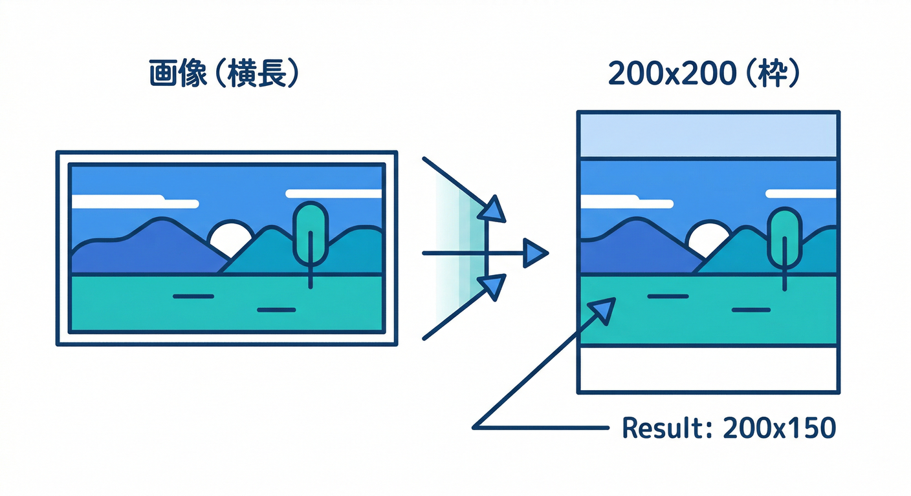
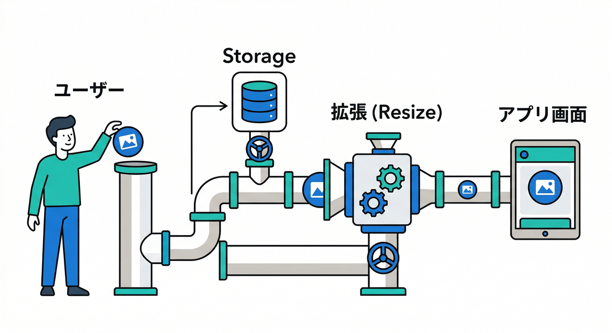
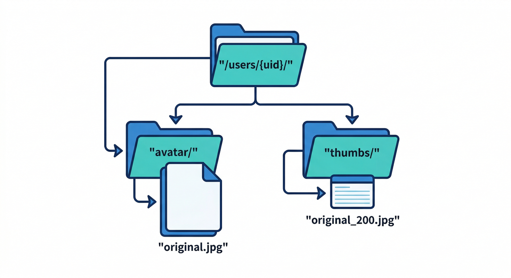
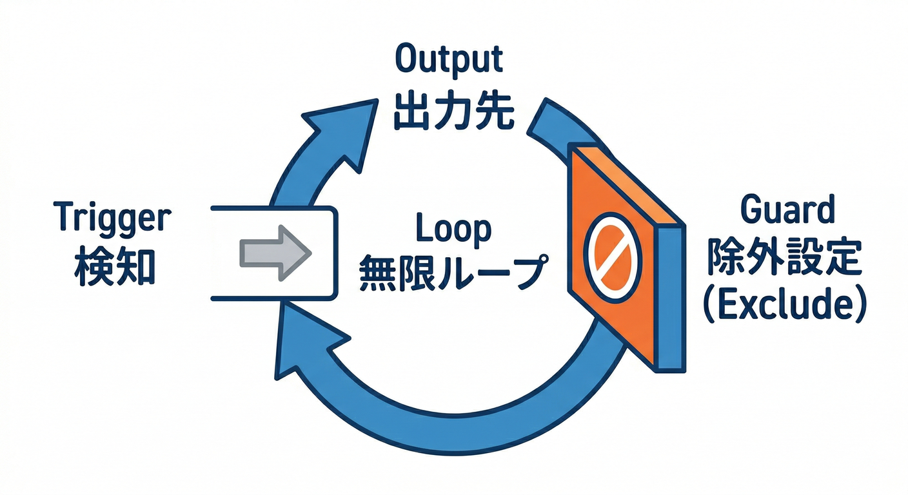
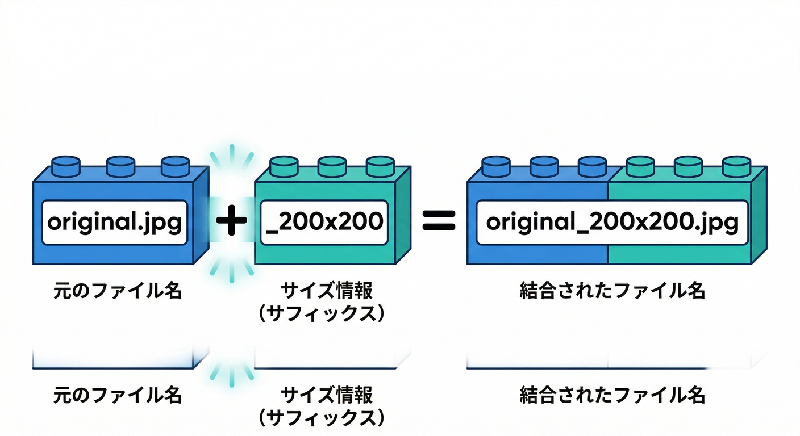
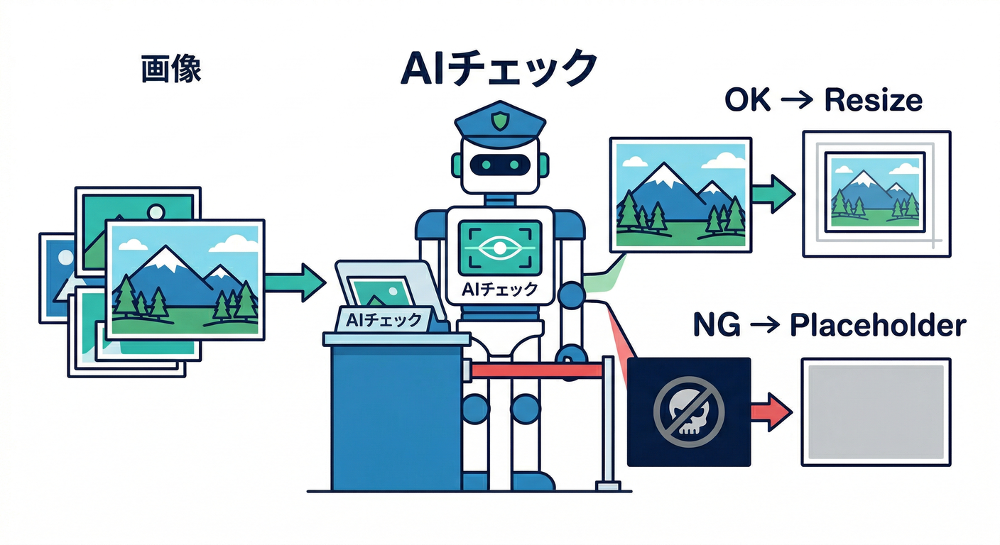

# 第4章：まずは鉄板！画像リサイズ拡張で“それっぽさ”爆上げ📷🖼️

## この章のゴール🏁✨

* 「画像をアップしたら勝手にサムネが増える」流れを、**図にして説明できる**🧠➡️🗺️
* **サムネの命名ルール**（例：`_200x200`）を“事故らない形”で決められる🧷
* “200x200って、ほんとに正方形？”みたいな**よくある勘違い**を潰せる🔧

---

## 1) まず「Resize Images」って何をしてくれるの？🧩

この拡張は、Cloud Storage に画像がアップされた瞬間に反応して、

* 画像かどうか判定して✅
* 指定したサイズの画像（サムネ）を作り🛠️
* **同じバケット**に保存する📦
* ファイル名は「元ファイル名 + `_幅x高さ`」みたいに**サフィックス**が付く🪪

…という“自動工場”です🏭✨ ([extensions.dev][1])

しかも、サムネは **200x200 / 400x400 / 680x680**みたいに複数サイズを一気に作れます📐📐📐 ([extensions.dev][1])

---

## 2) 超重要：`200x200` は「最大サイズ」だよ⚠️（正方形とは限らない）

ここ、初心者がいちばんハマるポイントです😇

Resize Images は基本的に **縦横比（アスペクト比）を保ったまま縮小**して、
「幅と高さが“指定値以下”に収まるようにする」動きです📏✨ ([extensions.dev][1])

つまり、**200x200 を指定しても**、画像が横長なら

* 200x200 ではなく **200x◯◯** になることが普通にあります🙂

## 「じゃあ、正方形のアイコンにしたいんだけど？」🧑‍💻

その場合は、拡張のパラメータ **`SHARP_OPTIONS`**（Sharp のリサイズ設定）で
`fit` や `position` を調整して「切り抜き」寄りにできます✂️🖼️ ([GitHub][2])

> ここは“設計で決めるところ”なので、第4章のうちに方向性だけ決めちゃうのが勝ちです😎

---

## 3) 設計図を書く🗺️：プロフィール画像アップロード例（いちばん使うやつ）

ここから“それっぽいアプリ感”が爆上がりします💥📷✨
イメージはこれ👇

## 全体フロー（文章でOK）🧠➡️

1. ユーザーがプロフィール画像を選ぶ👤📷
2. Storage にアップロードする⬆️📦
3. 拡張が反応してサムネを生成する⚙️🖼️
4. 画面は「元画像」と「サムネ」を表示する🧑‍💻✨

拡張は **Storage の finalize（アップ完了）をトリガー**に、Node.js 20 の関数として動きます🧰 ([GitHub][2])

---

## 4) “事故らない”パス設計🧯：おすすめの置き方

拡張は **指定バケット内の変更に広く反応**しやすいので、
「画像専用バケットに分ける」のが推奨されています📦➡️📦 ([extensions.dev][1])

とはいえ「まずは1バケットでやりたい」ことも多いので、その場合は👇が超大事！

## ✅ 推しルール（わかりやすくて強い）🧩

* 元画像：`/users/{uid}/avatar/original.jpg`
* サムネ出力先：`RESIZED_IMAGES_PATH = thumbs` にして
  `/users/{uid}/avatar/thumbs/original_200x200.jpg` みたいにする🖼️✨ ([GitHub][2])

さらに、**無限増殖（サムネがサムネを呼ぶ地獄）**を避けるために、

* `EXCLUDE_PATH_LIST` に `/users/*/avatar/thumbs` を入れておくのが安全です🧯🔥 ([GitHub][2])

---

## 5) 第4章で決めたい「命名ルール」案🪪✨

拡張の基本はこう👇

* 元：`original.jpg`
* 生成：`original_200x200.jpg`（サイズがサフィックス） ([extensions.dev][1])

## ミニ制作で使うなら、サイズはこう決めると楽🎯

* `200x200`：一覧や小アイコン用👤
* `600x600`：プロフィール詳細など中サイズ用🧑‍💼
* `1200x1200`：高精細用（必要なら）🖥️✨

サイズ指定は `IMG_SIZES` に `200x200,600x600` みたいに入れます📐 ([GitHub][2])

---

## 6) 「公開URLどうする？」問題🌐🔐（ここで方針だけ決める）

Resize Images には **`MAKE_PUBLIC`** があります。
ONにすると `https://storage.googleapis.com/...` 形式でアクセスしやすくなります🌍 ([GitHub][2])

ただ、プロフィール画像って「基本は本人だけ」なことも多いので、
この章では “どっちの思想で行くか” を決めるだけでOK🙆‍♂️

* **公開でいい**：表示が簡単、CDN的にも扱いやすい😄
* **非公開で行く**：ルールで守れる、安心感が強い🛡️

（実装の細かい取り回しは後の章で詰めればOKです📚）

---

## 7) 2026っぽい強化ポイント：AIで“画像の内容チェック”もできる🤖🖼️

今の Resize Images は、オプションで **AIベースのコンテンツフィルタ**が入っています🧠🚫

* Off / 低 / 中 / 高 のフィルタ強度
* 「ロゴ入ってる？」みたいな **Yes/No 質問プロンプト**によるカスタム判定
* ブロック時に **プレースホルダー画像**に差し替え
  みたいな機能が説明されています🧩 ([extensions.dev][1])

しかも権限として **`aiplatform.user`**（Gemini系モデル利用のため）が明記されています🤝 ([GitHub][2])

> 「FirebaseのAIサービスも絡めて」っていう意味で、ここはめちゃくちゃ教材映えします✨
> 例：子ども向けアプリならフィルタ強め👶🛡️、企業アプリなら「ロゴ検出」質問を追加🏢🔍

---

## 8) Gemini（AI）を“設計の相棒”にするコーナー🛸💬

第4章は「インストール」じゃなくて「設計」なので、AIが超ハマります😎✨
（やること＝紙に書く作業を、AIに手伝わせる感じ📝🤝）

## Gemini CLI / Agent に投げると強い依頼例💡

* 「プロフィール画像アップロードの Storage パス設計案を3つ出して。thumbs含めて」
* 「Resize Images のパラメータで最低限必要なものを、初心者向けに説明して」
* 「`200x200` が正方形にならないケースを例付きで説明して」
* 「無限リサイズを防ぐ EXCLUDE の設計を、ワイルドカード込みで提案して」 ([GitHub][2])

---

## 手を動かす🖐️：設計図を書こう（この章のメイン）🗺️✨

ノートでもOK！テキストでもOK！😄
以下の4点だけ埋めれば“設計図完成”です✅

1. **元画像の保存先パス**：`/users/{uid}/avatar/original.jpg` みたいな形
2. **サムネの出力先**：`RESIZED_IMAGES_PATH` を何にするか（例：`thumbs`） ([GitHub][2])
3. **サイズ**：`IMG_SIZES` 案（例：`200x200,600x600`） ([GitHub][2])
4. **事故防止**：`EXCLUDE_PATH_LIST` に thumbs 側を入れる（例：`/users/*/avatar/thumbs`） ([GitHub][2])

---

## ミニ課題🎯：命名ルールを1個だけ“文章で”決める🪪

例👇

* 「元が `original.jpg` なら、`original_200x200.jpg` を thumbs フォルダに置く」 ([extensions.dev][1])

これを **自分のアプリのパスで1つ**書けばクリアです✅✨

---

## チェック✅（3つ言えたら勝ち😆）

* Resize Images は「アップ完了」をトリガーにサムネを作る⚙️📷 ([extensions.dev][1])
* `200x200` は“最大サイズ”で、比率を保つので正方形とは限らない📐🧠 ([extensions.dev][1])
* thumbs 側を除外しないと、無限処理の事故が起きうるので設計で潰す🧯🔥 ([GitHub][2])

---

## おまけ：この拡張、実は「Blaze 必須」系だよ💸

インストールには **Blaze（従量課金）**が前提です（裏で Functions/Storage を使うため）💰 ([extensions.dev][1])
さらに、Cloud Storage の“デフォルトバケット”は **2026-02-03 以降は Blaze 必須でアクセス維持**の案内が出ています📅⚠️ ([Firebase][3])

（第14章でがっつりやるやつだけど、第4章でも“地雷の存在”だけ知っておくと強いです😎）

---

次の第5章は、この設計図をもとに「パラメータ設計が9割🎛️✨」へ進められます。
もしよければ、今あなたの想定アプリ（プロフィール画像？商品画像？）に合わせて、**パス案を“3パターン”作って比較**する形にもできますよ📦🧩

[1]: https://extensions.dev/extensions/firebase/storage-resize-images "Resize Images | Firebase Extensions Hub"
[2]: https://raw.githubusercontent.com/firebase/extensions/next/storage-resize-images/extension.yaml "raw.githubusercontent.com"
[3]: https://firebase.google.com/docs/storage/faqs-storage-changes-announced-sept-2024?utm_source=chatgpt.com "FAQs about changes to Cloud Storage for Firebase pricing ..."
