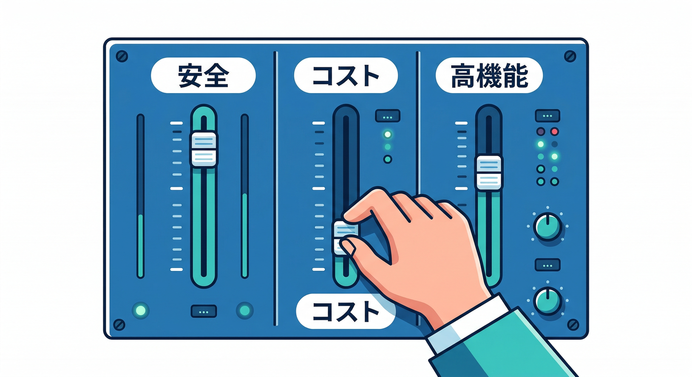
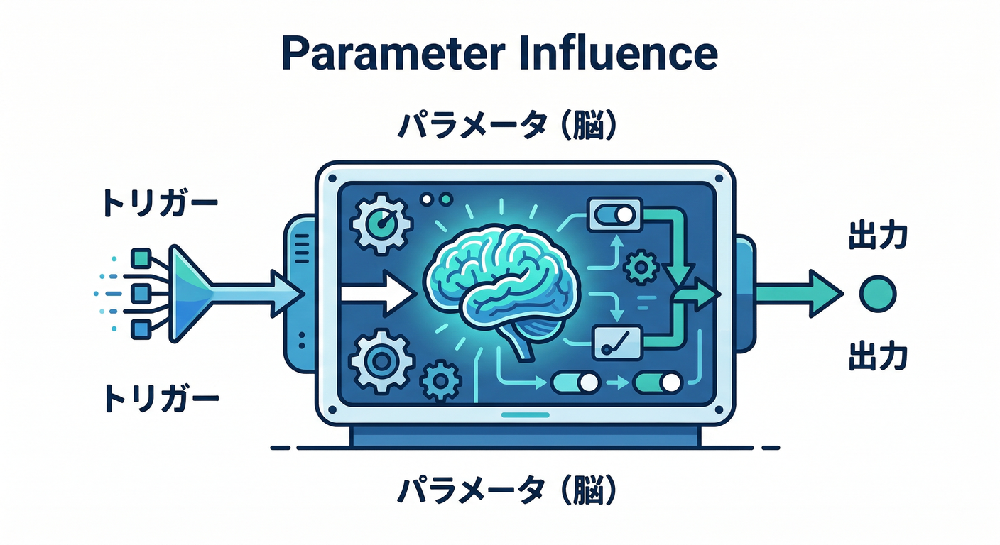
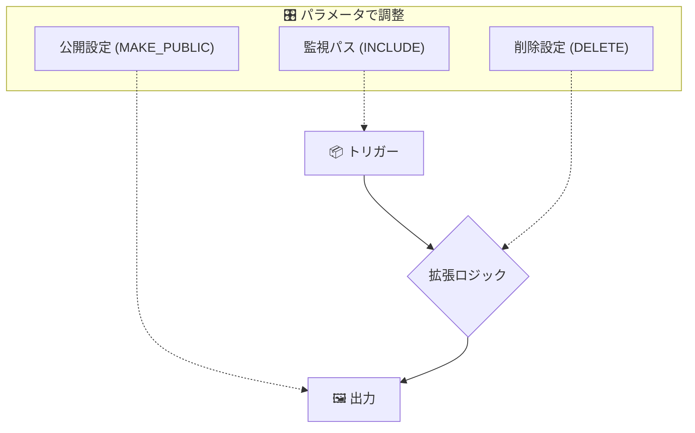
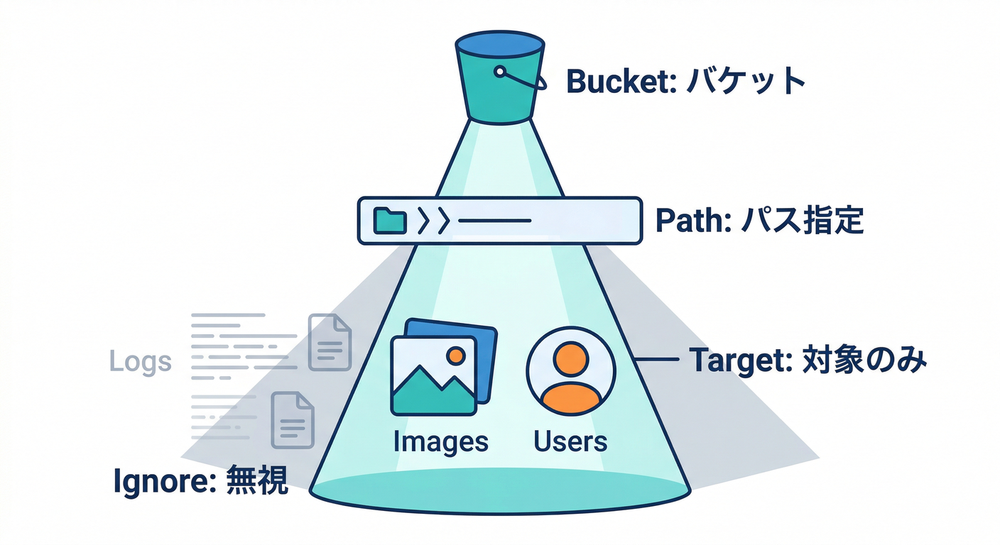
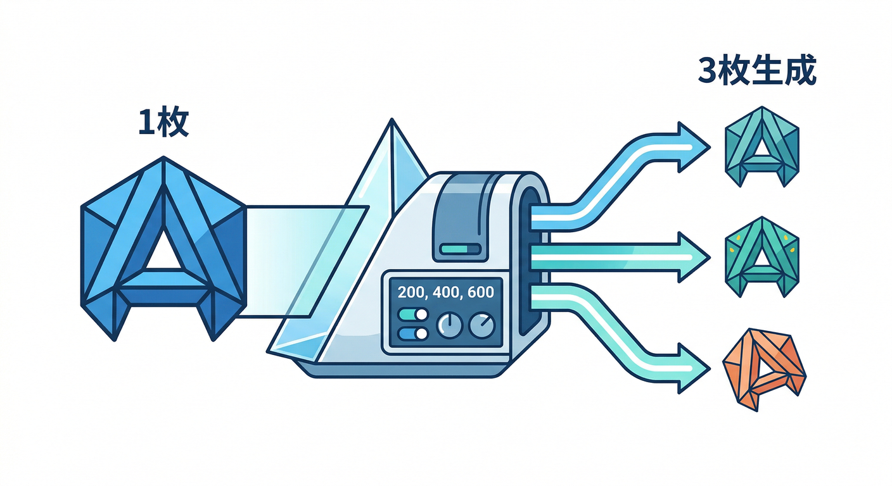
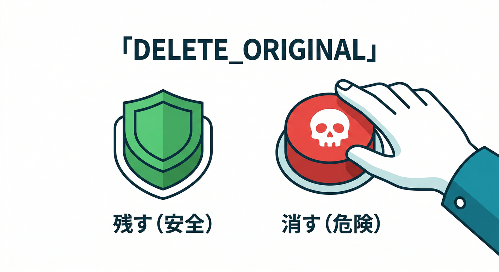
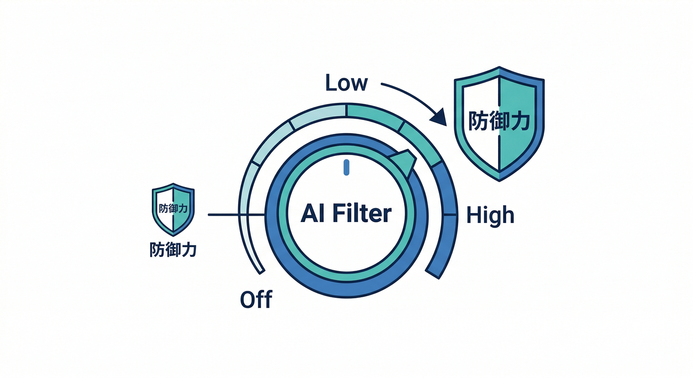
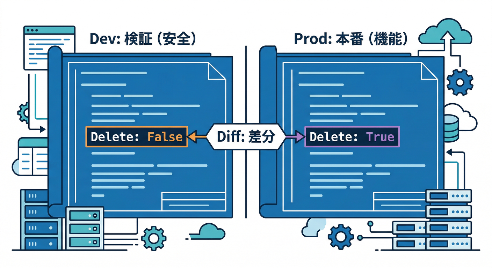

# 第5章：パラメータ設計が9割（拡張は“設定”で化ける）🎛️✨

この章はひとことで言うと👇
**「Extensionsは“中身を読む”より先に、“設定（パラメータ）を設計できる”と勝ち」** です😎🧩
同じ拡張でも、パラメータ次第で **安全にも・高機能にも・コスト爆発にも** 変わります💸🔥

---

## この章でできるようになること ✅

* 「この拡張、どのパラメータが“地雷”か」を先に見抜ける👀🧯
* Resize Images の設定を、**アプリ要件（UX/セキュリティ/費用）に合わせて決められる**📷🖼️
* **検証→本番**で「変えるべき値／変えない値」を整理できる🧪➡️🏭
* Gemini（CLI / コンソール支援 / Antigravity）で、**設定表づくり＆レビュー**を高速化できる🤖⚡ ([Firebase][1])

---



## 1) “パラメータ設計”ってなに？（図でつかむ）🧠🗺️

拡張はだいたいこう👇

1. **トリガー**（例：Storageに画像アップロード）
2. **処理**（例：リサイズ、形式変換、メタデータ調整）
3. **出力**（例：サムネ保存、公開/非公開、失敗時の置き場）





で、これ全部を **インストール時のパラメータ**が決めます。
「あとでコード書けば調整できるっしょ？」が通りにくいのが拡張の特徴です🧩（もちろん拡張の外側で補助はできます🙆）

パラメータの仕組み自体は、拡張側の `extension.yaml` の `params` で「質問項目」を定義して、インストール時に値を入れる流れです📄 ([Firebase][2])

---

## 2) まずは“設計の型”を覚える（失敗しない3点セット）🧰✨

## ✅ 型A：範囲を絞る（＝ムダ課金と事故を減らす）🧯💸

Resize Images は「バケット内の変更」を見に行くので、範囲を絞らないと **関係ないアップロードにも反応**しがちです。
公式も「専用バケット推奨」「複数インスタンスを同一バケットに入れると全インスタンスが毎回起動し得る」って注意しています⚠️ ([extensions.dev][3])



→ だから設計の最初は、**“どこを監視するか”**（バケット/パス）です📦🧭

---

## ✅ 型B：出力の置き場を決める（＝運用がラク）🧹

「サムネがどこに出るか」が曖昧だと、運用が地獄になります😇
Resize Images は **出力パス（相対パス）**を持てます。例の説明もあります🗂️ ([GitHub][4])

---

## ✅ 型C：公開方法を決める（＝セキュリティとUXが直結）🔐✨

Resize Images には **“公開するか”**のパラメータがあります。
安易に public にすると、URLを知ってる人が見れちゃう設計に寄りがちなので、ここは“目的ベース”で決めます🧠 ([GitHub][4])

---

## 3) Resize Images の“重要パラメータ”を、要件ベースで決める🎯📷

ここからが本番🔥
Resize Images の `extension.yaml` に載っている主要パラメータを、**初心者向けに「何を決めるもの？」へ翻訳**します👇 ([GitHub][4])

## 3-1. 監視対象（最優先）📦👀

* **IMG_BUCKET**：どのStorageバケットの画像を対象にするか

  * 推奨：画像リサイズ専用バケット（ムダ起動を減らす）📦 ([GitHub][4])
* **INCLUDE_PATH_LIST / EXCLUDE_PATH_LIST**：バケット内でも対象を絞る（または除外）

  * 「ユーザーのアイコンだけ」「投稿画像だけ」みたいに分けたい時に効きます🧭 ([GitHub][4])

---

## 3-2. 生成サイズ（体験が変わる）📐✨

* **IMG_SIZES**：`200x200,400x400` みたいにカンマ区切り

  * 複数サイズを一気に作れるのが強い💪 ([extensions.dev][3])
  * Resize Images はアスペクト比を保って、指定の最大幅/最大高以下に収める動きです📏 ([extensions.dev][3])



---

## 3-3. 出力の置き場と命名（運用の9割）🗂️🧹

* **RESIZED_IMAGES_PATH**：サムネを `thumbs` みたいな相対パスに置ける
* 命名：元ファイル名に **`_200x200` みたいなサフィックス**が付く仕様（例の説明あり）🧾 ([extensions.dev][3])

---

## 3-4. 元画像を消すか（事故率MAX）🧨

* **DELETE_ORIGINAL_FILE**：

  * `false`：消さない
  * `true`：常に消す（リサイズ失敗でも消す可能性）
  * `on_success`：成功したときだけ消す
    という選択肢があります⚠️ ([GitHub][4])



初心者のおすすめ感覚👇

* 検証：**消さない**（まず安全）🧪
* 本番：要件があるときだけ、**on_success**を検討（“戻せない”が本質）🧯

---

## 3-5. キャッシュ（速度とコストの体感に直撃）🚀💸

* Resize Images は元画像のメタデータをコピーし、必要なら **Cache-Control を上書き**できます📦 ([extensions.dev][3])
* **CACHE_CONTROL_HEADER** を入れると、サムネの体感が変わります（ただし更新戦略は要設計）🧠

---

## 3-6. 形式変換・画質（“軽さ”を作る）🖼️➡️🪶

* **IMAGE_TYPE**：jpeg/webp/png/avif…へ変換もできる（複数もOK）
* **OUTPUT_OPTIONS / SHARP_OPTIONS**：画質や圧縮など細かい調整（JSON文字列で渡す）
* **IS_ANIMATED**：GIF/WEBPのアニメを維持するか
* **FUNCTION_MEMORY**：重い画像・アニメ対応でメモリを増やす選択肢
  このへんは「画質 vs 軽さ vs コスト」の三すくみです⚖️ ([GitHub][4])

---

## 4) AI（Gemini）を“拡張の中”に入れる：コンテンツフィルタ 🤖🛡️

Resize Images には **AIベースのコンテンツフィルタ**が入っていて、
不適切画像を検知してブロックしたり、プレースホルダーに差し替えたりできます🧿 ([extensions.dev][3])

* **CONTENT_FILTER_LEVEL**：Off / Low / Medium / High 的な段階
* **CUSTOM_FILTER_PROMPT**：Yes/No質問で独自条件（例：ロゴ入り？暴力？）
* **PLACEHOLDER_IMAGE_PATH**：ブロック時の差し替え画像
* さらに、AIフィルタは **Genkit** を使っている説明もあります🧠 ([extensions.dev][3])
* `extension.yaml` 側でも、AI利用のための権限（例：Vertex AI系）に触れています🔐 ([GitHub][4])



ここ、教材としてめちゃ大事ポイント👇
**「画像リサイズ」だと思って入れたら、実は“AIモデレーション”までできる**
→ だからパラメータ設計で“やる/やらない”を決めるのが価値です😆

---

## 5) 検証→本番で「変える？変えない？」を決める🧪➡️🏭

拡張は **後からパラメータを変更（Reconfigure）**できます。
ただし、変更が効くのは **今後のトリガー**で、すでに作られた成果物（生成済み画像など）は自動で作り直されません🧠 ([Firebase][5])

なので、初心者向けのおすすめ運用はこれ👇



* **検証**：

  * 安全寄り（消さない / publicにしない / サイズ少なめ / 範囲狭め）🧯
* **本番**：

  * UX目的で必要なところだけ強化（サイズ追加 / キャッシュ設計 / 必要なら on_success）🚀
  * 変更は「Reconfigure」で未来の動作に効かせる🛠️ ([Firebase][5])

---

## 6) Gemini CLI / Antigravity で“パラメータ表”を秒速で作る🤖⚡

## 6-1. Gemini CLI（Firebase拡張を入れると強い）🧰

Firebase向けの Gemini CLI 拡張を入れると、Firebase MCPサーバーやFirebase特化のコンテキストが整って、作業が一気にやりやすくなります。 ([Firebase][1])

例（雰囲気が分かればOK🙆‍♂️）👇

```bash
gemini extensions install https://github.com/gemini-cli-extensions/firebase/
```

※URLはコード内だけに置いてます🧾 ([Firebase][1])

Geminiに投げると強い指示（コピペ用）👇

* 「Resize Images の主要パラメータを、**安全寄りの検証設定**と**本番設定**で表にして」
* 「DELETE_ORIGINAL_FILE / MAKE_PUBLIC が“事故るケース”を列挙して、回避策も書いて」
* 「INCLUDE/EXCLUDE の正規表現チェックで引っかかりそうな例を出して」 ([GitHub][4])

---

## 6-2. Antigravity（MCPサーバーを入れると“文脈が通る”）🛸

Antigravity 側も、メニューから Firebase MCP server を入れる手順が公式にあります。
「AIにログや設定を貼る」のじゃなく、**必要な情報をAIが取りに行ける**方向に寄せられます📡 ([Firebase][6])

---

## 7) 手を動かす🖐️：パラメータ設計ワークシートを埋めよう📝✨

以下を“紙でもメモでもOK”で埋めてください👇（ここが第5章のメイン練習！）

| 項目                            | 検証（安全寄り）🧪  | 本番（要件寄り）🏭                | 決める理由（ひとこと）   |
| ----------------------------- | ----------- | ------------------------- | ------------- |
| 対象バケット（IMG_BUCKET）            | 画像専用バケット    | 同じく専用バケット                 | ムダ起動を減らす📉    |
| 対象パス（INCLUDE/EXCLUDE）         | まずは狭める      | 必要範囲だけ                    | 事故と費用を減らす🧯💸 |
| サイズ（IMG_SIZES）                | 1〜2個        | 必要なだけ                     | UX/軽さの最適点🎯   |
| 元画像削除（DELETE_ORIGINAL_FILE）   | false       | 原則false / 必要なら on_success | “戻せない”⚠️      |
| 公開（MAKE_PUBLIC）               | false       | 要件次第                      | セキュリティとUX🔐   |
| 出力パス（RESIZED_IMAGES_PATH）     | thumbs 等に分離 | 同様に分離                     | 運用がラク🧹       |
| キャッシュ（CACHE_CONTROL_HEADER）   | 空 or 短め     | 設計して入れる                   | 体感速度が変わる🚀    |
| AIフィルタ（CONTENT_FILTER_LEVEL等） | Off         | 必要なら段階導入                  | ブランド/安全🛡️    |

※この表の根拠になるパラメータ群は `extension.yaml` にまとまっています。 ([GitHub][4])
※AIフィルタや運用上の注意（専用バケット推奨など）は拡張ページ側にも詳しいです。 ([extensions.dev][3])

---

## 8) ミニ課題🎯：「本番/検証で変えるパラメータ」を3つだけ決める

次のルールで決めてみてください👇

* **変える候補**：サイズ、キャッシュ、対象パス、AIフィルタ
* **なるべく固定**：出力パス設計（後から変えると運用が混乱しがち）🌀
* **慎重に**：削除と公開（事故がデカい）🧨 ([GitHub][4])

---

## 9) チェック✅（言えたら勝ち）

* 拡張は「コード」より **パラメータが設計の本体**だと分かった🎛️
* Resize Images の **地雷2つ**（削除/公開）を説明できる🧯
* 「検証→本番」で **変える値／変えない値**を区別できた🧪➡️🏭 ([Firebase][5])
* Geminiに“パラメータ表をレビューさせる”手順が想像できた🤖 ([Firebase][1])

---

## 次章予告（第6章）🧩🚀

次は、いよいよ **Consoleからインストール**して「このパラメータがどこで聞かれるか」「何が作られるか」を現物で確認します😆
第5章で作った表が、そのままインストール時の入力になりますよ🎛️✨

[1]: https://firebase.google.com/docs/ai-assistance/gcli-extension "Firebase extension for the Gemini CLI  |  Develop with AI assistance"
[2]: https://firebase.google.com/docs/extensions/publishers/parameters "Set up and use parameters in your extension  |  Firebase Extensions"
[3]: https://extensions.dev/extensions/firebase/storage-resize-images "Resize Images | Firebase Extensions Hub"
[4]: https://raw.githubusercontent.com/firebase/extensions/next/storage-resize-images/extension.yaml "raw.githubusercontent.com"
[5]: https://firebase.google.com/docs/extensions/manage-installed-extensions "Manage installed Firebase Extensions"
[6]: https://firebase.google.com/docs/ai-assistance/mcp-server "Firebase MCP server  |  Develop with AI assistance"
