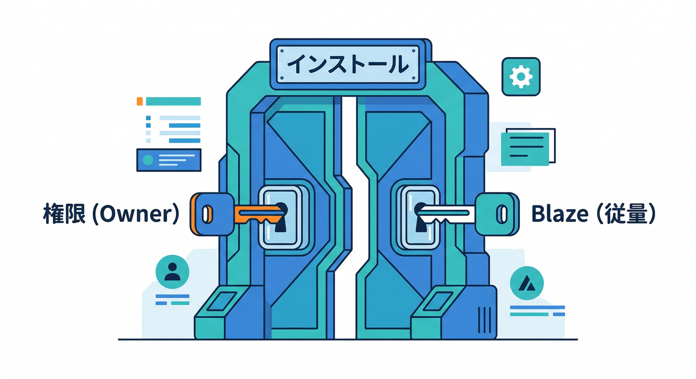
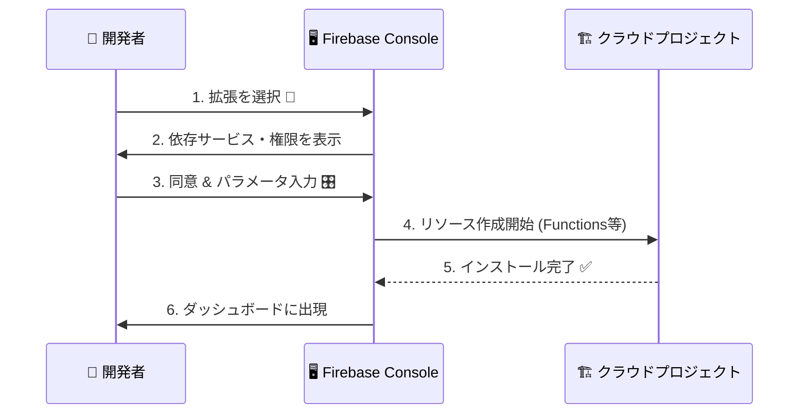
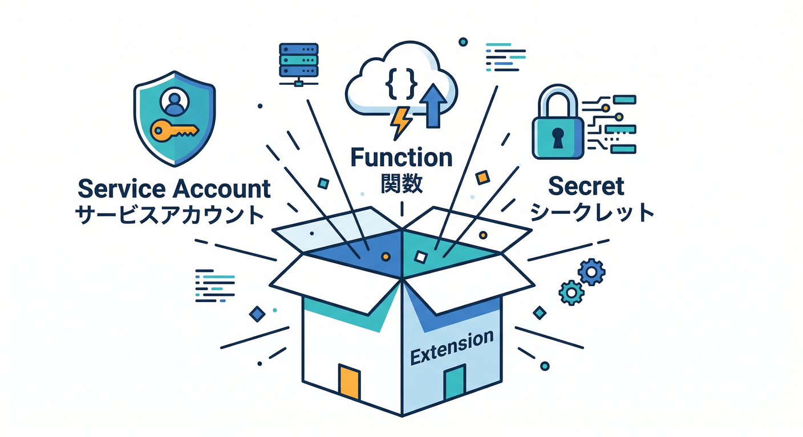
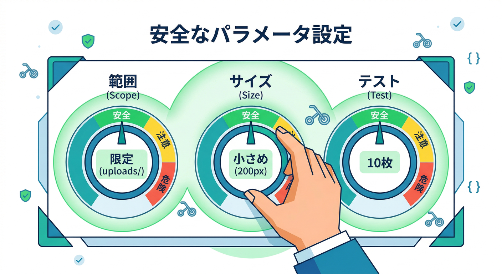
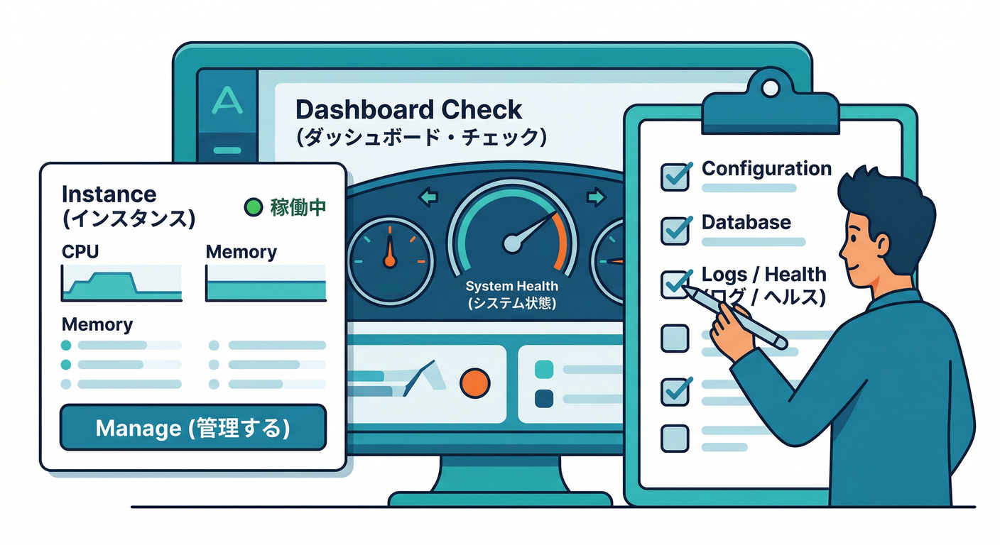
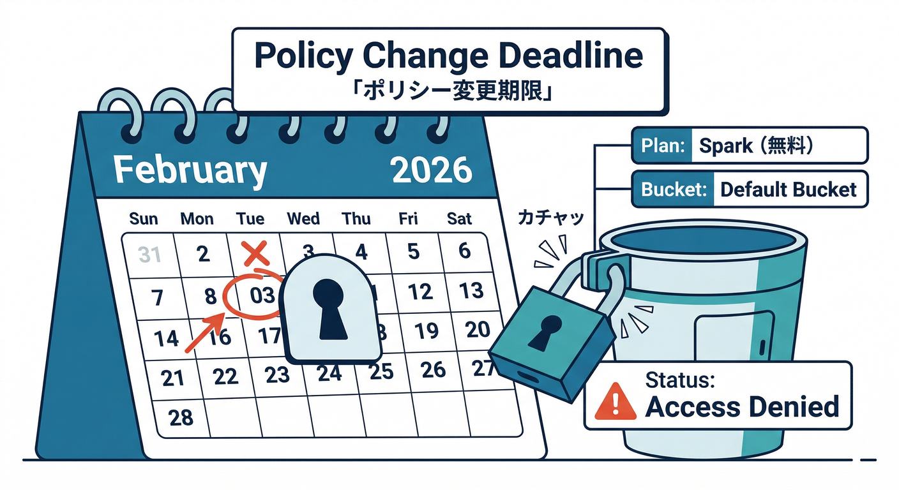

# 第6章：Consoleからインストールしてみる（最短ルート）🧩🚀

この章はね、「拡張を“実際に入れて動かす”」が主役だよ✨
しかも **Consoleだけ**でいける最短ルート！😆👍

---

## この章でできるようになること ✅🎯


* Console から Extensions をインストールして、**“拡張インスタンス”**を作れる🧩
* インストール時に **何が作られるか / 何が増えるか** を説明できる👀
* “安全寄り”のパラメータで、まず事故らず試せる🧯💸

---

## 1) まず超重要：インストール条件をサクッと確認 🧾👀



Consoleで拡張を入れるには、ざっくりこの2つが必要👇

* 権限：**Owner / Editor / Firebase Admin** のどれか🛡️ ([Firebase][1])
* 課金プラン：**Blaze（従量課金）** が必要💳 ([Firebase][1])

さらに、公式も「最初はテスト/開発プロジェクトで試すのが安心だよ」って言ってるやつ😊🧪 ([Firebase][1])
（拡張のインストール自体は無料でも、裏で使うサービスが無料枠を超えると課金があり得る、という意味ね💸）([Firebase][1])

---

## 2) Consoleでのインストール手順（王道ルート）🧭✨




ここからは「Resize Images」みたいな鉄板拡張を想定して説明するけど、流れはだいたい同じだよ😎

## 手順A：拡張を選ぶ 🧩🔎

1. **Firebase Console** を開く
2. 左メニューから **Extensions**（拡張機能）へ
3. **Extensions Hub**（拡張の一覧）から目的の拡張を選ぶ
4. 「この拡張、何するやつ？」を軽く読む📚

   * ここで **必要なAPI / 必要な権限 / 作られるリソース** のヒントが出てくるよ👀
   * 拡張は内部で `extension.yaml` に **必要API（apis）** と **必要ロール（roles）** を宣言していて、インストール時にそれを元にセットアップされる仕組み✨ ([Firebase][2])

## 手順B：インストール画面で「増えるもの」を観察する 👀📌



5. **Install（インストール）** を押す
6. 途中で出てくる「この拡張は以下を行います」的な画面で、ここをメモ📝

   * 自動で有効化される可能性があるAPI（選べる場合あり）([Firebase][2])
   * 拡張専用の **サービスアカウント** と、そこに付与されるロール（権限）🛡️
   * パラメータ（設定値）一覧🎛️

> ここ超大事：拡張には“拡張インスタンス用サービスアカウント”が作られて、必要最小限のロールが付くよ。
> そして **そのロールは基本いじらないでね**（壊れやすい）って公式が言ってるタイプ⚠️ ([Firebase][3])

## 手順C：パラメータを「安全寄り」で入れて進む 🧯🎛️

7. パラメータ入力（次の章で深掘りするけど、ここでは“事故らない”方向で）
8. **Install extension** を実行🚀
9. インストール完了まで待つ（裏でリソースが作られる）⏳
10. 完了したら Extensions ダッシュボードに “インスタンス” が出現✨ ([Firebase][4])

---

## 3) “安全寄り”パラメータの入れ方（事故らない作戦）🧯✨



拡張って、下手すると「想定外の場所を処理して課金が増える」みたいな事故が起きやすいんだよね💸😇
だから最初はこういう感じでOK👇

* 入力は **限定フォルダ** にする（例：`uploads/original/` だけを見る）📁
* 出力も **限定フォルダ** にする（例：`uploads/thumbs/`）🗂️
* サイズは最初は少なめ（例：`200x200` と `600x600` だけ）🖼️
* テストは少量画像で（10枚とか）📷🔟
* “全ユーザーの全画像”みたいなスコープにいきなりしない🙅‍♂️🔥

これだけで「いきなり燃える」率がかなり下がるよ😆🧯

---

## 4) インストール後に“増えたもの”を棚卸しする 🧾🔍



インストールできたら、**「何が増えた？」**を必ず確認！ここが第6章のキモ🧠✨

## 見る場所その1：Extensionsダッシュボード 🧩🛠️

* インストール済みインスタンスのカード → **Manage**
* 状態、設定、バージョン、ログ導線…などが揃ってる ([Firebase][4])

## 見る場所その2：Functions / ログ 🪵⚙️

* Functions ダッシュボードで、拡張が作った関数の状態を見る
* エラーや健康状態（Health）もここで追える ([Firebase][4])

## 見る場所その3：Secret Manager（秘密の値）🔐👀

* 拡張がSecretを作ることがある（APIキー等）
* Secret 名には規則があって、だいたい `ext-<インスタンスID>-<パラメータ名>` みたいな形式📛 ([Firebase][4])

---

## 5) AIで“インストール前後の不安”を秒速で潰す 🤖⚡

ここはAI導入済み前提の“ズルい攻略”いくよ😎🛸

## (1) Gemini CLIで「パラメータ表」と「事故ポイント表」を作らせる 📋🧠

Gemini CLI はターミナルで使えるAIアシスタント系。手順書づくりが速い🧰✨ ([Google Cloud Documentation][5])

```bash
## 例：Gemini CLIにお願いするイメージ（コマンド名は環境の案内に従ってね）
## 「拡張インストール前チェック表を作って」と依頼する

gemini "Firebase Extensions の Resize Images をConsoleで入れる。安全寄りパラメータ例と、確認すべき『作られるリソース/課金ポイント/権限』のチェック表を作って。"
```

## (2) Antigravityで「調べ物→まとめ→手順書」まで一気通貫 🛸📚

Antigravity は“調査＆作業をまとめてやる”系の開発体験を狙ったやつ（Codelabがある）だよ✨ ([Google Codelabs][6])
→ 拡張のREADMEや注意点を集めて、「自分用のインストール手順」にまとめるのが得意👍

## (3) Gemini in Firebaseで「ログの意味」を日本語で噛み砕く 🧠🔧

Console内でのAI支援（Gemini in Firebase）も、エラー理解や次の打ち手に強い💪 ([Firebase][7])

---

## 6) FirebaseのAIサービスも絡めて理解を深める 🧠🤖

「拡張でAIっぽいことをやる」だけじゃなくて、Firebase側のAI機能（例：AI Logic）を知っておくと、
後で **“拡張で足りない部分を自作で補う”** がめっちゃ楽になるよ✨ ([Firebase][8])

（第18章〜第20章あたりの“AI拡張”や“自作判断”につながる伏線ね🧩🧠）

---

## ミニ課題🎯：「インストール実況メモ」を作ろう 📝🔥

次の4つを、1枚メモにまとめてみてね（箇条書きでOK）👇

1. 入れた拡張名 / インスタンスID 📛
2. 入れたパラメータ（特に入力パス・出力パス）🎛️
3. **増えたもの**：Functions / Secrets / 有効化されたAPIっぽいもの 🔍
4. **課金が起きそうな場所**（Functions実行、Secret Manager、Storage など）💸

---

## チェック✅（できたら勝ち😆🏁）

* Consoleで拡張を入れて、Extensionsダッシュボードでインスタンスを見つけられた🧩
* 「何が作られたか」を3つ言える（例：関数・サービスアカウント・Secretなど）🧠 ([Firebase][4])
* “安全寄りパラメータ”の意味を説明できる🧯
* ログ/Health の場所がわかった🪵 ([Firebase][4])

---

## おまけ注意⚠️（2026の地雷：デフォルトバケット）🪣💥



もし Storage のデフォルトバケット（`PROJECT_ID.appspot.com`）を触る系なら、**2026-02-03 以降は Blaze じゃないとアクセスできなくなる**話があるので、ここだけは必ず意識してね📅💳 ([Firebase][9])
（拡張でStorageを使う場合、わりと直撃しやすいポイント！）

---

次の第7章は「CLIで入れる（再現性）」だけど、その前にここで作った **“インストール実況メモ”** があると、学習も運用も一気にラクになるよ😎🧾✨

[1]: https://firebase.google.com/docs/extensions/install-extensions?utm_source=chatgpt.com "Install a Firebase Extension"
[2]: https://firebase.google.com/docs/extensions/publishers/get-started?utm_source=chatgpt.com "Get started building an extension - Firebase - Google"
[3]: https://firebase.google.com/docs/extensions/permissions-granted-to-extension?utm_source=chatgpt.com "Permissions granted to a Firebase Extension - Google"
[4]: https://firebase.google.com/docs/extensions/manage-installed-extensions?utm_source=chatgpt.com "Manage installed Firebase Extensions"
[5]: https://docs.cloud.google.com/gemini/docs/codeassist/gemini-cli "Gemini CLI  |  Gemini for Google Cloud  |  Google Cloud Documentation"
[6]: https://codelabs.developers.google.com/getting-started-google-antigravity "Getting Started with Google Antigravity  |  Google Codelabs"
[7]: https://firebase.google.com/docs/ai-assistance/gemini-in-firebase/set-up-gemini "Set up Gemini in Firebase"
[8]: https://firebase.google.com/docs/ai-logic "Gemini API using Firebase AI Logic  |  Firebase AI Logic"
[9]: https://firebase.google.com/docs/storage/faqs-storage-changes-announced-sept-2024?utm_source=chatgpt.com "FAQs about changes to Cloud Storage for Firebase pricing ..."
