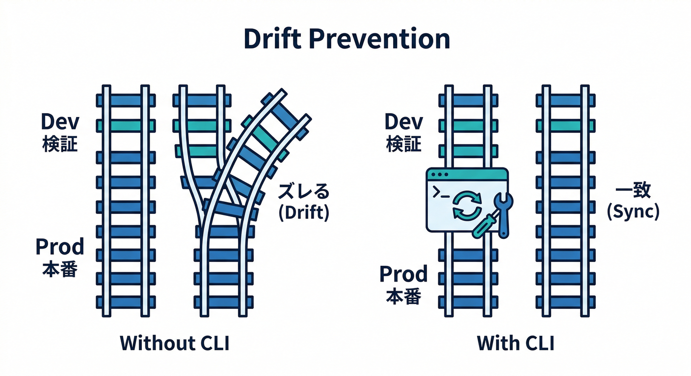
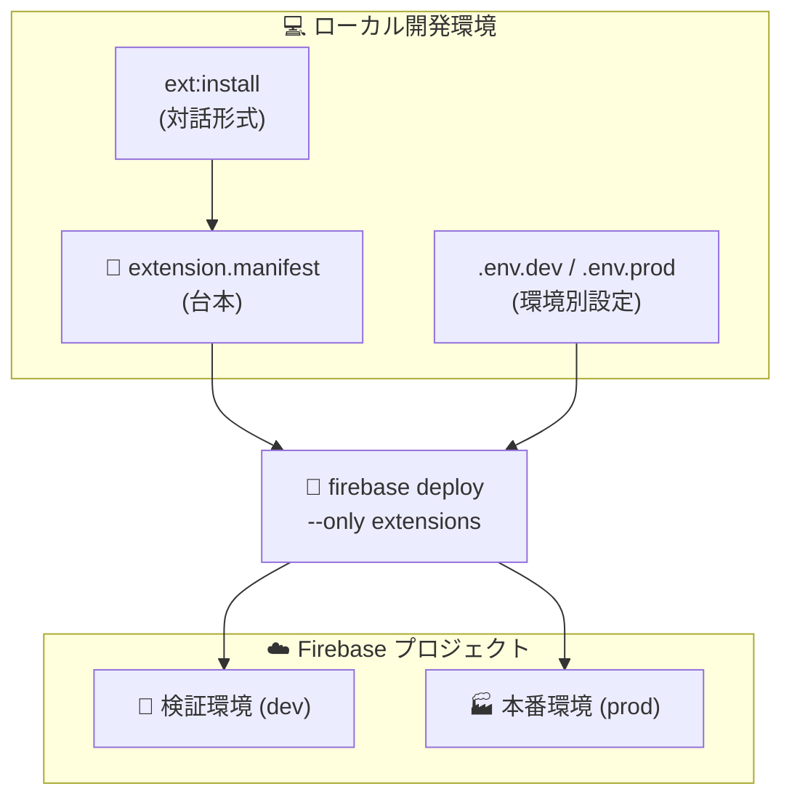
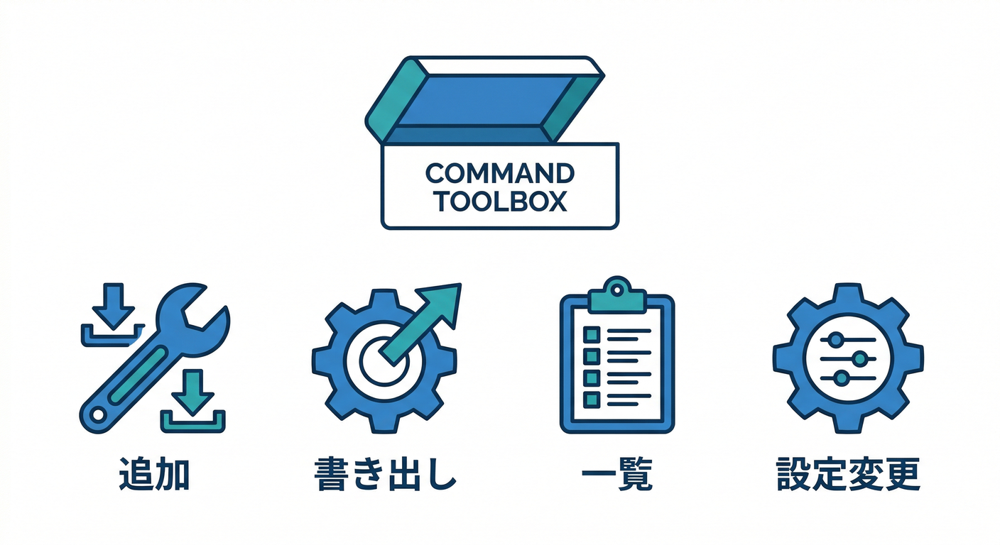
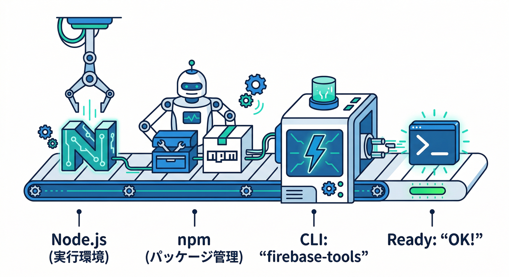
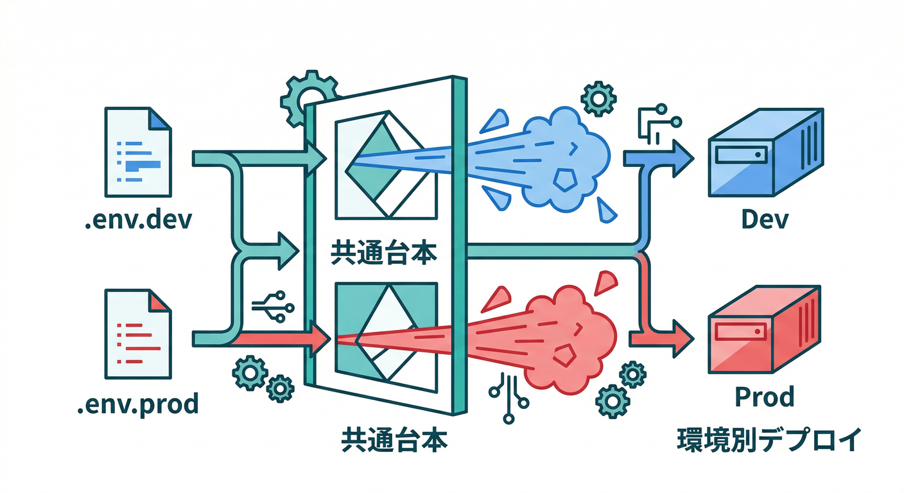
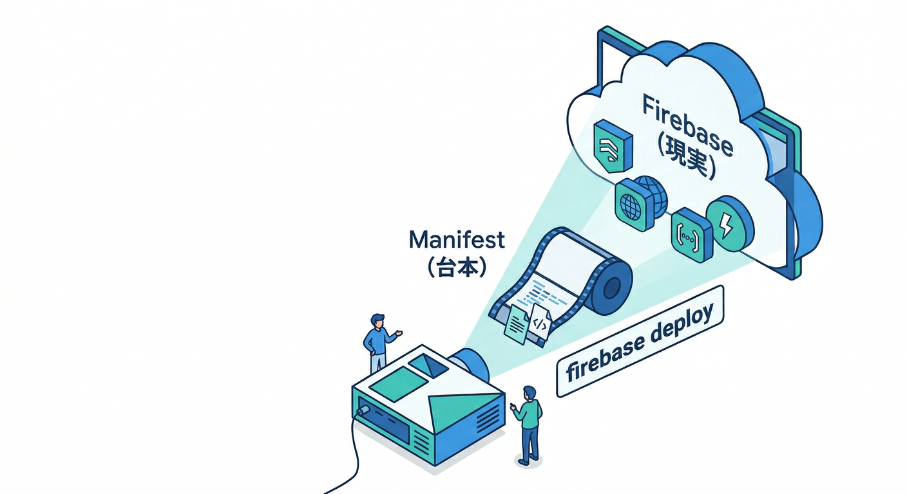

# 第7章：CLIで入れる（再現性のある運用へ）💻🔁

この章はひとことで言うと👇
**「Extensions を “手で入れる” から “手順として残して、いつでも再現できる” に進化させる章」** だよ🧩✨
（チームでも未来の自分でも、同じ結果を出せるのが強い💪）

---

## まずゴール確認🏁✨（この章でできるようになること）


* Extensions を **CLIで“同じ手順”で入れられる**（＝再現性）🧾
* **拡張の設定（パラメータ）をファイルで管理**して、検証→本番へ流せる🧪➡️🏭
* **インストール済み一覧・更新・再設定**ができる🔧 ([Firebase][1])

---

## “CLIで入れる”って、何がうれしいの？🤔✨



Console で入れるのは最短だけど、ありがちな事故がこれ👇💥

* 「どの設定で入れたっけ…？」（パラメータ迷子）
* 「検証と本番で設定がズレた…」
* 「手順が人によって違う…」

CLI運用にすると、こうなる👇

* 設定が **ファイルに残る** → 迷子になりにくい🧭
* Git管理できる → **レビューできる**👀✅
* いつでも同じ手順で再現 → **環境分離が強い**🧪🏭



---

## 読む📚：CLIで拡張を管理する「できること」一覧を掴む🧠



Firebase CLI には、Extensions 用のコマンドがまとまって用意されてるよ👇 ([Firebase][1])

* `firebase ext:install` … 拡張のインスタンスを **extension manifest に追加**🧩
* `firebase ext:export` … いま入ってる拡張を **manifest に書き出す**📤
* `firebase ext:list` … **プロジェクトに入ってる拡張一覧**📋
* `firebase ext:configure` … **パラメータ再設定**🎛️
* `firebase ext:update` … **更新**🔁

「manifestって何？」はこの後で超かんたんに説明するね🙆‍♂️

---

## 手を動かす🖐️：最短で“再現できる形”にする手順（王道セット）🧩🧾

ここからは、**Resize Images** みたいな拡張を入れる想定で進めるよ📷🖼️
（他の拡張でも流れはほぼ同じ！）

---

## 0) まずCLIが動く状態にする⚙️（Windowsでも迷いにくい版）



Firebase CLI は Node.js 経由で入れるのが定番だよ🧰
公式の流れは「Node.js → npm → firebase-tools」って感じ。 ([Firebase][1])

```bash
## Firebase CLI をグローバルインストール
npm i -g firebase-tools

## バージョン確認
firebase --version

## ログイン（ブラウザが開く）
firebase login
```

💡**ハマりポイント（2026っぽい注意）**

* Node.js は **LTSが24**になってるけど、ツール側の対応が追いつかないことがあるよ⚠️
  実際に firebase-tools の Node 24 対応について議論・計画が出てたりするので、もし不安定なら **Node 22/20 に寄せる**のが安全運転🙆‍♂️ ([Firebase][2])
* （“最新＝常に正義”じゃないやつ😇）

---

## 1) 「どのプロジェクトに入れるか」を固定する🎯（誤爆防止🧯）

CLIは“いまアクティブなプロジェクト”に対して動くから、ここを雑にすると事故る💥
プロジェクトエイリアスを作っておくとめちゃ安心✨ ([Firebase][1])

```bash
## 作業フォルダで、プロジェクトの紐づけ（エイリアス追加）
firebase use --add
```

* 例：`dev` / `prod` みたいに名前を付ける（検証と本番がズレない）🧪🏭
* 以降は `--project prod` みたいに明示もできるよ👍 ([Firebase][1])

---

## 2) “manifest” に拡張を追加する🧩（＝手順がファイルになる✨）


ここがこの章のキモ！
**extension manifest** は「このプロジェクトには、どの拡張を、どの設定で入れるか」を書いた台本📜みたいなもの。

```bash
## 例：拡張をmanifestに追加（ここでパラメータ入力が始まる）
firebase ext:install firebase/storage-resize-images
```

すると、ローカルにだいたいこんなのができる👇

* `extensions/manifest.json`（拡張の台本）
* `.env`（パラメータ値：環境ごとに分けられる）

💡**ここが“再現性”の正体**

* Consoleでポチポチした設定が、**ファイルに残る**
* だから「検証と本番で同じ拡張を同じ手順で入れる」ができる😆

---

## 3) 検証→本番に流すために、.env を分ける🧪➡️🏭



拡張の設定って、環境で変えたいことが多いよね？（ログの強さ、パス、サイズなど）
公式に **プロジェクトごとの env ファイル**を使うやり方が案内されてるよ✨

例（イメージ）👇

* `.env.dev`（検証用）
* `.env.prod`（本番用）

そして、manifest＋env を用意したら、次で反映！

---

## 4) 反映する（＝deploy）🚀

manifest に書いただけだと「台本を作っただけ」なので、最後に **デプロイ**するよ📦
公式の反映コマンドはこれ👇

```bash
## Extensions だけデプロイ（manifestの内容をプロジェクトへ反映）
firebase deploy --only extensions --project=dev
```

本番も同様👇

```bash
firebase deploy --only extensions --project=prod
```

---

## 5) “現実”を確認する👀（入った？動いてる？）

プロジェクトにインストールされてる拡張一覧を見る👇 ([Firebase][1])

```bash
firebase ext:list --project=dev
```

---

## 便利コマンドまとめ📌（覚えるのはこれだけでOK🙆‍♂️）



```bash
## いま入ってる拡張をmanifestへ書き出し（既存プロジェクトから台本を起こす）
firebase ext:export --project=dev

## 拡張をmanifestに追加
firebase ext:install <publisher>/<extension-id>

## パラメータを変える（manifestを更新）
firebase ext:configure <instance-id>

## 更新（manifestを更新）
firebase ext:update <instance-id>

## プロジェクトに入ってる拡張一覧
firebase ext:list --project=dev
```

> ポイント：`install / configure / update / export` は **台本（manifest）を更新**しがちで、
> `deploy` で **現実（クラウド）へ反映**する、って覚えると迷子にならない🧠✨ ([Firebase][1])

---

## ミニ課題🎯：検証→本番の“文章手順”を作ってみよう🧾✨

次の4行を、自分の言葉で「手順書」にしてみてね（10行くらいでOK）😊

1. `firebase use --add` で `dev/prod` を作る
2. `firebase ext:install ...` で manifest に追加
3. `.env.dev` / `.env.prod` を分ける
4. `firebase deploy --only extensions --project=...` で反映

---

## チェック✅（言えたら勝ち🏆）

* 「CLIで入れると何がうれしい？」→ **設定がファイル化されて再現できる**って言える🧩
* manifest と deploy の関係を説明できる（**台本→反映**）📜➡️🚀
* `ext:list / ext:configure / ext:update / ext:export` の役割がざっくり分かる🔧 ([Firebase][1])

---

## AI活用コーナー🤖✨（Antigravity / Gemini で“手順書づくり”を秒速化）

ここからは「自動化の香り」🌿😎
CLI運用って、**手順書・チェックリスト・差分確認**が増えるんだけど、そこをAIに任せるとめっちゃ楽！

## 1) Gemini CLI に“手順書テンプレ”を作らせる🧾

Gemini CLI 自体に拡張（extensions）や設定機能があるので、チームの型を作りやすいよ📦

Gemini CLI への頼み方例👇

* 「`firebase ext:install`〜`deploy` までの運用手順書テンプレ作って」
* 「dev/prod で env を分ける時の注意点を箇条書きして」

## 2) Firebase MCP Server で“参照しながら”支援させる🧠

Firebase 側は **MCP Server（AIがFirebaseを安全に扱うための接続口）**の情報が出てるので、AIエージェント運用と相性いい✨

（たとえば）

* manifest の内容を貼って「この設定、危ないところある？」って聞く
* `ext:list` の結果を貼って「何が入ってて、何が増えそう？」を要約させる

> 重要：AIは強いけど、**課金・権限・本番反映**は人間が最後に指差し確認ね🫵✅（事故ると痛い😂）

---

## ちょい補足：.NET / Python の話（この章の位置づけ）🧩

Extensions の裏側は基本的に **Cloud Functions が動く仕組み**で、Firebase側の Functions ランタイムは **Node.js 22/20（18は非推奨）**が選べるよ。 ([Firebase][3])
一方、「拡張じゃなくて自作に切り替える」未来では、Cloud Run functions 側で Node/Python などのランタイム表を見ながら決められる（例：Node 24、Python 3.13、など）ってイメージね。 ([Google Cloud Documentation][4])

---

次の第8章（Extensions Emulator）に行くと、**課金前に安全テスト**の流れが完成するよ🧪🧯
この第7章で作った manifest 運用が、そのまま第8章の“検証の型”になる👍✨

[1]: https://firebase.google.com/docs/cli "Firebase CLI reference  |  Firebase Documentation"
[2]: https://firebase.google.com/docs/extensions/manifest "Manage project configurations with the Extensions manifest  |  Firebase Extensions"
[3]: https://firebase.google.com/docs/functions/manage-functions?utm_source=chatgpt.com "Manage functions | Cloud Functions for Firebase - Google"
[4]: https://docs.cloud.google.com/functions/docs/runtime-support "Runtime support  |  Cloud Run functions  |  Google Cloud Documentation"
