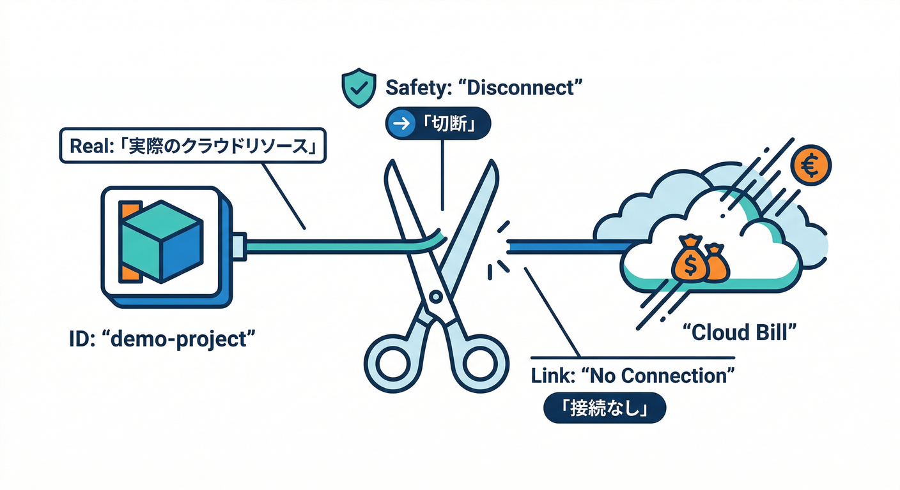
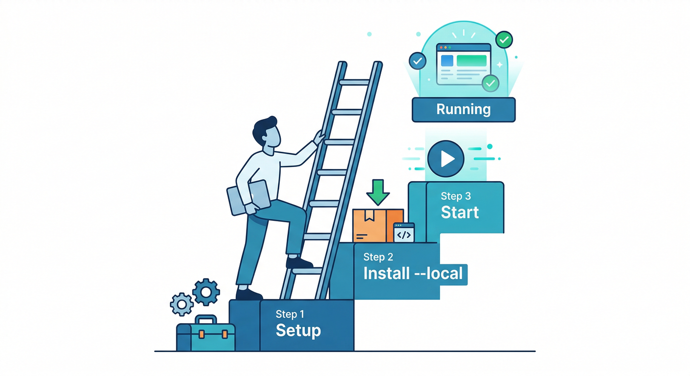
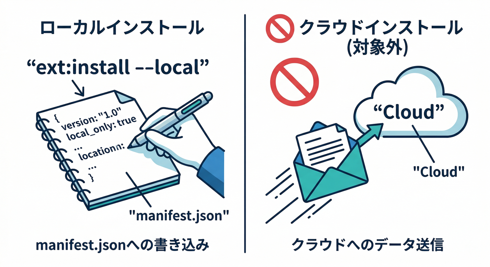
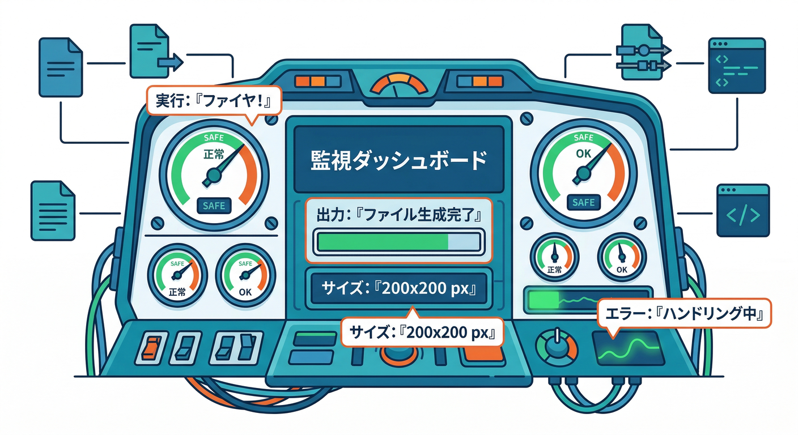
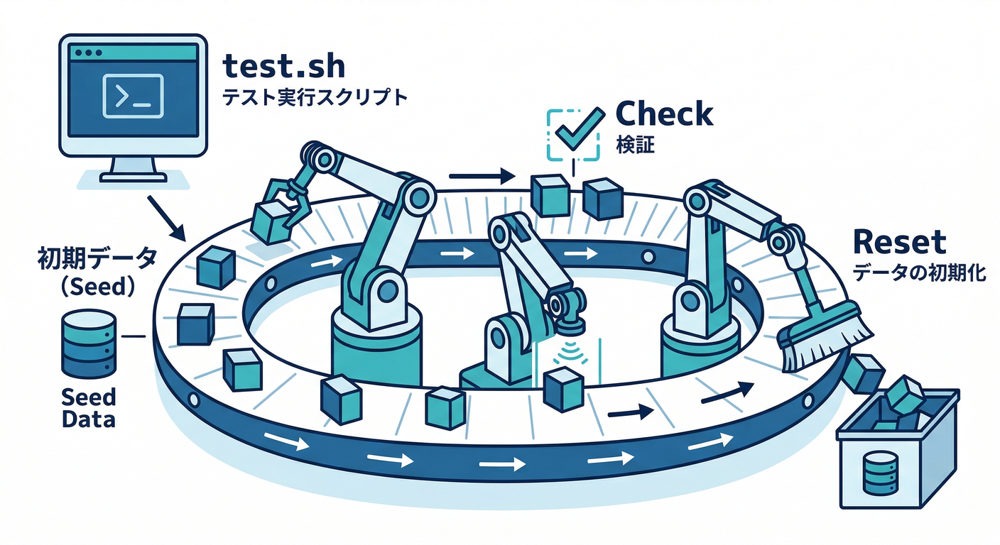

# 第8章：Extensions Emulatorで“課金前に動作確認”🧪🧯

この章でやることはコレ👇
**Extensions を「本番に入れる前に」ローカルで動かして、危ないところ＆ハマりどころを先に潰す**よ😎✨
しかも「課金・本番データ汚し」をできるだけ避けられるのが最高🧯💸 ([Firebase][1])

---

## 1) Extensions Emulatorって、何がうれしいの？🧩➡️🧪


Extensions Emulator は **Firebase Local Emulator Suite の一部**で、拡張機能（Extensions）を**安全なローカル環境でインストール＆動作確認**できるやつだよ🧪✨
裏側では “拡張の Functions” がローカルで動いて、**Firestore / Realtime DB / Storage / Auth / Pub/Sub のエミュレータ**と連携してイベントトリガーも試せるのがポイント！さらに **Cloud Functions v2（Eventarc）系の拡張トリガー**も対象に入ってるよ⚙️ ([Firebase][1])

しかも嬉しい注意点もある👇

* エミュレータに存在しない **Google Cloud API を拡張が叩く場合**、その部分は“本物”にアクセスしちゃう可能性がある（= 課金が発生し得る）⚠️ ([Firebase][1])
* そして **この機能は Beta**。仕様が変わる可能性はあるよ🧪🧩 ([Firebase][1])

---

## 2) まず「どのプロジェクトで回す？」を決める🎯



Extensions Emulator は「1つの Firebase プロジェクトID」を前提に動くよ📌 ([Firebase][1])
ここで大事なのが **Real プロジェクト**と **Demo プロジェクト**の違い！

## ✅おすすめ：Demo プロジェクト（`demo-` で始まるID）🧯

Demo は “実リソースが無い” ので、間違って本番を叩く事故が起きにくいのが強み🔥

> エミュレータが無いサービスに触ろうとすると失敗する（＝安全側） ([Firebase][1])

## 🔧プロジェクトの指定方法（2つ）

* `firebase use` で作業ディレクトリのプロジェクトを選ぶ
* もしくはコマンドごとに `--project` を渡す
  さらに、**UIや各エミュレータの連携のために project ID は統一する**のが推奨だよ🧠 ([Firebase][1])

---

## 3) 今日のメイン手順：3ステップで動かす🚀



## Step A：Emulator Suite をセットアップする🧰

Emulator Suite は Firebase CLI でセットアップしていくよ。基本フローは👇

* `firebase init`
* `firebase init emulators`（必要なエミュレータ選択＆ダウンロード＆ポート設定） ([Firebase][2])

（ここで Storage / Firestore / Functions など、拡張が使うやつを選ぶのがコツだよ🧩）

---

## Step B：拡張を「ローカルの manifest」に追加する📦



ポイントはここ！
`firebase ext:install --local ...` を使うと、**拡張を“設定した状態”でローカルに登録**できる。
しかも **この時点ではデプロイされない**（= 本番に入らない）から安心😮‍💨✨ ([Firebase][1])

例（ドキュメント例はメール拡張だけど、流れはどの拡張でも同じ）👇 ([Firebase][1])

```bash
## 例：拡張をローカル設定として登録（まだデプロイしない）
firebase ext:install --local firebase/firestore-send-email
```

この “manifest 管理” は `firebase.json` の `extensions` セクションや、`extensions/` 配下の `.env` ファイル群で表現される感じになるよ🧾
（既存の拡張インスタンスを manifest 化したいときは `ext:export` で吐き出せる） ([Firebase][3])

---

## Step C：エミュレータ起動！🟣

```bash
firebase emulators:start
```

起動すると、manifest に書かれた拡張を見て、拡張のソースをローカルにダウンロードしてから実行してくれるよ（キャッシュに落ちる）📥 ([Firebase][1])

---

## 4) “Resize Images をローカルで試す”ときの観察ポイント👀📷➡️🖼️



第4章で触った「画像リサイズ系」を例にすると、チェックしたいのはだいたいこのへん👇（超重要🧠✨）

## ✅観察チェックリスト（まずはこれだけ）🧾✅

* **トリガーが発火してる？**

  * 画像アップロード後に拡張の処理ログが出るか🪵
* **生成物が期待の場所に出る？**

  * サムネの保存先（フォルダ）🗂️
  * ファイル名ルール（サイズ入りなど）🧷
* **サイズ・形式が合ってる？**

  * 200x200 になってる？など📐
  * contentType が想定通り？🧪
* **失敗したときの挙動**

  * 対象外ファイル（png/jpg以外・巨大ファイル）でどうなる？🧯
* **“エミュレータに無いAPI” を叩いてない？**

  * 拡張が別の Google Cloud API を触るタイプだと、そこだけ本物に当たり得る⚠️（= 課金の芽） ([Firebase][1])

---

## 5) CIっぽく “自動で検証” したいとき🧪🤖



人間がUIでポチポチするのも良いけど、**スクリプトで再現できると最強**だよね😎
Emulator Suite には、スクリプトを実行してテストする `firebase emulators:exec` がある！ ([Firebase][1])

```bash
firebase emulators:exec my-test.sh
```

この `my-test.sh` でやることは例えば👇

* Firestore にテストデータ投入
* Storage にテスト画像投入
* 生成物チェック（ファイル一覧を見る、メタデータ確認など）
* 最後にクリーンアップ🧹

---

## 6) “本番と同じじゃない部分”だけは、ここで覚える🧠⚠️


ローカル検証はかなり本番に近いけど、差分もあるよ👇

## 🔐 IAM は再現しない

エミュレータは **IAM の挙動を再現しない**。
本番なら「このサービスアカウントで実行」みたいな権限設計があるけど、ローカルはそこが同じにならないんだ🧯
なので「ローカルでは動いたのに本番で権限エラー」は起き得るよ⚠️ ([Firebase][1])

## 🧲 トリガー種類に制限がある

現時点でサポートされるのは👇

* HTTP トリガー
* Eventarc のカスタムイベント（拡張向け）
* Firestore / RTDB / Storage / Auth / Pub/Sub のバックグラウンドイベント
  それ以外のトリガー型の拡張は、テスト用Firebaseプロジェクトに入れて試す必要があるよ🧪 ([Firebase][1])

---

## 7) AI活用：Antigravity / Gemini CLI を“検証係”にする🛸🤝🤖

ここ、めっちゃ相性いい🧠✨

## 🛸 Antigravity：エージェントに「検証計画」を作らせる

Antigravity は “Mission Control で複数エージェントを動かして開発を進める” 方向のIDEだよ🛰️ ([Google Codelabs][4])
なので、例えばエージェントにこんな依頼ができる👇

* 「この拡張のパラメータ一覧を表にして、危険そうな項目に⚠️つけて」
* 「Resize Images のローカル検証手順を、再現性あるチェックリストにして」
* 「失敗パターン（巨大画像、拡張子違い、権限不足）をテストケース化して」

## 🤖 Gemini CLI：ターミナルで“テスト台本”を作らせる

Gemini CLI はターミナルから使える AI エージェントで、Cloud Shell だと追加セットアップ無しで使える案内もあるよ🧰 ([Google Cloud Documentation][5])

使いどころは超わかりやすくて👇

* ログを貼って「原因候補3つ＋切り分け手順」出してもらう🪵🧠
* `emulators:exec` 用のスクリプト雛形を作ってもらう📜
* “本番との差分（IAM/トリガー制限）を踏まえたチェック項目” を作ってもらう✅

---

## 8) 手を動かす🖐️：この章のミニ実践（10〜15分）⏱️✨

## ✅やること

1. `firebase ext:install --local ...` で、試したい拡張を1つ manifest に登録する📦 ([Firebase][1])
2. `firebase emulators:start` で起動する🟣 ([Firebase][1])
3. “トリガーが起きる操作” を1回だけやる（例：画像アップロード）📷
4. 下の「観察ポイント」を埋める📝

## 📝観察ポイント（埋めるだけでOK）

* トリガーは発火した？（ログの出方は？）🪵
* 生成物はどこに出た？（パス）🗂️
* ファイル名は想定通り？🧷
* サイズ・形式は想定通り？📐
* “本物のAPIに当たりそう” な気配はあった？⚠️ ([Firebase][1])

---

## 9) チェック✅（この章を終えた合図🎉）

次の3つを自分の言葉で言えたら勝ち🏆✨

* **`ext:install --local` は「ローカルに設定だけ保存」して、いきなり本番に入れない** ([Firebase][1])
* **Extensions Emulator は課金や本番汚しを減らせるけど、“エミュレータに無いAPI” だけ本物に当たり得る** ([Firebase][1])
* **本番との差分（IAM再現なし／トリガー制限）を理解して、検証結果を過信しない** ([Firebase][1])

---

次の第9章は「extension.yaml を読む」だったよね🔍🧠
第8章で動かした拡張を、そのまま**“中身の設計図”として読む**と理解が爆速で進むよ😆✨

[1]: https://firebase.google.com/docs/emulator-suite/use_extensions "Use the Extensions Emulator to evaluate extensions  |  Firebase Local Emulator Suite"
[2]: https://firebase.google.com/docs/emulator-suite/install_and_configure?utm_source=chatgpt.com "Install, configure and integrate Local Emulator Suite - Firebase"
[3]: https://firebase.google.com/docs/extensions/manifest?utm_source=chatgpt.com "Manage project configurations with the Extensions manifest"
[4]: https://codelabs.developers.google.com/getting-started-google-antigravity?utm_source=chatgpt.com "Getting Started with Google Antigravity"
[5]: https://docs.cloud.google.com/gemini/docs/codeassist/gemini-cli?utm_source=chatgpt.com "Gemini CLI | Gemini for Google Cloud"
