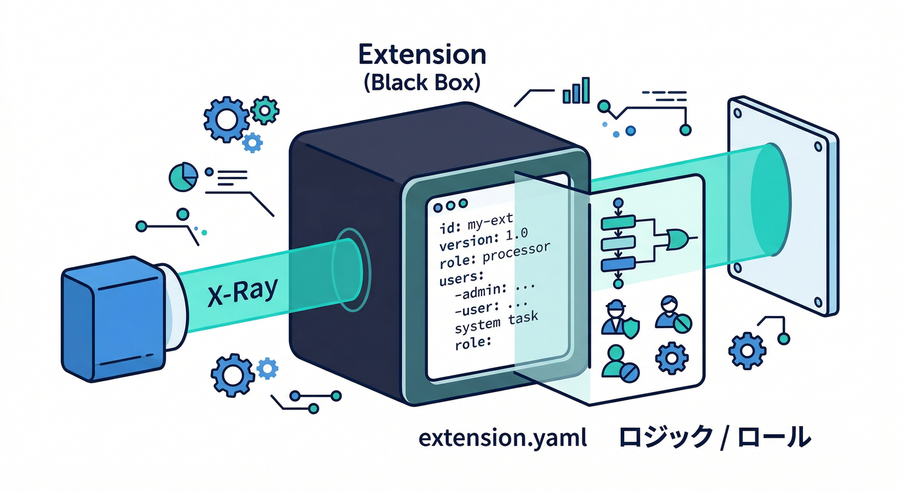
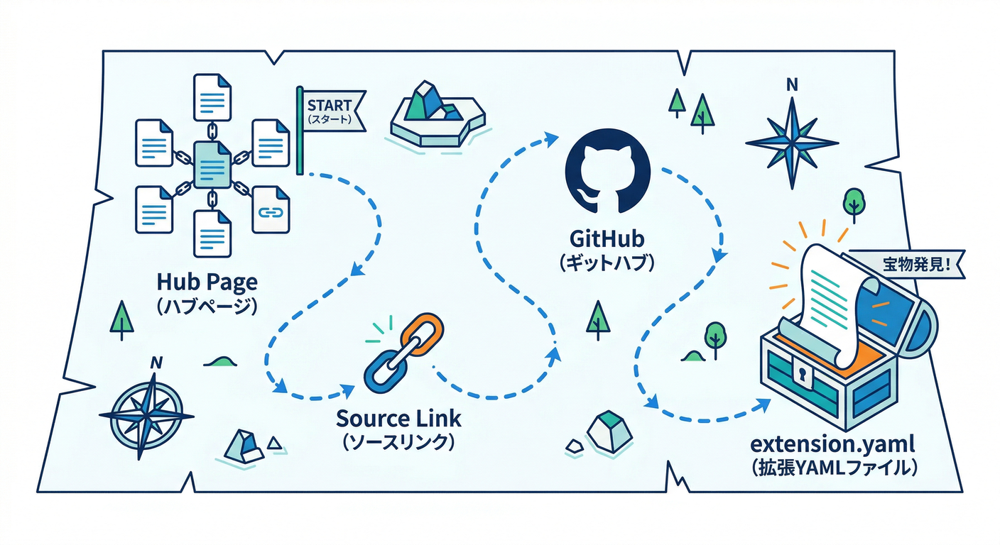
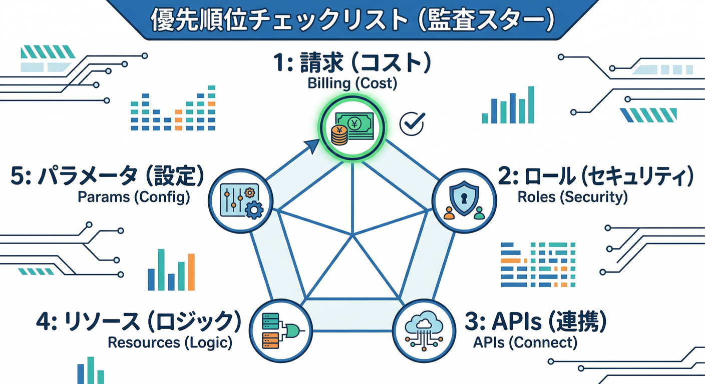
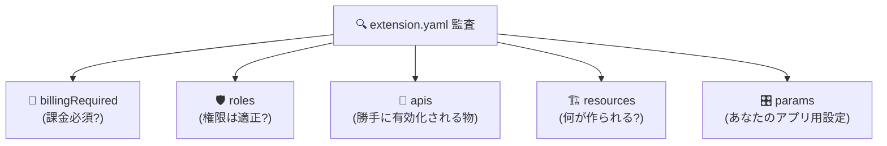
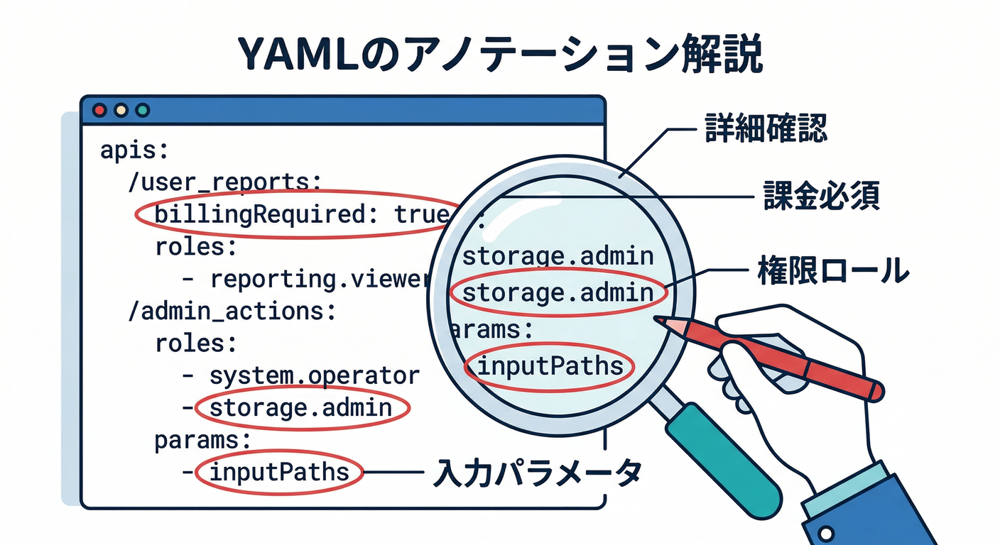
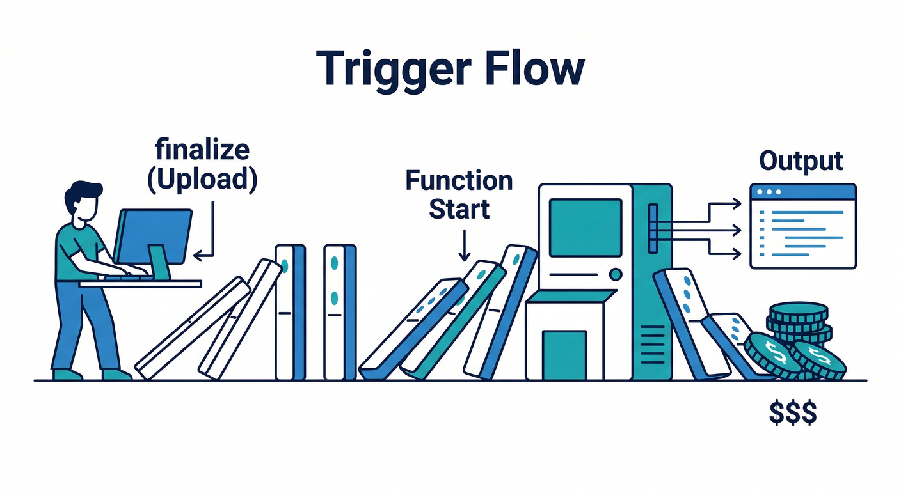

# 第9章：拡張の“中身”を覗く（extension.yamlの読み方）🔍🧠

この章はひとことで言うと、**「Extensionsを“怖くない黒箱”にする回」**だよ😎🧩
extension.yaml を読めるようになると、**何が作られて・どんな権限が付いて・どこで課金が起きそうか**が、インストール前にわかる👍✨

---

## 1) extension.yamlって何者？🧾🧩



**extension.yaml = その拡張の“設計図（マニフェスト）”**📌
ここにだいたい全部書いてある👇

* どの API を有効化するか（`apis`）🔌
* どんな権限を拡張に渡すか（`roles`）🛡️
* どんなリソース（Functions など）を作るか（`resources`）🏗️
* ユーザーが入力する設定項目（`params`）🎛️
* 課金必須か（`billingRequired`）💸

こういう「拡張の中身の地図」を公式が定義してるのが extension.yaml のリファレンスだよ📚

---

## 2) どこから extension.yaml を見るの？👀🔗



見るルートはだいたい2つ！

1. **extensions.dev の拡張ページ → ソース（GitHub等）** から `extension.yaml` を開く
2. 公式拡張なら `firebase/extensions` のリポジトリに `extension.yaml` が置いてあることが多い

「PREINSTALL / POSTINSTALL」みたいな説明ファイルも同じ場所にあって、**インストール前後に“人間が読む説明書”として必須**になってる📘 ([Firebase][1])

---

## 3) 読む順番はコレ！「3分監査」🕒🧠



extension.yaml を開いたら、上から全部読むより **“危険とコストに近い順”**で見るとラク😆

## ✅(A) まず課金：`billingRequired` 💸

* `true` なら、**請求先が必要**なタイプ（= 便利だけど無料とは限らない）
  ※Extensionsのインストール要件・課金注意の話とセットで理解すると強い💪 ([Firebase][2])

## ✅(B) 次に権限：`roles` 🛡️

* ここが一番大事🔥
* **強い権限（例：admin系）**があるほど、事故った時のダメージも大きい
* “なぜ必要？”の理由（`reason`）が書かれてることもあるよ

## ✅(C) 次にAPI：`apis` 🔌

* 拡張が動くために **勝手に有効化されるAPI** が並ぶ
* 有効化＝すぐ課金じゃないけど、**使われたら課金**につながることがある

## ✅(D) 次に実体：`resources` 🏗️

* どんな Functions / トリガー / リージョン…が作られるか
* **「いつ動く？」（イベント駆動）**がここに出る



## ✅(E) 最後に設定：`params` 🎛️

* バケット名、パス、サイズ、フィルタ…
* ここをミスると「動かない」「暴走」「課金増」の原因になる😇

---

## 4) 例：Resize Images の extension.yaml を“それっぽく読む”📷➡️🖼️



ここ、読み方のイメージを掴むために「Resize Images」系の例でいくね（公式拡張の `extension.yaml` 例）👀✨ ([GitHub][3])

## 💸 課金チェック

* `billingRequired: true` が書かれてたら、**請求先が前提**のタイプだと判断できる💳 ([GitHub][3])

## 🛡️ 権限チェック（危険ポイントになりがち）

* 例だと `storage.admin` みたいな強い権限が見えることがある
* さらに面白いのが、**AI系の権限**が出る場合があるところ👇
  例：`aiplatform.user`（Geminiモデルの利用などに触れてるケース）🤖✨ ([GitHub][3])
  → 「AI機能オプションONにしたら何が起きる？」をここで想像できる👍

## 🏗️ リソースチェック（いつ動く？）



* Storage の `finalize`（アップロード完了）みたいなイベントで動くなら、
  **“アップロードのたびに動く”＝回数が増えるほどコスト/ログも増える**って読める📈 ([GitHub][3])

## 🎛️ パラメータチェック（事故りやすい）

* `inputPaths` / `outputPaths` 的な「対象パス」
* `validationRegex` があるなら「こういう値じゃないとダメ」が明示されてる
* `selectResource` があるなら「Consoleで選ばせる系だな」って読める🧠 ([GitHub][3])

---

## 5) 手を動かす🖐️：権限・API・リソース・パラメータを“表”にする📋✨

ここがこの章のメイン作業！🧩
好きな拡張の `extension.yaml` を開いて、下の表を埋めていこう💪

| 観点     | extension.yaml のどこ？ | 自分に聞く質問💡     | 例（埋め方）           |
| ------ | ------------------- | ------------- | ---------------- |
| 💸課金   | `billingRequired`   | 請求先いる？無料枠で済む？ | true/false       |
| 🛡️権限  | `roles`             | 強すぎない？理由は妥当？  | storage/admin など |
| 🔌API  | `apis`              | どのAPIが有効化される？ | storage系/他       |
| 🏗️作る物 | `resources`         | 何が作られる？いつ動く？  | Functions/トリガー   |
| 🎛️設定  | `params`            | ミスると何が起きる？    | パス/サイズ/条件        |

埋め終わると、拡張が一気に“見える化”されるよ😆🔍

---

## 6) AI活用パート🤖✨：読む作業を「Antigravity × Gemini」で秒速化🛸💨


## 🧠(1) Gemini CLI に「この YAML を監査して」って頼む

Gemini CLI はターミナルから使えるAIエージェントで、コード理解やタスク整理に向いてる🧑‍💻✨ ([Google Cloud Documentation][4])
Antigravity はエージェント中心の開発体験を提供する、って公式の説明があるよ🛸 ([Google Codelabs][5])

やることはシンプル👇

* extension.yaml を貼る/読ませる
* さっきの「3分監査（課金→権限→API→リソース→params）」で要点を箇条書き化してもらう

プロンプト例（そのまま使ってOK）👇

```text
あなたはFirebase Extensionsのセキュリティ/コスト監査役です。
以下の extension.yaml から、(1)課金ポイント (2)危険な権限 (3)有効化されるAPI
(4)作られるリソースとトリガー (5)事故りやすいparams を表形式でまとめてください。
最後に「最小権限」「コスト抑制」「誤設定防止」の観点で改善案を3つください。
```

## 🧠(2) Firebase Console 側の Gemini で「ログやエラーを翻訳」する

Firebase コンソール内の **Gemini in Firebase** で、エラー調査や説明の噛み砕きができる📣
セットアップ手順も公式が用意してるよ🧩 ([Firebase][6])

## 🤖(3) “アプリ側のAI”も絡める（Firebase AI Logic）

拡張にAI要素がある/自作に切り替える未来があるなら、
Firebase AI Logic（Gemini/Imagen を扱える）を「公式ルートとして知っておく」と強い🔥 ([Firebase][7])

---

## 7) ありがちな勘違い＆事故ポイント😇🧯


* **「入れただけで無料で安心」** → ❌
  課金は `billingRequired` や、裏で動くリソース次第で普通に増える💸 ([Firebase][2])
* **「権限はよくわからんからOK」** → ❌
  `roles` は“拡張に渡す力”そのもの。強いほど慎重に🛡️
* **「どこで動くか知らない」** → ❌
  `resources` のトリガーを見れば、“いつ動くか”が読める🏗️ ([GitHub][3])
* **「Nodeの世代が混ざって混乱」** → あるある😵‍💫
  Cloud Functions for Firebase の Node は（現時点で）22/20/18(deprecated) の説明があるよ📌 ([Firebase][2])
  さらに第2世代は Cloud Run ベースで改善があり、Pythonも扱える流れが明記されてる🐍 ([Firebase][8])

---

## ミニ課題🎯🛡️

好きな拡張を1つ選んで、**「この拡張の怖いところ」**を1個見つけて、対策を書く✍️

例）

* 怖い：`storage.admin` が強い
* 対策：対象バケット/パスを params で狭める、運用で“検証→本番”を分ける、ログ監視を先に決める…など🧯

---

## チェック✅✨

次の3つを自分の言葉で説明できたら勝ち🏆

1. extension.yaml は「拡張の設計図」で、権限・API・リソース・設定が読める🧾
2. 見る順番は「課金→権限→API→リソース→params」が速い💨
3. Antigravity/Gemini（CLIやConsole）で“読む作業”を省力化できる🤖🛸 ([Google Cloud Documentation][4])

---

次の章（第10章）は、今日読めるようになった `resources` を使って、**「裏でFunctions/イベント/リソース作成がどうつながってるか」**を矢印で解剖していく感じになるよ➡️⚙️🧩

[1]: https://firebase.google.com/docs/extensions/publishers/user-documentation "Create user documentation for your extension  |  Firebase Extensions"
[2]: https://firebase.google.com/docs/functions/manage-functions?utm_source=chatgpt.com "Manage functions | Cloud Functions for Firebase - Google"
[3]: https://raw.githubusercontent.com/firebase/extensions/next/storage-resize-images/extension.yaml "raw.githubusercontent.com"
[4]: https://docs.cloud.google.com/gemini/docs/codeassist/gemini-cli?utm_source=chatgpt.com "Gemini CLI | Gemini for Google Cloud"
[5]: https://codelabs.developers.google.com/getting-started-google-antigravity?utm_source=chatgpt.com "Getting Started with Google Antigravity"
[6]: https://firebase.google.com/docs/ai-assistance/gemini-in-firebase?utm_source=chatgpt.com "Gemini in Firebase - Google"
[7]: https://firebase.google.com/docs/ai-logic?utm_source=chatgpt.com "Gemini API using Firebase AI Logic - Google"
[8]: https://firebase.google.com/docs/functions/2nd-gen-upgrade?hl=ja&utm_source=chatgpt.com "第 1 世代の Node.js 関数を第 2 世代にアップグレードする"
