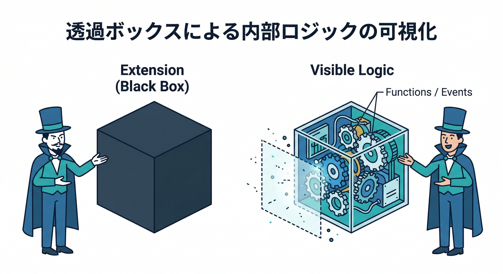
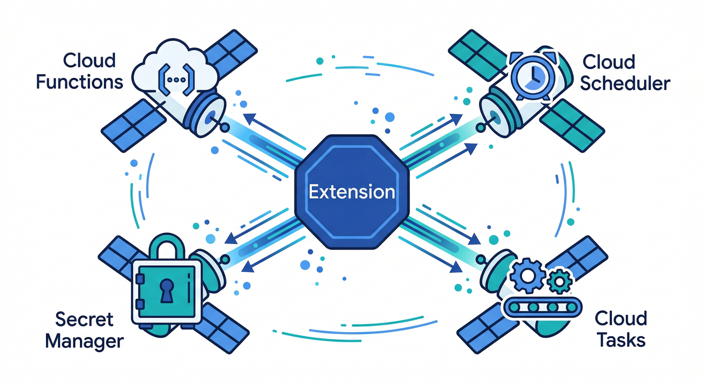
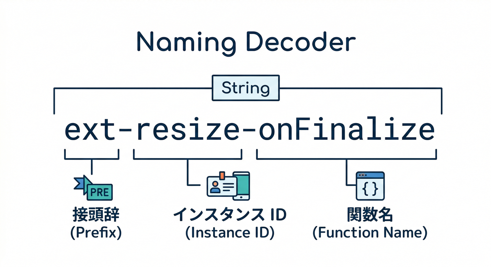
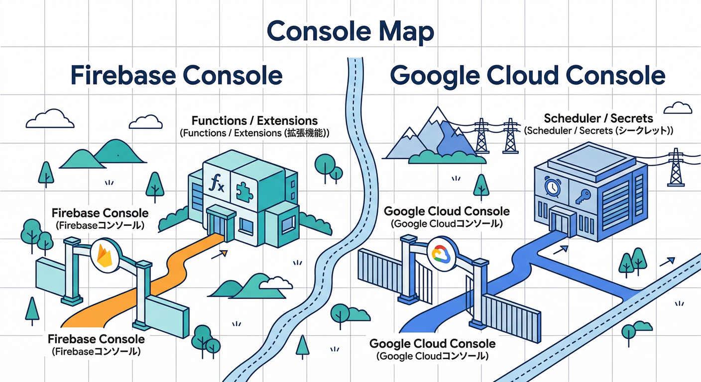
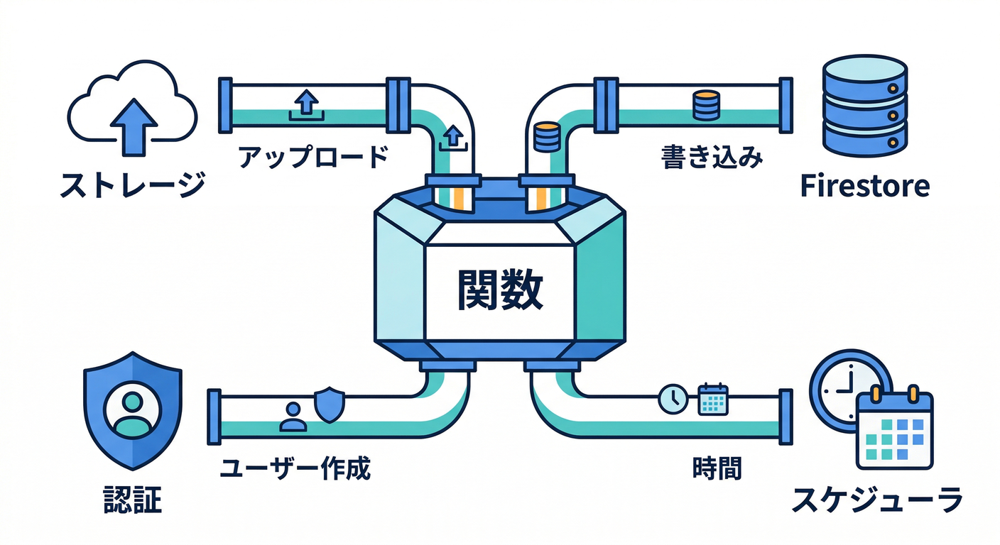
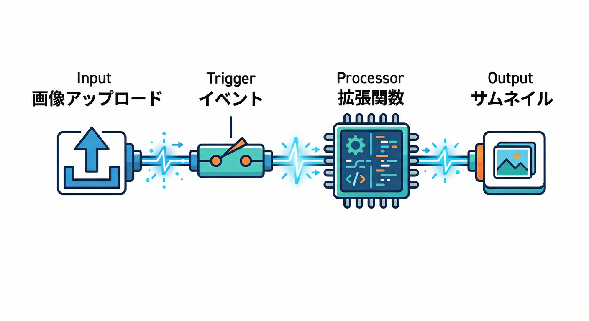

# 第10章：裏側の仕組み（Functions/イベント/リソース作成）⚙️🧩

この章は「Extensionsって便利だけど、裏で何が起きてるの？」をスッキリさせる回だよ😆
**“黒箱”を“見える箱”に変える**と、トラブル時に強くなる🔥

---

## 1) まずは超ざっくり全体像（これだけ覚えればOK）🧠✨

Extensions を入れる＝あなたの Firebase プロジェクトに、**いくつかのクラウドリソースが自動で追加される**ってこと！
代表例は **Cloud Functions**（イベントで動く処理）で、拡張によっては **Cloud Scheduler / Cloud Tasks / Secret Manager** なども増えるよ。([Firebase][1])

イメージはこんな感じ👇

* アプリが何かする（画像アップロード📷 / Firestore書き込み📝 など）
* それを合図（イベント）に **Functions が動く**⚙️
* 必要なら「予約実行」⏰「キュー処理」📬「秘密情報」🔐も使う

---

## 2) “増えるもの”早見表（命名ルールが超重要）🧾🔍

拡張を追跡するとき、いちばん強いのは **名前の規則**！
公式が「こういう形式だよ」って明言してるので、ここだけは丸暗記でOK😎

**✅ Functions（いちばん大事）**

* 形式：`ext-<extension-instance-id>-<functionName>`
* 例：`ext-awesome-task-simplifier-onUserCreate`
  → **Functions ダッシュボードでこの形式を探せば当たり**🎯([Firebase][1])

**✅ Cloud Scheduler（定期実行がある拡張）⏰**

* 形式：`firebase-ext-<extension-instance-id>-<functionName>`
* 例：`firebase-ext-awesome-task-simplifier-doTask`([Firebase][1])

**✅ Cloud Tasks（キューで順番に処理する拡張）📬**

* Firebase Console の拡張詳細に **APIs and resources** が出て、そこからキューへ飛べるよ。([Firebase][1])

**✅ Secret Manager（APIキー等を安全に持つ）🔐**

* 形式：`ext-<extension-instance-id>-<paramName>`
* 例：`ext-awesome-task-simplifier-API_KEY`([Firebase][1])

**✅ extension.yaml（設計図）📄**
拡張の設計図側でも、最終的にデプロイされる関数名が `ext-<instance-id>-<name>` になること、そして **1st-gen / 2nd-gen の Functions リソース型がある**ことが明記されてるよ。([Firebase][2])

---

## 3) 手を動かす前に：見る場所はこの2つだけ🧭👀

### A. Firebase Console 側（まずここ）🔥

* **Extensions → 対象インスタンス → Manage**

  * ここに「設定」「状態」「ログ」「APIs and resources」がまとまってる🧩([Firebase][1])
* **Functions ダッシュボード**

  * Extensions が作った関数も一覧に出る
  * さっきの `ext-...` 形式で探すのが最短ルート🧠([Firebase][1])

### B. Google Cloud Console 側（深掘り用）⛏️

* Cloud Scheduler（定期ジョブ）⏰
* Secret Manager（秘密）🔐
* Cloud Tasks（キュー）📬
  ※どれも「名前の規則」で一発で追えるのが気持ちいい✨([Firebase][1])

---

## 4) “トリガー（合図）”の見つけ方➡️🧲

「いつ動くの？」は、だいたい **イベントトリガー**で決まるよ。

よくある例👇

* **Storage**：ファイルがアップロードされたら📷➡️⚙️
* **Firestore**：ドキュメントが作られたら📝➡️⚙️
* **Auth**：ユーザー作成されたら👤➡️⚙️
* **Pub/Sub**：メッセージが来たら📨➡️⚙️
* **Scheduler**：時間になったら⏰➡️⚙️
* **Eventarc**：カスタムイベントで動く（拡張や2nd genで出てきがち）🛰️([Firebase][3])

そしてローカル検証（エミュレータ）だと、対応してるトリガー種類に制限があるよ、って公式がちゃんと書いてる。
「この拡張、ローカルで完全に再現できないかも？」を早めに察知できるのが大事👍([Firebase][3])

---

## 5) いちばん大事：トラブル時の“原因調査ルート”🧯🕵️

拡張が動かない/変な動きのとき、パニックになりがちだけど…
見る順番を固定すると楽勝になるよ😎

1. **Functions ダッシュボードで対象関数（`ext-...`）を特定**🔍([Firebase][1])
2. **Health タブでエラー傾向を見る**（全体→対象へ絞る）🩺([Firebase][1])
3. **ログを見る**（失敗の “最初の1行” がだいたい犯人）🪵
4. もし定期実行なら **Scheduler** を確認⏰([Firebase][1])
5. もし順番待ち処理なら **Tasks キュー** を確認📬([Firebase][1])
6. APIキー等が絡むなら **Secret Manager** を確認🔐([Firebase][1])

---

## 6) AIで理解を爆速にする（おすすめの使い方）🤖⚡

**Gemini in Firebase** は、エラーの意味を噛み砕いたり、ログを読んで「次に何を試す？」を提案してくれる（公式が “ログ解析できる” と明言してる）ので、Extensionsの原因調査と相性がいいよ🧠✨([Firebase][4])

使い方のコツ（丸投げ禁止🙅‍♂️）👇

* 「このログの意味を日本語で」🗣️
* 「今の状況で疑うべきポイントを3つ」🎯
* 「再発防止のチェックリストを作って」🧾

---

## 手を動かす🖐️：インストール後の“棚卸し”をやってみよう🧹✨

ここからが本番！
**「作られたリソース一覧」を自分で書けたら勝ち**🏆

## ステップA：拡張インスタンスIDをメモ📝

* Firebase Console → Extensions → 対象インスタンス → Manage
* 画面内にある **インスタンスID**（＝命名規則の中核）を控える([Firebase][1])

## ステップB：Functions を特定して“動く条件”を読む🔍

* Functions ダッシュボードへ
* `ext-<instance-id>-...` を探して、見つけた関数を全部メモ🧾([Firebase][1])

## ステップC：定期・キュー・秘密があるか確認⏰📬🔐

* あるなら「どれが増えたか」を名前規則で探す

  * Scheduler：`firebase-ext-...`([Firebase][1])
  * Tasks：拡張詳細の APIs and resources からキューへ([Firebase][1])
  * Secret：`ext-<instance-id>-<param>`([Firebase][1])

---

## ミニ課題🎯：「トリガーはどこ？入力はどこ？」を矢印で描く➡️🖊️

紙でもメモ帳でもOK！こういう “配線図” を作ってね👇

* 入力（例：Storageのアップロード先パス📷）
* トリガー（例：アップロード完了イベント🧲）
* 関数（例：`ext-...-generateThumbnail`⚙️）
* 出力（例：サムネ保存先🖼️）
* 追加（例：Secret を使う？ Scheduler がある？）

「矢印が描ける＝原因調査できる」になるよ😆🔥

---

## チェック✅（できたら次章へGO！🚀）

* `ext-<instance-id>-...` の関数を Functions 一覧から見つけられる🔍([Firebase][1])
* Scheduler / Tasks / Secret がある拡張を “名前規則”で追跡できる🧾([Firebase][1])
* 「イベント → 関数 → 出力」の矢印図を描ける➡️
* エミュレータだとトリガー種類に制限があり得る、と説明できる🧪([Firebase][3])
* Gemini in Firebase を使ってログやエラーを読解し、次の一手を作れる🤖([Firebase][4])

---

## おまけ：自作に切り替える時の“ランタイム感覚”👀

拡張の裏側は Functions だから、将来自作するなら Node.js のサポート範囲は把握しとくと安心！
Cloud Functions for Firebase は Node.js **22 / 20**（18は非推奨）って明記されてるよ。([Firebase][5])

---

次の第11章（Resize Images実践）に行くと、いま作った“配線図”がそのまま効いてくるよ📷➡️🖼️➡️🧑‍💻
必要なら、この章の「棚卸しシート」をテンプレ化して、どの拡張でも使える万能フォーマットも作るよ😎🧾

[1]: https://firebase.google.com/docs/extensions/manage-installed-extensions "Manage installed Firebase Extensions"
[2]: https://firebase.google.com/docs/extensions/reference/extension-yaml?utm_source=chatgpt.com "Reference for extension.yaml - Firebase - Google"
[3]: https://firebase.google.com/docs/emulator-suite/use_extensions "Use the Extensions Emulator to evaluate extensions  |  Firebase Local Emulator Suite"
[4]: https://firebase.google.com/docs/ai-assistance/gemini-in-firebase?utm_source=chatgpt.com "Gemini in Firebase - Google"
[5]: https://firebase.google.com/docs/functions/manage-functions?utm_source=chatgpt.com "Manage functions | Cloud Functions for Firebase - Google"
